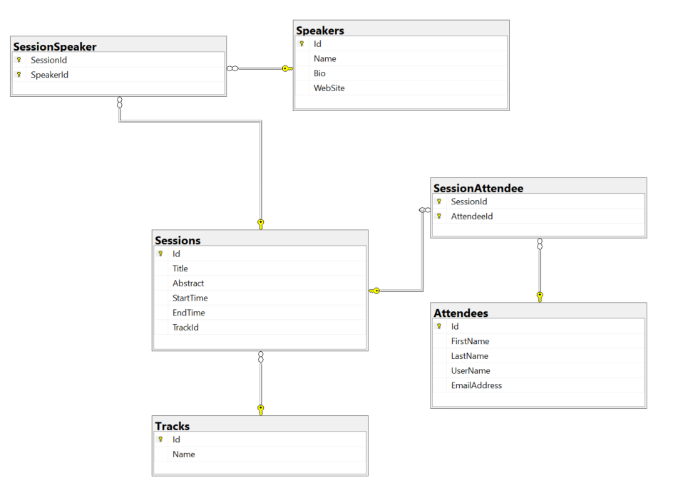

# ASP.NET Core - App Building Workshop

[](https://dev.azure.com/dotnet/AspNetCoreWorkshop/_build/latest?definitionId=71&branchName=master)

## Setup

It is recommended that you clone the repository for this workshop on your computer. You can then perform the exercises for Sessions 1 through 5 while offline, if necessary. Sessions 6 onwards require an Internet connection. To clone the repository, move to a convenient folder on your computer, and run the following command from a command prompt window:

```console
git clone https://github.com/dotnet-presentations/aspnetcore-app-workshop
```

> **Note:** You must have previously installed the [Git tools](https://git-scm.com/downloads)

You can perform the exercises using [Visual Studio 2019](https://visualstudio.microsoft.com/downloads/), or the [.NET Core CLI and SDK](https://dotnet.microsoft.com/download/dotnet-core/3.0) from the command line.

If you're installing Visual Studio, you only need to select the **ASP.NET and web development** workload.

If you're using the .NET Core CLI, run the following command to install the HTTPS certificate for the development web server:

```console
dotnet dev-certs https --trust
```

If you are using the .NET Core CLI, you'all also need the [Azure CLI](https://docs.microsoft.com/cli/azure/install-azure-cli?view=azure-cli-latest) installed on your computer.


If you have issues downloading the installers, we may have USB sticks with offline installers for you to use.

In the exercises, you have a choice between using a local SQL Server instance or a SQLite database. If you are running on a non-Windows computer, you should probably use SQLite as SQL Server might not be available. If you are running on Windows, you can use SQL Server or SQLite.

## What you'll build

In this workshop, you'll learn by building a full-featured ASP.NET Core application from scratch. The application displays information about conference sessions and speakers. The application enables users to register, and create their own conference agenda based on the sessions they want to attend. Users with administrative rights can also edit the details of conference sessions.

In Session 1, you'll start with a back-end application that exposes a web API for accessing and maintaining conference data. You'll store the conference information in a database, and the back end will use an Entity Framework model to retrieve and manage the data.

In Session 2, you'll extend the entity model and create Data Transfer Objects (DTOs) that the application uses to send and receive data.

In Session 3, you'll create a front-end web application that enables users to browse sessions and speakers. This application uses the DTOs created in Session 2 to package data when communicating with the back-end web API.

In Session 4, you'll add security by implementing authentication and authorization. You'll also implement an administrative policy that enables specific users to modify the details of sessions.

In Session 5, you'll enable logged-in users to select sessions and create their own personalized conference agenda.

In Session 6, you'll also learn how to deploy the back-end and front-end applications to a production environment. This session presents several different deployment scenarios, including deployment to Azure, and deployment as Docker containers.

In Session 7, you'll optimize the fromt-end web application to use Blazor to communicate with the back-end. Blazor uses SignalR to pass data between a web server and a client application, and can be more efficient for updating a web page than requesting a new version of the entire page over HTTP.

Session 8 presents additional challenges you can tackle if you have time.

Session 9 shows how to create a Single Page Application (SPA) that acts as an alternative front end.

### Application architecture

The diagram below highlights the components you'll create in this workshop, and the technologies used. The Conference DTO project is based on the .NET Standard for maximum interopability with front ends that use technologies other than .NET Core.


### Database Schema

You'll store the data in a SQL Server database. The following diagram shows the tables that the application will create:



## Sessions

The table below provides links to the exercises for each session.

| Session | Topics |
| ----- | ---- |
| [Session #1](docs/1.%20Create%20BackEnd%20API%20project.md) | Build the back-end web API with a basic Entity Framework model. |
| [Session #2](docs/2.%20Build%20out%20BackEnd%20and%20Refactor.md) | Extend the Entity Framework model. Add DTOs to the back-end web API, and refactor the model classes into view models. |
| [Session #3](docs/3.%20Add%20front-end%2C%20render%20agenda%2C%20set%20up%20front-end%20models.md) | Create an ASP.NET front-end web application, display session and speaker information, and create front-end models. |
| [Session #4](docs/4.%20Add%20auth%20features.md) | Add authentication to the front-end web application. Implement an administrator policy that enables specific users to edit sessions information. Define and use a custom auth tag helper. |
| [Session #5](docs/5.%20Add%20personal%20agenda.md) | Enable users to register for a conference and create their own personal agenda. |
| [Session #6](docs/6.%20Production%20Readiness%20and%20Deployment.md) | Configure health diagnostics for the back-end web API and the front-end web application. Deploy the back-end and front-end components to a production environment. |
| [Session #7](docs/7.%20Use%20Blazor%20to%20Optimize%20the%20Front%20End.md) | Modify the front-end web application to use Blazor to communicate with the back-end over a SignalR channel. |
| [Session #8](docs/8.%20Challenges.md) | Add support for external authentication (Google or Twitter). Add a third-party logger to the front-end web application. Provide support for image uploading, editing, and display. Implement caching in the front-end web application. Modify the back end to store data in MySQL or PostgreSQL. Write unit and functional tests. Add further features to the front-end and back-end applications.
| [Session #9](docs/9.%20SPA%20FrontEnd.md) | Create a SPA front-end web application. |
