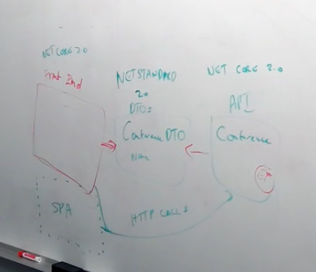

# aspnetcore-app-workshop

* Conference Planner
  * Admin
  * Attendee (customize session)
  * Public
* Search
* Schema
  * Speakers
  * Tracks
  * Tags
  * Sessions
  * Users
* Need architecture diagram
* Conference DTO
  * .NET Standard
* API App has Entity Models referencing DTOs
* DTOs with buddy types
  * Follow Damian's code in live.asp.net (preview 2 branch)
  * Input / Output models in API
  * Front end will have page models
  
* Introduction
  * Get SDK (Preview 1)
  * How to use more recent bits
  * File / New
    * Back End (EF, API)
    * Front End
* Tag Helpers and Forms
  * Validation
  * Model Binding
  * Razor Pages
* EF and Data
  * What's new in EF 2
* Unit Testing
* API
* Security
  * Middleware for HSTS (use one from live.asp.net)
  * Switch to nsecweb HSTS
* Auth
* Hosted Service
* Azure
  * Publishing
  * App Insights
  * Diagnostics
  * Deployment Slots (?)
  * Containers (?)
* Day 2 Second Half
  * SPA Services (optional lunch session)
  * Docker
  * Xamarin app
* Call to action at end
  * Boilerplate
  * Identity Server

## Day 1
| Time | Title |  |
| ---- | ----- | ---- |
| 9:00 AM - 9:45 AM | Session #1: Introduction to the .NET Core SDK | Damian |
| 9:45 AM - 10:30 AM | Lab #1 | Get bits installed, create first app |
| 10:30 PM - 10:45 AM | Breakfast Snack | |
| 10:45 AM - 11:15 AM | Session #2: MVC Applications with ASP.NET Core | Jon |
| 11:15 AM - 12:00 PM | Lab #2 | Routing patterns, MVC basics, etc. |
| 12:00 PM - 12:30 PM | Session #3: Startup, Hosting and Middleware | David |
| 12:30 PM - 1:30 PM | Lunch | |
| 1:30 PM - 2:15 PM | Lab #3 | WebHost, Startup, Configuration, Environments, Middleware, & IIS |
| 2:15 PM - 3:00 PM | Session #4: Dependency Injection & Testing | Damian |
| 3:00 PM - 3:15 PM | Break | |
| 3:15 PM - 3:45 PM | Lab #4 | Use dependency injection for application services, add a unit test project |
| 3:45 PM - 4:30 PM | Session #5: Logging & Error handling | David |
| 4:30 PM - 5:00 PM | Lab #5 | Using logging abstractions & providers, diagnostics pages/middleware |

## Day 2
| Time | Title |  |
| ---- | ----- | ---- |
| 9:00 AM - 9:15 AM | Introduction & Day Overview | |
| 9:15 AM - 10:00 AM | Session #6: Razor & Tag Helpers | Damian |
| 10:10 AM - 10:30 AM | Lab #6 | Working with Tag Helpers |
| 10:30 AM - 10:45 AM | Break | |
| 10:45 AM - 11:30 AM | Session #7: MVC Web API | David |
| 11:30 AM - 12:30 PM | Lab #7 | MVC Web API *or* Deploy app to azure |
| 12:30 PM - 1:30 PM | Lunch | |
| 1:30 PM - 2:15 PM | Session #8 : Single Page Applications | Jon |
| 2:15 PM - 3:00 PM | Lab #8 | Single Page Applications |
| 3:00 PM - 3:15 PM | Break | |
| 3:15 PM - 4:45 PM | App building: Attendee List | |
| 4:45 PM - 5:00 PM | Summary & Conclusion | |
