# Create the BackEnd Web API

In this session, you'll create a back-end application that exposes a web API for accessing and maintaining conference data. You'll store the conference information in a database. The application will use an Entity Framework model to retrieve and manage the data.

## Create a new project

The first task is to create a new solution and project for the back-end application.

**If you're using Visual Studio, perform the following steps:**

1. Start Visual Studio 2019, and select **Create a new project**.
    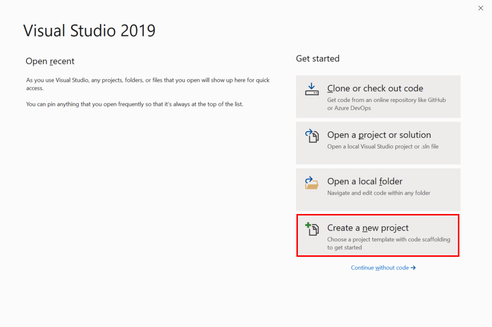

2. On the **Create a new project** page, select the **ASP.NET Core Web Application** template, and then click **Next**.

    

3. On the **Configure your new project** page, name the project **BackEnd**, name the solution **ConferencePlanner**, and then click **Create**.

    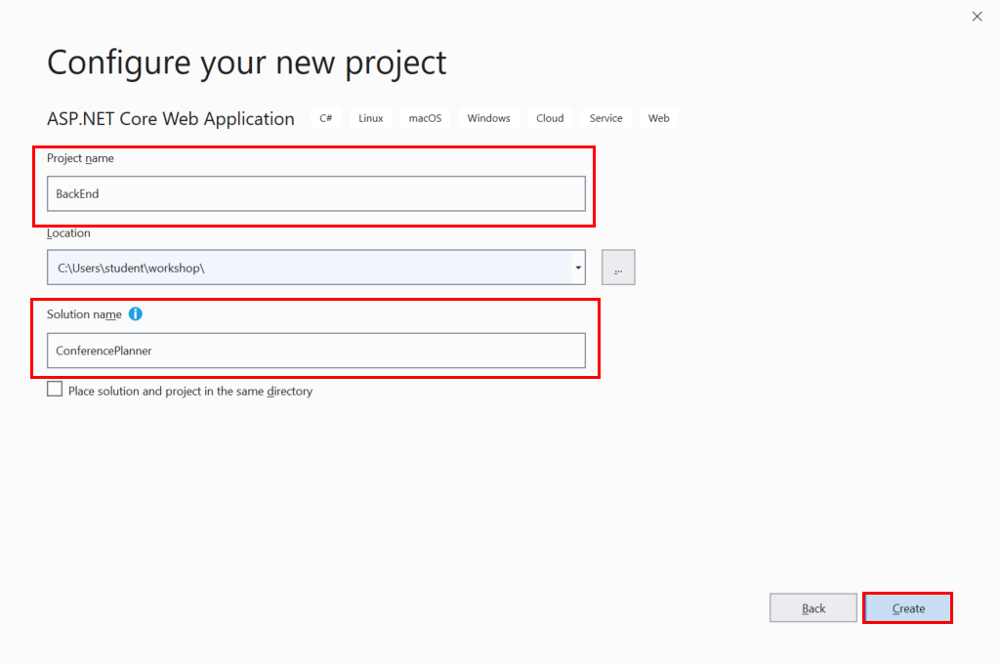

4. On the **Create a new ASP.NET Core web application** page, make sure you've selected the **.NET Core** and **ASP.NET Core 3.1** options. Select the **API** template, leave the **Authentication** and **Advanced** settings at their default values, and then click **Create**.

    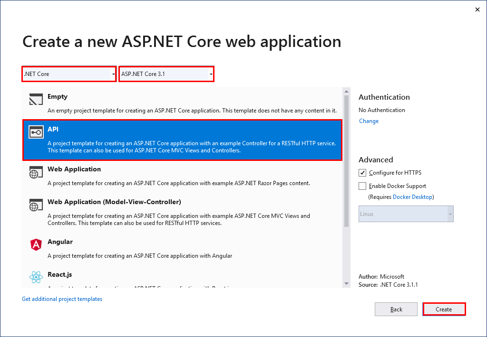

**If you're using the .NET Core CLI, perform the following steps:**

1. Open a command prompt window, and go to the folder you wish to use for your solution.
2. Create a folder named **ConferencePlanner**.
3. Move to the **ConferencePlanner** folder and run the command `dotnet new sln` to create a new .NET Core solution. This command will generate a solution file named **ConferencePlanner.sln**.
4. Run the command `dotnet new webapi -o BackEnd` command to create a new ASP.NET web API project. The project will be named **BackEnd**, and will be stored in a folder also named **BackEnd**.
5. Run the command `dotnet sln add BackEnd/BackEnd.csproj` to add the **BackEnd** project to the **ConferencePlanner** solution.

## Add a model to store and retrieve speaker data

In this task, you'll create a class that models the speaker entity in the database. You'll also create and configure a class that the Entity Framework can use to connect to the database.

1. Add a new folder named **Models** to the root of the **BackEnd** application, as follows:
   - **If you're using Visual Studio 2019**:
       1. In Solution Explorer, right-click the **BackEnd** project, point to **Add**, and then click **New Folder**.
       2. Change the name of the folder from **NewFolder** to **Models**.

            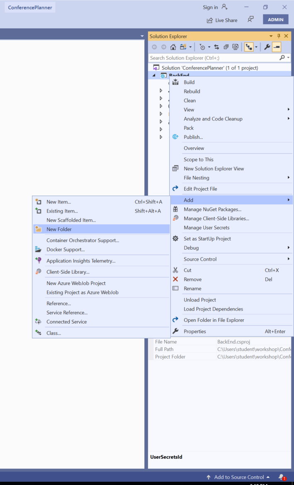

   - **If you're using the .NET Core CLI**:
     - Create a new folder named **Models** in the **BackEnd** folder.

2. Add a new class file named **Speaker.cs** to the **Models** folder:
    - **If you're using Visual Studio 2019**:
      1. In Solution Explorer, right-click the **Models** folder, point to **Add**, and then click **Class**.
      2. In the **Add New Item - BackEnd** dialog box, select the **Class** template, in the **Name** box, type **Speaker.cs**, and then click **Add**.

        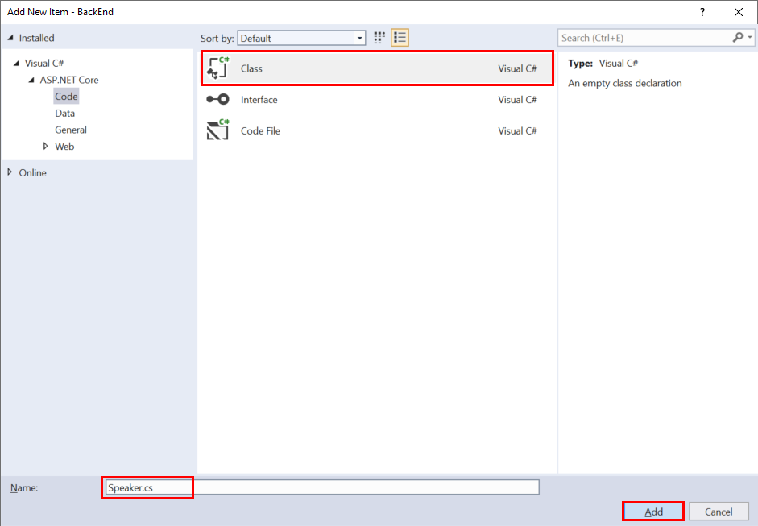

    - **If you're using the .NET Core CLI**:
      - Move to the **Models** folder, and use an editor of your choice to create a file named **Speaker.cs**.

3. Add the following code to the **Models.cs** file, and then save the file.

   > **Note:** If you're using the .NET Core CLI, the file will be blank initially. If you're using Visual Studio, the file will contain a skeleton class; in this case, replace all the code in the file with that shown below:

    ```csharp
    using System;
    using System.Collections.Generic;
    using System.ComponentModel.DataAnnotations;
    using System.Linq;
    using System.Threading.Tasks;

    namespace BackEnd.Models
    {
        public class Speaker
        {
           public int Id { get; set; }

           [Required]
           [StringLength(200)]
           public string Name { get; set; }

           [StringLength(4000)]
           public string Bio { get; set; }

           [StringLength(1000)]
           public virtual string WebSite { get; set; }
        }
    }
    ```

    The file defines the structure of the **Speaker** entity. You'll use the Entity Framework to create a table named **Speaker** in the database. Each public property in the **Speaker** will become a column in the table.

4. If you're using SQL Server to store conference data, add a reference to the NuGet package: `Microsoft.EntityFrameworkCore.SqlServer` version `3.1.2`:
    - **If you're using Visual Studio 2019**:
        1. In Solution Explorer, right-click the **BackEnd** project, and then click **Manage NuGet Packages**.
        2. In the **NuGet Package Manager: BackEnd** window, click the **Browse** tab.

            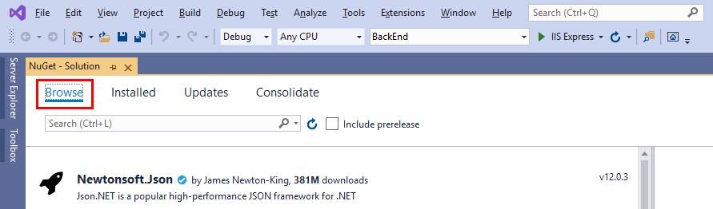

        3. In the search box, type **Microsoft.EntityFrameworkCore.SqlServer**.
        4. Select the **Microsoft.EntityFrameworkCore.SqlServer** package, set the **Version** to **Latest stable 3.1.2**, and then click **Install**.
            
        5. If the **Preview Changes** dialog box appears, click **OK**.
        6. In the **License Acceptance** dialog box, click **I Accept**.

    - **If you're using the .NET Core CLI**:
        1. Move to the **BackEnd** folder.
        2. Run the command `dotnet add package Microsoft.EntityFrameworkCore.SqlServer --version 3.1.2`

5. If you're using SQLite to store conference data, add a reference to the NuGet package `Microsoft.EntityFrameworkCore.Sqlite` version `3.1.2`:
    - **If you're using Visual Studio 2019**:
      - In the **NuGet Package Manager: BackEnd** window, on the **Browse** page, search for **Microsoft.EntityFrameworkCore.Sqlite**, and install the package following the procedure described in the previous step.
    - **If you're using the .NET Core CLI**:
      - In the **BackEnd** folder, run the command `dotnet add package Microsoft.EntityFrameworkCore.Sqlite --version 3.1.2`

6. Create a new class file named **ApplicationDbContext.cs** in the **Models** folder. Follow the procedures described earlier in this exercise for the **Speaker** class. If you're using the .NET Core CLI, make sure you switch back to the **Models** folder before creating the class file.

7. Add the code shown below to the **ApplicationDbContext.cs** class file. If you're using Visual Studio 2019, replace the existing code with the following:

    ```csharp
    using Microsoft.EntityFrameworkCore;

    namespace BackEnd.Models
    {
        public class ApplicationDbContext : DbContext
        {
            public ApplicationDbContext(DbContextOptions<ApplicationDbContext> options)
                : base(options)
            {

            }

            public DbSet<Speaker> Speakers { get; set; }
        }
    }
    ```

    The Entity Framework will use this class to connect to the database. The **Speakers** property is used to read and write **Speaker** objects. The Entity Framework will convert these objects into rows in the **Speakers** table in the database.

8. Open the **appsettings.json** file for the project. If you're using the .NET Core CLI, the **appsettings.json** file is in the **BackEnd** folder.

    - **If you're using SQL Server to store the conference data:**

        - Add the connection string shown below, directly above the **Logging** configuration. This connection string directs the application to use a database named **aspnet-BackEnd** in a local instance of SQL Server Express.

            ```json
            {
                "ConnectionStrings": {
                    "DefaultConnection": "Server=(localdb)\\mssqllocaldb;Database=aspnet-BackEnd-931E56BD-86CB-4A96-BD99-2C6A6ABB0829;Trusted_Connection=True;MultipleActiveResultSets=true"
                },
                "Logging": {
                    "LogLevel": {
                        "Default": "Warning",
                        "Microsoft": "Warning",
                        "Microsoft.Hosting.Lifetime": "Information"
                    }
                },
                "AllowedHosts": "*"
            }
            ```

    - **If you're using SQLite to store the conference data:**

        - Add the connection string shown below, directly above the **Logging** configuration. This connection string directs the application to use a local SQLite database named **conference.db**.

            ```json
            {
                "ConnectionStrings": {
                    "DefaultConnection": "Data Source=conference.db"
                },
                "Logging": {
                    "LogLevel": {
                        "Default": "Warning",
                        "Microsoft": "Warning",
                        "Microsoft.Hosting.Lifetime": "Information"
                    }
                },
                "AllowedHosts": "*"
            }
            ```

9. Open the **Startup.cs** file in the **BackEnd** project. If you're using the .NET Core CLI, you'll find this file in the **BackEnd** folder.

10. Add the following `using` directives to the list at the top of the file:

    ```csharp
    using BackEnd.Models;
    using System.Runtime.InteropServices;
    using Microsoft.EntityFrameworkCore;
    ```

11. If you're using SQL Server to store the conference data, add the following code to the start of the **ConfigureServices** method, before the `services.AddControllers();` statement:

    ```csharp
    services.AddDbContext<ApplicationDbContext>(options =>
    {
        options.UseSqlServer(Configuration.GetConnectionString("DefaultConnection"));
    });
    ```

    If you're using SQLite, add the following code instead:

    ```csharp
    services.AddDbContext<ApplicationDbContext>(options =>
    {
        options.UseSqlite(Configuration.GetConnectionString("DefaultConnection"));
    });
    ```

    This code registers the **ApplicationDbContext** service so it can be injected into controllers at runtime.

## Perform an Entity Framework migration

You've created an Entity Framework model, but you haven't yet created the database and the **Speakers** table. You perform these tasks with the Entity Framework migration tools. These tools generate information about the entities in your project. You then use this information to create the database and generate the corresponding tables.

1. Add a reference to the NuGet package `Microsoft.EntityFrameworkCore.Tools` version `3.1.2` to the **BackEnd** project:
    - **If you're using Visual Studio 2019**:
        - Use the NuGet package manager window, as described earlier.
    - **If you're using the .NET Core CLI**:
        1. Move to the **BackEnd** folder.
        2. Install the package with the command `dotnet add package Microsoft.EntityFrameworkCore.Tools --version 3.1.2`

2. Run the migration tools to generate the migration data and add the necessary tables to the database:
    - **If you're using Visual Studio 2019**:
        1. On the **Tools** menu, point to **NuGet Package Manager**, and then click **Package Manager Console**.

            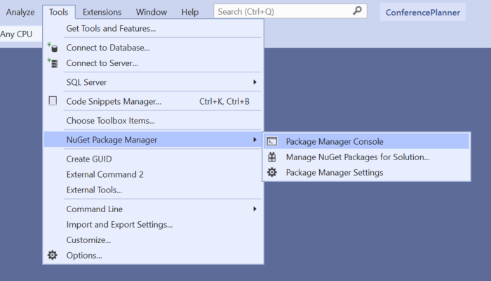

        2. In the **Package Manager Console** window, at the **PM>** prompt, run the following commands:

            ```console
            Add-Migration Initial
            Update-Database
            ```

    - **If you're using the .NET Core CLI**:
        1. Move to the **BackEnd** folder, and run the following command to install the EntityFramework tool, `dotnet-ef`:

            ```console
            dotnet tool install -g dotnet-ef --version 3.1.2
            ```

        2. Close the command prompt window, open a new Command Prompt window, and return to the **ConferencePlanner\BackEnd** folder. This step is necessary because the previous command makes changes to the environment that don't come into effect until you start a new command session.

        3. Run the following commands:

            ```console
            dotnet build
            dotnet ef migrations add Initial
            dotnet ef database update
            ```

            If your database ever gets into a bad state and you need to reset it, you can run the command `dotnet ef database drop` followed by `dotnet ef database update`. This sequence of commands will remove your database and run all the migrations again.

            > For more information on these commands, and ASP.NET MVC scaffolding in general, see [Add a model to an ASP.NET Core MVC app](https://docs.microsoft.com/en-us/aspnet/core/tutorials/first-mvc-app/adding-model#add-initial-migration-and-update-the-database).

## Create an API Controller

You've created a simple EF model and database you can use to store information about conference speakers. The next stage is to provide access to this data by implementing a web API. Client applications use this API to retrieve, create, and maintain speaker data.

**If you're using Visual Studio, perform the following steps:**

1. In Solution Explorer, right-click the **Controllers** folder, point to **Add**, and then click **Controller**.

   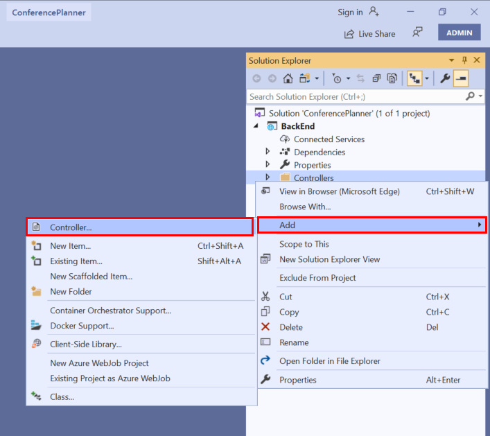

2. In the **Add New Scaffolded Item** dialog box, select **API Controller with actions, using Entity Framework**, and then click **Add**.

   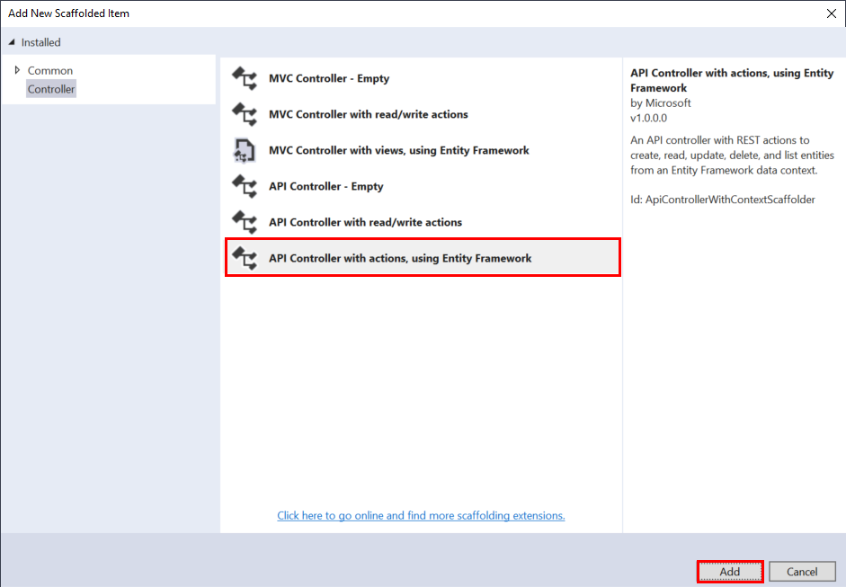

3. In the **Add API Controller with actions, using Entity Framework** dialog box, in the **Model class** list, click **Speaker (BackEnd.Models)**. In the **Data context class** list, click **ApplicationDbContext (BackEnd.Models)**, leave the **Controller name** set to **SpeakersController**, and then click **Add**.

   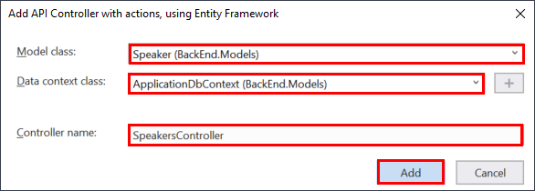

4. Examine the **SpeakersController** class after it's been generated. You'll see it contains methods that correspond to HTTP GET, PUT, POST, and DELETE operations. Each of these methods use the Entity Framework to read and write to the **Speakers** table in the database.

5. In Solution Explorer, expand the **Controllers** folder.

6. Delete the **WeatherForecastController.cs** file. This is a sample controller and isn't required by the ConferencePlanner web API.

**If you're using the .NET Core CLI, perform the following steps:**

1. Move to the **BackEnd** folder, and run the following command to install the `Microsoft.VisualStudio.Web.CodeGeneration.Design` package:

    ```console
    dotnet add package Microsoft.VisualStudio.Web.CodeGeneration.Design --version 3.1.1
    ```

2. Run the following command to install the **aspnet-codegenerator** tool:

    ```console
    dotnet tool install -g dotnet-aspnet-codegenerator --version 3.1.1
    ```

3. Close the command prompt window, open a new Command Prompt window, and return to the **ConferencePlanner\BackEnd** folder. As before, the previous command makes changes to the environment that don't come into effect until you start a new command session.

4. Run the following command to create the **SpeakersController** class. The class will be stored in the **Controller** sub-folder.

    ```console
    dotnet aspnet-codegenerator controller -api -name SpeakersController -m Speaker -dc BackEnd.Models.ApplicationDbContext -outDir Controllers
    ```

5. Open the **SpeakersController.cs** file in the **Controllers** folder. The **SpeakersController** class contains methods that correspond to HTTP GET, PUT, POST, and DELETE operations. Each of these methods uses the Entity Framework to read and write to the **Speakers** table in the database. Don't make any changes to the contents of this file.

6. Close the **SpeakersController.cs** file.

7. In the **Controllers** folder, delete the **WeatherForecastController.cs** file. This is a sample controller and isn't required by the ConferencePlanner web API.

## Test the API using Swashbuckle

In this section, you'll use the Swashbuckle NuGet package to generate information about the operations exposed by the Web API at runtime. The [Swashbuckle.AspNetCore](https://github.com/domaindrivendev/swashbuckle.aspnetcore) package is an open source project for generating Swagger documents for Web APIs built with ASP.NET Core. [Swagger](https://swagger.io) is a machine readable representation of a RESTful API that supports interactive documentation, client SDK generation, and discoverability. You'll use the interactive element of Swashbuckle to test the Web API and add a new speaker.

You can find additional information on using Swashbuckle at [ASP.NET Web API Help Pages using Swagger](https://docs.microsoft.com/en-us/aspnet/core/tutorials/web-api-help-pages-using-swagger).

1. Add a reference to the NuGet package `Swashbuckle.AspNetCore` version `5.0.0` to the **BackEnd** project.
    - **If you're using Visual Studio 2019**:
        - Use the NuGet package manager window, following the procedure described earlier.
    - **If you're using the .NET Core CLI**:
        1. Move to the **BackEnd** folder.
        2. Install the package with the command `dotnet add package Swashbuckle.AspNetCore --version 5.0.0`

2. Edit the **Startup.cs** file in the root folder of the **BackEnd** project. Add the following `using` directive to the list at the start of the file:

    ```csharp
    using using Microsoft.OpenApi.Models;
    ```

3. Add the statement shown below to the end of the **ConfigureServices** method, after the `services.AddControllers()` statement:

    ```csharp
    services.AddSwaggerGen(options =>
        options.SwaggerDoc("v1", new OpenApiInfo { Title = "Conference Planner API", Version = "v1" })
    );
    ```

    This statement adds Swashbuckle services to the web API application.

4. In the **Configure** method, add the following lines just before the `app.UseRouting()` statement:

    ```csharp
    app.UseSwagger();

    app.UseSwaggerUI(options =>
        options.SwaggerEndpoint("/swagger/v1/swagger.json", "Conference Planner API v1")
    );
    ```

5. Open the **launchSettings.json** file in the **Properties** folder of the **BackEnd** project. In this file, change the value of the **launchUrl** property of the **IIS Express** and **BackEnd** profiles from **weatherforecast** to **api/speakers**. This URL causes the application to invoke the **GetSpeakers** method in the **Speakers** controller when it's started using Visual Studio. The resulting file should look similar to this:

    ```json
    {
      "$schema": "http://json.schemastore.org/launchsettings.json",
      "iisSettings": {
        "windowsAuthentication": false,
        "anonymousAuthentication": true,
        "iisExpress": {
          "applicationUrl": "http://localhost:19701",
          "sslPort": 44367
        }
      },
      "profiles": {
        "IIS Express": {
          "commandName": "IISExpress",
          "launchBrowser": true,
          "launchUrl": "api/speakers",
          "environmentVariables": {
            "ASPNETCORE_ENVIRONMENT": "Development"
          }
        },
        "BackEnd": {
          "commandName": "Project",
          "launchBrowser": true,
          "launchUrl": "api/speakers",
          "applicationUrl": "https://localhost:5001;http://localhost:5000",
          "environmentVariables": {
            "ASPNETCORE_ENVIRONMENT": "Development"
          }
        }
      }
    }
    ```

6. Make a note of the values in the **applicationUrl** property of the **BackEnd** profile (your port numbers may vary from those shown above). This property contains two URLs separated by a semicolon. A client application can send requests to the web API using either URL; the first is for HTTPS, the second is for HTTP.

7. Run the application.
    - **If you're using Visual Studio 2019**:
        1. In the toolbar, select the **BackEnd** profile, and then press **F5**.

            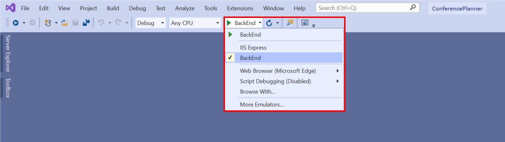

        2. If you're prompted to trust the IIS Express SSL certificate, click **Yes**, and allow Visual Studio to install the certificate when asked.

            A web browser window will open, with the URL **http://localhost:*port*/api/speakers**, and display an empty array of speaker information.

            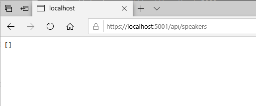

    - **If you're using the .NET Core CLI**:
        1. Move to the **BackEnd** folder and execute the `dotnet run` command.
        2. Open a web browser, and go to the URL **https://localhost:*port*/api/speakers**. Replace *port* with the value you noted for the HTTPS value of the **applicationUrl** property in the previous step. The web browser will display an empty array of speaker information.

            If the **This site is not secure** page appears, click **Details**, and then click **Go on to the webpage**.

8. Browse to the Swagger UI at **https://localhost:*port*/swagger**.

    The Swagger page will appear, displaying details of the Conference Planner API.

    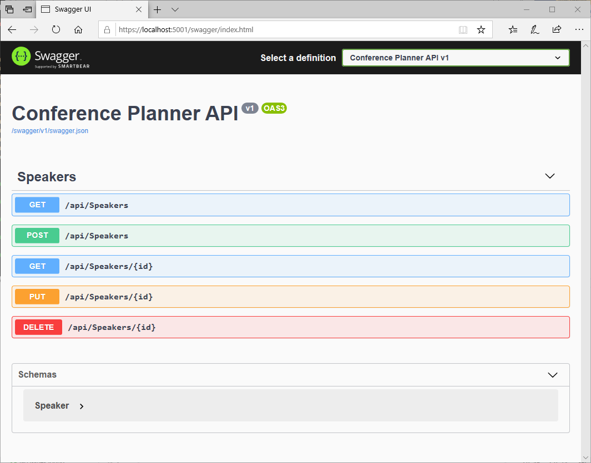

9. In the **Schemas** section, expand the **Speaker** schema.

    The schema contains the fields you specified for the **Speaker** class in the entity model.

    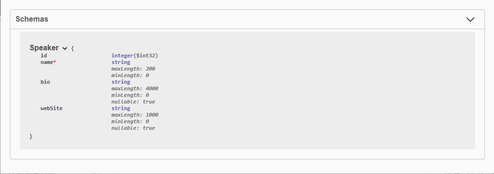

10. In the **Speakers** section, click the **GET** button for **/api/Speakers**, click **Try it out**, and then click **Execute**.

    No speakers should be returned in the **Response body** because the **Speakers** table in the database is currently empty.

    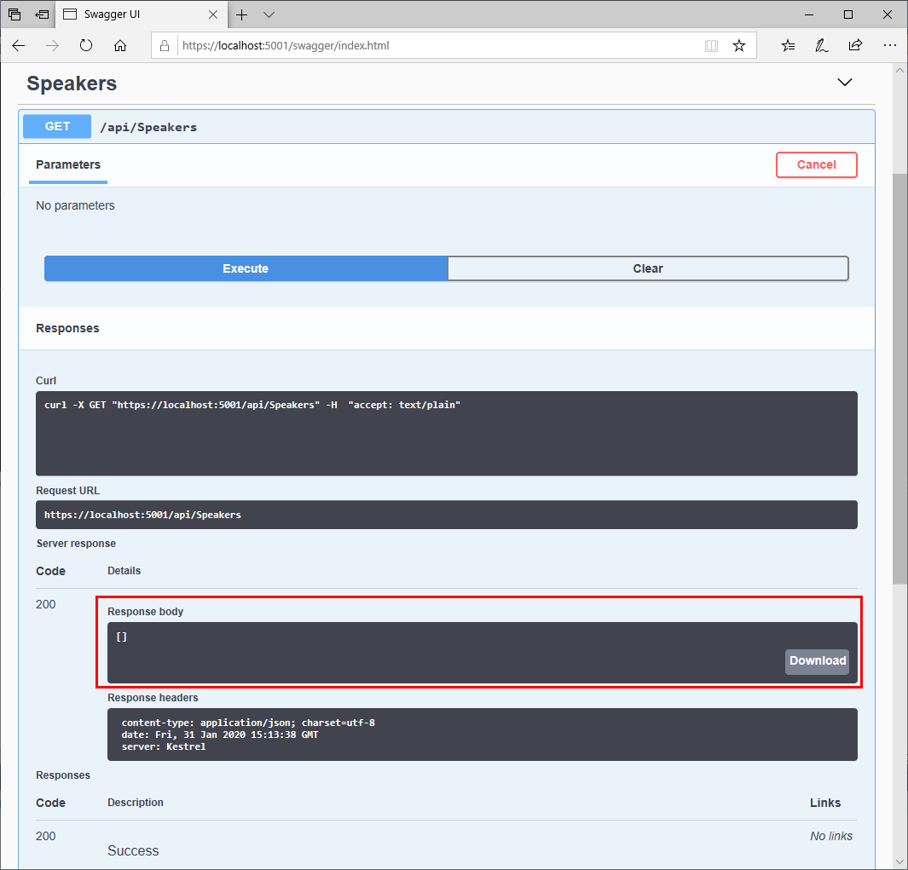

11. Scroll down, click the **POST** button, and then click **Try it out**.

12. In the **Request body** box, enter the details shown below. Omit the **id** property because this value will be generated by the database.

    ```json
    {
      "name": "Tyrion Lannister",
      "bio": "Drinks and knows things",
      "webSite": "http://giphy.com/search/tyrion-lannister"
    }
    ```

13. Click the **Execute** button, and scroll down to the **Responses** section. You should see a success response from the server, indicating that the HTTP POST request has successfully added the new speaker.

    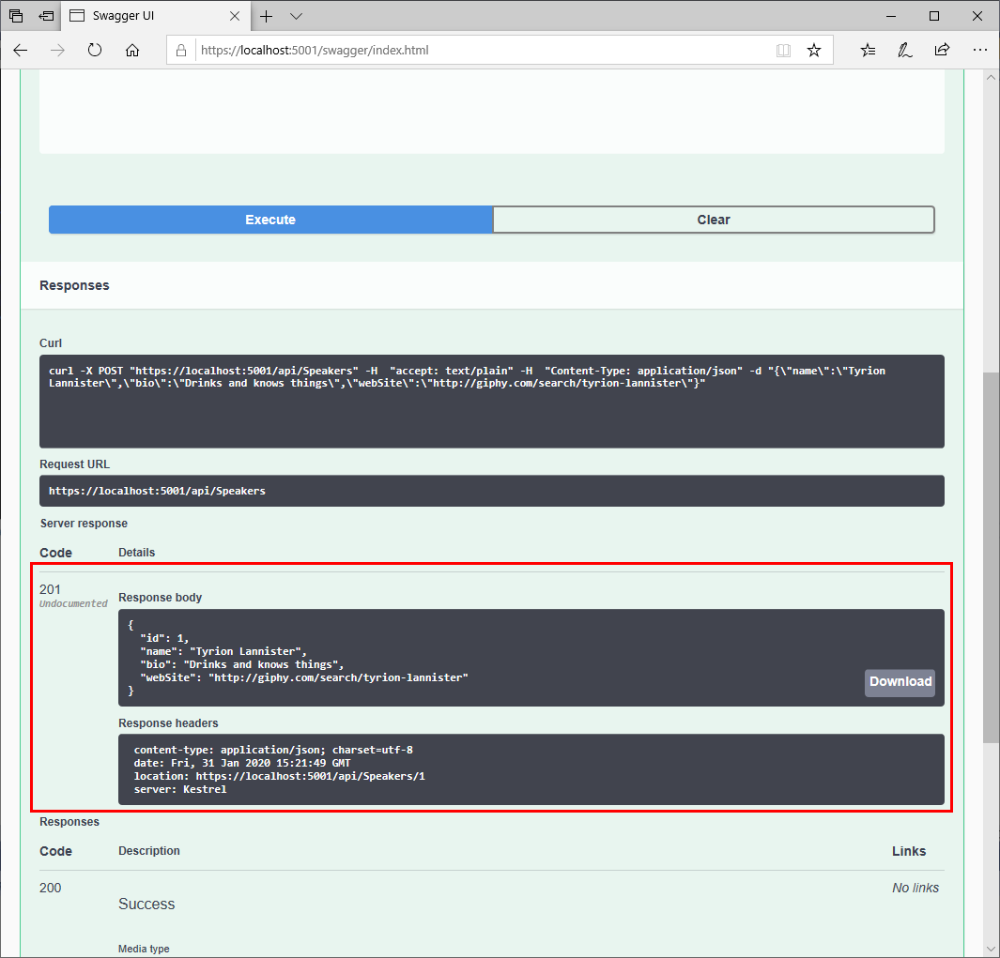

14. In the **GET** for **/api/Speakers**, click **Cancel**. Click **Try it out**, and then click **Execute**.

    This time, the HTTP GET request should return the speaker you just added in the response body.

    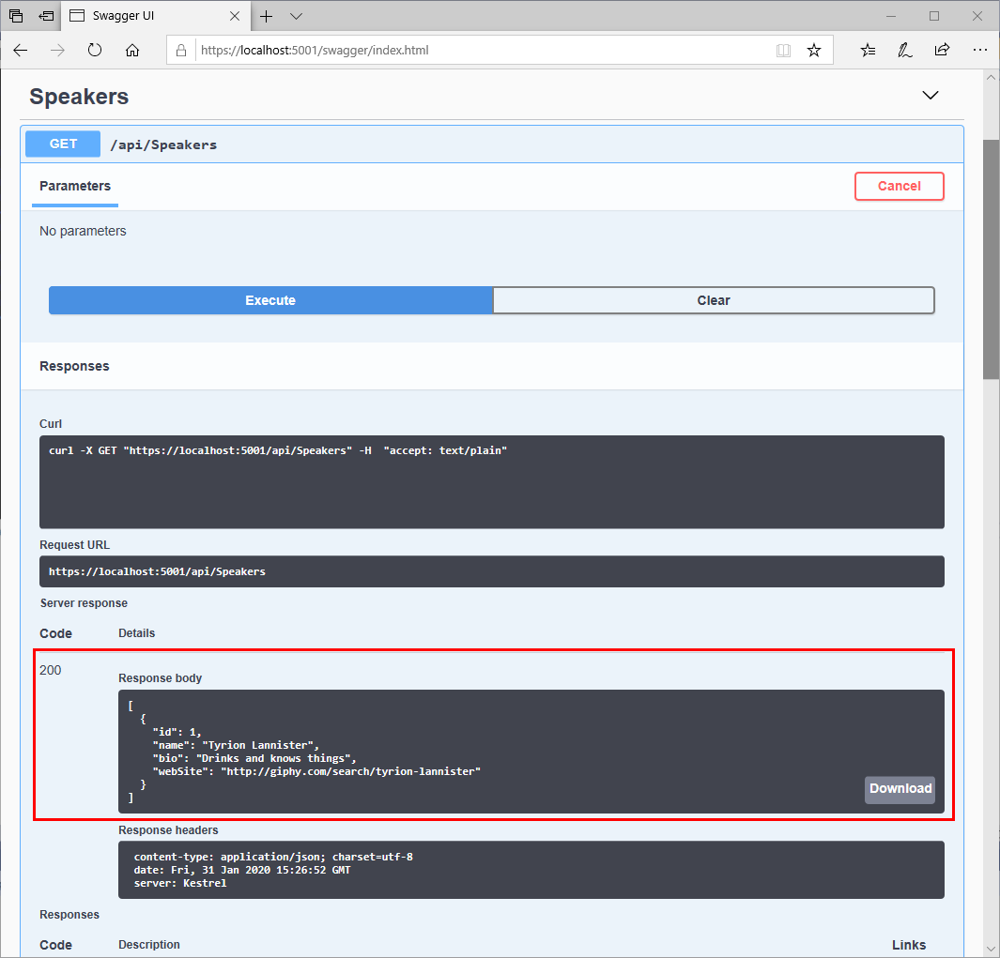

15. Close the web browser and stop the application.

> **Note:** You can find the completed code for the exercises in this session in the [Session 1 save point folder](../save-points/1-Create-API-and-EF-Model)

**Next**: [Session #2 -Extend the BackEnd Web API and Add Data Transfer Objects](2.%20Build%20out%20BackEnd%20and%20Refactor.md)
