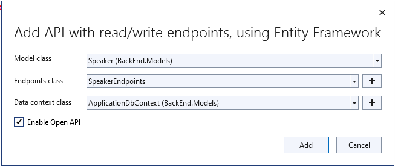

## Creating a new project using Visual Studio

1. Create and add a new project named `BackEnd` and name the solution `ConferencePlanner` using File / New / ASP.NET Core Web API. Select the Web API template, No Auth, no Docker support. Uncheck the box that says "Use controllers (uncheck to use minimal APIs)".

   
   
   

## Creating a new project from the command line

If not using Visual Studio, create the project using the dotnet cli at the command line as follows:

1. Create folder ConferencePlanner and create a solution by running the following console command:

    ```bash
    dotnet new sln
    ```

1. Create sub-folder BackEnd and create a project by running

    ```bash
    dotnet new webapi -minimal
    ```

1. Add the project to the solution using the following command

    ```bash
    dotnet sln add BackEnd/BackEnd.csproj
    ```

1. Open the solution in Visual Studio Code by running the following command:

    ```bash
    code .
    ```

## Adding model classes

1. Add a new `Models` folder to the root of the application.
1. Add a new `Speaker` class using the following code:

    ```csharp
    using System.ComponentModel.DataAnnotations;
    
    namespace BackEnd.Models;
    
    public class Speaker
    {
        public int Id { get; set; }
    
        [Required]
        [StringLength(200)]
        public string? Name { get; set; }
    
        [StringLength(4000)]
        public string? Bio { get; set; }
    
        [StringLength(1000)]
        public virtual string? WebSite { get; set; }
    }
    ```

## Add NuGet packages and EF Core tools

Before you start, you need to add the required packages.

### Adding packages using Visual Studio

1. In Visual Studio, right click the project and select `Manage NuGet Packages...`, then select `Browse...` and search for `Microsoft.EntityFrameworkCore.Sqlite` and click `Install`.

1. Search for `Microsoft.EntityFrameworkCore.Tools` and click `Install`.

### Adding packages from the command line

1. From the terminal, run the following command:

    ```bash
    dotnet add package Microsoft.EntityFrameworkCore.Sqlite
    ```

    This command adds the NuGet package that contains the EF Core SQLite database provider and all its dependencies, including the common EF Core services.

## Adding a database context

1. Next we'll create a new Entity Framework DbContext. Create a new `ApplicationDbContext` class in the `Models` folder using the following code:

    ```csharp
    using Microsoft.EntityFrameworkCore;
    
    namespace BackEnd.Models
    {
        public class ApplicationDbContext : DbContext
        {
            public ApplicationDbContext(DbContextOptions<ApplicationDbContext> options)
                : base(options)
            {
    
            }

            public DbSet<Speaker> Speakers => Set<Speaker>();
        }
    }
    ```

    > **Note**
    > We're using the `=>Set<Speaker>)()` on that last line to [deal with nullable warnings](https://docs.microsoft.com/ef/core/miscellaneous/nullable-reference-types#dbcontext-and-dbset), since we know that EF Core will be initializing this `DbSet`.

1. Add a connection string to the *appsettings.json* file for this database:

    ```json
    {
      "ConnectionStrings": {
        "DefaultConnection": "Data Source=ConferencePlanner.db"
      },
      "Logging": {
        "LogLevel": {
          "Default": "Information",
          "Microsoft.AspNetCore": "Warning"
        }
      },
      "AllowedHosts": "*"
    }
    ```

## Register the DB Context Service

1. Just below the top line of `Program.cs`, add the code read the connection string from the *appsettings.json* file and set up the Sqlite database, so that it reads as follows:

    ```csharp
    var builder = WebApplication.CreateBuilder(args);

    // Add services to the container.
    var connectionString = builder.Configuration.GetConnectionString("DefaultConnection") 
       ?? "Data Source=conferences.db";

    builder.Services.AddSqlite<BackEnd.Models.ApplicationDbContext>(connectionString);
    ```

    > This code registers the `ApplicationDbContext` service so it can be injected into controllers. Additionally, it configures Entity Framework to use SQLite with the configured connection string.

## Configuring EF Migrations

You will be using either a terminal window or the Visual Studio Developer PowerShell terminal for the following steps.

1. If you are using Visual Studio, open the Developer PowerShell terminal by selecting View -> Terminal and enter `cd BackEnd`.

1. If you are using a terminal window, navigate to the project directory (the directory containing the `Program.cs` file).

1. Install the required NuGet package for migrations:

   ```bash
   dotnet add package Microsoft.EntityFrameworkCore.Design
   ```

1. Install the EntityFramework global tool `dotnet-ef` using the following command:

   ```bash
   dotnet tool install -g dotnet-ef
   ```

1. If you receive a message that the tool is already installed, update to the newest version with the following command:

   ```bash
   dotnet tool update -g dotnet-ef
   ```

1. Build the project using the following command:

    ```bash
    dotnet build
    ```

1. Run the following commands in the command prompt:

    ```bash
    dotnet ef migrations add Initial
    dotnet ef database update
    ```

Commands Explained

| Command       |Description       |
| ------------- |-------------|
| `dotnet ef migrations add Initial`     | Generates code to create the initial database schema based on the model specified in 'ApplicationDbContext.cs'. `Initial` is the name of the migration. |  
|`dotnet ef database update` | Creates the database and runs all newly created migrations (in this case, just the `Initial` migration). |

  >For more information on these commands and scaffolding in general, see [this tutorial](https://docs.microsoft.com/aspnet/core/tutorials/first-mvc-app/adding-model#add-initial-migration-and-update-the-database).

  >If your database ever gets in a bad state and you'd like to reset things, you can use `dotnet ef database drop` followed by `dotnet ef database update` to remove your database and run all migrations again.

## A quick look at the Weather Forecast API

Scroll down to the bottom of `Program.cs` and you'll see some sample code for the Weather Forecast API:

```csharp
var summaries = new[]
{
    "Freezing", "Bracing", "Chilly", "Cool", "Mild", "Warm", "Balmy", "Hot", "Sweltering", "Scorching"
};

app.MapGet("/weatherforecast", () =>
{
    var forecast = Enumerable.Range(1, 5).Select(index =>
        new WeatherForecast
        (
            DateTime.Now.AddDays(index),
            Random.Shared.Next(-20, 55),
            summaries[Random.Shared.Next(summaries.Length)]
        ))
        .ToArray();
    return forecast;
})
.WithName("GetWeatherForecast");

app.Run();

internal record WeatherForecast(DateTime Date, int TemperatureC, string? Summary)
{
    public int TemperatureF => 32 + (int)(TemperatureC / 0.5556);
}
```

You'll see a simple API that returns weather forecasts and is mapped to the HTTP GET verb. You'll see the output of this API in a bit, but first we'll build our own API for the `Speakers` model class.

## Scaffolding the Speaker API

### Using Visual Studio

1. Create a new *Endpoints* directory in the *BackEnd* project.
1. Right-click the **Project** and select **Add** > **New Scaffolded Item...**. Select **API with read/write endpoints, using Entity Framework** and click **Add**.
1. In the dialog, select the `Speaker` model for the Model Class.
1. Click the **+** button to add a new endpoint named `SpeakerEndpoints`.
1. Select `ApplicationDbContext` for the "Data Context Class" and click the **Add** button.
1. Check the **Enable Open API** checkbox and click the **Add** button.
   

### Using the cmd line

1. Install the `aspnet-codegenerator` global tool by running the following command:

    ```bash
    dotnet tool install -g dotnet-aspnet-codegenerator
    ```

1. If you receive a message that the tool is already installed, update to the newest version with the following command:

   ```bash
   dotnet tool update -g dotnet-aspnet-codegenerator
   ```

  > **Note**** 
  > You may need to close and reopen the console window to be able to use this tool.

1. Run the following command to view the help for the `minimalapi` scaffolding command:

   ```bash
   dotnet aspnet-codegenerator minimalapi --help
   ```

1. Run the following in the project folder at the cmd line:

    ```bash
    dotnet aspnet-codegenerator minimalapi -e SpeakerEndpoints -dc ApplicationDbContext -o -m BackEnd.Models.Speaker
    ```

This scaffolder does two things:

1. It generates an endpoints class named `SpeakersEndpoints` with API endpoints that map to database operations using the `ApplicationDbContext` class and the `Speaker` model.

1. It adds the follwing code to the `Program.cs` file to register the endpoints class:

  ```csharp
  app.MapSpeakerEndpoints();
```

We'll make a quick improvement to add tags to the **SpeakerEndpoints** class so it works a little better with Open API.

1. Open the `SpeakersEndpoints.cs` file in the project folder.

1. Open the Quick Replace menu using **Edit** / **Find and Replace** / **Quick Replace**.

1. In the Find textbox, enter `.WithName(`

1. In the Replace textbox, enter `.WithTags("Speaker").WithName(`

1. Select **Replace All (Alt-A)**

## Testing the API using Swagger UI

In this section, we'll be interacting with the API using the [Swagger UI](https://swagger.io/tools/swagger-ui/) web interface. Swagger is a machine readable representation of a RESTful API that enables support for interactive documentation, client SDK generation and discoverability.

1. Run the application (F5 in Visual Studio or `dotnet run` from console).
1. If the browser does not automatically open, browse to the Swagger UI at `http://localhost:<random_port>/swagger`.
    
1. First, click on the *GET* button in *WeatherForecast* section. You'll see the values that were listed in the `WeatherForecastController` earlier.
1. In the *Speakers* section, click on the *GET* button. You'll see there are no speakers returned. Let's add one!
1. In the *Speakers* section, click on the *POST* button. Referencing the example on the right, fill in a speaker request. Leave the `ID` blank, that will be filled in by the database.

    

    ```json
    {
      "name": "Dr. Steven Strange",
      "bio": "Formerly a renowned surgeon, Doctor Stephen Strange now serves as the Sorcerer Supreme.",
      "webSite": "https://giphy.com/search/doctor-strange"
    }
    ```

1. When you click the *Execute* button, you should see a success response from the server. Now, trying out the *GET* endpoint above should show your newly added speaker.

    

**Next**: [Session #2 - Back-end](2.%20Build%20out%20BackEnd%20and%20Refactor.md)
