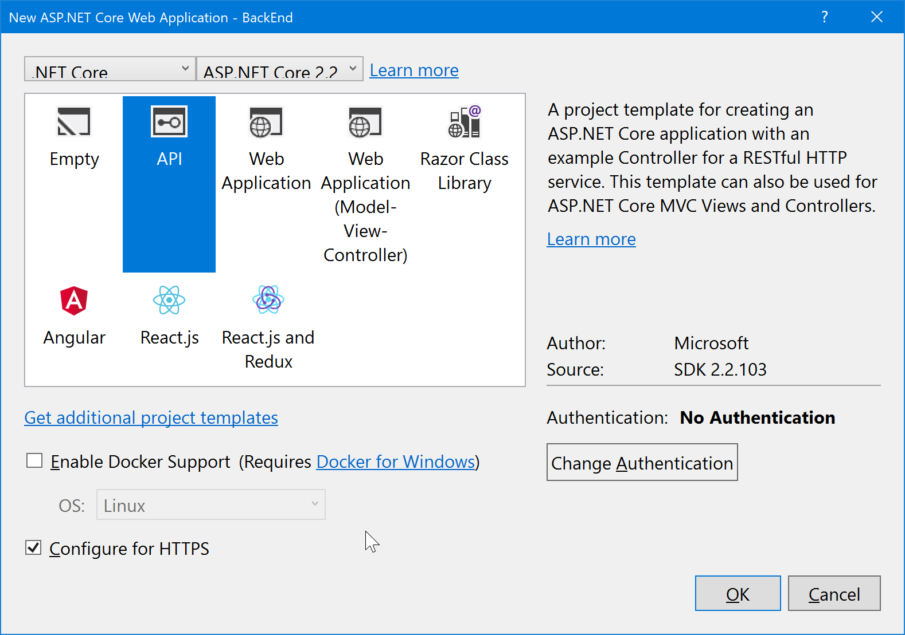

## Creating a basic EF model

1. Create a new project using File / New / ASP.NET Core Web Application. Select the Web API template, No Auth, no Docker support.
   
   
   > ***Note:* If not using Visual Studio, create the project using `dotnet new webapi`**
1. Add a new `Models` folder to the root of the application.
1. Add a new `Speaker` class using the following code:
    ```csharp
    using System;
    using   System.Collections.Generic;
    using System.Linq;
    using   System.Threading.Tasks;
  
    namespace BackEnd.Models
    {
        public class Speaker
        {
           public int ID { get; set; }
    
           [Required]
           [StringLength(200)]
           public string Name { get; set; }
    
           [StringLength(4000)]
           public string Bio { get; set; }
    
           [StringLength(1000)]
           public virtual string WebSite { get; set; }
        }
    }
    ``` 
1. Next we'll create a new Entity Framework DbContext. Create a new `ApplicationDbContext` class in the `Models` folder using the following code:
    ```csharp
   using Microsoft.EntityFrameworkCore;
   using Microsoft.EntityFrameworkCore.Infrastructure;
   using Microsoft.Extensions.DependencyInjection;
   
   namespace BackEnd.Models
   {
       public class ApplicationDbContext : DbContext
       {
           public ApplicationDbContext(DbContextOptions<ApplicationDbContext> options)
               : base(options)
           {
   
           }

           public DbSet<Speaker> Speaker { get; set; }
       }

       public class ApplicationDbContextFactory : IDbContextFactory<ApplicationDbContext>
       {
           public ApplicationDbContext Create(string[] args) =>
               Program.BuildWebHost(args).Services.CreateScope().ServiceProvider.GetRequiredService<ApplicationDbContext>();
       }
   }
    ```
1. Add a connection string to the appSettings.json file for this database:

   ```json
   {
     "Logging": {
       "IncludeScopes": false,
       "LogLevel": {
         "Default": "Warning"
       }
     },
     "ConnectionStrings": {
       "DefaultConnection": "Server=(localdb)\\mssqllocaldb;Database=BackEndContext-2faf96af-a5fb-451a-b07e-badfooddecaf;   Trusted_Connection=True;MultipleActiveResultSets=true"
     }
   }
   ```

## Register the DB Context Service
1. Add the following code to the top of the `ConfigureServices()` method in `Startup.cs`:
   ```csharp
    services.AddDbContext<ApplicationDbContext>(options =>
    {
        if (RuntimeInformation.IsOSPlatform(OSPlatform.Windows))
        {
            options.UseSqlServer(Configuration.GetConnectionString("DefaultConnection"));
        }
        else
        {
            options.UseSqlite("Data Source=conferences.db");
        }
    });
   ```
   >This code registers the ApplicationDbContext service so it can be injected into controllers. Additionally, it configures operating system specific connection strings.

## Configuring EF Migrations
1. Add the `Microsoft.EntityFrameworkCore.Tools.DotNet` NuGet package. This can be done via the Visual Studio dialog, by running `dotnet add package Microsoft.EntityFrameworkCore.Tools.DotNet`, or by editing the project file and adding it to the tools reference group:
   ```xml
   <ItemGroup>
     <DotNetCliToolReference    Include="Microsoft.VisualStudio.Web.CodeGeneration.Tools" Version="2.0.0-preview1-final" />
     <DotNetCliToolReference    Include="Microsoft.EntityFrameworkCore.Tools.DotNet" Version="2.0.0-preview1-final" />
   </ItemGroup>
   ```
1. Open a command prompt and navigate to the project directory. (The directory containing the `Startup.cs` file).

1. Run the following commands in the command prompt:

  ```console
  dotnet restore
  dotnet ef migrations add Initial
  dotnet ef database update
  ```
  >For more information on these commands and scaffolding in general, see [this tutorial](https://docs.microsoft.com/en-us/aspnet/core/tutorials/first-mvc-app/adding-model#add-initial-migration-and-update-the-database).

## A quick look at the Values Controller
First, open the `Controllers` controller and take a quick look at the `ValuesController`. You'll see simple functions that correspond to HTTP verbs. You'll see the output of this controller in a bit, but first we'll build our own API controller for the `Speakers` model class.

## Scaffolding an API Controller 
>*Note:* Scaffolding is only available in Visual Studio 2017 (Windows). If you're running on another platform or have trouble with this section, you can just copy the  completed controller code in from [here](/save-points/1-Create-API-and-EF-Model/ConferencePlanner/BackEnd/Controllers/SpeakersController.cs).
1. Right-click the `Controllers` folder and select Add/Controller. You'll be shown a prompt for setting up Scaffolding. Select "Minimal Dependencies".
1. Again, right-click the `Controllers` folder and select Add/Controller. Select "API Controller with Actions, Using EF".
1. In the dialog, select the `Speaker` model for the Model Class, `ApplicationDbContext` for the "Data Context Class" and click the `Add` button.
   

## Testing the API using the Swashbuckle

In this section, we'll be adding documentation to our API using the Swashbuckle NuGet package.

*Swashbuckle.AspNetCore* is an open source project for generating Swagger documents for Web APIs that are built with ASP.NET Core MVC.

Swagger is a machine readable representation of a RESTful API that enables support for interactive documentation, client SDK generation and discoverability.

Additional information on using Swashbuckle in ASP.NET Core is available in this tutorial: [ASP.NET Web API Help Pages using Swagger](https://docs.microsoft.com/en-us/aspnet/core/tutorials/web-api-help-pages-using-swagger)

1. Add the `Swashbuckle.AspNetCore` NuGet package.
   > This can be done from the command line using `dotnet add package Swashbuckle.AspNetCore`
1. Register Swashbuckle as a service by replacing the line that reads `services.AddMvc();` in the the `ConfigureServices()` method in `Startup.cs`:
   ```csharp
    services.AddMvcCore()
        .AddJsonFormatters()
        .AddApiExplorer();

    services.AddSwaggerGen(options =>
        options.SwaggerDoc("v1", new Info { Title = "Conference Planner API", Version = "v1" })
    );
   ```
1. Configure Swashbuckle by adding the following lines to top of the `Configure()` method in `Startup.cs`:
   ```csharp
    app.UseSwagger();

    app.UseSwaggerUI(options =>
        options.SwaggerEndpoint("/swagger/v1/swagger.json", "Conference Planner API v1")
    );
   ```
1. Run the application (F5 in Visual Studio or `dotnet run` from console). 
1. Browse to the Swagger UI at `http://localhost:<random_port>/swagger`. 
   
1. First, click on the *GET* button in *Values* section. You'll see the values that were listed in the `ValuesController` earlier.
1. In the *Speakers* section, click on the *GET* button. You'll see there are not speakers returned. Let's add one!
1. In the *Speakers* section, click on the *POST* button. Referencing the example on the right, fill in a speaker request. Leave the `ID` blank, that will be filled in by the database. 
   
1. When you click the *Try it out!* button, you should see a success response from the server. Now, clicking the *GET* button above should show your newly added speaker.
   
