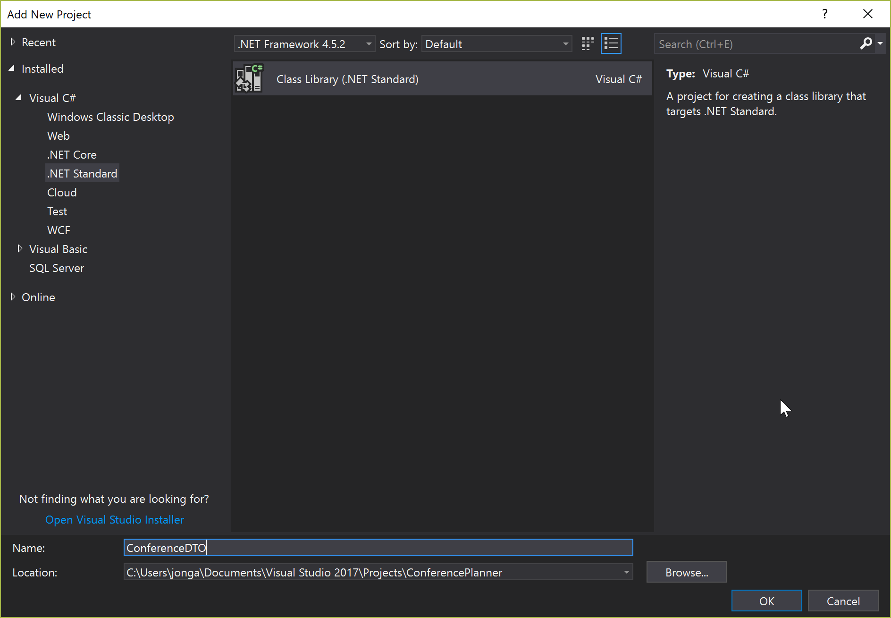

## Building out the Back End

In this session, we'll add the rest of our models and controllers that expose them. We'll also refactor our application, moving our DTOs to a shared project so they can be used by our front-end application later.

## Add a ConferenceDTO project
> We'll start by creating the new shared project to hold our data transfer objects.
### Adding the ConferenceDTO Project using Visual Studio
1. If using Visual Studio, right-click on the Solution and select *Add* / *New Project...*.
1. Select *.NET Standard* from the project types on the left and select the *Class Libarary (.NET Standard)* template. Name the project ConferenceDTO and press OK.

1. Delete the generated `Class1.cs` file from this new project.

### Adding the ConferenceDTO project via the Command Line
1. Open a command prompt and navigate to the root `ConferencePlanner` directory.
1. Run the following command: 
   ```
   dotnet new classlib -o ConferenceDTO -f netstandard2.0
   ```
1. Next we'll need to add a reference to the ConferenceDTO project from the BackEnd project. From the command line, navigate to the BackEnd project directory and execute the following command:
   ```
   dotnet add reference ../ConferenceDTO/ConferenceDTO.csproj
   ```
1. Add the ConferenceDTO project to the solution:
   ```
   dotnet sln add ConferenceDTO\ConferenceDTO.csproj
   ```

## Refactoring the Speaker model into the ConferenceDTO project
1. Copy the `Speaker.cs` class from the *BackEnd* application into the root of the new ConferenceDTO project, and change the namespace to `ConferenceDTO`.
1. The data annotations references can't be resolved to a missing NuGet package. Add a reference to `System.ComponentModel.Annotations`. When the package restore completes, you should see that your data annotations are now resolved.
1. Go back to the *BackEnd* application and modify the code in `Speaker.cs` as shown:
   ```csharp
   public class Speaker : ConferenceDTO.Speaker
   {
   }
   ```
1. Run the application and view the Speakers data using the Swagger UI to verify everything still works.

## Adding the remaining models to ConferenceDTO

We've got several more models to add, and unfortunately it's a little mechanical. You can copy the following classes manually, or open the completed solution which is shown at the end.

1. Create an `Attendee.cs` class in the *ConferenceDTO* project with the following code:
   ```csharp
   using System;
   using System.Collections.Generic;
   using System.ComponentModel.DataAnnotations;
   
   namespace ConferenceDTO
   {
       public class Attendee
       {
           public int ID { get; set; }
   
           [Required]
           [StringLength(200)]
           public virtual string FirstName { get; set; }
   
           [Required]
           [StringLength(200)]
           public virtual string LastName { get; set; }
   
           [Required]
           [StringLength(200)]
           public string UserName { get; set; }
           
           [StringLength(256)]
           public virtual string EmailAddress { get; set; }
       }
   }   
   ```
1. Create a `Conference.cs` class with the following code:
   ```csharp
   using System;
   using System.Collections.Generic;
   using System.ComponentModel.DataAnnotations;
   using System.Text;
   
   namespace ConferenceDTO
   {
       public class Conference
       {
           public int ID { get; set; }
   
           [Required]
           [StringLength(200)]
           public string Name { get; set; }
       }
   }   
   ```
1. Create a `Session.cs` class with the following code:
   ```csharp
   using System;
   using System.Collections;
   using System.Collections.Generic;
   using System.ComponentModel.DataAnnotations;
   
   namespace ConferenceDTO
   {
       public class Session
       {
           public int ID { get; set; }
   
           [Required]
           public int ConferenceID { get; set; }
   
           [Required]
           [StringLength(200)]
           public string Title { get; set; }
   
           [StringLength(4000)]
           public virtual string Abstract { get; set; }
   
           public virtual DateTimeOffset? StartTime { get; set; }
   
           public virtual DateTimeOffset? EndTime { get; set; }
   
           // Bonus points to those who can figure out why this is written this way
           public TimeSpan Duration => EndTime?.Subtract(StartTime ?? EndTime ?? DateTimeOffset.MinValue) ?? TimeSpan.Zero;
   
           public int? TrackId { get; set; }
       }
   }
   ```
1. Create a new `Tag.cs` class with the following code:
   ```csharp
   using System.Collections.Generic;
   using System.ComponentModel.DataAnnotations;
   
   namespace ConferenceDTO
   {
       public class Tag
       {
           public int ID { get; set; }
   
           [Required]
           [StringLength(32)]
           public string Name { get; set; }
       }
   }
   ```
1. Create a new `Track.cs` class with the following code:
   ```csharp
   using System;
   using System.Collections.Generic;
   using System.ComponentModel.DataAnnotations;
   
   namespace ConferenceDTO
   {
       public class Track
       {
           public int TrackID { get; set; }
   
           [Required]
           public int ConferenceID { get; set; }
   
           [Required]
           [StringLength(200)]
           public string Name { get; set; }
       }
   }
   ```

## Creating Derived Models in the BackEnd project
We're not going to create our EF models directly from the *ConferenceDTO* classes. Instead, we'll create some composite classes such as *SessionSpeaker*, since these will map more closely to what our application will be working with.

We're also going to take this opportunity to rename the `Models` directory in the *BackEnd* project to `Data` since it no longer just contains models.
1. Right-click the `Models` directory and select `Rename`, changing the name to `Data`.
1. In the *BackEnd* project, add a `ConferenceAttendee.cs` class to the `Data` directory with the following code:
   ```csharp
   using System;
   using System.Collections.Generic;
   using System.Linq;
   using System.Threading.Tasks;
   
   namespace BackEnd.Data
   {
       public class ConferenceAttendee
       {
           public int ConferenceID { get; set; }
   
           public Conference Conference { get;    set; }
   
           public int AttendeeID { get; set; }
   
           public Attendee Attendee { get; set; }
       }
   }
   ```
1. Add a `SessionSpeaker.cs` class to the `Data` directory with the following code:
   ```csharp
   using System;
   using System.Collections.Generic;
   using System.Linq;
   using System.Threading.Tasks;
   
   namespace BackEnd.Data
   {
       public class SessionSpeaker
       {
           public int SessionId { get; set; }
   
           public Session Session { get; set; }
   
           public int SpeakerId { get; set; }
   
           public Speaker Speaker { get; set; }
       }
   }
   ```
1. Add a `SessionTag.cs` class to the `Data` directory with the following code:
   ```csharp
   using System;
   using System.Collections.Generic;
   using System.Linq;
   using System.Threading.Tasks;
   
   namespace BackEnd.Data
   {
       public class SessionTag
       {
           public int SessionID { get; set; }
   
           public Session Session { get; set; }
   
           public int TagID { get; set; }
   
           public Tag Tag { get; set; }
       }
   }
   ```
1. Add an `Attendee.cs` class with the following code:
   ```csharp
   using System;
   using System.Collections.Generic;
   
   namespace BackEnd.Data
   {
       public class Attendee : ConferenceDTO.Attendee
       {
           public virtual ICollection<ConferenceAttendee> ConferenceAttendees { get; set; }
   
           public virtual ICollection<Session> Sessions { get; set; }
       }
   }
   ```
1. Add a `Conference.cs` class with the following code:
   ```csharp
   using System;
   using System.Collections.Generic;
   using System.Text;
   
   namespace BackEnd.Data
   {
       public class Conference : ConferenceDTO.Conference
       {
           public virtual ICollection<Track> Tracks { get; set; }
   
           public virtual ICollection<Speaker> Speakers { get; set; }
   
           public virtual ICollection<Session> Sessions { get; set; }
   
           public virtual ICollection<ConferenceAttendee> ConferenceAttendees { get; set; }
       }
   }
   ```
1. Add a `Session.cs` class with the following code:
   ```csharp
   using System;
   using System.Collections;
   using System.Collections.Generic;
   
   namespace BackEnd.Data
   {
       public class Session : ConferenceDTO.Session
       {
           public Conference Conference { get; set; }
   
           public virtual ICollection<SessionSpeaker> SessionSpeakers { get; set; }
   
           public Track Track { get; set; }
   
           public virtual ICollection<SessionTag> SessionTags { get; set; }
       }
   }
   ```
1. Modify the `Speaker.cs` class we wrote previously to make the following two changes: update to the namespace to match our directory rename, and add a referece to the `SessionSpeaker` composite class:
   ```csharp
   using System;
   using System.Collections.Generic;
   
   namespace BackEnd.Data
   {
       public class Speaker : ConferenceDTO.Speaker
       {
           public virtual ICollection<SessionSpeaker> SessionSpeakers { get; set; } = new List<SessionSpeaker>();
       }
   }
   ```

1. Add a `Tag.cs` class with the following code:
   ```csharp
   using System.Collections.Generic;

   namespace BackEnd.Data
   {
       public class Tag : ConferenceDTO.Tag
       {
           public virtual ICollection<SessionTag> SessionTags { get; set; }
       }
   }
   ```
1. Add a `Track.cs` class with the following code:
   ```csharp
   using System;
   using System.Collections.Generic;
   using System.ComponentModel.DataAnnotations;

   namespace BackEnd.Data
   {
       public class Track : ConferenceDTO.Track
       {
           [Required]
           public Conference Conference { get; set; }

           public virtual ICollection<Session> Sessions { get; set; }
       }
   }
   ```

## Update the ApplicationDbContext
Okay, now we need to update our `ApplicationDbContext` so Entity Framework knows about our new models.

1. Update `ApplicationDbContext.cs` to use the following code:
   ```csharp
   using System;
   using System.Collections.Generic;
   using System.Linq;
   using System.Threading.Tasks;
   using Microsoft.EntityFrameworkCore;
   using Microsoft.EntityFrameworkCore.Infrastructure;
   using Microsoft.EntityFrameworkCore.Design;
   using Microsoft.Extensions.DependencyInjection;

   namespace BackEnd.Data
   {
       public class ApplicationDbContext : DbContext
       {
           public ApplicationDbContext(DbContextOptions<ApplicationDbContext> options)
               : base(options)
           {

           }

           protected override void OnModelCreating(ModelBuilder modelBuilder)
           {
               modelBuilder.Entity<Attendee>()
                   .HasIndex(a => a.UserName)
                   .IsUnique();

               // Many-to-many: Conference <-> Attendee
               modelBuilder.Entity<ConferenceAttendee>()
                   .HasKey(ca => new { ca.ConferenceID, ca.AttendeeID });

               // Many-to-many: Speaker <-> Session
               modelBuilder.Entity<SessionSpeaker>()
                   .HasKey(ss => new { ss.SessionId, ss.SpeakerId});

               // Many-to-many: Session <-> Tag
               modelBuilder.Entity<SessionTag>()
                   .HasKey(st => new { st.SessionID, st.TagID });
           }

           public DbSet<Conference> Conferences { get; set; }

           public DbSet<Session> Sessions { get; set; }

           public DbSet<Track> Tracks { get; set; }

           public DbSet<Tag> Tags { get; set; }

           public DbSet<Speaker> Speakers { get; set; }

           public DbSet<Attendee> Attendees { get; set; }
       }

       public class ApplicationDbContextFactory : IDesignTimeDbContextFactory<ApplicationDbContext>
       {
           public ApplicationDbContext CreateDbContext(string[] args) =>
               Program.CreateWebHostBuilder(args).Build().Services.CreateScope().ServiceProvider.GetRequiredService<ApplicationDbContext>();
       }
   }
   ```
1. Fix errors due to the rename from `BackEnd.Models` to `BackEnd.Data`. You can either do this using a find / replace (replacing "BackEnd.Models" with "BackEnd.Data") or you can do a build and fix errors.
1. Ensure that the application builds now.

## Add a new database migration
1. Run the following commands in the command prompt in the `BackEnd` project directory:
   ```console
   dotnet ef migrations add Refactor
   dotnet ef database update
   ```
1. Now take a deep breath and run the application and navigate to `/swagger`. You should see the Swagger UI.

>Save point for above code changes is [here](/save-points/2a-Refactor-to-ConferenceDTO/ConferencePlanner)

## Misc Cleanup
Let's fix a few remaining details before moving on to the remaining API Controllers.
1. Delete `ValuesController.cs` from the `Controllers` directory.
1. Delete the `wwwroot` directory.

## Updating the Speakers API controller
1. We'll rename `_context` to `_db`, so your context will appear as shown:
   ```csharp
   private readonly ApplicationDbContext _db;
   
   public SpeakersController(ApplicationDbContext db)
   {
       _db = db;
   }
   ```
1. Make this controller asynchronous by adding the `async` keyword and to return `Task<IActionResult>` as shown:
   ```csharp
   public async Task<IActionResult> GetSpeakers()
   ```
1. Modify the query as shown below:
   ```csharp
    var speakers = await _db.Speakers.AsNoTracking()
                            .Include(s => s.SessionSpeakers)
                                .ThenInclude(ss => ss.Session)
                            .ToListAsync();
    return Ok(speakers);   
   ```
1. While the above will work, this is directly returning our model class. A better practice is to return an output model class. Create a `SpeakerResponse.cs` class in the *ConferenceDTO* project with the following code:
   ```csharp
    using System;
    using System.Collections.Generic;
    using System.Text;

    namespace ConferenceDTO
    {
        public class SpeakerResponse : Speaker
        {
            // TODO: Set order of JSON proeprties so this shows up last not first
            public ICollection<Session> Sessions { get; set; } = new List<Session>();
        }
    }
   ```
1. Now we'll add a utility method to map between these classes. In the *BackEnd* project, create an `Infrastructure` directory. Add a class named `EntityExtensions.cs` with the following mapping code:
   ```csharp
    using BackEnd.Data;
    using System;
    using System.Collections.Generic;
    using System.Linq;
    using System.Threading.Tasks;

    namespace BackEnd.Data
    {
        public static class EntityExtensions
        {
            public static ConferenceDTO.SpeakerResponse MapSpeakerResponse(this Speaker speaker) =>
                new ConferenceDTO.SpeakerResponse
                {
                    ID = speaker.ID,
                    Name = speaker.Name,
                    Bio = speaker.Bio,
                    WebSite = speaker.WebSite,
                    Sessions = speaker.SessionSpeakers?
                        .Select(ss =>
                            new ConferenceDTO.Session
                            {
                                ID = ss.SessionId,
                                Title = ss.Session.Title
                            })
                        .ToList()
                };
        }
    }
   ```
1. Now we can update the `GetSpeakers()` method of the *SpeakersController* so that it returns our response model. Update the last few lines so that the method reads as follows:
   ```csharp
    [HttpGet]
    public async Task<IActionResult> GetSpeakers()
    {
        var speakers = await _db.Speakers.AsNoTracking()
                                        .Include(s => s.SessionSpeakers)
                                            .ThenInclude(ss => ss.Session)
                                        .ToListAsync();

        var result = speakers.Select(s => s.MapSpeakerResponse());
        return Ok(result);
    }
   ```
1. Update the `GetSpeaker()` method to use our mapped response models as follows:
   ```csharp
    [HttpGet("{id:int}")]
    public async Task<IActionResult> GetSpeaker([FromRoute]int id)
    {
        var speaker = await _db.Speakers.AsNoTracking()
                                        .Include(s => s.SessionSpeakers)
                                            .ThenInclude(ss => ss.Session)
                                        .SingleOrDefaultAsync(s => s.ID == id);
        if (speaker == null)
        {
            return NotFound();
        }
        var result = speaker.MapSpeakerResponse();
        return Ok(result);
    }
   ```
1. Update the remaining actions in the *SpeakerController* as shown below:
   ```csharp
    [HttpPost]
    public async Task<IActionResult> CreateSpeaker([FromBody]ConferenceDTO.Speaker input)
    {
        if (!ModelState.IsValid)
        {
            return BadRequest(ModelState);
        }

        var speaker = new Speaker
        {
            Name = input.Name,
            WebSite = input.WebSite,
            Bio = input.Bio
        };

        _db.Speakers.Add(speaker);
        await _db.SaveChangesAsync();

        var result = speaker.MapSpeakerResponse();

        return CreatedAtAction(nameof(GetSpeaker), new { id = speaker.ID }, result);
    }

    [HttpPut("{id:int}")]
    public async Task<IActionResult> UpdateSpeaker([FromRoute]int id, [FromBody]ConferenceDTO.Speaker input)
    {
        var speaker = await _db.FindAsync<Speaker>(id);

        if (speaker == null)
        {
            return NotFound();
        }

        if (!ModelState.IsValid)
        {
            return BadRequest(ModelState);
        }

        speaker.Name = input.Name;
        speaker.WebSite = input.WebSite;
        speaker.Bio = input.Bio;

        // TODO: Handle exceptions, e.g. concurrency
        await _db.SaveChangesAsync();

        var result = speaker.MapSpeakerResponse();

        return Ok(result);
    }

    [HttpDelete("{id:int}")]
    public async Task<IActionResult> DeleteSpeaker([FromRoute]int id)
    {
        var speaker = await _db.FindAsync<Speaker>(id);

        if (speaker == null)
        {
            return NotFound();
        }

        _db.Remove(speaker);

        // TODO: Handle exceptions, e.g. concurrency
        await _db.SaveChangesAsync();

        return NoContent();
    }
   ```

## Adding the remaining API Controllers
1. Add the following response DTO classes from [the save point folder](/save-points/2b-BackEnd-completed/ConferencePlanner/ConferenceDTO)
   - `AttendeeResponse`
   - `SessionRespsone`
   - `ConferenceResponse`
   - `TrackResponse`
   - `TagResponse`
1. Update the `EntityExtensions` class with the extra mapping methods from [the save point folder](/save-points/2b-BackEnd-completed/ConferencePlanner/BackEnd/Infrastructure)
1. Copy the following controllers from [the save point folder](/save-points/2b-BackEnd-completed/ConferencePlanner/BackEnd/Controllers) into the current project's `BackEnd/Controllers` directory:
   - `SessionsController`
   - `ConferencesController`
   - `AttendeesController`
   
## Update EntityExtensions
1. Update the `EntityExtensions.cs` file to with the following code (adding the `MapSessionResponse` and `MapAttendeeResponse` methods):
   ```csharp
   using BackEnd.Data;
   using System;
   using System.Collections.Generic;
   using System.Linq;
   using System.Threading.Tasks;

   namespace BackEnd.Data
   {
       public static class EntityExtensions
       {
           public static ConferenceDTO.SessionResponse MapSessionResponse(this Session session) =>
               new ConferenceDTO.SessionResponse
               {
                   ID = session.ID,
                   Title = session.Title,
                   StartTime = session.StartTime,
                   EndTime = session.EndTime,
                   Tags = session.SessionTags?
                                 .Select(st => new ConferenceDTO.Tag
                                 {
                                     ID = st.TagID,
                                     Name = st.Tag.Name
                                 })
                                  .ToList(),
                   Speakers = session.SessionSpeakers?
                                     .Select(ss => new ConferenceDTO.Speaker
                                     {
                                         ID = ss.SpeakerId,
                                         Name = ss.Speaker.Name
                                     })
                                      .ToList(),
                   TrackId = session.TrackId,
                   Track = new ConferenceDTO.Track
                   {
                       TrackID = session?.TrackId ?? 0,
                       Name = session.Track?.Name
                   },
                   ConferenceID = session.ConferenceID,
                   Abstract = session.Abstract
               };

           public static ConferenceDTO.SpeakerResponse MapSpeakerResponse(this Speaker speaker) =>
               new ConferenceDTO.SpeakerResponse
               {
                   ID = speaker.ID,
                   Name = speaker.Name,
                   Bio = speaker.Bio,
                   WebSite = speaker.WebSite,
                   Sessions = speaker.SessionSpeakers?
                       .Select(ss =>
                           new ConferenceDTO.Session
                           {
                               ID = ss.SessionId,
                               Title = ss.Session.Title
                           })
                       .ToList()
               };

           public static ConferenceDTO.AttendeeResponse MapAttendeeResponse(this Attendee attendee) =>
               new ConferenceDTO.AttendeeResponse
               {
                   ID = attendee.ID,
                   FirstName = attendee.FirstName,
                   LastName = attendee.LastName,
                   UserName = attendee.UserName,
                   Sessions = attendee.Sessions?
                       .Select(s =>
                           new ConferenceDTO.Session
                           {
                               ID = s.ID,
                               Title = s.Title,
                               StartTime = s.StartTime,
                               EndTime = s.EndTime
                           })
                       .ToList(),
                   Conferences = attendee.ConferenceAttendees?
                       .Select(ca =>
                           new ConferenceDTO.Conference
                           {
                               ID = ca.ConferenceID,
                               Name = ca.Conference.Name
                           })
                       .ToList(),
               };
       }
   }
   ```

## Adding Seed data
1. Copy the `SessionizeLoader.cs` class from [here](/src/BackEnd/Data/SessionizeLoader.cs) into the current project's `/src/BackEnd/Data/` directory.
1. Copy the `BaseDataLoader.cs` class from [here](/src/BackEnd/BaseDataLoader.cs) into the root the `BackEnd` project.
1. Copy the `NDC_Sydney_2018.json` file from [here](/src/BackEnd/NDC_Sydney_2018.json) into the root of the `BackEnd` project.
1. Add the following lines at the end of the `Configure()` method in the *BackEnd* `Startup.cs` file to seed the database on application startup:
   ```csharp
   // Comment out the following line to avoid resetting the database each time
   var loader = new SessionizeLoader(app.ApplicationServices);
   loader.LoadData("NDC_Sydney_2018.json", "NDC Sydney 2018");
   ```
1. Run the application to see the updated data via Swagger UI.

**Next**: [Session #3 - Front-end](3.%20Add%20front-end%2C%20render%20agenda%2C%20set%20up%20front-end%20models.md) | **Previous**: [Session #1 - Setup, basic EF model](/docs/1.%20Create%20BackEnd%20API%20project.md)
