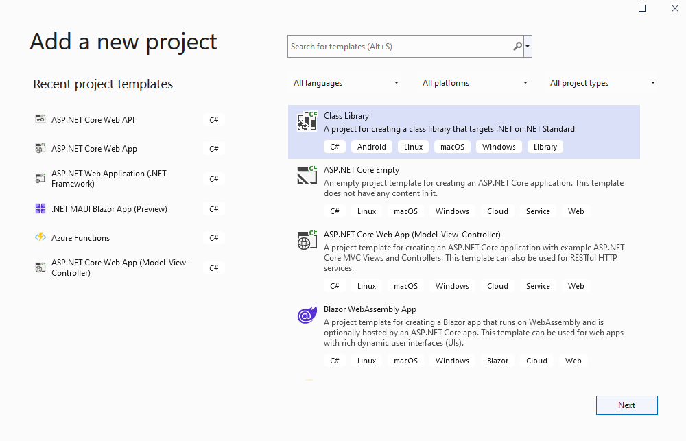

# Building out the Back End

In this session, we'll add the rest of our models and controllers that expose them. We'll also refactor our application, moving our data transfer objects (DTOs) to a shared project so they can be used by our front-end application later.

## Add a ConferenceDTO project

We'll start by creating the new shared project to hold our data transfer objects.

### Adding the ConferenceDTO Project using Visual Studio

1. If using Visual Studio, right-click on the Solution and select **Add** > **New Project...**.
1. Select **Class Library** from the project type, name the project ConferenceDTO and press OK.

1. Delete the generated `Class1.cs` file from this new project.
1. Right-click the 'Dependencies' node under the *BackEnd* project, select **Add** > **Project Reference** and put a checkmark near *ConferenceDTO*.

### Adding the ConferenceDTO project via the Command Line

1. Open a command prompt and navigate to the root *ConferencePlanner* directory.
1. Run the following command:

   ```bash
   dotnet new classlib -o ConferenceDTO
   ```

1. Next we'll need to add a reference to the ConferenceDTO project from the BackEnd project. From the command line, navigate to the BackEnd project directory and execute the following command:

   ```bash
   dotnet add reference ../ConferenceDTO
   ```

1. Add the ConferenceDTO project to the solution:

   ```bash
   dotnet sln add ConferenceDTO/ConferenceDTO.csproj
   ```

## Refactoring the Speaker model into the ConferenceDTO project

1. Copy the `Speaker.cs` class from the *BackEnd* application into the root of the new ConferenceDTO project, and change the namespace from `Backend.Models` to `ConferenceDTO`.
1. Go back to the *BackEnd* application and modify the code in `Speaker.cs` as shown:

   ```csharp
   namespace BackEnd.Models;

   public class Speaker : ConferenceDTO.Speaker
   {
   }
   ```

1. Run the application and view the Speakers data using the Swagger UI to verify everything still works.

## Adding the remaining models to ConferenceDTO

We've got several more models to add, and unfortunately it's a little mechanical. You can copy the following classes manually, or open the completed solution which is shown at the end.

1. Create an `Attendee.cs` class in the *ConferenceDTO* project with the following code:

   ```csharp
   using System.ComponentModel.DataAnnotations;
   
   namespace ConferenceDTO;
   
   public class Attendee
   {
       public int Id { get; set; }
   
       [Required]
       [StringLength(200)]
       public virtual string? FirstName { get; set; }
   
       [Required]
       [StringLength(200)]
       public virtual string? LastName { get; set; }
   
       [Required]
       [StringLength(200)]
       public string? UserName { get; set; }
   
       [StringLength(256)]
       public virtual string? EmailAddress { get; set; }
   }
   ```

1. Create a `Session.cs` class in the *ConferenceDTO* project with the following code:

   ```csharp
   using System.ComponentModel.DataAnnotations;
   
   namespace ConferenceDTO;
   
   public class Session
   {
       public int Id { get; set; }
   
       [Required]
       [StringLength(200)]
       public string? Title { get; set; }
   
       [StringLength(4000)]
       public virtual string? Abstract { get; set; }
   
       public virtual DateTimeOffset? StartTime { get; set; }
   
       public virtual DateTimeOffset? EndTime { get; set; }
   
       // Bonus points to those who can figure out why this is written this way
       public TimeSpan Duration => 
           EndTime?.Subtract(StartTime ?? EndTime ?? DateTimeOffset.MinValue) ?? 
           TimeSpan.Zero;
   
       public int? TrackId { get; set; }
   }
   ```

1. Create a new `Track.cs` class in the *ConferenceDTO* project with the following code:

   ```csharp
   using System.ComponentModel.DataAnnotations;
   
   namespace ConferenceDTO;
   public class Track
   {
       public int Id { get; set; }
   
       [Required]
       [StringLength(200)]
       public string? Name { get; set; }
   }
   ```

## Creating Derived Models in the BackEnd project

We're not going to create our EF models directly from the `ConferenceDTO` classes. Instead, we'll create some composite classes such as `SessionSpeaker`, since these will map more closely to what our application will be working with.

We're also going to take this opportunity to rename the `Models` directory in the *BackEnd* project to `Data` since it no longer just contains models.

1. Right-click the *Models* directory and select **Rename**, changing the name to *Data*.

1. Change the namespace for both `ApplicationDbContext` and `Speaker` to `Backend.Data`.

    > **Note**
    > As you add the following classes, you will see syntax error indications (the dreaded "red squiggly lines") for a bit, because you're adding several classes that reference eachother. Don't worry, it'll be fixed when this section is complete.

1. Add a `SessionSpeaker.cs` class to the *BackEnd* project's *Data* directory with the following code:

   ```csharp
    namespace BackEnd.Data;
    
    public class SessionSpeaker
    {
        public int SessionId { get; set; }
    
        public Session Session { get; set; } = null!;
    
        public int SpeakerId { get; set; }
    
        public Speaker Speaker { get; set; } = null!;
    }
   ```

1. Add an `SessionAttendee.cs` class to the *BackEnd* project's *Data* directory with the following code:

   ```csharp
    namespace BackEnd.Data;
    
    public class SessionAttendee
    {
        public int SessionId { get; set; }
    
        public Session Session { get; set; } = null!;
    
        public int AttendeeId { get; set; }
    
        public Attendee Attendee { get; set; } = null!;
    }
   ```

1. Add an `Attendee.cs` class to the *BackEnd* project's `Data` directory with the following code:

   ```csharp
    namespace BackEnd.Data;
    
    public class Attendee : ConferenceDTO.Attendee
    {
        public virtual ICollection<SessionAttendee> SessionsAttendees { get; set; } = null!;
    }
   ```

1. Add a `Session.cs` class to the *BackEnd* project's *Data* directory with the following code:

   ```csharp
   using System;
   using System.Collections;
   using System.Collections.Generic;
   
   namespace BackEnd.Data
   {
       public class Session : ConferenceDTO.Session
       {
           public virtual ICollection<SessionSpeaker> SessionSpeakers { get; set; } = null!;

           public virtual ICollection<SessionAttendee> SessionAttendees { get; set; } = null!;
   
           public Track Track { get; set; }
       }
   }
   ```

1. Add a `Track.cs` class to the *BackEnd* project's *Data* directory with the following code:

   ```csharp
    namespace BackEnd.Data;
    
    public class Track : ConferenceDTO.Track
    {
        public virtual ICollection<Session> Sessions { get; set; } = null!;
    }
   ```

1. Modify the `Speaker.cs` class we wrote in the *BackEnd* project previously to make the following two changes: update to the namespace to match our directory rename (if not already done), and add a reference to the `SessionSpeaker` composite class:

   ```csharp
    namespace BackEnd.Data;
    
    public class Speaker : ConferenceDTO.Speaker
    {
        public virtual ICollection<SessionSpeaker> SessionSpeakers { get; set; } = new List<SessionSpeaker>();
    }
   ```

## Update the ApplicationDbContext

Okay, now we need to update our `ApplicationDbContext` so Entity Framework knows about our new models.

1. Update `ApplicationDbContext.cs` to use the following code:

   ```csharp
    using Microsoft.EntityFrameworkCore;
    
    namespace BackEnd.Data;
    
    public class ApplicationDbContext : DbContext
    {
        public ApplicationDbContext(DbContextOptions<ApplicationDbContext> options)
            : base(options)
        {
        }
    
        protected override void OnModelCreating(ModelBuilder modelBuilder)
        {
            modelBuilder.Entity<Attendee>()
            .HasIndex(a => a.UserName)
            .IsUnique();
    
            // Many-to-many: Session <-> Attendee
            modelBuilder.Entity<SessionAttendee>()
                .HasKey(ca => new { ca.SessionId, ca.AttendeeId });
    
            // Many-to-many: Speaker <-> Session
            modelBuilder.Entity<SessionSpeaker>()
                .HasKey(ss => new { ss.SessionId, ss.SpeakerId });
        }
    
        public DbSet<Session> Sessions => Set<Session>();
    
        public DbSet<Track> Tracks => Set<Track>();
    
        public DbSet<Speaker> Speakers => Set<Speaker>();
    
        public DbSet<Attendee> Attendees => Set<Attendee>();
    }
   ```

1. Fix errors due to the rename from `BackEnd.Models` to `BackEnd.Data`. You can either do this using a find / replace (replacing "BackEnd.Models" with "BackEnd.Data") or you can do a build and fix errors.
1. Ensure that the application builds now.

## Add a new database migration

1. Run the following commands in the *Visual Studio Developer Powershell* or command prompt in the `BackEnd` project directory:

   ```bash
   dotnet ef migrations add Refactor
   dotnet ef database update
   ```

1. Now take a deep breath and run the application and navigate to `/swagger`. Hopefully, you should see the Swagger UI. There are no new endpoints, but you will see some new types listed in the Schemas section (e.g. `Session`, `Track`, `Speaker`, etc.).

## Updating the Speakers API controller

Now that we've added our new models, we can update our `Speakers` API endpoints to include richer information, which will simplify building our UI by removing the need to make a lot of separate requests. When we display the list of speakers, we're going to want to include the sessions they are presenting. We can do this by updating our EF query to use the [many-to-many navigation properties](https://docs.microsoft.com/ef/core/modeling/relationships?tabs=fluent-api%2Cfluent-api-simple-key%2Csimple-key#many-to-many) we've added to our models.

We **could** just modify the first route in our `SpeakerEndpoints` class as shown below.

    > **Warning**
    > Don't do this, it's just for illustration. We'll implement a better solution in a minute.

   ```csharp
    routes.MapGet("/api/Speaker", async (ApplicationDbContext db) =>
    {
        var speakers = await db.Speakers.AsNoTracking()
                        .Include(s => s.SessionSpeakers)
                        .ThenInclude(ss => ss.Session)
                        .ToListAsync();
        return speakers;
    })
    .WithTags("Speaker")
    .WithName("GetAllSpeakers")
    .Produces<List<Speaker>>(StatusCodes.Status200OK);
   ```

While the above will work, this is directly returning our model class. A better practice is to return an output model class. 

1. Create a `SpeakerResponse.cs` class in the `ConferenceDTO` project with the following code:

   ```csharp
    namespace ConferenceDTO;
    public class SpeakerResponse : Speaker
    {
        public ICollection<Session> Sessions { get; set; } = new List<Session>();
    }
   ```

1. Now we'll add a utility method to map between these classes. In the *BackEnd* project, create an *Infrastructure* directory. Add a class named `EntityExtensions.cs` with the following mapping code:

   ```csharp
    namespace BackEnd.Data;
    public static class EntityExtensions
    {
        public static ConferenceDTO.SpeakerResponse MapSpeakerResponse(this Speaker speaker) =>
            new ConferenceDTO.SpeakerResponse
            {
                Id = speaker.Id,
                Name = speaker.Name,
                Bio = speaker.Bio,
                WebSite = speaker.WebSite,
                Sessions = speaker.SessionSpeakers?
                    .Select(ss =>
                        new ConferenceDTO.Session
                        {
                            Id = ss.SessionId,
                            Title = ss.Session.Title
                        })
                    .ToList() ?? new()
            };
    }
   ```

Now we can update the `GetSpeakers()` method of the *SpeakersEndpoints* so that it returns our response model.

1. Add a using statement to `SpeakersEndpoints.cs`: `using BackEnd.Infrastructure;`

1. Update the `/api/Speaker` endpoint method so that it reads as follows:

   ```csharp
    routes.MapGet("/api/Speaker", async (ApplicationDbContext db) =>
    {
        var speakers = await db.Speakers.AsNoTracking()
                                        .Include(s => s.SessionSpeakers)
                                        .ThenInclude(ss => ss.Session)
                                        .Select(s => s.MapSpeakerResponse())
                                        .ToListAsync();
        return speakers;
    })
    .WithTags("Speaker")
    .WithName("GetAllSpeakers")
    .Produces<List<ConferenceDTO.Speaker>>(StatusCodes.Status200OK);
   ```

1. Update the route for `/api/Speaker/{id}` to use our mapped response models as follows:

   ```csharp
    routes.MapGet("/api/Speaker/{id}", async (int Id, ApplicationDbContext db) =>
    {
        return await db.Speakers.AsNoTracking()
                        .Include(s => s.SessionSpeakers)
                        .ThenInclude(ss => ss.Session)
                        .SingleOrDefaultAsync(s => s.Id == Id)
            is Speaker model
                ? Results.Ok(model)
                : Results.NotFound();
    })
    .WithTags("Speaker")
    .WithName("GetSpeakerById")
    .Produces<ConferenceDTO.Speaker>(StatusCodes.Status200OK)
    .Produces(StatusCodes.Status404NotFound);
   ```

1. Remove the other routes (`MapPut`, `MapPost`, `MapDelete`), on the `SpeakersEndpoints`. We will be loading our speakers from a JSON file into our database, so we don't need to support these actions. This is a good concept to keep in mind when you're working with a REST API: only expose the actions that you want to allow.

Let's do one more cleanup task on the `SpeakerEndpoints` before moving on. As you've probably guessed, we're going to have some other endpoints to interact with our other models, like *Attendees* and *Sessions*. Before we go further down that path, let's create a directory to move our `Endpoints` classes out of the root of the project.

1. Create an *Endpoints* directory in the *BackEnd* project.
1. Move the `SpeakerEndpoints` class into the *Endpoints* directory and update the namespace to `BackEnd.Endpoints`. Fix the references in `Program.cs` for this refactor.

## Adding the remaining API Endpoints and DTOs

Okay, we've been through the the refactoring process with the `Speaker` model classes. The process with the other models is very similar, so we'll move through that quickly. 

> **Note**
> You've got a few turbo-boost options if you'd like to just skim through the rest of this unit without writing / copying the code.
>    * You can just use the code from the [the save point folder](/save-points/2-BackEnd-completed/ConferencePlanner/) when you start the next unit.
>    * Alternatively, you can copy the following files from the second *save point* into your project:
>        * `ConferenceDTO.AttendeeResponse`
>        * `ConferenceDTO.SessionResponse`
>        * `BackEnd.Endpoints.SessionEndpoints`
>        * `BackEnd.Endpoints.AttendeeEndpoints`
>        * `BackEnd.Data.EntityExtensions`
>        * `BackEnd.Program`

Next, we'll add response classes for `Attendees` and `Sessions`, then update the `EntityExtensions` class to map them.

1. Add an `AttendeeResponse` class to the `ConferenceDTO` project with the following code:

    ```csharp
    namespace ConferenceDTO;

    public class AttendeeResponse : Attendee
    {
        public ICollection<Session> Sessions { get; set; } = new List<Session>();
    }
    ```

1. Add an `SessionResponse` class to the `ConferenceDTO` project with the following code:

    ```csharp
    namespace ConferenceDTO;

    public class SessionResponse : Session
    {
        public Track Track { get; set; } = null!;

        public List<Speaker> Speakers { get; set; } = new List<Speaker>();
    }
    ```

1. Update the `EntityExtensions` class with the `MapSessionResponse` and `MapAttendeeResponse` methods as shown below:

    ```csharp
    namespace BackEnd.Data;
    public static class EntityExtensions
    {
        public static ConferenceDTO.SessionResponse MapSessionResponse(this Session session) =>
            new ConferenceDTO.SessionResponse
            {
                Id = session.Id,
                Title = session.Title,
                StartTime = session.StartTime,
                EndTime = session.EndTime,
                Speakers = session.SessionSpeakers?
                                .Select(ss => new ConferenceDTO.Speaker
                                {
                                    Id = ss.SpeakerId,
                                    Name = ss.Speaker.Name
                                })
                                .ToList() ?? new(),
                TrackId = session.TrackId,
                Track = new ConferenceDTO.Track
                {
                    Id = session?.TrackId ?? 0,
                    Name = session?.Track?.Name
                },
                Abstract = session?.Abstract
            };

        public static ConferenceDTO.SpeakerResponse MapSpeakerResponse(this Speaker speaker) =>
            new ConferenceDTO.SpeakerResponse
            {
                Id = speaker.Id,
                Name = speaker.Name,
                Bio = speaker.Bio,
                WebSite = speaker.WebSite,
                Sessions = speaker.SessionSpeakers?
                    .Select(ss =>
                        new ConferenceDTO.Session
                        {
                            Id = ss.SessionId,
                            Title = ss.Session.Title
                        })
                    .ToList() ?? new()
            };

        public static ConferenceDTO.AttendeeResponse MapAttendeeResponse(this Attendee attendee) =>
            new ConferenceDTO.AttendeeResponse
            {
                Id = attendee.Id,
                FirstName = attendee.FirstName,
                LastName = attendee.LastName,
                UserName = attendee.UserName,
                Sessions = attendee.SessionsAttendees?
                    .Select(sa =>
                        new ConferenceDTO.Session
                        {
                            Id = sa.SessionId,
                            Title = sa.Session.Title,
                            StartTime = sa.Session.StartTime,
                            EndTime = sa.Session.EndTime
                        })
                    .ToList() ?? new()
            };
    }
    ```

1. Add a new `AttendeeEndpoints` class to the *Endpoints* directory with the following code:

    ```csharp
    using Microsoft.EntityFrameworkCore;
    using BackEnd.Data;
    using ConferenceDTO;

    namespace BackEnd.Endpoints;

    public static class AttendeeEndpoints
    {
        public static void MapAttendeeEndpoints(this IEndpointRouteBuilder routes)
        {
            routes.MapGet("/api/Attendee/{username}", async (string username, ApplicationDbContext db) =>
            {
                var attendee = await db.Attendees.Include(a => a.SessionsAttendees)
                    .ThenInclude(sa => sa.Session)
                    .SingleOrDefaultAsync(a => a.UserName == username);

                return await db.Attendees.Include(a => a.SessionsAttendees)
                    .ThenInclude(sa => sa.Session)
                    .SingleOrDefaultAsync(a => a.UserName == username)
                    is Data.Attendee model
                        ? Results.Ok(model.MapAttendeeResponse())
                        : Results.NotFound();
            })
            .WithTags("Attendee")
            .WithName("GetAttendee")
            .Produces<AttendeeResponse>(StatusCodes.Status200OK)
            .Produces(StatusCodes.Status404NotFound);

            routes.MapPost("/api/Attendee/", async (ConferenceDTO.Attendee input, ApplicationDbContext db) =>
            {
                // Check if the attendee already exists
                var existingAttendee = await db.Attendees
                    .Where(a => a.UserName == input.UserName)
                    .FirstOrDefaultAsync();

                if (existingAttendee == null)
                {
                    var attendee = new Data.Attendee
                    {
                        FirstName = input.FirstName,
                        LastName = input.LastName,
                        UserName = input.UserName,
                        EmailAddress = input.EmailAddress
                    };

                    db.Attendees.Add(attendee);
                    await db.SaveChangesAsync();

                    var result = attendee.MapAttendeeResponse();

                    return Results.Created($"/api/Attendee/{attendee.UserName}", result);
                }
                else
                {
                    return Results.Conflict();
                }
            })
            .WithTags("Attendee")
            .WithName("CreateAttendee")
            .Produces<AttendeeResponse>(StatusCodes.Status201Created)
            .Produces(StatusCodes.Status409Conflict);

            routes.MapPost("/api/Attendee/{username}/Session/{sessionId}",
                async (string username, int sessionId, ApplicationDbContext db) =>
            {
                var attendee = await db.Attendees.Include(a => a.SessionsAttendees)
                                    .ThenInclude(sa => sa.Session)
                                    .SingleOrDefaultAsync(a => a.UserName == username);

                if (attendee == null)
                {
                    return Results.NotFound(new { Attendee = username });
                }

                var session = await db.Sessions.FindAsync(sessionId);

                if (session == null)
                {
                    return Results.NotFound(new { Session = sessionId });
                }

                attendee.SessionsAttendees.Add(new SessionAttendee
                {
                    AttendeeId = attendee.Id,
                    SessionId = sessionId
                });

                await db.SaveChangesAsync();

                var result = attendee.MapAttendeeResponse();
                return Results.Created($"/api/Attendee/{result.UserName}", result);
            })
            .WithTags("Attendee")
            .WithName("AddAttendeeSession")
            .Produces<AttendeeResponse>(StatusCodes.Status201Created)
            .Produces(StatusCodes.Status404NotFound);

            routes.MapDelete("/api/Attendee/{username}/Session/{sessionId}",
                async (string username, int sessionId, ApplicationDbContext db) =>
                {
                    var attendee = await db.Attendees.Include(a => a.SessionsAttendees)
                        .SingleOrDefaultAsync(a => a.UserName == username);

                    if (attendee is Data.Attendee)
                    {
                        var session = await db.Sessions.FindAsync(sessionId);

                        if (session is Data.Session)
                        {
                            var sessionAttendee = attendee.SessionsAttendees
                                .FirstOrDefault(sa => sa.SessionId == sessionId);

                            if(sessionAttendee is SessionAttendee)
                            attendee.SessionsAttendees.Remove(sessionAttendee);

                            await db.SaveChangesAsync();
                            return Results.Ok();
                        }
                    }
                    return Results.NotFound();
                })
            .WithTags("Attendee")
            .WithName("RemoveSessionFromAttendee")
            .Produces(StatusCodes.Status200OK)
            .Produces(StatusCodes.Status404NotFound);
        }
    }
    ```

1. Add a new `SessionEndpoints` class to the *Endpoints* directory with the following code:

    ```csharp
    using Microsoft.EntityFrameworkCore;
    using BackEnd.Data;
    using ConferenceDTO;

    namespace BackEnd.Endpoints;

    public static class SessionEndpoints
    {
        public static void MapSessionEndpoints(this IEndpointRouteBuilder routes)
        {
            routes.MapGet("/api/Session/", 
                async (ApplicationDbContext db) =>
            {
                return await db.Sessions.AsNoTracking()
                            .Include(s => s.Track)
                            .Include(s => s.SessionSpeakers)
                            .ThenInclude(ss => ss.Speaker)
                            .Select(m => m.MapSessionResponse())
                            .ToListAsync()
                is List<SessionResponse> model
                    ? Results.Ok(model)
                    : Results.NotFound();
            })
            .WithTags("Session")
            .WithName("GetAllSessions")
            .Produces<List<SessionResponse>>(StatusCodes.Status200OK)
            .Produces(StatusCodes.Status404NotFound);

            routes.MapGet("/api/Session/{id}", 
                async (int id, ApplicationDbContext db) =>
            {
                return await db.Sessions.AsNoTracking()
                            .Include(s => s.Track)
                            .Include(s => s.SessionSpeakers)
                            .ThenInclude(ss => ss.Speaker)
                            .SingleOrDefaultAsync(s => s.Id == id)
                is Data.Session model
                    ? Results.Ok(model.MapSessionResponse())
                    : Results.NotFound();

            })
            .WithTags("Session")
            .WithName("Getsession")
            .Produces<SessionResponse>(StatusCodes.Status200OK)
            .Produces(StatusCodes.Status404NotFound);

            routes.MapPost("/api/Session/", 
                async (ConferenceDTO.Session input, ApplicationDbContext db) =>
            {
                var session = new Data.Session
                {
                    Title = input.Title,
                    StartTime = input.StartTime,
                    EndTime = input.EndTime,
                    Abstract = input.Abstract,
                    TrackId = input.TrackId
                };

                db.Sessions.Add(session);
                await db.SaveChangesAsync();

                return Results.Created($"/api/Session/{session.Id}", 
                    session.MapSessionResponse());
            })
            .WithTags("Session")
            .WithName("CreateSession")
            .Produces<SessionResponse>(StatusCodes.Status201Created)
            .Produces(StatusCodes.Status409Conflict);

            routes.MapPut("/api/Session/{id}", 
                async (int id, ConferenceDTO.Session input, ApplicationDbContext db) =>
            {
                var session = await db.Sessions.FindAsync(id);

                if (session is null)
                {
                    return Results.NotFound();
                }

                session.Id = input.Id;
                session.Title = input.Title;
                session.Abstract = input.Abstract;
                session.StartTime = input.StartTime;
                session.EndTime = input.EndTime;
                session.TrackId = input.TrackId;

                await db.SaveChangesAsync();

                return Results.NoContent();
            })
            .WithTags("Session")
            .WithName("UpdateSession")
            .Produces(StatusCodes.Status404NotFound)
            .Produces(StatusCodes.Status204NoContent);

            routes.MapDelete("/api/Sessions/{id}/",
                async (int id, ApplicationDbContext db) =>
                {
                    if (await db.Sessions.FindAsync(id) is Data.Session session)
                    {
                        db.Sessions.Remove(session);
                        await db.SaveChangesAsync();
                        return Results.Ok();
                    }

                    return Results.NotFound();
                })
            .WithTags("Session")
            .WithName("DeleteSession")
            .Produces(StatusCodes.Status200OK)
            .Produces(StatusCodes.Status404NotFound);

            routes.MapPost("api/Sessions/upload", 
                async (HttpRequest req, ApplicationDbContext db) =>
            {
                if (db.Sessions.Any())
                {
                    return Results.Conflict("Sessions already uploaded");
                }
                var loader = new TechoramaDataLoader();
                await loader.LoadDataAsync(req.Body, db);
                await db.SaveChangesAsync();

                return Results.NoContent();
            })
            .WithTags("Session")
            .Accepts<IFormFile>("text/plain");
        }
    }
    ```

## Adding Conference Upload support

1. Copy the `DataLoader.cs` class from [here](/src/BackEnd/Data/DataLoader.cs) into the `Data` directory of the `BackEnd` project.
1. Copy the `SessionizeLoader.cs`, `DevIntersectionLoader.cs`, and `TechoramaLoader.cs` classes from [here](/src/BackEnd/Data/) into the current project's `/src/BackEnd/Data/` directory.
    > Note: We have data loaders from a few of the conference series where this workshop has been presented most; you can update this to plug in your own conference file format.
1. Add a new `api/Sessions/upload` endpoint to the `SessionEndpoints` class:

    ```c#
    routes.MapPost("api/Sessions/upload", 
        async (HttpRequest req, ApplicationDbContext db) =>
    {
        if (db.Sessions.Any())
        {
            return Results.Conflict("Sessions already uploaded");
        }
        var loader = new TechoramaDataLoader();
        await loader.LoadDataAsync(req.Body, db);
        await db.SaveChangesAsync();

        return Results.NoContent();
    })
    .WithTags("Session")
    .Accepts<IFormFile>("text/plain");
    ```

1. Run the application to see the updated data via Swagger UI.
1. Use the Swagger UI to upload [Techorama_2022.json](/src/BackEnd/Data/Import/Techorama_2022.json) to the `/api/Sessions/upload` API.

**Next**: [Session #3 - Front-end](3.%20Add%20front-end%2C%20render%20agenda%2C%20set%20up%20front-end%20models.md) | **Previous**: [Session #1 - Setup, basic EF model](/docs/1.%20Create%20BackEnd%20API%20project.md)
