# Create the FrontEnd web application

In this session, you'll create a front-end web application that enables users to browse sessions and speakers. This application uses the DTOs created in Session 2 to package data when communicating with the back-end web API.

> **Note:** You can either continue with your own project, or use the code in the [Session 2 save point folder](../save-points/2-BackEnd-completed).

## Create the FrontEnd project

You'll create the front end as a new web application. This application will be part of the **ConferencePlanner** solution.

**If you're using Visual Studio, perform the following steps:**

1. In Solution Explorer, right-click **ConferencePlanner** solution, point to **Add**, and then click **New Project**.

2. In the **Add a new project** dialog box, select the **ASP.NET Core Web Application** project type. Make sure you select the C# version of the template. Click **Next**.

    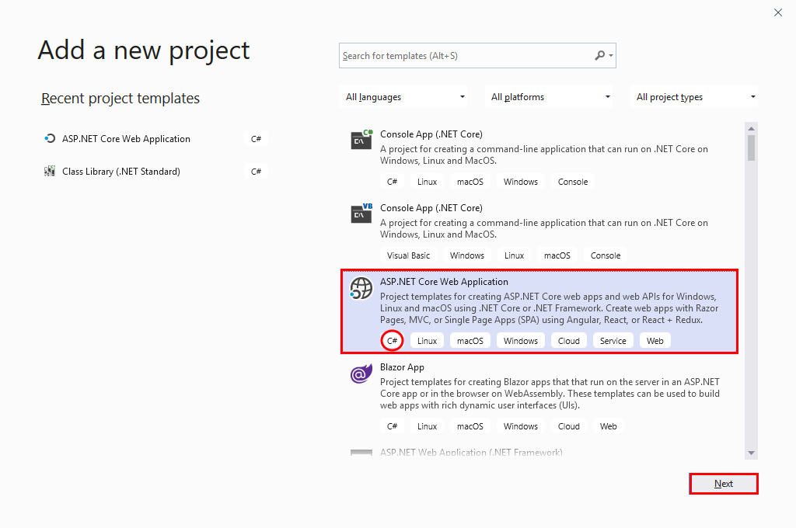

3. In the **Configure your new project** dialog box, name the project **FrontEnd**, and then click **Create**.

4. In the **Create a new ASP.NET Core web application** dialog box, make sure the framework is set to **.NET Core**, and the version is set to **ASP.NET Core 3.1**. Select the **Web Application** template. Leave all other options at their default values, and then click **Create**:

    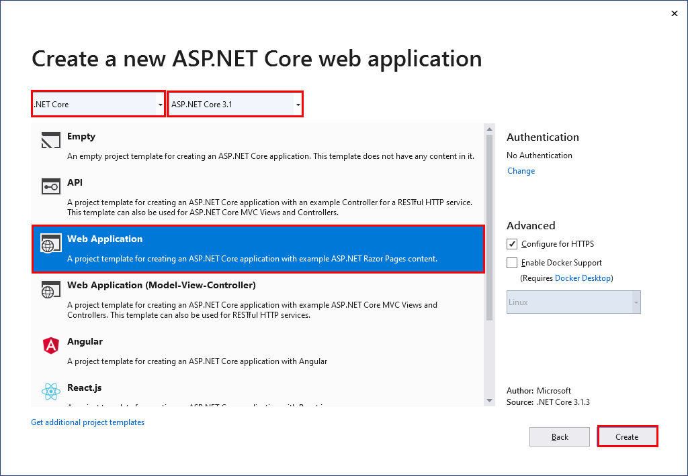

5. When the project has been created, in Solution Explorer, right-click the **FrontEnd** project, point to **Add**, and then click **Reference**.
6. In the **Reference Manager - FrontEnd** dialog box, on the **Projects** tab, select the **ConferenceDTO** project, and then click **OK**.

> **Note:** Don't accidentally add a reference to the **BackEnd** project.

**If you're using the .NET Core CLI, perform the following steps:**

1. In a command prompt window, move to the **ConferencePlanner** folder for your solution.

2. Run the following command to create a new web application project named **FrontEnd**:

   ```console
   dotnet new webapp -o FrontEnd
   ```

3. Execute the command shown below to add the **FrontEnd** project to the **ConferencePlanner** solution:

    ```console
    dotnet sln add FrontEnd/FrontEnd.csproj
    ```

4. Move to the **FrontEnd** folder, and run the command shown below to add a reference to the **ConferenceDTO**:

   ```console
   dotnet add reference ../ConferenceDTO/ConferenceDTO.csproj
   ```

## Create the API service client class

In this task, you'll create a class to communicate with the back-end web API service. You'll isolate this logic in a single class that the various web pages in the application can use.

1. Create a folder called **Services** in the root folder of the **FrontEnd** project.

2. In the **Services** folder, add a new interface file called **IApiClient.cs**:

    - **If you're using Visual Studio 2019**:
        1. In Solution Explorer, right-click the **Services** folder, click **Add**, and then click **Class**.
        1. In the **Add New Item - FrontEnd** dialog box, select the **Interface** template, enter **IApiClient.cs** in the **Name** field, and then click **Add**.

            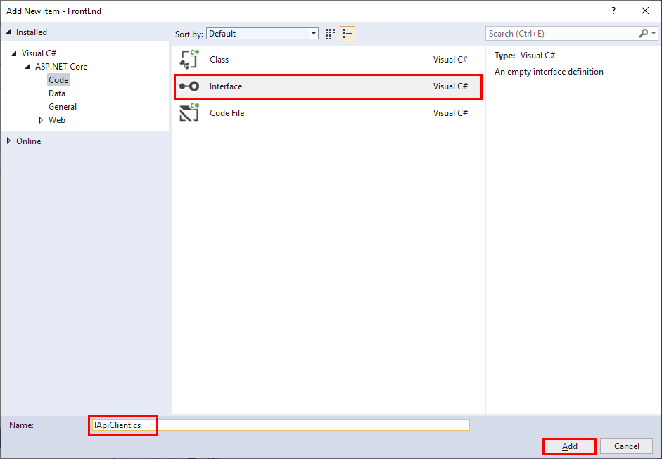

    - **If you're using the .NET Core CLI**:
        - Move to the **Services** folder, and create a new file named **IApiClient.cs** using an editor of your choice.

3. Add the code shown below to the **IApiClient** interface file. This interface defines the methods that the client application will use to send requests to the back-end web API service:

    ``` csharp
    using System.Collections.Generic;
    using System.Threading.Tasks;
    using ConferenceDTO;

    namespace FrontEnd.Services
    {
        public interface IApiClient
        {
            Task<List<SessionResponse>> GetSessionsAsync();
            Task<SessionResponse> GetSessionAsync(int id);
            Task<List<SpeakerResponse>> GetSpeakersAsync();
            Task<SpeakerResponse> GetSpeakerAsync(int id);
            Task PutSessionAsync(Session session);
            Task<bool> AddAttendeeAsync(Attendee attendee);
            Task<AttendeeResponse> GetAttendeeAsync(string name);
            Task DeleteSessionAsync(int id);
        }
    }
    ```

4. Add a reference to the **Microsoft.AspNet.WebApi.Client** version 5.2.7 NuGet package to the **FrontEnd** project:

    - **If you're using Visual Studio 2019**:
        1. In Solution Explorer, right-click the **FrontEnd** project, and then click **Manage NuGet Packages**.
        2. In the **NuGet Package Manager: FrontEnd** window, on the **Browse** tab, search for **Microsoft.AspNet.WebApi.Client** package.
        3. Select the package, set the **Version** to **Latest stable 5.2.7**, and then click **Install**.
        4. In the **Preview Changes** dialog box, click **OK**.
        5. In the **License Acceptance** dialog box, click **I Accept**.

    - **If you're using the .NET Core CLI**:
        1. Move to the **FrontEnd** folder.
        2. Run the following command:

            ```console
            dotnet add package Microsoft.AspNet.WebApi.Client -v 5.2.7
            ```

5. Add a new class file called **ApiClient.cs** to the **Services** folder.

6. Add the code shown below to the **ApiClient** class. This class implements the **IApiClient** interface. The methods use an **HttpClient** object to send requests to the various endpoints exposed by the web API, and handle the responses:

    ``` csharp
    using System.Collections.Generic;
    using System.Net;
    using System.Net.Http;
    using System.Threading.Tasks;
    using ConferenceDTO;

    namespace FrontEnd.Services
    {
        public class ApiClient : IApiClient
        {
            private readonly HttpClient _httpClient;

            public ApiClient(HttpClient httpClient)
            {
                _httpClient = httpClient;
            }

            public async Task<bool> AddAttendeeAsync(Attendee attendee)
            {
                var response = await _httpClient.PostAsJsonAsync($"/api/attendees", attendee);

                if (response.StatusCode == HttpStatusCode.Conflict)
                {
                    return false;
                }

                response.EnsureSuccessStatusCode();

                return true;
            }

            public async Task<AttendeeResponse> GetAttendeeAsync(string name)
            {
                if (string.IsNullOrEmpty(name))
                {
                    return null;
                }

                var response = await _httpClient.GetAsync($"/api/attendees/{name}");

                if (response.StatusCode == HttpStatusCode.NotFound)
                {
                    return null;
                }

                response.EnsureSuccessStatusCode();

                return await response.Content.ReadAsAsync<AttendeeResponse>();
            }

            public async Task<SessionResponse> GetSessionAsync(int id)
            {
                var response = await _httpClient.GetAsync($"/api/sessions/{id}");

                if (response.StatusCode == HttpStatusCode.NotFound)
                {
                    return null;
                }

                response.EnsureSuccessStatusCode();

                return await response.Content.ReadAsAsync<SessionResponse>();
            }

            public async Task<List<SessionResponse>> GetSessionsAsync()
            {
                var response = await _httpClient.GetAsync("/api/sessions");

                response.EnsureSuccessStatusCode();

                return await response.Content.ReadAsAsync<List<SessionResponse>>();
            }

            public async Task DeleteSessionAsync(int id)
            {
                var response = await _httpClient.DeleteAsync($"/api/sessions/{id}");

                if (response.StatusCode == HttpStatusCode.NotFound)
                {
                    return;
                }

                response.EnsureSuccessStatusCode();
            }

            public async Task<SpeakerResponse> GetSpeakerAsync(int id)
            {
                var response = await _httpClient.GetAsync($"/api/speakers/{id}");

                if (response.StatusCode == HttpStatusCode.NotFound)
                {
                    return null;
                }

                response.EnsureSuccessStatusCode();

                return await response.Content.ReadAsAsync<SpeakerResponse>();
            }

            public async Task<List<SpeakerResponse>> GetSpeakersAsync()
            {
                var response = await _httpClient.GetAsync("/api/speakers");

                response.EnsureSuccessStatusCode();

                return await response.Content.ReadAsAsync<List<SpeakerResponse>>();
            }

            public async Task PutSessionAsync(Session session)
            {
                var response = await _httpClient.PutAsJsonAsync($"/api/sessions/{session.Id}", session);

                response.EnsureSuccessStatusCode();
            }
        }
    }
    ```

## Configure the API client

In this task, you'll configure the client to connect to the web API.

1. Open the **Startup.cs** file in the root folder of the **FrontEnd** project.

2. Add the following `using` directive to the list at the start of the file:

    ```csharp
    using FrontEnd.Services;
    ```

3. Locate the **ConfigureServices** method, and add the statement shown in the code sample below, after the call to `services.AddRazorPages();`. This code creates an **HttpClient** object based on the **IApiClient** interface. The object connects to the web API specified by the URL in the **serviceUrl** property of the application configuration file:

    ``` csharp
    public void ConfigureServices(IServiceCollection services)
    {
        services.AddRazorPages();
        services.AddHttpClient<IApiClient, ApiClient>(client =>
        {
            client.BaseAddress = new Uri(Configuration["serviceUrl"]);
        });
    }
    ```

4. Open the **appsettings.json** file in the root folder of the **FrontEnd** project.

5. Add the configuration key for `serviceUrl` to the end of the configuration information, as shown below. In the URL, replace *\<port\>* with the port used by your web API. You can find this information in the *launchSettings.json* file, in the **Properties** folder of the **BackEnd** project:

    ``` json
    {
      "Logging": {
        "LogLevel": {
          "Default": "Information",
          "Microsoft": "Warning",
          "Microsoft.Hosting.Lifetime": "Information"
        }
      },
      "AllowedHosts": "*",
      "ServiceUrl": "https://localhost:<port>/"
    }
    ```

## Load conference session data into the page model for the home page

In this task, you'll update the model for the home page to retrieve a list of sessions for the conference.

1. In the **FrontEnd** project, in the **Pages** folder, open the **Index.cshtml.cs** file. The **Index.cshtml.cs** file contains the **IndexModel** class.

   > **Note:** If you're using Visual Studio, expand the **Index.cshtml** file in Solution Explorer to see the **Index.cshtml.cs** file.

2. Add the following `using` directives to the list at the start of the file:

    ```csharp
    using FrontEnd.Services;
    using ConferenceDTO;
    ```

3. Modify the constructor to take an **IApiClient** object as the parameter, and store this object in a local field, as shown below. The model will use the **ApiClient** object to send requests to the web API service:

    ``` csharp
    public class IndexModel : PageModel
    {
        private readonly ILogger<IndexModel> _logger;
        protected readonly IApiClient _apiClient;

        public IndexModel(IApiClient apiClient)
        {
            _apiClient = apiClient;
        }

        ...
    }
    ```

4. Remove the **_logger** field as it's no longer required.

5. After the constructor, add the following properties to the **IndexModel** class. These properties store information about sessions and other data you'll need when rendering the page:

   ``` csharp
   public IEnumerable<IGrouping<DateTimeOffset?, SessionResponse>> Sessions { get; set; }

   public IEnumerable<(int Offset, DayOfWeek? DayofWeek)> DayOffsets { get; set; }

   public int CurrentDayOffset { get; set; }
   ```

6. Modify the **OnGet** page handler method to handle GET requests to the page as shown below. The code loads the session data for a specific day of the conference, and identifies the data required to build the day navigation UI:

   ``` csharp
   public async Task OnGet(int day = 0)
   {
       CurrentDayOffset = day;

       var sessions = await _apiClient.GetSessionsAsync();

       var startDate = sessions.Min(s => s.StartTime?.Date);

       DayOffsets = sessions.Select(s => s.StartTime?.Date)
                            .Distinct()
                            .OrderBy(d => d)
                            .Select(day => ((int)Math.Floor((day.Value - startDate)?.TotalDays ?? 0),
                                            day?.DayOfWeek))
                            .ToList();

       var filterDate = startDate?.AddDays(day);

       Sessions = sessions.Where(s => s.StartTime?.Date == filterDate)
                          .OrderBy(s => s.TrackId)
                          .GroupBy(s => s.StartTime)
                          .OrderBy(g => g.Key);
   }
   ```

## Render the conference sessions list on the home page

In this task, you'll modify the UI for the the home page to display the details of the conference sessions retrieved by the page model.

1. In the **Pages** folder, open the **Index.cshtml** Razor Page file.

2. Delete all the existing HTML content after line 6, and replace it with the Razor markup shown below. This markup displays the sessions as a simple list, grouped by time slot:

   ``` html
   <div class="agenda">
       <h1>My Conference @System.DateTime.Now.Year</h1>

       @foreach (var timeSlot in Model.Sessions)
       {
           <h4>@timeSlot.Key?.ToString("HH:mm")</h4>
           <ul>
               @foreach (var session in timeSlot)
               {
                   <li>@session.Title</li>
               }
           </ul>
       }
   </div>
   ```

3. Test the solution:

    - **If you're using Visual Studio 2019:**
        1. In Solution Explorer, right-click the **ConferencePlanner** solution, and then click **Properties**.
        2. In the **Solution 'ConferencePlanner' Property Pages** dialog box, click **Multiple startup projects**, set the **Action** for the **BackEnd** and **FrontEnd** projects to **Start**, and then click **OK**.

            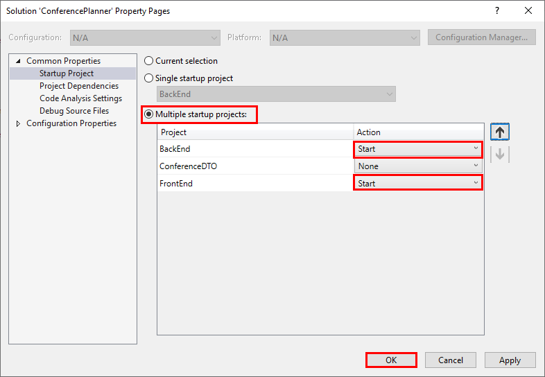

        3. Press **F5** to build and run the application.

            The web browser will start and open two windows; one for the **BackEnd** project and the other for the **FrontEnd** project. Select the **Home Page - FrontEnd** window.

        4. If the **Microsoft Visual Studio** dialog box appears, select the **Don't ask me again** check box, and then click **Yes**.
        5. If the **Security Warning** dialog box appears, click **Yes**.

    - **If you're using the .NET Core CLI:**

        1. If you haven't already done so, run the following command to install the trusted HTTPS certificate for the development web server, and follow the instructions:

            ```console
            dotnet dev-certs https --trust
            ```

        2. Open the **launchSettings.json** file in the **Properties** folder of the **BackEnd** project.
        3. Make a note of the ports in the **applicationUrl** property for the **BackEnd** profile. The profile will look similar to the following JSON content. In this example, the ports are 5000 and 5001:
        4. **remove https**

            ```JSON
            "BackEnd": {
                "commandName": "Project",
                "launchBrowser": true,
                "launchUrl": "api/speakers",
                "applicationUrl": "https://localhost:5001;http://localhost:5000",
                "environmentVariables": {
                    "ASPNETCORE_ENVIRONMENT": "Development"
                }
            }
            ```

        5. Close the file without making any changes.
        6. Open the **launchSettings.json** file in the **Properties** folder of the **FrontEnd** project.
        7. If the ports for the **applicationUrl** property of the **FrontEnd** profile are the same as those used by the **BackEnd** profile then change them (for example, set them to 6000 and 6001).
        8. Save the changes and close the file.
        9. Move to the **ConferencePlanner** solution folder.
        10. Run the following command to run the **BackEnd** project in a new console window:

            ```console
            start dotnet run --project BackEnd
            ```

        11. When the **BackEnd** project has started, return to the original console window, and run the following command to start the **FrontEnd** project:

            ```console
            dotnet run --project FrontEnd
            ```

        12. Open a web browser, and go to the URL of the **FrontEnd** web application. This will be one of the URLs you specified in the **applicationUrl** property, in the **launchSettings.json** file. If the **This site is not secure** page appears, click **Details**, and then click **Go on to the webpage**.

1. Verify that the website displays a list of conference sessions:

    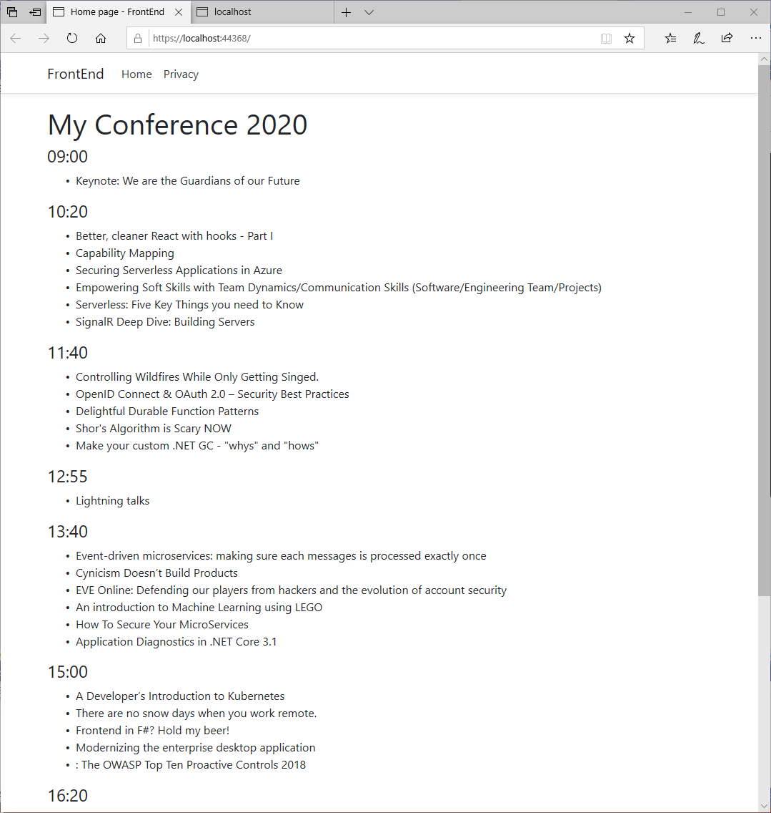

2. Stop the web application and web API service:

    - **If you're using Visual Studio 2019**:
        - Close the web browser. The **FrontEnd** and **BackEnd** projects will stop automatically.

    - **If you're using the .NET Core CLI**:
        1. Close the web browser.
        2. Switch to the console window for the **BackEnd** project, and press **Ctrl+C** to stop the web API service.
        3. Return to the console window for the **FrontEnd** project and press **Ctrl+C** to stop the web application.

## Modify the user interface to display conference sessions for different days

1. In the **Pages** folder of the **FrontEnd** project, open the **Index.cshtml** file.

2. After the **\<h1>** tag in the markup you added earlier, and before the **@foreach** statement, add the code shown below. This markup adds navigation links presented as buttons displaying the days of the conference as weekday names. The user can select a weekday name. The weekday name is converted into a day number (the first day of the conference is day 0), which is used by the **OnGet** method to retrieve the sessions for that day:

   ``` html
   <ul class="nav nav-pills mb-3">
       @foreach (var day in Model.DayOffsets)
       {
           <li role="presentation" class="nav-item">
               <a class="nav-link @(Model.CurrentDayOffset == day.Offset ? "active" : null)" asp-route-day="@day.Offset">@day.DayofWeek?.ToString()</a>
           </li>
       }
   </ul>
   ```

3. Run the application again. Click the buttons to show the sessions for the different days.

    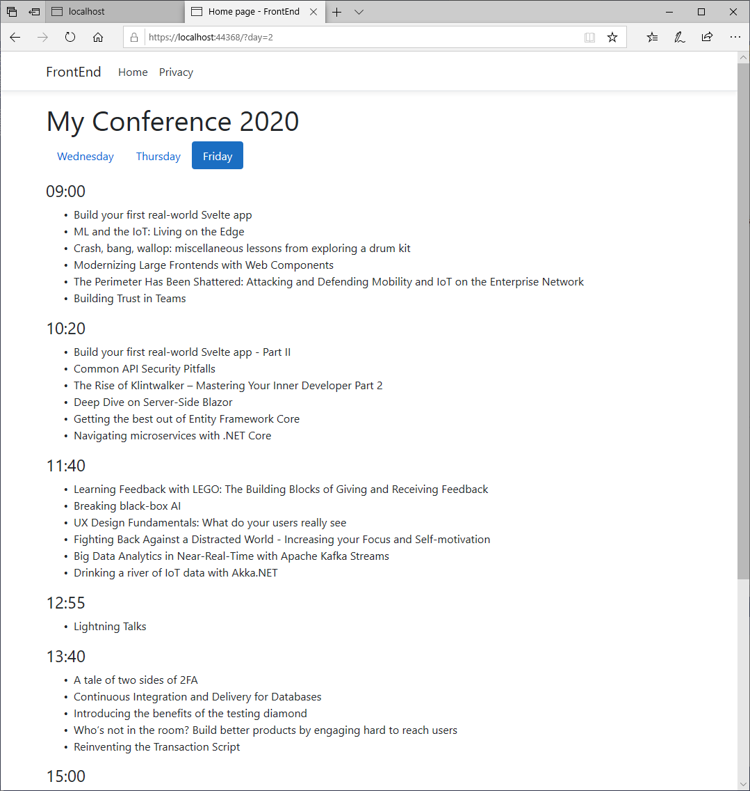

4. Stop the web application.

## Enhance the conference sessions list display

In this task, you'll use [Bootrap cards](https://getbootstrap.com/docs/4.0/components/card/) to enhance the way in which session data is presented.

1. Open the **_Layout.cshtml** file in the **Shared** folder, under the **Pages** folder of the **FrontEnd** project.

2. Add the following **\<link\>** tag at the end of the **\<head\>** section:

    ```html
    ...
    <head>
        ...
        <link rel="stylesheet" href="https://stackpath.bootstrapcdn.com/bootstrap/4.4.1/css/bootstrap.min.css" integrity="sha384-Vkoo8x4CGsO3+Hhxv8T/Q5PaXtkKtu6ug5TOeNV6gBiFeWPGFN9MuhOf23Q9Ifjh" crossorigin="anonymous">
    <head>
    ...
    ```

3. Add the **\<script\>** tags shown below, immediately before the end of the **\<body\>** section:

    ```html
    ...
    <body>
        ...
        ...
        <script src="https://code.jquery.com/jquery-3.4.1.slim.min.js" integrity="sha384-J6qa4849blE2+poT4WnyKhv5vZF5SrPo0iEjwBvKU7imGFAV0wwj1yYfoRSJoZ+n" crossorigin="anonymous"></script>
        <script src="https://cdn.jsdelivr.net/npm/popper.js@1.16.0/dist/umd/popper.min.js" integrity="sha384-Q6E9RHvbIyZFJoft+2mJbHaEWldlvI9IOYy5n3zV9zzTtmI3UksdQRVvoxMfooAo" crossorigin="anonymous"></script>
        <script src="https://stackpath.bootstrapcdn.com/bootstrap/4.4.1/js/bootstrap.min.js" integrity="sha384-wfSDF2E50Y2D1uUdj0O3uMBJnjuUD4Ih7YwaYd1iqfktj0Uod8GCExl3Og8ifwB6" crossorigin="anonymous"></script>
    </body>
    ...
    ```

4. Open the **Index.cshtml** file in the **Pages** folder.

5. Replace the **@foreach** loop that displays the sessions in each time slot with the following code. This markup renders each session as a formatted card rather than simple text:

    ``` html
    ...
    @foreach (var timeSlot in Model.Sessions)
    {
        <h4>@timeSlot.Key?.ToString("HH:mm")</h4>
        <div class="row">
            @foreach (var session in timeSlot)
            {
                <div class="col-md-3 mb-4">
                    <div class="card shadow session h-100">
                        <div class="card-header">@session.Track?.Name</div>
                        <div class="card-body">
                            <h5 class="card-title"><a asp-page="Session" asp-route-id="@session.Id">@session.Title</a></h5>
                        </div>
                        <div class="card-footer">
                            <ul class="list-inline mb-0">
                                @foreach (var speaker in session.Speakers)
                                {
                                    <li class="list-inline-item">
                                        <a asp-page="Speaker" asp-route-id="@speaker.Id">@speaker.Name</a>
                                    </li>
                                }
                            </ul>
                        </div>
                    </div>
                </div>
            }
        </div>
    }
    ...
    ```

6. Run the solution again to view the updated sessions list UI. Click the buttons again to show the sessions for the different days. The home page should look similar to this:

    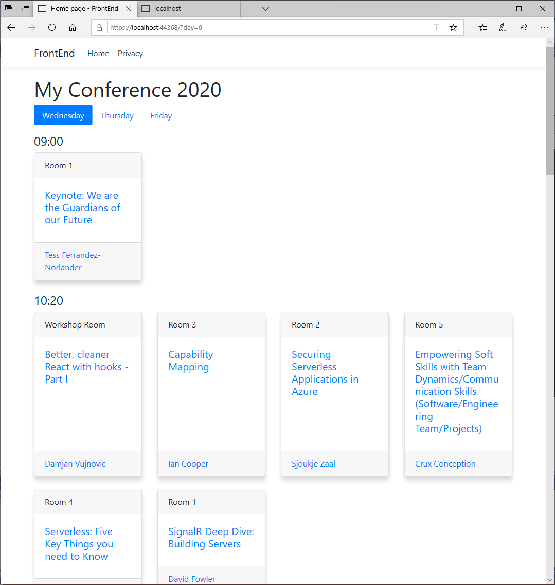

7. Stop the web application and web API service.

## Add a page to display the details of conference sessions

The web application enables the user to see the titles, location, and speaker for each conference session. In this task, you'll add a page that enables the user to view the description of a session that they select.

1. Add a new Razor page to the **FrontEnd** project:

    - **If you're using Visual Studio 2019:**
        1. In Solution Explorer, right-click the **Pages** folder in the **FrontEnd** project, point to **Add**, and then click **Razor Page**.

            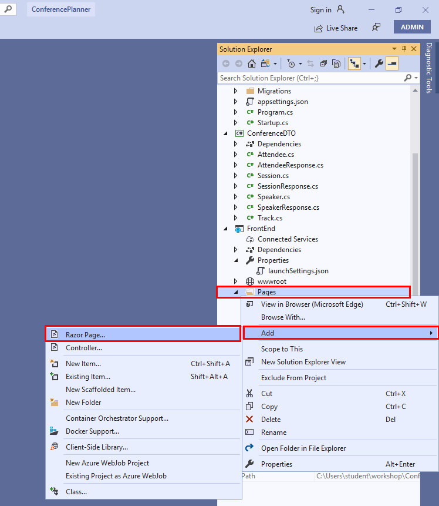

        2. In the **Add New Scaffolded Item** dialog box, select the **Razor Page** template, and then click **Add**.

            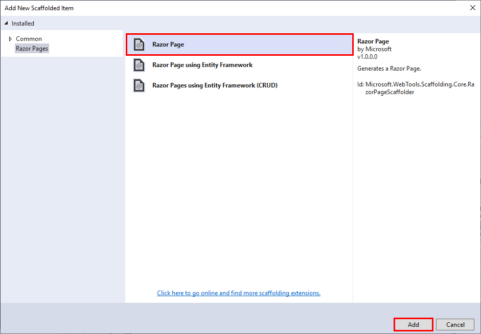

        3. In the **Add Razor Page** template, set the **Razor Page name** to **Session**, leave the other options at their default values, and then click **Add**.

            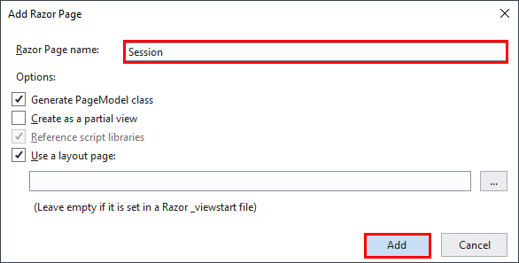

    - **If you're using the .NET Core CLI:**
  
        1. Move to the **FrontEnd** project folder.
        2. Run the following command:

            ```console
            dotnet new page --name Session --output Pages --namespace FrontEnd
            ```

2. In the **Pages** folder, open the **Session.cshtml.cs** file. Expand the **Session.cshtml** file to view it if you're using Visual Studio 2019.

3. Add the following `using` directives to the list at the start of the file:

    ```csharp
    using ConferenceDTO;
    using FrontEnd.Services;
    ```

4. Add the code shown below to the **SessionModel** class. As with the **IndexModel** shown earlier, the **SessionModel** will use an **ApiClient** object to send requests to the web API service. The **Session** and **DayOffset** fields will be used to cache information about the sessions retrieved.

    ```csharp
    public class SessionModel : PageModel
    {
        private readonly IApiClient _apiClient;

        public SessionModel(IApiClient apiClient)
        {
            _apiClient = apiClient;
        }

        public SessionResponse Session { get; set; }

        public int? DayOffset { get; set; }

        public void OnGet()
        {
        }
    }
    ```

5. Delete the **OnGet** page handler and replace it with an asynchronous method that retrieves the details for a specified session (identified by the session ID), and adds them to the **SessionModel** object:

    ``` csharp
    public async Task<IActionResult> OnGetAsync(int id)
    {
        Session = await _apiClient.GetSessionAsync(id);

        if (Session == null)
        {
            return RedirectToPage("/Index");
        }

        var allSessions = await _apiClient.GetSessionsAsync();

        var startDate = allSessions.Min(s => s.StartTime?.Date);

        DayOffset = Session.StartTime?.Subtract(startDate ?? DateTimeOffset.MinValue).Days;

        return Page();
    }
    ```

    > **Note:** The session ID is provided by the following code in the **Index** page that you added earlier:
    >
    > ```html
    > <h5 class="card-title"><a asp-page="Session" asp-route-id="@session.Id">@session.Title</a></h5>
    > ```
    >
    > When the user clicks the title of a session in a card, the **Index** page routes a request to the **Session** page containing the ID of the session.

6. Open the **Session.cshtml** file. Replace the existing markup with that shown below. This code displays the details of the session using the information in the **SessionModel**. The code also adds navigation links to enable the user to return to the home page and display the list of conference sessions:

    ``` html
    @page "{id}"
    @model SessionModel

    <ol class="breadcrumb">
        <li class="breadcrumb-item"><a asp-page="/Index">Agenda</a></li>
        <li class="breadcrumb-item"><a asp-page="/Index" asp-route-day="@Model.DayOffset">Day @(Model.DayOffset + 1)</a></li>
        <li class="breadcrumb-item active">@Model.Session.Title</li>
    </ol>

    <h1>@Model.Session.Title</h1>
    <span class="label label-default">@Model.Session.Track?.Name</span>

    @foreach (var speaker in Model.Session.Speakers)
    {
        <em><a asp-page="Speaker" asp-route-id="@speaker.Id">@speaker.Name</a></em>
    }

    @foreach (var para in Model.Session.Abstract.Split("\r\n", StringSplitOptions.RemoveEmptyEntries))
    {
       <p>@para</p>
    }
    ```

7. Build and run the solution. On the home page, click the name of any session. The **Session** page will appear, displaying the information for that session:

    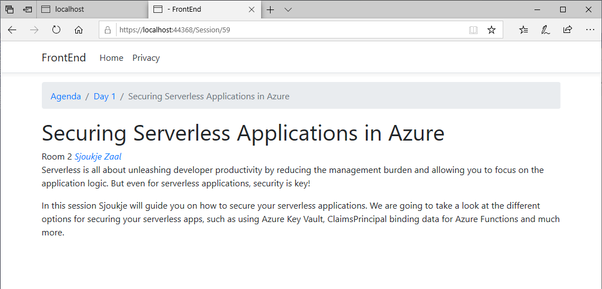

8. Stop the web application and the web API service.

## Add a page to show speaker details

The next task is to add a page to display the details of the speakers for any given session. Currently these details are limited to the sessions that the speaker is due to present.

1. Using the procedure described in the previous task, add another Razor page to the **Pages** folder in the **FrontEnd** project. Specify the **Razor Page** template, and name it **Speaker.cshtml**.

2. Open the **Speaker.cshtml.cs** file, and add the following `using` directives to the list at the start of the file:

    ```csharp
    using ConferenceDTO;
    using FrontEnd.Services;
    ```

3. Add a constructor to the **SpeakerModel** class. The constructor should take an **IApiClient** object and store it in a local field. You should also add a **SpeakerResponse** property. You'll use this property to cache information about the speaker. The following snippet shows the code for the class:

    ``` csharp
    public class SpeakerModel : PageModel
    {
        private readonly IApiClient _apiClient;

        public SpeakerModel(IApiClient apiClient)
        {
            _apiClient = apiClient;
        }

        public SpeakerResponse Speaker { get; set; }

        public void OnGet()
        {
        }
    }
    ```

4. Replace the **OnGet** page handler with an asynchronous version that retrieves the speaker details and saves them in the model:

    ``` csharp
    public async Task<IActionResult> OnGetAsync(int id)
    {
        Speaker = await _apiClient.GetSpeakerAsync(id);

        if (Speaker == null)
        {
            return NotFound();
        }

        return Page();
    }
    ```

5. Open the **Speaker.cshtml** file. Replace the code on this page with the following markup. This code displays details of the speaker, including the sessions presented by the speaker:

    ``` html
    @page "{id}"
    @model SpeakerModel

    <ol class="breadcrumb">
        <li class="breadcrumb-item"><a asp-page="/Speakers">Speakers</a></li>
        <li class="breadcrumb-item active">@Model.Speaker.Name</li>
    </ol>

    <h2>@Model.Speaker.Name</h2>

    <p>@Model.Speaker.Bio</p>

    <h3>Sessions</h3>
    <div class="row">
        <div class="col-md-5">
            <ul class="list-group">
                @foreach (var session in Model.Speaker.Sessions)
                {
                    <li class="list-group-item"><a asp-page="Session"  asp-route-id="@session.Id">@session.Title</a></li>
                }
            </ul>
        </div>
    </div>
    ```

    > **Note:** The speaker ID is provided by the following code on the **Session** page. You added this code earlier:
    >
    > ```html
    > <em><a asp-page="Speaker" asp-route-id="@speaker.Id">@speaker.Name</a></em>
    > ```
    >
    > Similarly, the **Index** page contains the following markup:
    >
    > ```html
    > <a asp-page="Speaker" asp-route-id="@speaker.Id">@speaker.Name</a>
    >```
    >
    > On either page, when the user clicks the name of a speaker, the **Session** or **Index** page routes a request to the **Speaker** page containing the ID of the speaker.

6. Build and run the solution. On the home page, click the name of any session. On the session details page, click the name of any of the speakers. A page will appear displaying the list of sessions presented by the speaker:

    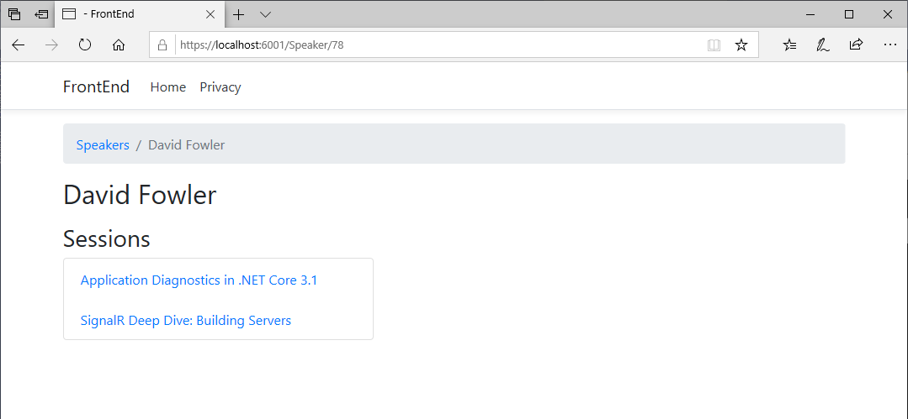

7. Stop the web application and the web API service.

## Add search functionality to the back-end web API service

For the final set of tasks in this session, you'll add search functionality to the back-end web API service and the front-end web app. Users can search for speakers and sessions. You start by adding support for searching to the back-end web API.

1. In the **ConferenceDTO** project, add a new class file named **SearchTerm.cs**, with the following code. This class is a wrapper that stores the search string provided by the user:

    ```csharp
    namespace ConferenceDTO
    {
        public class SearchTerm
        {
            public string Query { get; set; }
        }
    }
    ```

2. Add another class file, named  **SearchResult.cs**, to the **ConferenceDTO** project. Add the code shown below to this file. The **SearchResult** class records the sessions or speakers found by the search. The **SearchResultType** enumeration indicates whether the search is for a session or a speaker:

    ```csharp
    using System;
    using System.Collections.Generic;
    using System.Text;

    namespace ConferenceDTO
    {
        public class SearchResult
        {
            public SearchResultType Type { get; set; }

            public SessionResponse Session { get; set; }

            public SpeakerResponse Speaker { get; set; }
        }

        public enum SearchResultType
        {
            Session,
            Speaker
        }
   }
   ```

3. Switch to the **BackEnd** project, and add a new controller, named **SearchController**, to the **Controllers** folder:

    - **If you're using Visual Studio 2019**:
        1. In Solution Explorer, right-click the **Controllers** folder in the **BackEnd** project, point to **Add**, and then click **Controller**.
        2. In the **Add New Scaffolded Item** dialog box, select the **API Controller - Empty** template, and then click **Add**.
        3. In the **Add Empty API Controller** dialog box, set the controller name to **SearchController**, and then click **Add**.

    - **If you're using the .NET Core CLI**:
        1. Move to the **BackEnd** project folder.
        2. Run the following command:

            ```console
            dotnet aspnet-codegenerator controller -api -name SearchController -outDir Controllers
            ```

4. Open the **SearchController.cs** file, and add the following `using` directives to the list at the start of the file:

    ```csharp
    using BackEnd.Data;
    using ConferenceDTO;
    using Microsoft.EntityFrameworkCore;
    ```

5. Add the constructor shown in the code below to the **SearchController** class:

    ```csharp
    [Route("api/[controller]")]
    [ApiController]
    public class SearchController : ControllerBase
    {
        private readonly ApplicationDbContext _context;

        public SearchController(ApplicationDbContext context)
        {
           _context = context;
        }
    }
    ```

6. Add an asynchronous action method named **SearchAsync** to the controller. The **SearchAsync** method takes a **SearchTerm** object as a parameter and searches for sessions and speakers with matching titles or names. The results are stored in a list of **SearchResult** objects:

    ```csharp
    public class SearchController : ControllerBase
    {
        ...
        [HttpPost]
        public async Task<ActionResult<List<SearchResult>>> SearchAsync(SearchTerm term)
        {
            var query = term.Query;
            var sessionResults = await _context.Sessions.Include(s => s.Track)
                                                        .Include(s => s.SessionSpeakers)
                                                        .ThenInclude(ss => ss.Speaker)
                                                        .Where(s =>
                                                            s.Title.Contains(query) ||
                                                           s.Track.Name.Contains(query)
                                                        )
                                                       .ToListAsync();

            var speakerResults = await _context.Speakers.Include(s => s.SessionSpeakers)
                                                        .ThenInclude(ss => ss.Session)
                                                        .Where(s =>
                                                            s.Name.Contains(query) ||
                                                            s.Bio.Contains(query) ||
                                                            s.WebSite.Contains(query)
                                                        )
                                                       .ToListAsync();

            var results = sessionResults.Select(s => new SearchResult
            {
                Type = SearchResultType.Session,
                Session = s.MapSessionResponse()
            })
            .Concat(speakerResults.Select(s => new SearchResult
            {
                Type = SearchResultType.Speaker,
                Speaker = s.MapSpeakerResponse()
            }));

            return results.ToList();
        }
    }
    ```

## Add a search facility to the front-end client application

In this task, you'll modify the **FrontEnd** project to allow the user to submit search requests to the **BackEnd** web API service. You'll add a page that the web app uses to display the results.

1. In the **FrontEnd** project, open the **IApiClient.cs** file in the **Services** folder.

2. Add the **SearchAsync** method shown below to the **IApiClient** interface:

    ```csharp
    public interface IApiClient
    {
        ...
        Task<List<SearchResult>> SearchAsync(string query);
    }
    ```

3. Open the **ApiClient.cs** file, and implement the **SearchAsync** method as shown below. This method takes a string parameter and uses it to construct a **SearchTerm** object. The search term is then passed as the parameter to a **search** request sent to the web API service. The results are serialized into a list of **SearchResult** objects:

    ```csharp
    public async Task<List<SearchResult>> SearchAsync(string query)
    {
        var term = new SearchTerm
        {
            Query = query
        };

        var response = await _httpClient.PostAsJsonAsync($"/api/search", term);

        response.EnsureSuccessStatusCode();

        return await response.Content.ReadAsAsync<List<SearchResult>>();
    }
    ```

4. Add a new Razor page to the **Pages** folder **FrontEnd** project, using the **Razor Page** template. Name the page **Search.cshtml**.

5. Open the **Search.cshmtl.cs** file, and add the following `using` directives to the list at the start of the file:

    ```csharp
    using ConferenceDTO;
    using FrontEnd.Services;
    ```

6. Add a constructor that takes an **IApiClient** object, and save this object in a local field. You also add fields that store the search term (a string), and the search results:

    ``` csharp
    public class SearchModel : PageModel
    {
        private readonly IApiClient _apiClient;

        public SearchModel(IApiClient apiClient)
        {
            _apiClient = apiClient;
        }

        public string Term { get; set; }

        public List<SearchResult> SearchResults { get; set; }

        public void OnGet()
        {
        }
    }
    ```

7. Remove the **OnGet** method, and replace it with an asynchronous method that takes a string parameter containing a search term. Call the **SearcAsync** method of the **ApiClient** object, and save the results in the **SearchResults** field, as shown in the following code:

    ``` csharp
    public async Task OnGetAsync(string term)
    {
        Term = term;
        SearchResults = await _apiClient.SearchAsync(term);
    }
    ```

8. Open the **Search.cshtml** file. Replace the markup in this page with the code shown below. The first **\<div\>** contains an HTML form that enables the user to enter a search term and submit a search request. The page displays the results in the second **\<div\>**, casting each result to the relevant display model type; either a speaker or a session:

    ``` html
    @page
    @using ConferenceDTO
    @model SearchModel

    <div class="search">
        <h1>Search</h1>
        <form method="get">
            <div class="input-group mb-3">
                <input asp-for="Term" placeholder="Search for sessions or speakers..." class="form-control" />
                <div class="input-group-append">
                    <button class="btn btn-outline-secondary" type="submit">Go!</button>
                </div>
            </div>
            @if (Model.SearchResults?.Count > 0)
            {
                <p>
                    @Model.SearchResults.Count result(s)
                </p>
            }
        </form>
    </div>

    <div class="row">
        @foreach (var result in Model.SearchResults)
        {
            <div class="col-md-12">
                @switch (result.Type)
                {
                    case SearchResultType.Speaker:
                        <div class="card shadow mb-3">
                            <div class="card-header">
                                <h3 class="card-title">Speaker: <a asp-page="Speaker" asp-route-id="@result.Speaker.Id">@result.Speaker.Name</a></h3>
                            </div>
                            <div class="card-body">
                                <p>
                                    @foreach (var session in result.Speaker.Sessions)
                                    {
                                        <a asp-page="/Session" asp-route-id="@session.Id"><em>@session.Title</em></a>
                                    }
                                </p>
                                <p>
                                    @result.Speaker.Bio
                                </p>
                            </div>
                        </div>
                        break;

                    case SearchResultType.Session:
                        <div class="card shadow mb-3">
                            <div class="card-header">
                                <h3 class="card-title">Session: <a asp-page="Session" asp-route-id="@result.Session.Id">@result.Session.Title</a></h3>
                                @foreach (var speaker in result.Session.Speakers)
                                {
                                    <a asp-page="/Speaker" asp-route-id="@speaker.Id"><em>@speaker.Name</em></a>
                                }
                            </div>
                            <div class="card-body">
                                <p>
                                    @result.Session.Abstract
                                </p>
                            </div>
                        </div>
                        break;
                }
            </div>
        }
    </div>
    ```

9. Open the **_Layout.cshtml** file in the **Shared** folder, under the **Pages** folder. Add the search link to the navigation pane in the header, where indicated in the code below:

    ```html
    ...
    <head>
        ...
    </head>
    <body>
        <header>
            <nav ...>
                <div class="container">
                    ...
                    <div class="navbar-collapse collapse d-sm-inline-flex flex-sm-row-reverse">
                        <ul class="navbar-nav flex-grow-1">
                            <li class="nav-item">
                                ...
                            </li>
                            <li class="nav-item">
                                ...
                            </li>
                            <li class="nav-item">
                                <a class="nav-link text-dark" asp-page="/Search">Search</a>
                            </li>
                        </ul>
                    </div>
                </div>
            </nav>
        </header>
        ...
    </body>
    ...
    ```

10. Build and run the solution.

11. On the home page, click **Search** in the navigation bar.

    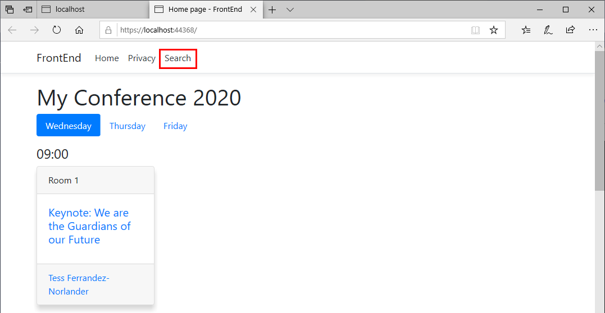

12. On the **Search** page enter a string to search for, and then click **Go!**. All matching speakers and session titles will be displayed, as shown in the image below:

    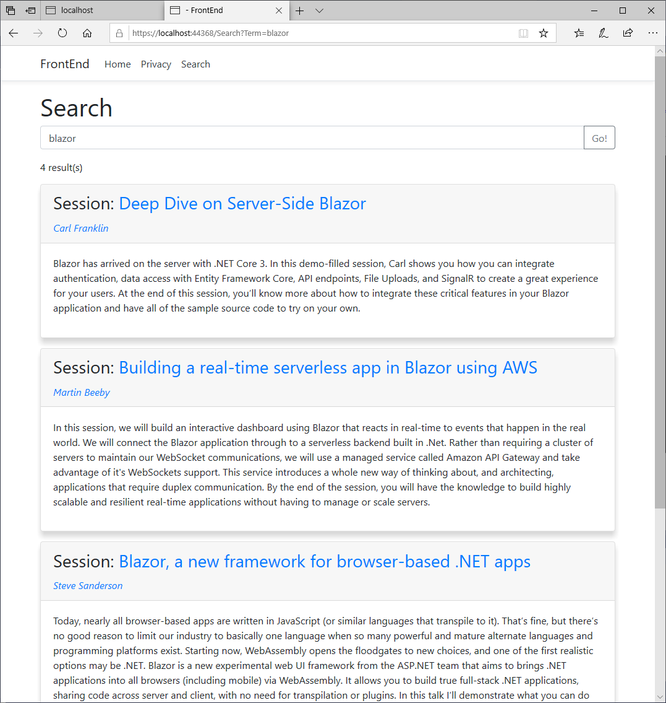

13. Stop the web application and the web API service.

> **Note:** You can find the completed code for the exercises in this session in the [Session 3 save point folder](../save-points/3-Front-End-started/).

**Next**: [Session #4 - Add authentication to the front-end web application](4.%20Add%20auth%20features.md) | **Previous**: [Session #2 - Extend the BackEnd Web API and Add Data Transfer Objects](2.%20Build%20out%20BackEnd%20and%20Refactor.md).
