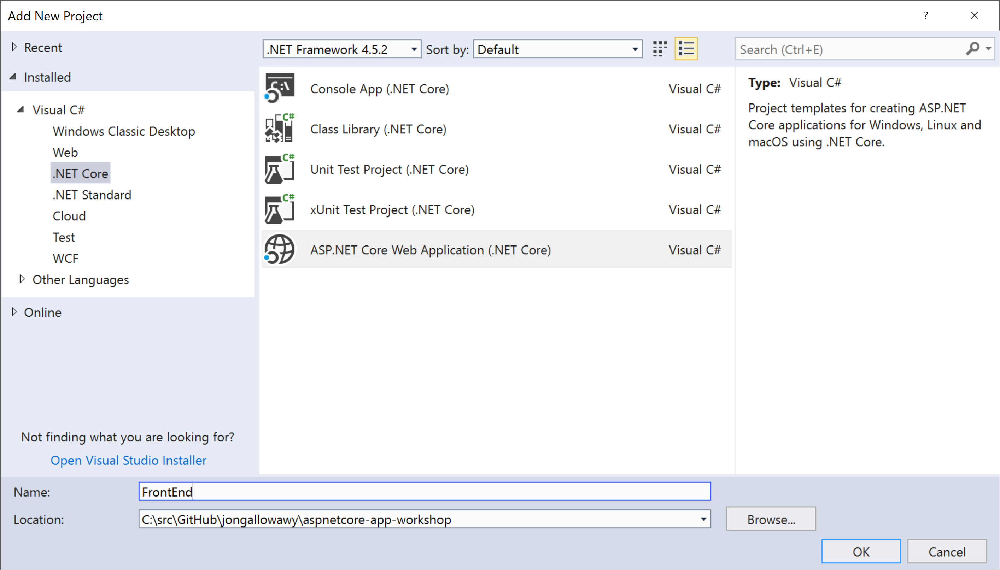
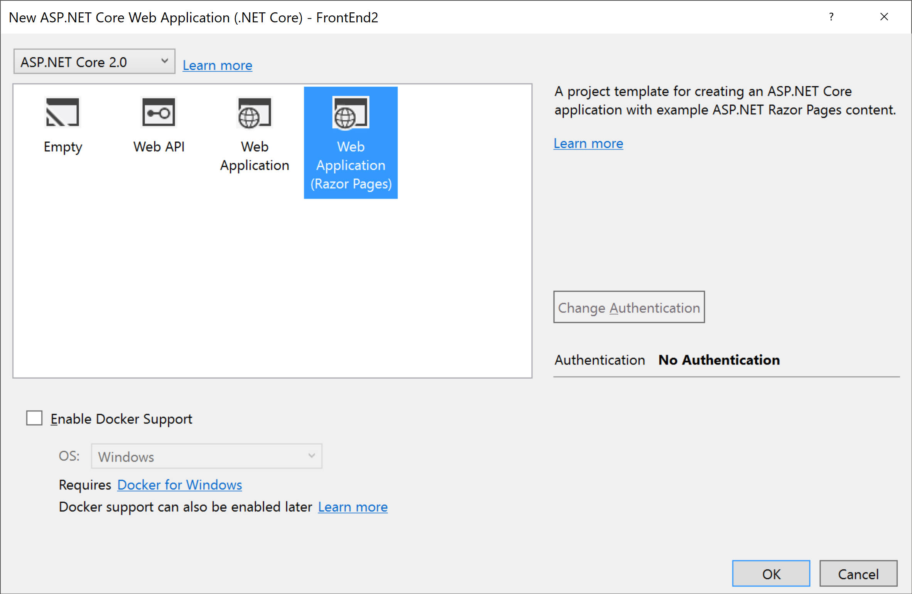

## Building the Front End

In this session, we'll add the front end web site, with a public (anonymous) home page showing the conference agenda.

## Add a FrontEnd project
> We'll start by creating the new front end project for the web site.

### Adding the FrontEnd Project using Visual Studio
1. If using Visual Studio, right-click on the Solution and select *Add* / *New Project...*.
1. Select *.NET Core* from the project types on the left and select the *ASP.NET Core Web Application (.NET Core)* template. Name the project FrontEnd and press OK.

1. Select *ASP.NET Core 2.0* from the drop-down list in the top-left corner
1. Select the *Web Application (Razor Pages)* template and click *OK*


### Adding the FrontEnd Project via the Command Line
1. Open a command prompt and navigate to the root `ConferencePlanner` directory.
1. Run the following command: 
   ```
   dotnet new razor -o FrontEnd
   ```
1. Next we'll need to add a reference to the ConferenceDTO project from the new FrontEnd project. From the command line, navigate to the FrontEnd project directory and execute the following command:
   ```
   dotnet add reference ../ConferenceDTO/ConferenceDTO.csproj
   ```

## Delete unwanted content
> We'll clear out some content from the template that we don't need
1. Open */Pages/Index.cshtml* and delete all the HTML content (after line 6)
1. Delete the following files:
   - */Pages/About.cshtml*
   - */Pages/About.cshtml.cs*
   - */Pages/Contact.cshtml*
   - */Pages/Contact.cshtml.cs*
1. Open the */Pages/_Layout.cshtml* file and delete the nav links to the pages you just deleted (lines 34 and 35)

## Create and wire-up an API service client
> We'll create a class to talk to our backend web API service

### Create the API service client class
1. Create a folder called *Services* in the root of the project
1. In this folder, add a new interface called `IApiClient` with the following members:
   ``` c#
   public interface IApiClient
   {
       Task<List<SessionResponse>> GetSessionsByAttendeeAsync(string name);
       Task<List<SessionResponse>> GetSessionsAsync();
       Task<SessionResponse> GetSessionAsync(int id);
       Task<List<SpeakerResponse>> GetSpeakersAsync();
       Task<SpeakerResponse> GetSpeakerAsync(int id);
       Task PutSessionAsync(Session session);
       Task<List<SearchResult>> SearchAsync(string query);
       Task AddAttendeeAsync(Attendee attendee);
       Task<AttendeeResponse> GetAttendeeAsync(string name);
       Task DeleteSessionAsync(int id);
       Task AddSessionToAttendeeAsync(string name, int sessionId);
       Task RemoveSessionFromAttendeeAsync(string name, int sessionId);
   }
   ```
1. Staying in this foler, add a new class called `ApiClient` that implements the `IApiClient` interface by using `HttpClient` to call out to our BackEnd API application and JSON serialize/deserialize the payloads:
    ``` c#
    using System;
    using System.Collections.Generic;
    using System.Linq;
    using System.Net;
    using System.Net.Http;
    using System.Threading.Tasks;
    using ConferenceDTO;
    using FrontEnd.Infrastructure;

    namespace FrontEnd.Services
    {
        public class ApiClient : IApiClient
        {
            private readonly HttpClient _httpClient;

            public ApiClient(HttpClient httpClient)
            {
                _httpClient = httpClient;
            }

            public async Task AddAttendeeAsync(Attendee attendee)
            {
                var response = await _httpClient.PostJsonAsync($"/api/attendees", attendee);

                response.EnsureSuccessStatusCode();
            }

            public async Task<AttendeeResponse> GetAttendeeAsync(string name)
            {
                if (string.IsNullOrEmpty(name))
                {
                    return null;
                }

                var response = await _httpClient.GetAsync($"/api/attendees/{name}");

                if (response.StatusCode == HttpStatusCode.NotFound)
                {
                    return null;
                }

                response.EnsureSuccessStatusCode();

                return await response.Content.ReadAsJsonAsync<AttendeeResponse>();
            }

            public async Task<SessionResponse> GetSessionAsync(int id)
            {
                var response = await _httpClient.GetAsync($"/api/sessions/{id}");

                if (response.StatusCode == HttpStatusCode.NotFound)
                {
                    return null;
                }

                response.EnsureSuccessStatusCode();

                return await response.Content.ReadAsJsonAsync<SessionResponse>();
            }

            public async Task<List<SessionResponse>> GetSessionsAsync()
            {
                var response = await _httpClient.GetAsync("/api/sessions");

                response.EnsureSuccessStatusCode();

                return await response.Content.ReadAsJsonAsync<List<SessionResponse>>();
            }

            public async Task DeleteSessionAsync(int id)
            {
                var response = await _httpClient.DeleteAsync($"/api/sessions/{id}");

                if (response.StatusCode == HttpStatusCode.NotFound)
                {
                    return;
                }

                response.EnsureSuccessStatusCode();
            }

            public async Task<SpeakerResponse> GetSpeakerAsync(int id)
            {
                var response = await _httpClient.GetAsync($"/api/speakers/{id}");

                if (response.StatusCode == HttpStatusCode.NotFound)
                {
                    return null;
                }

                response.EnsureSuccessStatusCode();

                return await response.Content.ReadAsJsonAsync<SpeakerResponse>();
            }

            public async Task<List<SpeakerResponse>> GetSpeakersAsync()
            {
                var response = await _httpClient.GetAsync("/api/speakers");

                response.EnsureSuccessStatusCode();

                return await response.Content.ReadAsJsonAsync<List<SpeakerResponse>>();
            }

            public async Task PutSessionAsync(Session session)
            {
                var response = await _httpClient.PutJsonAsync($"/api/sessions/{session.ID}", session);

                response.EnsureSuccessStatusCode();
            }

            public async Task<List<SearchResult>> SearchAsync(string query)
            {
                var term = new SearchTerm
                {
                    Query = query
                };

                var response = await _httpClient.PostJsonAsync($"/api/search", term);

                response.EnsureSuccessStatusCode();

                return await response.Content.ReadAsJsonAsync<List<SearchResult>>();
            }
        }
    }
    ```
1. The previous class relies on some extension methods to make working with JSON payloads a littler nicer with `HttpClient` so let's add those now.
1. Create a directory in the root of the project called *Infrastructure*
1. Add a new class called `HttpClientExtensions` with the following code:
    ``` c#
    using System;
    using System.Collections.Generic;
    using System.IO;
    using System.Linq;
    using System.Net;
    using System.Net.Http;
    using System.Threading.Tasks;
    using Newtonsoft.Json;

    namespace FrontEnd.Infrastructure
    {
        public static class HttpClientExtensions
        {
            private static readonly JsonSerializer _jsonSerializer = new JsonSerializer();

            public static async Task<T> ReadAsJsonAsync<T>(this HttpContent httpContent)
            {
                using (var stream = await httpContent.ReadAsStreamAsync())
                {
                    var jsonReader = new JsonTextReader(new StreamReader(stream));

                    return _jsonSerializer.Deserialize<T>(jsonReader);
                }
            }

            public static Task<HttpResponseMessage> PostJsonAsync<T>(this HttpClient client, string url, T value)
            {
                return SendJsonAsync<T>(client, HttpMethod.Post, url, value);
            }
            public static Task<HttpResponseMessage> PutJsonAsync<T>(this HttpClient client, string url, T value)
            {
                return SendJsonAsync<T>(client, HttpMethod.Put, url, value);
            }

            public static Task<HttpResponseMessage> SendJsonAsync<T>(this HttpClient client, HttpMethod method, string url, T value)
            {
                var stream = new MemoryStream();
                var jsonWriter = new JsonTextWriter(new StreamWriter(stream));

                _jsonSerializer.Serialize(jsonWriter, value);

                jsonWriter.Flush();

                stream.Position = 0;

                var request = new HttpRequestMessage(method, url)
                {
                    Content = new StreamContent(stream)
                };

                request.Content.Headers.TryAddWithoutValidation("Content-Type", "application/json");

                return client.SendAsync(request);
            }
        }
    }
    ```

### Configure the API client
1. Open the *Startup.cs* file
1. Locate the `ConfigureServices` method and add the following code to the bottom of it:
    ``` c#
    var httpClient = new HttpClient
    {
        BaseAddress = new Uri(Configuration["serviceUrl"])
    };
    services.AddSingleton(httpClient);
    services.AddSingleton<IApiClient, ApiClient>();
    ```
1. This adds an instance of `HttpClient` with its base URL pulled from the application configuration, which will point to our BackEnd API application
1. Open the *appsettings.json* file and add the configuration key for `serviceUrl` pointing to the URL your specific BackEnd API application is configured to run in (check your *launchSettings.json* file for the specific port your BackEnd API application uses):
    ``` json
    "ServiceUrl": "http://localhost:56009/"
    ```

## List the sessions on the home page
>Now that we have an API client we can use to talk to our BackEnd API application, we'll update the home page to show a basic list of all sessions for the conference to ensure the FrontEnd can talk to the BackEnd correctly.

