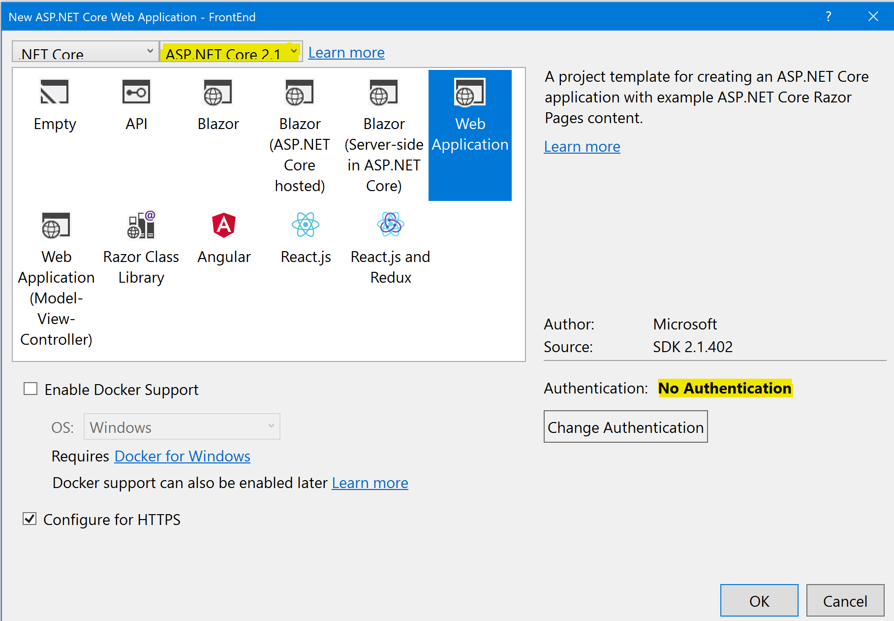

## Building the Front End

In this session, we'll add the front end web site, with a public (anonymous) home page showing the conference agenda.

## Add a FrontEnd project
> We'll start by creating the new front end project for the web site.

### Adding the FrontEnd Project using Visual Studio
1. If using Visual Studio, right-click on the Solution and select *Add* / *New Project...*.
1. Select *.NET Core* from the project types on the left and select the *ASP.NET Core Web Application (.NET Core)* template. Name the project FrontEnd and press OK.

1. Select *ASP.NET Core 2.0* from the drop-down list in the top-left corner
1. Select the *Web Application (Razor Pages)* template and click *OK*


### Adding the FrontEnd Project via the Command Line
1. Open a command prompt and navigate to the root `ConferencePlanner` directory.
1. Run the following command: 
   ```
   dotnet new razor -o FrontEnd
   ```
1. Next we'll need to add a reference to the ConferenceDTO project from the new FrontEnd project. From the command line, navigate to the FrontEnd project directory and execute the following command:
   ```
   dotnet add reference ../ConferenceDTO/ConferenceDTO.csproj
   ```

## Delete unwanted content
> We'll clear out some content from the template that we don't need
1. Open */Pages/Index.cshtml* and delete all the HTML content (after line 6)
1. Delete the following files:
   - */Pages/About.cshtml*
   - */Pages/About.cshtml.cs*
   - */Pages/Contact.cshtml*
   - */Pages/Contact.cshtml.cs*
1. Open the */Pages/_Layout.cshtml* file and delete the nav links to the pages you just deleted (lines 34 and 35)

## Create and wire-up an API service client
> We'll create a class to talk to our backend web API service

### Create the API service client class
1. Create a folder called *Services* in the root of the project
1. In this folder, add a new interface called `IApiClient` with the following members:
   ``` c#
   public interface IApiClient
   {
       Task<List<SessionResponse>> GetSessionsAsync();
       Task<SessionResponse> GetSessionAsync(int id);
       Task<List<SpeakerResponse>> GetSpeakersAsync();
       Task<SpeakerResponse> GetSpeakerAsync(int id);
       Task PutSessionAsync(Session session);
       Task<List<SearchResult>> SearchAsync(string query);
       Task AddAttendeeAsync(Attendee attendee);
       Task<AttendeeResponse> GetAttendeeAsync(string name);
       Task DeleteSessionAsync(int id);
   }
   ```
1. Staying in this foler, add a new class called `ApiClient` that implements the `IApiClient` interface by using `HttpClient` to call out to our BackEnd API application and JSON serialize/deserialize the payloads:
    ``` c#
    using System;
    using System.Collections.Generic;
    using System.Linq;
    using System.Net;
    using System.Net.Http;
    using System.Threading.Tasks;
    using ConferenceDTO;
    using FrontEnd.Infrastructure;

    namespace FrontEnd.Services
    {
        public class ApiClient : IApiClient
        {
            private readonly HttpClient _httpClient;

            public ApiClient(HttpClient httpClient)
            {
                _httpClient = httpClient;
            }

            public async Task AddAttendeeAsync(Attendee attendee)
            {
                var response = await _httpClient.PostJsonAsync($"/api/attendees", attendee);

                response.EnsureSuccessStatusCode();
            }

            public async Task<AttendeeResponse> GetAttendeeAsync(string name)
            {
                if (string.IsNullOrEmpty(name))
                {
                    return null;
                }

                var response = await _httpClient.GetAsync($"/api/attendees/{name}");

                if (response.StatusCode == HttpStatusCode.NotFound)
                {
                    return null;
                }

                response.EnsureSuccessStatusCode();

                return await response.Content.ReadAsJsonAsync<AttendeeResponse>();
            }

            public async Task<SessionResponse> GetSessionAsync(int id)
            {
                var response = await _httpClient.GetAsync($"/api/sessions/{id}");

                if (response.StatusCode == HttpStatusCode.NotFound)
                {
                    return null;
                }

                response.EnsureSuccessStatusCode();

                return await response.Content.ReadAsJsonAsync<SessionResponse>();
            }

            public async Task<List<SessionResponse>> GetSessionsAsync()
            {
                var response = await _httpClient.GetAsync("/api/sessions");

                response.EnsureSuccessStatusCode();

                return await response.Content.ReadAsJsonAsync<List<SessionResponse>>();
            }

            public async Task DeleteSessionAsync(int id)
            {
                var response = await _httpClient.DeleteAsync($"/api/sessions/{id}");

                if (response.StatusCode == HttpStatusCode.NotFound)
                {
                    return;
                }

                response.EnsureSuccessStatusCode();
            }

            public async Task<SpeakerResponse> GetSpeakerAsync(int id)
            {
                var response = await _httpClient.GetAsync($"/api/speakers/{id}");

                if (response.StatusCode == HttpStatusCode.NotFound)
                {
                    return null;
                }

                response.EnsureSuccessStatusCode();

                return await response.Content.ReadAsJsonAsync<SpeakerResponse>();
            }

            public async Task<List<SpeakerResponse>> GetSpeakersAsync()
            {
                var response = await _httpClient.GetAsync("/api/speakers");

                response.EnsureSuccessStatusCode();

                return await response.Content.ReadAsJsonAsync<List<SpeakerResponse>>();
            }

            public async Task PutSessionAsync(Session session)
            {
                var response = await _httpClient.PutJsonAsync($"/api/sessions/{session.ID}", session);

                response.EnsureSuccessStatusCode();
            }

            public async Task<List<SearchResult>> SearchAsync(string query)
            {
                var term = new SearchTerm
                {
                    Query = query
                };

                var response = await _httpClient.PostJsonAsync($"/api/search", term);

                response.EnsureSuccessStatusCode();

                return await response.Content.ReadAsJsonAsync<List<SearchResult>>();
            }
        }
    }
    ```
1. The previous class relies on some extension methods to make working with JSON payloads a littler nicer with `HttpClient` so let's add those now.
1. Create a directory in the root of the project called *Infrastructure*
1. Add a new class called `HttpClientExtensions` with the following code:
    ``` c#
    using System;
    using System.Collections.Generic;
    using System.IO;
    using System.Linq;
    using System.Net;
    using System.Net.Http;
    using System.Threading.Tasks;
    using Newtonsoft.Json;

    namespace FrontEnd.Infrastructure
    {
        public static class HttpClientExtensions
        {
            private static readonly JsonSerializer _jsonSerializer = new JsonSerializer();

            public static async Task<T> ReadAsJsonAsync<T>(this HttpContent httpContent)
            {
                using (var stream = await httpContent.ReadAsStreamAsync())
                {
                    var jsonReader = new JsonTextReader(new StreamReader(stream));

                    return _jsonSerializer.Deserialize<T>(jsonReader);
                }
            }

            public static Task<HttpResponseMessage> PostJsonAsync<T>(this HttpClient client, string url, T value)
            {
                return SendJsonAsync<T>(client, HttpMethod.Post, url, value);
            }
            public static Task<HttpResponseMessage> PutJsonAsync<T>(this HttpClient client, string url, T value)
            {
                return SendJsonAsync<T>(client, HttpMethod.Put, url, value);
            }

            public static Task<HttpResponseMessage> SendJsonAsync<T>(this HttpClient client, HttpMethod method, string url, T value)
            {
                var stream = new MemoryStream();
                var jsonWriter = new JsonTextWriter(new StreamWriter(stream));

                _jsonSerializer.Serialize(jsonWriter, value);

                jsonWriter.Flush();

                stream.Position = 0;

                var request = new HttpRequestMessage(method, url)
                {
                    Content = new StreamContent(stream)
                };

                request.Content.Headers.TryAddWithoutValidation("Content-Type", "application/json");

                return client.SendAsync(request);
            }
        }
    }
    ```

### Configure the API client
1. Open the *Startup.cs* file
1. Locate the `ConfigureServices` method and add the following code to the bottom of it:
    ``` c#
    var httpClient = new HttpClient
    {
        BaseAddress = new Uri(Configuration["serviceUrl"])
    };
    services.AddSingleton(httpClient);
    services.AddSingleton<IApiClient, ApiClient>();
    ```
1. This adds an instance of `HttpClient` with its base URL pulled from the application configuration, which will point to our BackEnd API application
1. Open the *appsettings.json* file and add the configuration key for `serviceUrl` pointing to the URL your specific BackEnd API application is configured to run in (check your *launchSettings.json* file for the specific port your BackEnd API application uses):
    ``` json
    "ServiceUrl": "http://localhost:56009/"
    ```

## List the sessions on the home page
>Now that we have an API client we can use to talk to our BackEnd API application, we'll update the home page to show a basic list of all sessions for the conference to ensure the FrontEnd can talk to the BackEnd correctly.

### Load the data into the PageModel
1. Open the */Pages/Index.cshtml.cs* file
1. Edit the constructor to accept the `IApiClient` interface and store it in a local field:
    ``` c#
    protected readonly IApiClient _apiClient;

    public IndexModel(IApiClient apiClient)
    {
        _apiClient = apiClient;
    }
    ```
1. Add some properties to store sessions and other data we'll need when rendering the page:
    ``` c#
    public IEnumerable<IGrouping<DateTimeOffset?, SessionResponse>> Sessions { get; set; }

    public IEnumerable<(int Offset, DayOfWeek? DayofWeek)> DayOffsets { get; set; }

    public int CurrentDayOffset { get; set; }
    ```
1. Add a page handler method to handle GET requests to the page, that loads the session data and calculates the data required to build the day navigation UI:
    ``` c#
    public async Task OnGet(int day = 0)
    {
        CurrentDayOffset = day;

        var sessions = await _apiClient.GetSessionsAsync();

        var startDate = sessions.Min(s => s.StartTime?.Date);
        var endDate = sessions.Max(s => s.EndTime?.Date);

        var numberOfDays = ((endDate - startDate)?.Days) + 1;

        DayOffsets = Enumerable.Range(0, numberOfDays ?? 0)
            .Select(offset => (offset, (startDate?.AddDays(offset))?.DayOfWeek));

        var filterDate = startDate?.AddDays(day);

        Sessions = sessions.Where(s => s.StartTime?.Date == filterDate)
                           .OrderBy(s => s.TrackId)
                           .GroupBy(s => s.StartTime)
                           .OrderBy(g => g.Key);
    }
    ```

### Render the sessions list on the home page
1. Open the */Pages/Index.cshtml* Razor Page file
1. Add some Razor markup to show the sessions as a simple list, grouped by time-slot:
    ``` html
    <div class="agenda">
        <h1>NDC Oslo 2017</h1>

        @foreach (var timeSlot in Model.Sessions)
        {
            <h4>@timeSlot.Key?.ToString("HH:mm")</h4>
            <ul>
                @foreach (var session in timeSlot)
                {
                    <li>@session.Title</li>
                }
            </ul>
        }
    </div>
    ```
1. Run the FrontEnd application at this stage and we should see the sessions listed on the home page

### Add buttons to allow showing sessions for different days
1. In */Pages/Index.cshtml*, add some markup to allow the user to show sessions for the different days of the conference, below the `<h1>` we added previously:
    ``` html
    <ul class="nav nav-pills">
        @foreach (var day in Model.DayOffsets)
        {
            <li role="presentation" class="@(Model.CurrentDayOffset == day.Offset ? "active" : null)">
                <a asp-route-day="@day.Offset">@day.DayofWeek?.ToString()</a>
            </li>
        }
    </ul>
    ```
1. Run the application again and try clicking the buttons to show sessions for the different days

## Update the sessions list UI
1. Make the list of sessions better looking by updating the markup to use some CSS and components from Bootstrap:
    ``` html
    @foreach (var timeSlot in Model.Sessions)
    {
        <h4>@timeSlot.Key?.ToString("HH:mm")</h4>
        <div class="row">
            @foreach (var session in timeSlot)
            {
                <div class="col-md-3">
                    <div class="panel panel-default session">
                        <div class="panel-body">
                            <p>@session.Track?.Name</p>
                            <h3 class="panel-title"><a asp-page="Session" asp-route-id="@session.ID">@session.Title</a></h3>
                            <p>
                            @foreach (var speaker in session.Speakers)
                            {
                                <em><a asp-page="Speaker" asp-route-id="@speaker.ID">@speaker.Name</a></em>
                            }
                            </p>
                        </div>
                    </div>
                </div>
            }
        </div>
    }
    ```
1. Run the page again and see the updated sessions list UI. Click the buttons again to show sessions for the different days.

## Add a session details page
> Now that we have a home page showing all the sessions, we'll create a page to show all the details of a specific session

### Add a Session Razor Page
1. Add a new Razor Page using the *Razor Page (with page model)* template. Call the page *Session.cshtml* and save it in the */Pages* directory.
1. Open *Session.cshtml.cs* and change the page model class to `SessionModel`. 
1. Accept the `IApiClient` in the constructor and add supporting members to the Page model `SessionModel`:
    ``` c#
    public class SessionModel : PageModel
    {
        private readonly IApiClient _apiClient;

        public SessionModel(IApiClient apiClient)
        {
            _apiClient = apiClient;
        }

        public SessionResponse Session { get; set; }

        public int? DayOffset { get; set; }
    }
    ```
1. Add a page handler method to retrieve the Session details and set them on the model:
    ``` c#
    public async Task<IActionResult> OnGet(int id)
    {
        Session = await _apiClient.GetSessionAsync(id);

        if (Session == null)
        {
            return RedirectToPage("/Index");
        }

        var allSessions = await _apiClient.GetSessionsAsync();

        var startDate = allSessions.Min(s => s.StartTime?.Date);

        DayOffset = Session.StartTime?.DateTime.Subtract(startDate ?? DateTime.MinValue).Days;

        if (!string.IsNullOrEmpty(Session.Abstract))
        {
            Session.Abstract = "<p>" + String.Join("</p><p>", Session.Abstract.Split("\r\n", StringSplitOptions.RemoveEmptyEntries)) + "</p>";
        }

        return Page();
    }
    ```
1. Open the *Session.cshtml* file and add markup to display the details and navigation UI:
    ``` html
    @page "{id}"
    @model SessionModel

    <ol class="breadcrumb">
        <li><a asp-page="/Index">Agenda</a></li>
        <li><a asp-page="/Index" asp-route-day="@Model.DayOffset">Day @(Model.DayOffset + 1)</a></li>
        <li class="active">@Model.Session.Title</li>
    </ol>

    <h1>@Model.Session.Title</h1>
    <span class="label label-default">@Model.Session.Track?.Name</span>

    @foreach (var speaker in Model.Session.Speakers)
    {
        <em><a asp-page="Speaker" asp-route-id="@speaker.ID">@speaker.Name</a></em>
    }

    <p>@Html.Raw(Model.Session.Abstract)</p>    
    ```

## HTML Encoding the Session Abstract
Currently, the *Session* Abstract is displayed using `@Html.Raw()`. This makes it vulnerable to Cross-Site Scripting (XSS) and Injection Attacks, since an abstract could contain JavaScript. We'll update `Session.cshtml.cs` to HTML encode the Abstract to protect against these attacks.

1. Add an HtmlEncoder field to the SessionModel using the following code:
   ```csharp
   private readonly HtmlEncoder _htmlEncoder;
   ```
1. Update the `SessionModel` constructor to inject an `HtmlEncoder`:
   ```csharp
   public SessionModel(IApiClient apiClient, HtmlEncoder htmlEncoder)
    {
        _apiClient = apiClient;
        _htmlEncoder = htmlEncoder;
    }
   ```
1. Update the section of the `OnGet()` method that handles `Session.Abstract` to encode the output.
   ```csharp
    if (!string.IsNullOrEmpty(Session.Abstract))
    {
        var encodedCrLf = _htmlEncoder.Encode("\r\n");
        var encodedAbstract = _htmlEncoder.Encode(Session.Abstract);
        Session.Abstract = "<p>" + String.Join("</p><p>", encodedAbstract.Split(encodedCrLf, StringSplitOptions.RemoveEmptyEntries)) + "</p>";
    }
   ```