# Add authentication to the front-end web application

In this session, you'll add security by implementing authentication and authorization. You'll also implement an administrative policy that enables specific users to modify the details of sessions. Then you'll implement a custom authentication tag helper, to simplify the authentication logic in the front-end web pages.

> **Note:** You can either continue with your own solution, or use the code in the [Session 3 save point folder](../save-points/3-Front-End-started).

## Add ASP.NET Core Identity capabilities

In this task, you'll add authentication capabilities to the **FrontEnd** web application using the **ASP.NET Core Identity** feature. **ASP.NET Core Identity** stores user information in a local SQl Server database. You can use the Entity Framework to retrieve and manage the information in this database.

> **Note:** For detailed information about implementing authentication in an ASP.NET Core Web application, visit [Introduction to Identity on ASP.NET Core](https://docs.microsoft.com/aspnet/core/security/authentication/identity?view=aspnetcore-3.1&tabs=visual-studio).

**If you're using Visual Studio, perform the following steps:**

1. In Solution Explorer, right-click the **FrontEnd** project, click **Add**, and then click **New Scaffolded Item**.

2. In the **Add New Scaffolded Item** dialog box, in the tree view on the left, click **Identity**, click the **Identity** template, and then click **Add**.

    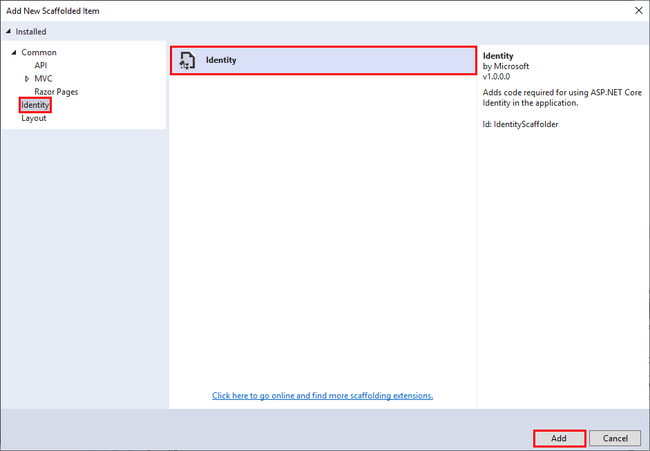

3. In the **Add Identity** dialog box, next to the **Data context class** box, click **+**.

    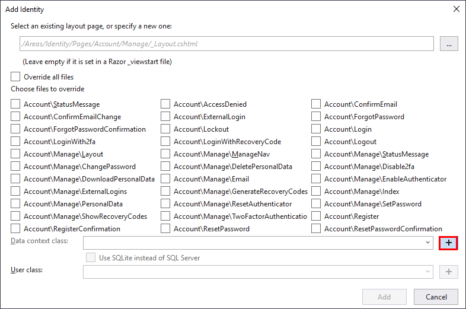

    > **Note:** If you're using a non-Windows computer, select the **Use SQLite instead of SQL Server** check box.

4. In the **Add Data Context** dialog box, name the data context class **FrontEnd.Data.IdentityDbContext**, and then click **Add**.

    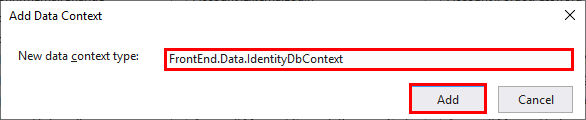

5. In the **Add Identity** dialog box, next to the **User class** box, click **+**.

    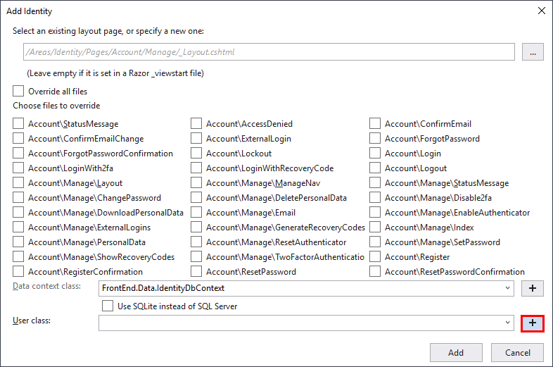

6. In the **Add User Class** dialog box, name the user class **FrontEnd.Data.User**, and then click **Add**.

    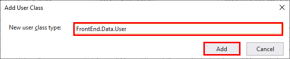.

7. Back in the **Add Identity** dialog box, if want to use SQLite instead of SQL Server to store identity information, select the **Use SQLite instead of SQL Server** option in the **Add Identity** dialog box:

8. In the **Add Identity** dialog box, click **Add**.

    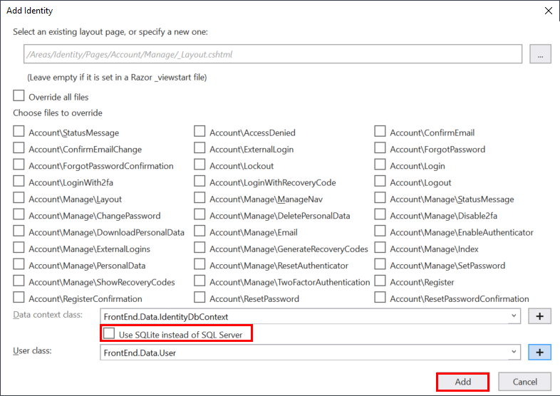

**If you're using the .NET Core CLI, perform the following steps:**

1. If you haven't done so already, install the command-line scaffolding tool.

    1. Run the following command:

        ```console
        dotnet tool install -g dotnet-aspnet-codegenerator
        ```

    2. Close the command prompt window, and open a new one.

2. Move to the **FrontEnd** project folder.

3. Run the following commands to add the NuGet packages required by ASP.NET Core Identity to the project:

    ```console
    dotnet add package Microsoft.VisualStudio.Web.CodeGeneration.Design --version 3.1.1
    dotnet add package Microsoft.AspNetCore.Identity.UI --version 3.1.2
    dotnet add package Microsoft.EntityFrameworkCore.Design --version 3.1.2
    dotnet add package Microsoft.AspNetCore.Identity.EntityFrameworkCore --version 3.1.2
    ```

4. If you want to store user data in a local SQL Server database, install the SQL Server NuGet package for the Entity Framework Core:

    ```console
    dotnet add package Microsoft.EntityFrameworkCore.SqlServer --version 3.1.2
    ```

    If want to use SQLite instead of SQL Server, install the SQLite package:

    ```console
    dotnet add package Microsoft.EntityFrameworkCore.Sqlite --version 3.1.2
    ```

5. Run the command shown below to add the **ASP.NET Core Identity** feature to the project. This command generates a data context class named **FrontEnd.Data.IdentityDbContext** that the application uses to connect to the SQL Server database containing the authentication information, and a class named **FrontEnd.Data.User** that the application uses to store and retrieve information about authenticated users.

    - If you're using SQL Server to store identity information, run this command:

        ```console
        dotnet aspnet-codegenerator identity --dbContext FrontEnd.Data.IdentityDbContext --userClass FrontEnd.Data.User --useDefaultUI
        ```

    - If you're using SQLite, run this command instead:

        ```console
        dotnet aspnet-codegenerator identity --dbContext FrontEnd.Data.IdentityDbContext --userClass FrontEnd.Data.User --useDefaultUI --useSqLite
        ```

## Add the authentication middleware

In this task, you'll configure the request pipeline so that it contains the Authentication middleware before any other middleware that represents resources the application might want to authorize, such as Razor Pages.

1. In the root folder of the **FrontEnd** project, open the **Startup.cs** file.

2. In the **Configure** method of the **Startup** class, call the **UseAuthentication** method after **UseRouting**, but before **UseAuthorization** and **UseEndpoints**, as shown below:

    ```csharp
    public void Configure(IApplicationBuilder app, IHostingEnvironment env)
    {
        ...
        app.UseRouting();

        app.UseAuthentication();

        app.UseAuthorization();

        app.UseEndpoints(endpoints =>
        {
            endpoints.MapRazorPages();
        });
    }
    ```

## Update the layout with Identity links

The scaffolded out Identity system includes a Razor partial view that contains the Identity-related UI for the site header. This includes Login and Register links, the user name once logged in, and so on. In this task, you'll integrate the partial view into the layout page for the website:

1. In the **FrontEnd** project, in the **/Areas/Identity/Pages** folder, delete the **_ValidationScriptsPartial.cshtml** and **_ViewStart.cshtml** files in this folder. You don't need these files as similar pages already exist in the **Pages/Shared** and **Pages** folders.

2. Delete the **ScaffoldingReadme.txt** file in the root folder of the **FrontEnd** project.

3. Go to the **Shared** folder under the **Pages** folder, then open the **_Layout.cshtml** file.

4. In this file, locate the following markup. It should be on or around line 20:

    ```html
    <div class="navbar-collapse collapse d-sm-inline-flex flex-sm-row-reverse">
    ```

5. Immediately after this line, add the `<partial>` tag helper to render the newly added `_LoginPartial.cshtml` content, as shown below:

    ```html
    <div class="navbar-collapse collapse d-sm-inline-flex flex-sm-row-reverse">
        <!-- new code below-->
        <partial name="_LoginPartial" />
        <ul class="navbar-nav flex-grow-1">
            ...
        </ul>
        <!-- end of new code -->
    </div>
    ```

6. Start the solution:

    - **If you're using Visual Studio:**
        1. Press **F5** to build and run the solution. The **FrontEnd** and **BackEnd** projects will start. A web browser will open displaying two webpages: one for the **BackEnd** project, the other for the **FrontEnd**.

        2. Switch to the window displaying the webpage for the **FrontEnd** web app.

    - **If you're using the .NET Core CLI:**
        1. Open the **launchSettings.json** file in the **Properties** folder of the **FrontEnd** project.
        2. Make a note of the HTTPS URL in the **applicationUrl** property in the **FrontEnd** profile, and then close the **launchSettings.json** file.
        3. Move to the **ConferencePlanner** solution folder.
        4. Run the following command to run the **BackEnd** project in a new console window:

            ```console
            start dotnet run --project BackEnd
            ```

        5. When the **BackEnd** project has started, return to the original console window, and run the following command to start the **FrontEnd** project:

            ```console
            dotnet run --project FrontEnd
            ```

        6. Open a web browser, and go to the HTTPS URL of the **FrontEnd** web application that you noted earlier.

7. Verify that the home page now displays links labelled **Register** and **Login**.

    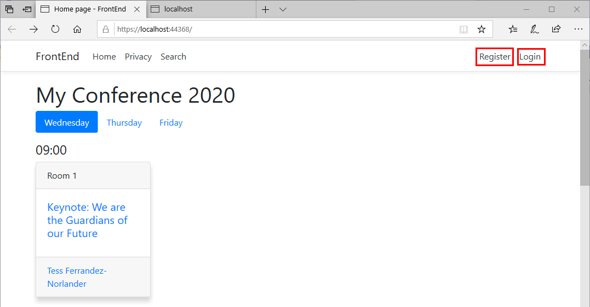

8. Click the **Login** link. The default login page should appear. Don't try and sign in yet:

    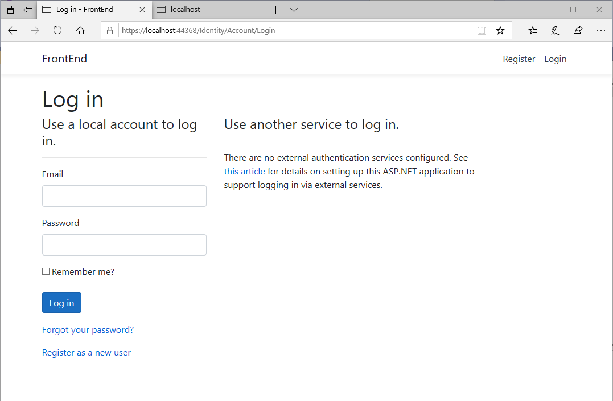

9. Click the **Register** link. The default register page should be displayed. Users can utilize this page to create a new account and set a password. Don't register yourself yet.

    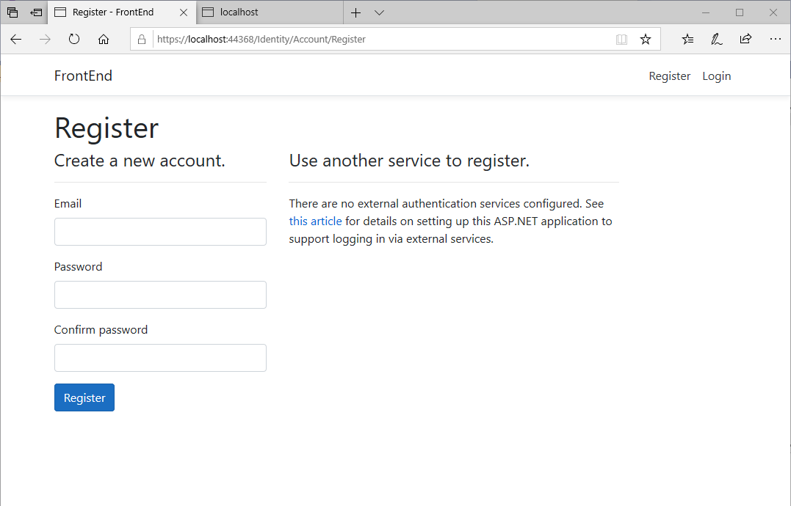

10. Stop the web application and web API service:

    - **If you're using Visual Studio 2019:**

        - Close the web browser. The FrontEnd and BackEnd projects will stop automatically.

    - **If you're using the .NET Core CLI:**

        1. Close the web browser.
        2. Switch to the console window for the **BackEnd** project and press **Ctrl-C** to stop the web API service.
        3. Return to the console window for the **FrontEnd** project, and press **Ctrl-C** to stop the web application.

## Update the web application to support administrative users

Identity supports simple customization of the classes representing users. You can also customize the default Identity UI. In this task, you'll add the ability to create an administrative user. In the **FrontEnd** web application, the first user to register with the site is deemed to be the administrator.

1. Open the **User.cs** class file in the **/Areas/Identity/Data** folder in the **FrontEnd** project.

2. Add a `bool` property called **IsAdmin** to the **User** class, to indicate whether the user is an administrator:

    ```csharp
    public class User : IdentityUser
    {
        public bool IsAdmin { get; set; }
    }
    ```

3. Update the database with the changes to the schema.

    - **If you're using Visual Studio 2019:**

        1. On the **Tools** menu, point to **NuGet Package Manager**, and then click **Package Manager Console**.

        2. In the toolbar for the **Package Manager Console**, set the default project to **FrontEnd**.

            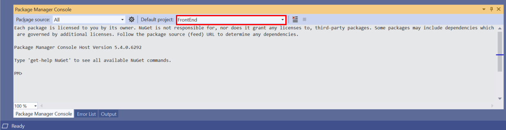

        3. Run the following commands in the **Package Manager Console**:

            ```console
            Add-Migration CreateIdentitySchema
            Update-Database
            ```

    - **If you're using the .NET Core CLI:**

        1. Install the Core Entity Framework migration tools if you haven't done so previously:

            1. Run the following command:

                ```console
                dotnet tool install -g dotnet-ef --version 3.1.2
                ```

            2. Close the command prompt window, and open a new one.

        2. Move to the **FrontEnd** project folder.

        3. Run the following commands:

            ```console
            dotnet build
            dotnet ef migrations add CreateIdentitySchema
            dotnet ef database update
            ```

4. Create a new interface file named **IAdminService.cs** in the **Services** folder.

    - **If you're using Visual Studio 2019:**

        1. In Solution Explorer, right-click the **Services** folder in the **FrontEnd** project, point to **Add**, and then click **Class**.
        2. In the **Add New Item - FrontEnd** dialog box, select the **Interface** template, enter **IAdminService** for the name of the interface file, and then click **Add**.

    - **If you're using the .NET Core CLI:**
        1. Move to the **Services** folder in the **FrontEnd** project folder.
        2. Create a new file named **IAdminService.cs** using an editor of your choice.

5. Add the code shown below to this file:

    ```csharp
    using System.Threading.Tasks;

    namespace FrontEnd.Services
    {
        public interface IAdminService
        {
            Task<bool> AllowAdminUserCreationAsync();
        }
    }
    ```

6. Create a new class file named  **AdminService.cs** in the **Services** folder. This class will implement the **IAdminService** interface, and is responsible for tracking whether the site should allow creating administrative users.

    - **If you're using Visual Studio 2019:**

        1. In Solution Explorer, right-click the **Services** folder in the **FrontEnd** project, point to **Add**, and then click **Class**.
        2. In the **Add New Item - FrontEnd** dialog box, select the **Class** template, enter **AdminService** for the name of the class file, and then click **Add**.

    - **If you're using the .NET Core CLI:**
        1. Move to the **Services** folder in the **FrontEnd** project folder.
        2. Create a new file named **AdminService.cs** using an editor of your choice.

7. Add the following directives to the list at the start of the file, if they aren't already present:

    ```csharp
    using System;
    using FrontEnd.Data;
    using Microsoft.EntityFrameworkCore;
    using System.Threading.Tasks;
    using Microsoft.Extensions.DependencyInjection;
    ```

8. Add the code shown below to the **AdminService** class:

    ```csharp
    namespace FrontEnd.Services
    {
        public class AdminService: IAdminService
        {
            private readonly IServiceProvider _serviceProvider;

            private bool _adminExists;

            public AdminService(IServiceProvider serviceProvider)
            {
                _serviceProvider = serviceProvider;
            }

            public async Task<bool> AllowAdminUserCreationAsync()
            {
                if (_adminExists)
                {
                    return false;
                }
                else
                {
                    using (var scope = _serviceProvider.CreateScope())
                    {
                        var dbContext = scope.ServiceProvider.GetRequiredService<IdentityDbContext>();

                        if (await dbContext.Users.AnyAsync(user => user.IsAdmin))
                        {
                            // There are already admin users so disable admin creation
                            _adminExists = true;
                            return false;
                        }

                        // There are no admin users so enable admin creation
                        return true;
                    }
                }
            }
        }
    }
    ```

9. Return to the **Startup.cs** file in the root folder of the **FrontEnd** project.

10. In the **Startup** class, modify the **ConfigureServices** method to add **AdminService** to the DI container, as shown below:

    ```csharp
    public void ConfigureServices(IServiceCollection services)
    {
        services.AddSingleton<IAdminService, AdminService>();
        ...
    }
    ```

11. Override the default **Register** page to enable you to create the admin account when the first user is registered:

    - **If you're using Visual Studio 2019:**
  
      1. In Solution Explorer, right-click the **FrontEnd** project, point to **Add**, and then click **New Scaffolded Item**.

      2. In the **Add New Scaffolded Item** dialog box, select the **Identity** template, and then click **Add**.

      3. In the **Add Identity** dialog box, select the **Account\Register** check box, and then next to the **Data context class** box, click **+**.

            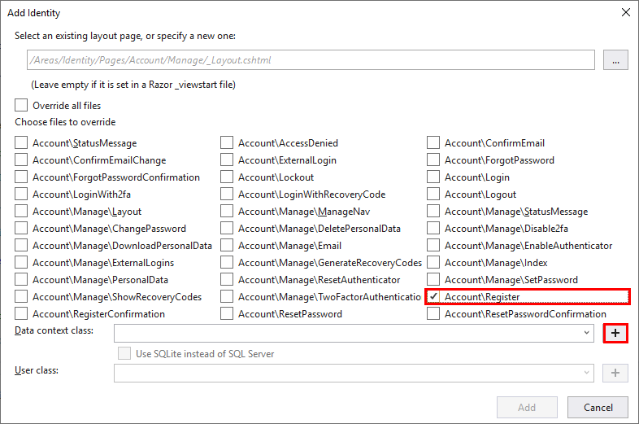

      4. In the **Add Data Context** dialog box, set the data context name to **FrontEnd.Data.IdentityDbContext**, and then click **Add**.

      5. In the **Add Identity** dialog box, if you're not running on Windows, select the **Use SQLite instead of SQL Server** check box.

      6. Click **Add**.

    - **If you're using the .NET Core CLI:**
  
      1. Move to the **FrontEnd** project folder.

      2. If you're using SQL Server to store user data, execute the following command:

            ```console
            dotnet aspnet-codegenerator identity --dbContext FrontEnd.Data.IdentityDbContext --files Account.Register
            ```

            If you're using SQLite, execute this command instead:

            ```console
            dotnet aspnet-codegenerator identity --dbContext FrontEnd.Data.IdentityDbContext --files Account.Register --useSqLite
            ```

12. Delete the file **ScaffoldingReadMe.txt** from the root folder of the **FrontEnd** project.

13. In the **Areas/Identity/Pages/Account** folder, open the **Register.cshtml.cs** file.

14. Add the directive `using FrontEnd.Services;` to the list at the start of the file.

15. In the **RegisterModel** class, modify the constructor and add an **IAdminService** parameter. Save the object passed in this parameter to a local field, as shown in the code below:

    ```csharp
    [AllowAnonymous]
    public class RegisterModel : PageModel
    {
        private readonly SignInManager<User> _signInManager;
        private readonly UserManager<User> _userManager;
        private readonly ILogger<RegisterModel> _logger;
        private readonly IEmailSender _emailSender;
        private readonly IAdminService _adminService;

        public RegisterModel(
            UserManager<User> userManager,
            SignInManager<User> signInManager,
            ILogger<RegisterModel> logger,
            IEmailSender emailSender,
            IAdminService adminService)
        {
            _userManager = userManager;
            _signInManager = signInManager;
            _logger = logger;
            _emailSender = emailSender;
            _adminService = adminService;
        }

        ...
    }
    ```

16. Find the **OnPostAsync** method. In this method, add the code shown below that marks the new user as an administrator if the **IAdminService.AllowAdminUserCreationAsync** method returns true, before calling the **_userManager.CreateAsync** method:

    ```csharp
    ...
    var user = new User  { UserName = Input.Email, Email = Input.Email };

    if (await _adminService.AllowAdminUserCreationAsync())
    {
        // Set as admin user
        user.IsAdmin = true;
    }

    var result = await _userManager.CreateAsync(user, Input.Password);
    ...
    ```

17. After the call to the **_userManager.CreateAsync** method, update the code that logs a message when users are created, to indicate when an administrative user has been registered, as shown below:

    ``` c#
    ...
    var result = await _userManager.CreateAsync(user, Input.Password);
    if (result.Succeeded)
    {
        if (user.IsAdmin)
        {
            _logger.LogInformation("Admin user created a new account with password.");
        }
        else
        {
            _logger.LogInformation("User created a new account with password.");
        }
    ...
    }
    ```

18. Rebuild the **FrontEnd** project, and correct any compilation errors.

## Cache the administrative status of a user after login

In later tasks in this session, you're going to add features that only an administrator can use. Rather than looking up the user in the database each time the app needs to check if a user is an administrator, you can retrieve this information once when the user logs in. You then store it as an additional claim on the user identity. You'll add an authorization policy to the application that corresponds to this claim. The application uses this policy to protect resources and features that only an administrator should be able to access.

1. Create a new class file named **ClaimsPrincipalFactory.cs** in the **/Areas/Identity** folder of the **FrontEnd** project.

2. Add the following `using` directives to the list at the start of the file:

    ```csharp
    using System.Threading.Tasks;
    using FrontEnd.Data;
    using FrontEnd.Services;
    using Microsoft.AspNetCore.Identity;
    using Microsoft.Extensions.Options;
    using System.Security.Claims;
    ```

3. Add the code shown below to the **ClaimsPrincipalFactory** class. This code adds an *admin* claim to users who are administrators. Note that you haven't defined the **MakeAdmin** method yet; you'll do this in the next step:

    ```csharp
    public class ClaimsPrincipalFactory : UserClaimsPrincipalFactory<User>
    {
        private readonly IApiClient _apiClient;

        public ClaimsPrincipalFactory(IApiClient apiClient, UserManager<User> userManager, IOptions<IdentityOptions> optionsAccessor)
            : base(userManager, optionsAccessor)
        {
            _apiClient = apiClient;
        }

        protected override async Task<ClaimsIdentity> GenerateClaimsAsync(User user)
        {
            var identity = await base.GenerateClaimsAsync(user);

            if (user.IsAdmin)
            {
                identity.MakeAdmin();
            }

            return identity;
        }
    }
    ```

4. Add a new folder named **Infrastructure** to the root folder of the **FrontEnd** project.

5. Create a code file named **AuthHelpers.cs** in the **Infrastructure** folder of the **FrontEnd** project.

    > **Note:** If you're using Visual Studio 2019, in the **Add New Item - FrontEnd** dialog box, select the **Code File** template.

6. Add the following `using` statements to the start of the file:

    ```csharp
    using FrontEnd.Infrastructure;
    using Microsoft.AspNetCore.Authorization;
    using System.Linq;
    ```

7. Add the **AuthConstants**, **AuthnHelpers**, and **AuthzHelpers** classes shown below to the **AuthHelpers.cs** file. The application will use the helper methods in the **AuthnHelpers** class for reading and setting the *admin* claim of a user:

    ```csharp
    namespace FrontEnd.Infrastructure
    {
        public static class AuthConstants
        {
            public static readonly string IsAdmin = nameof(IsAdmin);
            public static readonly string IsAttendee = nameof(IsAttendee);
            public static readonly string TrueValue = "true";
        }
    }

    namespace System.Security.Claims
    {
        public static class AuthnHelpers
        {
            public static bool IsAdmin(this ClaimsPrincipal principal) =>
                principal.HasClaim(AuthConstants.IsAdmin, AuthConstants.TrueValue);

            public static void MakeAdmin(this ClaimsPrincipal principal) =>
                principal.Identities.First().MakeAdmin();

            public static void MakeAdmin(this ClaimsIdentity identity) =>
                identity.AddClaim(new Claim(AuthConstants.IsAdmin, AuthConstants.TrueValue));
        }
    }

    namespace Microsoft.Extensions.DependencyInjection
    {
        public static class AuthzHelpers
        {
            public static AuthorizationPolicyBuilder RequireIsAdminClaim(this AuthorizationPolicyBuilder builder) =>
                builder.RequireClaim(AuthConstants.IsAdmin, AuthConstants.TrueValue);
        }
    }
    ```

8. Open the **IdentityHostingStartup.cs** file in the **/Areas/Identity** folder of the **FrontEnd** project.

9. In the **Configure** method of the **IdentityHostingStartup** class, register the custom **UserClaimsPrincipalFactory\<User\>** class in the call to the **AddDefaultIdentity** method, as shown below. Note that you should use the `UseSqlite` option rather than `UseSqlServer` if you are storing identity data in SQLite:

    ```csharp
    builder.ConfigureServices((context, services) => {
        services.AddDbContext<IdentityDbContext>(options =>
            // If you are using SQL Server:
            options.UseSqlServer(
                context.Configuration.GetConnectionString("IdentityDbContextConnection")));
            // Change as below if you are using SQLite:
            // options.UseSqlite(
            //    context.Configuration.GetConnectionString("IdentityDbContextConnection")));

        services.AddDefaultIdentity<User>(options => options.SignIn.RequireConfirmedAccount = true)
            .AddEntityFrameworkStores<IdentityDbContext>()
            .AddClaimsPrincipalFactory<ClaimsPrincipalFactory>(); /* Add this statement */

    });
    ```

10. Open the **Startup.cs** file in the root folder of the **FrontEnd** project.

11. In the **ConfigureServices** method, add authorization services with an admin policy, as shown below:

    ```csharp
    public void ConfigureServices(IServiceCollection services)
    {
        ...
        services.AddAuthorization(options =>
        {
            options.AddPolicy("Admin", policy =>
            {
                policy.RequireAuthenticatedUser()
                      .RequireIsAdminClaim();
            });
        });
    }
    ```

12. Open the **Index.cshtml.cs** file in the **Pages** folder of the **FrontEnd** project.

13. Add the directive `using System.Security.Claims;` to the list at the start of the file.

14. Add a public Boolean property named **IsAdmin**. At the start of the **OnGetAsync** method, add the statement shown below. This statement determines whether the current user is an administrator:

    ```csharp
    public bool IsAdmin { get; set; }

    public async Task OnGetAsync(int day = 0)
    {
        IsAdmin = User.IsAdmin();
        ...
    }
    ```

15. Open the **Index.cshtml** Razor page. Add the code highlighted below, directly after the end of the speaker `foreach` loop. This code adds a link to each card, to allow administrators to edit sessions information:

    ```html
    @foreach (var session in timeSlot)
    {
        <div class="col-md-3 mb-4">
            <div class="card shadow session h-100">
                <div class="card-header">@session.Track?.Name</div>
                <div class="card-body">
                    <h5 class="card-title"><a asp-page="Session" asp-route-id="@session.Id">@session.Title</a></h5>
                </div>
                <div class="card-footer">
                    <ul class="list-inline mb-0">
                        @foreach (var speaker in session.Speakers)
                        {
                            <li class="list-inline-item">
                                <a asp-page="Speaker" asp-route-id="@speaker.Id">@speaker.Name</a>
                            </li>
                        }
                        <!-- NEW CODE HERE -->
                        @if (Model.IsAdmin)
                        {
                            <li>
                                <a asp-page="/Admin/EditSession" asp-route-id="@session.Id" class="btn btn-default btn-xs">Edit</a>
                            </li>
                        }
                        <!-- END OF NEW CODE -->
                    </ul>
                </div>
            </div>
        </div>
    }
    ```

## Create a form for editing a session

In this task, you'll create a form that enables an administrator to view, modify, and save changes made to the details of a session.

1. In the **FrontEnd** project, add a folder named **Admin** to the **Pages** folder.

2. In the **Admin** folder, create a new Razor page named **EditSession.cshtml**:

    - **If you're using Visual Studio 2019:**

        1. In Solution Explorer, right-click the **Admin** folder, point to **Add**, and then click **Razor Page**.

        2. In the **Add New Scaffolded Item** dialog box, select the **Razor Page** template, and then click **Add**.

        3. In the **Add Razor Page** dialog box, specify a **Razor Page name** of **EditSession**. Leave the other options at their default values, and then click **Add**.

    - **If you're using the .NET Core CLI:**

        1. Move to the root folder of the **FrontEnd** project.

        2. Run the following command:

            ```console
            dotnet new page --name EditSession --output Pages/Admin --namespace FrontEnd
            ```

3. Open the **EditSession.cshtml.cs** file in the **Pages/Admin** folder.

4. Add the following `using` directives to the list at the start of the file:

    ```csharp
    using FrontEnd.Services;
    using ConferenceDTO;
    ```

5. Add the code shown below to the **EditSessionModel** class. The **OnGetAsync** method retrieves the details of the session specified by the **id** parameter:

   ```csharp
   public class EditSessionModel : PageModel
   {
      private readonly IApiClient _apiClient;

      public EditSessionModel(IApiClient apiClient)
      {
         _apiClient = apiClient;
      }

      public Session Session { get; set; }

      public async Task OnGetAsync(int id)
      {
         var session = await _apiClient.GetSessionAsync(id);
         Session = new Session
         {
             Id = session.Id,
             TrackId = session.TrackId,
             Title = session.Title,
             Abstract = session.Abstract,
             StartTime = session.StartTime,
             EndTime = session.EndTime
         };
      }
   }
   ```

6. Edit the **EditSession.cshtml** file, and add the **{id}** parameter to the `*@page` directive, as shown below. This form presents the data for a session and enables the user to modify it. The form contains two buttons for saving the changes, and deleting the session:

    ```html
    @page "{id}"
    @model EditSessionModel
    ...
    ```

7. Remove any existing HTML markup on the page, and replace it with the following edit form:

   ```html
   <h3>Edit Session</h3>

   <form method="post" class="form-horizontal">
       <div asp-validation-summary="All" class="text-danger"></div>
       <input asp-for="Session.Id" type="hidden" />
       <input asp-for="Session.TrackId" type="hidden" />
       <div class="form-group">
           <label asp-for="Session.Title" class="col-md-2 control-label"></label>
           <div class="col-md-10">
               <input asp-for="Session.Title" class="form-control" />
               <span asp-validation-for="Session.Title" class="text-danger"></span>
           </div>
       </div>
       <div class="form-group">
           <label asp-for="Session.Abstract" class="col-md-2 control-label"></label>
           <div class="col-md-10">
               <textarea asp-for="Session.Abstract" class="form-control"></textarea>
               <span asp-validation-for="Session.Abstract" class="text-danger"></span>
           </div>
       </div>
       <div class="form-group">
           <label asp-for="Session.StartTime" class="col-md-2 control-label"></label>
           <div class="col-md-10">
               <input asp-for="Session.StartTime" class="form-control" />
               <span asp-validation-for="Session.StartTime" class="text-danger"></span>
           </div>
       </div>
       <div class="form-group">
           <label asp-for="Session.EndTime" class="col-md-2 control-label"></label>
           <div class="col-md-10">
               <input asp-for="Session.EndTime" class="form-control" />
               <span asp-validation-for="Session.EndTime" class="text-danger"></span>
           </div>
       </div>
       <div class="form-group">
           <div class="col-md-offset-2 col-md-10">
               <button type="submit" class="btn btn-primary">Save</button>
               <button type="submit" asp-page-handler="Delete" class="btn btn-danger">Delete</button>
           </div>
       </div>
   </form>

   @section Scripts {
        <partial name="_ValidationScriptsPartial" />
   }
   ```

8. Return to the **EditSession.cshtml.cs** file, and add the **OnPostAsync** and **OnPostDeleteAsync** methods shown below to the **EditSession** class, after the **OnGetAsync** method. These methods handle the **Save** and **Delete** button actions:

    ```csharp
    public class EditSessionModel : PageModel
    {
        ...
        public async Task OnGetAsync(int id)
        {
            ...
        }

        public async Task<IActionResult> OnPostAsync()
        {
            if (!ModelState.IsValid)
            {
                return Page();
            }

            await _apiClient.PutSessionAsync(Session);

            return Page();
        }

        public async Task<IActionResult> OnPostDeleteAsync(int id)
        {
            var session = await _apiClient.GetSessionAsync(id);

            if (session != null)
            {
                await _apiClient.DeleteSessionAsync(id);
            }

            return Page();
        }
    }
    ```

9. Add the `[BindProperty]` attribute to the **Session** property of the **EditSessionModel** class. This property ensures that the properties of the **Session** object are bound correctly when the form is posted:

    ```csharp
    public class EditSessionModel : PageModel
    {
        ...
        [BindProperty]
        public Session Session { get; set; }
        ...
    }
    ```

10. Open the **Startup.cs** file in the root folder of the **FrontEnd** project.

11. In the **Configuration** method, modify the call to the **AddRazorPages** function, as shown below. The code protects the pages in the **Admin** folder with an *Admin* policy:

    ```csharp
    public void ConfigureServices(IServiceCollection services)
    {
        ...
        services.AddRazorPages();services.AddRazorPages(options =>
        {
            options.Conventions.AuthorizeFolder("/Admin", "Admin");
        });
        ...
    }
    ```

## Redirect requests back to the home page after a successful update

In this task, you'll use the [Post/Redirect/Get (PRG) pattern](https://en.wikipedia.org/wiki/Post/Redirect/Get) to redirect the user back to the edit page, or the home page, after successfully editing, or deleting, a session respectively.

1. Return to the **EditSession.cshtml.cs** file in the **Pages/Admin** folder.

2. Add the **Message** and **ShowMessage** properties illustrated below to the start of the **EditSessionModel** class:

    ```csharp
    public class EditSessionModel : PageModel
    {
        [TempData]
        public string Message { get; set; }

        public bool ShowMessage => !string.IsNullOrEmpty(Message);
        ...
    }
    ```

3. In the **OnPostAsync** and **OnPostDeleteAsync** methods, store a success message in the **Message** property. Change the `Page()` method call to `RedirectToPage()` at the end of the method, as shown below:

    ```csharp
    public async Task<IActionResult> OnPostAsync()
    {
        if (!ModelState.IsValid)
        {
            return Page();
        }

        Message = "Session updated successfully!";

        await _apiClient.PutSessionAsync(Session);

        return RedirectToPage();
    }

    public async Task<IActionResult> OnPostDeleteAsync(int id)
    {
        var session = await _apiClient.GetSessionAsync(id);

        if (session != null)
        {
            await _apiClient.DeleteSessionAsync(id);
        }

        Message = "Session deleted successfully!";

        return RedirectToPage("/Index");
    }
    ```

4. In the **EditSession.cshtml** file, add the following code directly below the `<h3>` tag near the start of the page.  This markup displays the message, after posting:

    ```html
    @if (Model.ShowMessage)
    {
        <div class="alert alert-success alert-dismissible" role="alert">
            <button type="button" class="close" data-dismiss="alert" aria-label="Close"><span aria-hidden="true">&times;</span></button>
            @Model.Message
        </div>
    }
    ```

5. Copy the **Message** and **ShowMessages** properties from the **EditSessionModel** class in the **EditSession.cshtml.cs** file to the **IndexModel** class in the **Index.cshtml.cs** file, in the **Pages** folder. Note that properties marked as **TempData** persist across pages, so setting the **Message** property in the **EditSession** page makes the same message available in the **Index** page:

    ``` csharp
    [TempData]
    public string Message { get; set; }

    public bool ShowMessage => !string.IsNullOrEmpty(Message);
    ```

6. Copy the message display markup from the **EditSession.cshtml** file to the top of the **Index.cshtml** file in the **Pages** folder, just below the `<h1>` tag:

    ```html
    @if (Model.ShowMessage)
    {
        <div class="alert alert-success alert-dismissible" role="alert">
            <button type="button" class="close" data-dismiss="alert" aria-label="Close"><span aria-hidden="true">&times;</span>   </button>
            @Model.Message
        </div>
    }
    ```

7. Rebuild and run the solution.

8. On the **Home** page, click **Register**.

9. On the **Register** page, create a new account for yourself, and then click **Register**.

    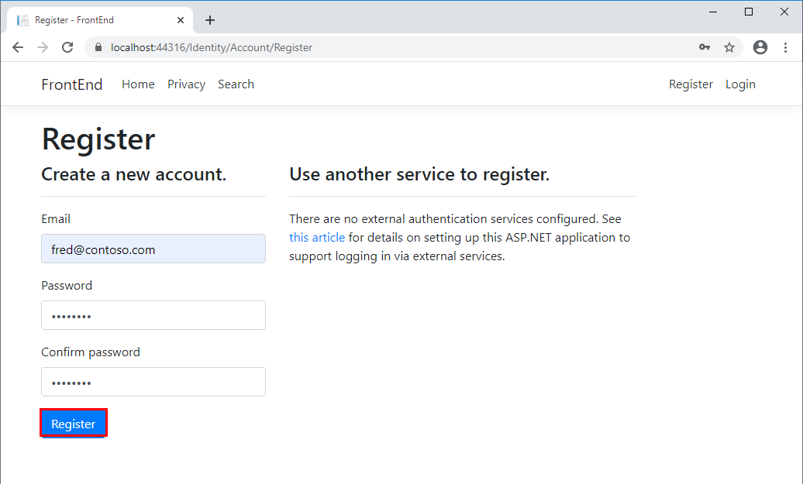

10. On the **Register confirmation** page, click **Click here to confirm your account**.

    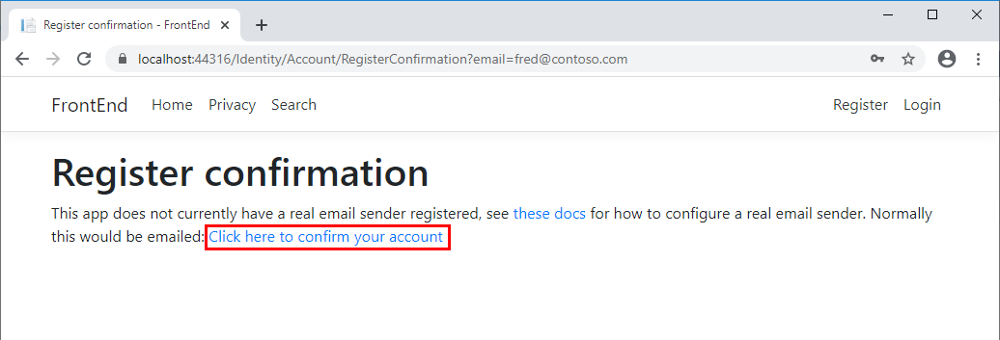

11. The **Confirm email** page will appear. This page is currently blank, apart from the title. In production system, you would customize this page to send an email to the new user and await their response, to confirm that the email address is valid. In this case, just click the **Home** link.

    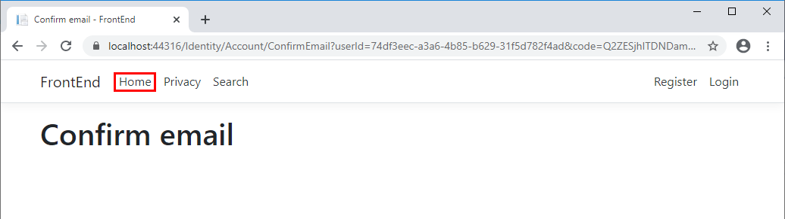

12. On the **Home** page, click **Login** and sign in using your new account credentials. Your name will appear in the navigation bar. You're the first user, so you are an administrator, and can edit session information, so the session cards will contain an **Edit** link.

    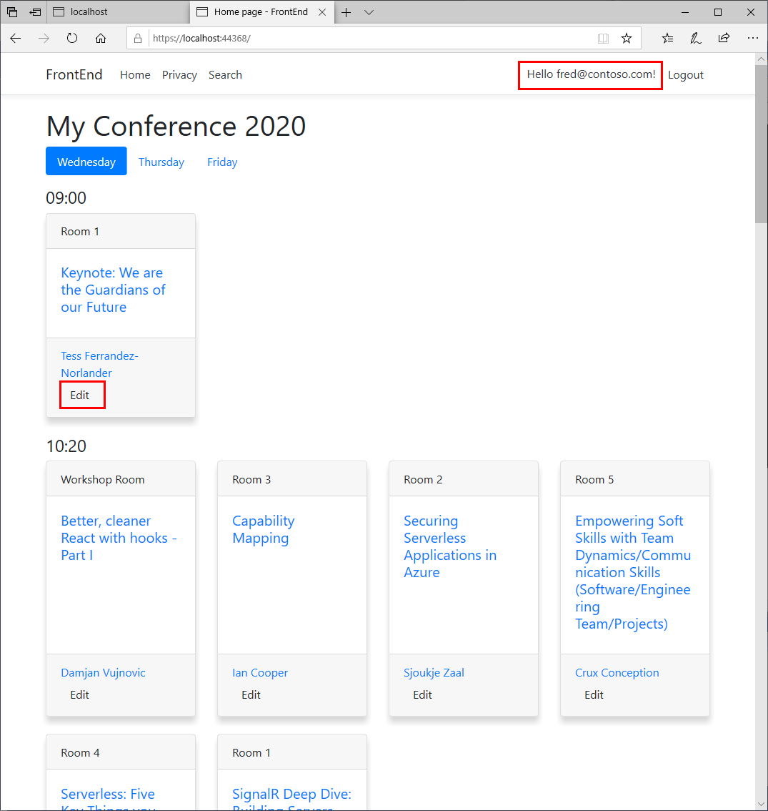

13. Click **Edit** on any card. The **Edit Session** page should appear.

    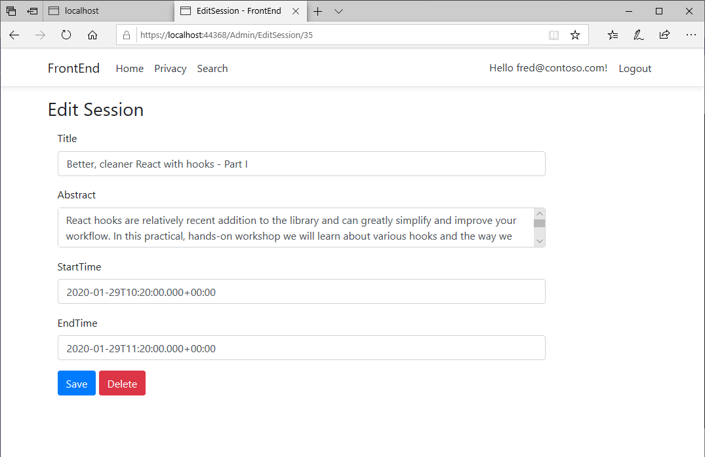

14. Make a change to the title of the session, and then click **Save**. The message **Session updated successfully** should be displayed.

15. Click **Delete** to remove the session. You'll be returned to the home page, where the message **Session deleted successfully** should be displayed. The session will have disappeared from the home page.

16. Close the web browser and stop the application.

## Create a tag helper for setting authorization requirements in UI elements

The **FrontEnd** application currently uses `if` blocks to determine whether to show parts of the UI based the user's rights. In this task, you'll create a custom [Tag Helper](https://docs.microsoft.com/en-us/aspnet/core/mvc/views/tag-helpers/intro) that can help to simplify this logic.

1. Create a new folder called **TagHelpers** in the root of the **FrontEnd** project.

2. Create a new tag helper class:

    - **If you're using Visual Studio 2019:**

        1. In Solution Explorer, right-click the **TagHelpers** folder, point to **Add**, and then click **New Item**.

        2. In the **Add New Item - FrontEnd** dialog box, in the tree view pane, click **Web**. In the middle pane, click **Tag Helper Class**. In the **Name** box, enter **AuthzTagHelper.cs**, and then click **Add**.

            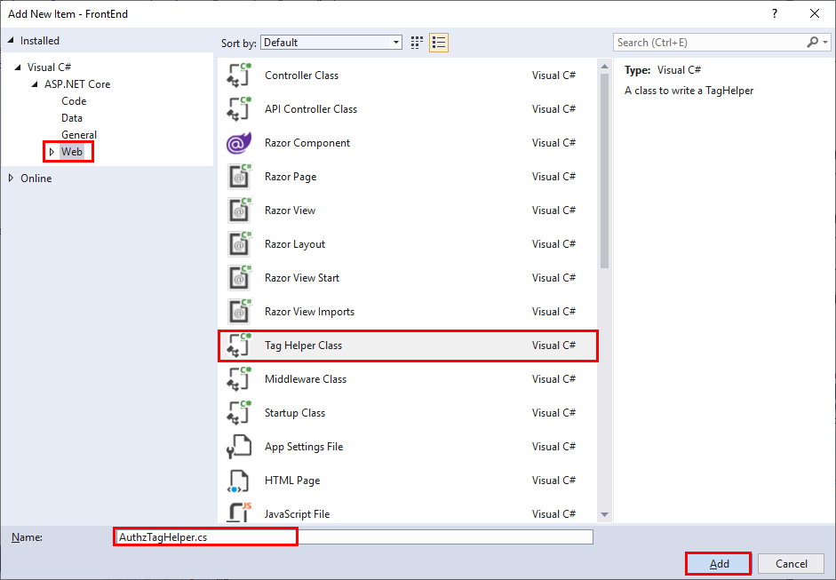

    - **If you're using the .NET Core CLI:**

        1. Move to the **TagHelpers** folder, and create a new file named **AuthzTagHelper.cs** using an editor of your choice.

        2. Add the following code to the **AuthzTagHelper.cs** file:

            ```csharp
            using System;
            using System.Collections.Generic;
            using System.Linq;
            using System.Threading.Tasks;
            using Microsoft.AspNetCore.Razor.Runtime.TagHelpers;
            using Microsoft.AspNetCore.Razor.TagHelpers;

            namespace FrontEnd.TagHelpers
            {
                [HtmlTargetElement("tag-name")]
                public class AuthzTagHelper : TagHelper
                {
                    public override void Process(TagHelperContext context, TagHelperOutput output)
                    {

                    }
                }
            }
            ```

3. Add the following `using` directives to the list at the start of the file:

    ```csharp
    using Microsoft.AspNetCore.Authorization;
    using Microsoft.AspNetCore.Mvc.ViewFeatures;
    using Microsoft.AspNetCore.Mvc.Rendering;
    ```

4. Modify the **HtmlTargetElement** attribute to bind to all elements with an **authz** attribute, as follows:

    ```csharp
    [HtmlTargetElement("*", Attributes = "authz")]
    ```

5. Add an additional **HtmlTargetElement** attribute to bind to all elements with an **authz-policy** attribute:

    ```csharp
    [HtmlTargetElement("*", Attributes = "authz-policy")]
    ```

6. In the **AuthzTagHelper** class, add a property and constructor to inject the **AuthorizationService**, as shown below:

    ```csharp
    public class AuthzTagHelper : TagHelper
    {
        private readonly IAuthorizationService _authzService;

        public AuthzTagHelper(IAuthorizationService authzService)
        {
            _authzService = authzService;
        }

        public override void Process(TagHelperContext context, TagHelperOutput output)
        {

        }
    }
    ```

7. After the constructor, add the following properties to the **AuthzTagHelper** class. These properties represent the **auth** and **authz** attributes to which the tag helper will bind:

    ```csharp
    public class AuthzTagHelper : TagHelper
    {
        ...
        [HtmlAttributeName("authz")]
        public bool RequiresAuthentication { get; set; }

        [HtmlAttributeName("authz-policy")]
        public string RequiredPolicy { get; set; }
        ...
    }
    ```

8. Add the following **ViewContext** property to the **AuthzTagHelper** class, after the HTML attributes you added in the previous step:

    ```csharp
    public class AuthzTagHelper : TagHelper
    {
        ...
        [ViewContext]
        public ViewContext ViewContext { get; set; }
        ...
    }
    ```

9. Delete the **Process** method and replace it with the **ProcessAsync** method shown below:

    ```csharp
    public override async Task ProcessAsync(TagHelperContext context, TagHelperOutput output)
    {
        var requiresAuth = RequiresAuthentication || !string.IsNullOrEmpty(RequiredPolicy);
        var showOutput = false;

        if (context.AllAttributes["authz"] != null && !requiresAuth && !ViewContext.HttpContext.User.Identity.IsAuthenticated)
        {
            // authz="false" & user isn't authenticated
            showOutput = true;
        }
        else if (!string.IsNullOrEmpty(RequiredPolicy))
        {
            // authz-policy="foo" & user is authorized for policy "foo"
            var authorized = false;
            var cachedResult = ViewContext.ViewData["AuthPolicy." + RequiredPolicy];
            if (cachedResult != null)
            {
                authorized = (bool)cachedResult;
            }
            else
            {
                var authResult = await _authzService.AuthorizeAsync(ViewContext.HttpContext.User, RequiredPolicy);
                authorized = authResult.Succeeded;
                ViewContext.ViewData["AuthPolicy." + RequiredPolicy] = authorized;
            }

            showOutput = authorized;
        }
        else if (requiresAuth && ViewContext.HttpContext.User.Identity.IsAuthenticated)
        {
            // authz="true" & user is authenticated
            showOutput = true;
        }

        if (!showOutput)
        {
            output.SuppressOutput();
        }
    }
    ```

10. Open the  **_ViewImports.cshtml** file in the **Pages** folder, and register the new tag helper:

    ```html
    @using FrontEnd
    @namespace FrontEnd.Pages
    @addTagHelper *, Microsoft.AspNetCore.Mvc.TagHelpers
    @addTagHelper *, FrontEnd
    ```

11. You can now update the **Index.cshtml** page to replace the `if` block that controls the **Edit** button's display with declarative code, using the new tag helper.

    Open the **Index.cshtml** file in the **Pages** folder, remove the `if` block, and add an `<a>` tag  that displays the edit button, only if the user is authenticated and is an administrator. Apply the **authz-policy** policy to the `<a>` tag, as shown below:

    ```html
    ...
    <div class="card-footer">
        <ul class="list-inline mb-0">
            @foreach (var speaker in session.Speakers)
            {
                ...
            }
        </ul>
        <a authz-policy="Admin" asp-page="/Admin/EditSession" asp-route-id="@session.Id" class="btn btn-default btn-xs">Edit</a>
    </div>
    ...
    ```

12. Rebuild and run the solution.

13. On the home page, click **Login**, and sign in using the administrator account you registered in the previous task. The **Edit** links should appear, and the application should function exactly as before.

14. Click **Logout**.

15. Click **Register**, and register another user, who won't be an administrator.

16. Click **Login**, and sign in with the new account. This time, the **Edit** links won't appear.

17. Close the web browser and stop the application.

> **Note:** You can find the completed code for the exercises in this session in the [Session 4 save point folder](../save-points/4-Authentication-and-Tag-Helpers/).

**Next**: [Session #5 - Add Registration and Agendas](5.%20Add%20personal%20agenda.md) | **Previous**: [Session #3 - Create the FrontEnd Web Application](3.%20Add%20front-end%2C%20render%20agenda%2C%20set%20up%20front-end%20models.md).
