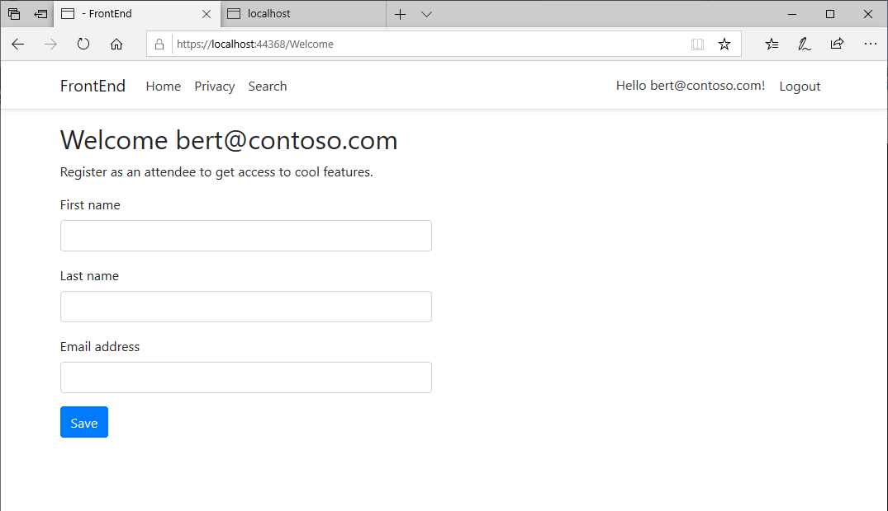
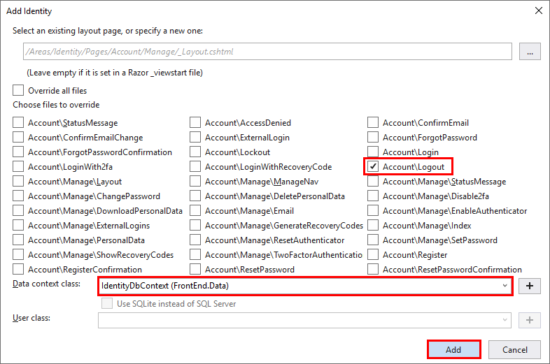
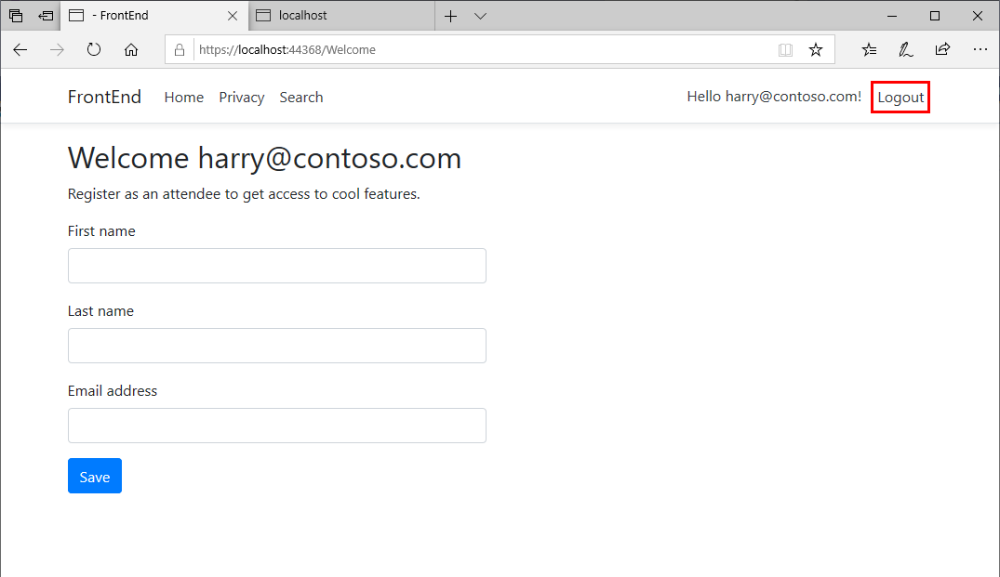
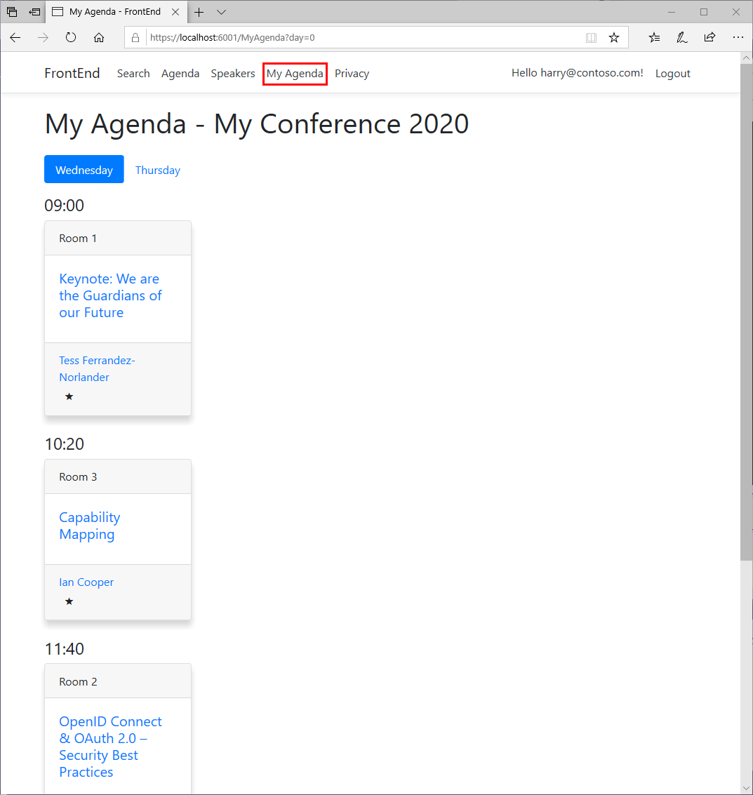

# Add user registration and personal agendas

In this session, you'll enable users to register for a conference, and create their own personal session agendas. Users will list the sessions they would like to attend.

> **Note:** You can either continue with your own project, or use the code in the [Session 4 save point folder](../save-points/4-Authentication-and-Tag-Helpers).

## Add BackEnd attendee and FrontEnd user association

In this task, you'll update the BackEnd and FrontEnd projects to associate a logged-in user with an **Attendee** entity in the conference database.

1. In the **FrontEnd** project, open the **AuthHelpers.cs** file in the **Infrastucture** folder.

2. Add the **IsAttendee**, and overloaded **MakeAttendee** methods to the **AuthnHelpers** class, as shown in the following code:

    ```csharp
    namespace System.Security.Claims
    {
        public static class AuthnHelpers
        {
            public static bool IsAdmin(this ClaimsPrincipal principal) =>
                principal.HasClaim(AuthConstants.IsAdmin, AuthConstants.TrueValue);

            public static void MakeAdmin(this ClaimsPrincipal principal) =>
                principal.Identities.First().MakeAdmin();

            public static void MakeAdmin(this ClaimsIdentity identity) =>
                identity.AddClaim(new Claim(AuthConstants.IsAdmin, AuthConstants.TrueValue));

            // New methods below
            public static bool IsAttendee(this ClaimsPrincipal principal) =>
                principal.HasClaim(AuthConstants.IsAttendee, AuthConstants.TrueValue);

            public static void MakeAttendee(this ClaimsPrincipal principal) =>
                principal.Identities.First().MakeAttendee();

            public static void MakeAttendee(this ClaimsIdentity identity) =>
                identity.AddClaim(new Claim(AuthConstants.IsAttendee, AuthConstants.TrueValue));
        }
    }
    ```

3. Open the **ClaimsPrincipalFactory.cs** file in the **Areas/Identity** folder of the **FrontEnd** project.

4. Modify the **GenerateClaimsAsync** method in the **ClaimsPrincipalFactory** class, as shown in the following code. The new code adds the **IsAttendee** claim if the user is registered as a conference attendee:

    ```csharp
    public class ClaimsPrincipalFactory : UserClaimsPrincipalFactory<User>
    {
        ...

        protected override async Task<ClaimsIdentity> GenerateClaimsAsync(User user)
        {
            var identity = await base.GenerateClaimsAsync(user);

            if (user.IsAdmin)
            {
                identity.MakeAdmin();
            }

            // New code below
            var attendee = await _apiClient.GetAttendeeAsync(user.UserName);
            if (attendee != null)
            {
                identity.MakeAttendee();
            }

            return identity;
        }
    }
    ```

5. Create a folder named **Models** under the **Pages** folder of the **FrontEnd** project. Make sure you select the **Pages** folder in the root of the **FrontEnd** project, and not the **Areas/Identity/Pages** folder.

6. Create a class named **Attendee.cs** in the **Models** folder.

7. Add the **Attendee** class shown in the code below to the **Attendee.cs** file:

    ```csharp
    using System.ComponentModel;
    using System.ComponentModel.DataAnnotations;

    namespace FrontEnd.Pages.Models
    {
        public class Attendee : ConferenceDTO.Attendee
        {
            [DisplayName("First name")]
            public override string FirstName { get => base.FirstName; set => base.FirstName = value; }

            [DisplayName("Last name")]
            public override string LastName { get => base.LastName; set => base.LastName = value; }

            [DisplayName("Email address")]
            [DataType(DataType.EmailAddress)]
            public override string EmailAddress { get => base.EmailAddress; set => base.EmailAddress = value; }
        }
    }
    ```

8. Add a new Razor page named **Welcome.cshtml** to the **Pages** folder of the **FrontEnd** project:

    - **If you're using Visual Studio 2019:**

        1. In Solution Explorer, right-click the **Pages** folder, point to **Add**, and then click **Razor Page**.

        2. In the **Add New Scaffolded Item** dialog box, select the **Razor Page** template, and then click **Add**.

        3. In the **Add Razor Page** dialog box, specify a **Razor Page name** of **Welcome**. Leave the other options at their default values, and then click **Add**.

    - **If you're using the .NET Core CLI:**

        1. Move to the root folder of the **FrontEnd** project.

        2. Run the following command:

            ```console
            dotnet new page --name Welcome --output Pages --namespace FrontEnd
            ```

9. Open the **Welcome.cshtml.cs** file, and add the logic shown below to the **WelcomeModel** class. This code associates the logged-in user with an attendee:

    ```csharp
    using System.Threading.Tasks;
    using FrontEnd.Services;
    using FrontEnd.Pages.Models;
    using Microsoft.AspNetCore.Mvc;
    using Microsoft.AspNetCore.Mvc.RazorPages;
    using System.Security.Claims;
    using Microsoft.AspNetCore.Authentication;
    using Microsoft.AspNetCore.Identity;

    namespace FrontEnd.Pages
    {
        public class WelcomeModel : PageModel
        {
            private readonly IApiClient _apiClient;

            public WelcomeModel(IApiClient apiClient)
            {
                _apiClient = apiClient;
            }

            [BindProperty]
            public Attendee Attendee { get; set; }

            public IActionResult OnGet()
            {
                // Redirect to home page if user is anonymous or already registered as attendee
                var isAttendee = User.IsAttendee();

                if (!User.Identity.IsAuthenticated || isAttendee)
                {
                    return RedirectToPage("/Index");
                }

                return Page();
            }

            public async Task<IActionResult> OnPostAsync()
            {
                var success = await _apiClient.AddAttendeeAsync(Attendee);

                if (!success)
                {
                    ModelState.AddModelError("", "There was an issue creating the attendee for this user.");
                    return Page();
                }

                // Re-issue the auth cookie with the new IsAttendee claim
                User.MakeAttendee();
                await HttpContext.SignInAsync(IdentityConstants.ApplicationScheme, User);

                return RedirectToPage("/Index");
            }
        }
    }
    ```

10. Open the **Welcome.cshtml** file, and add the form shown in the markup below to this file. This form enables the user to sign up as an attendee, after they've logged in:

    ```html
    @page
    @using ConferenceDTO
    @model WelcomeModel

    <h2>Welcome @User.Identity.Name</h2>
    <p>
        Register as an attendee to access cool features.
    </p>

    <form method="post">
        <div asp-validation-summary="All" class="text-danger"></div>
        <input asp-for="Attendee.UserName" value="@User.Identity.Name" type="hidden" />
        <div class="form-group">
            <label asp-for="Attendee.FirstName" class="control-label"></label>
            <div class="row">
                <div class="col-md-6">
                    <input asp-for="Attendee.FirstName" class="form-control" />
                </div>
            </div>
            <span asp-validation-for="Attendee.FirstName" class="text-danger"></span>
        </div>
        <div class="form-group">
            <label asp-for="Attendee.LastName" class="control-label"></label>
            <div class="row">
                <div class="col-md-6">
                    <input asp-for="Attendee.LastName" class="form-control" />
                </div>
            </div>
            <span asp-validation-for="Attendee.LastName" class="text-danger"></span>
        </div>
        <div class="form-group">
            <label asp-for="Attendee.EmailAddress" class="control-label"></label>
            <div class="row">
                <div class="col-md-6">
                    <input asp-for="Attendee.EmailAddress" class="form-control" />
                </div>
            </div>
            <span asp-validation-for="Attendee.EmailAddress" class="text-danger"></span>
        </div>
        <div class="form-group">
            <div class="">
                <button type="submit" class="btn btn-primary">Save</button>
            </div>
        </div>
    </form>
    @section Scripts {
        <partial name="_ValidationScriptsPartial" />
    }
    ```

    Logged-in users can now be associated with an attendee by visiting this page.

## Force logged-in users to sign up on the Welcome page

In this task, you'll create and configure a middleware component that forces a user to sign up as an attendee, using the Welcome page, when they first sign in.

1. In the **FrontEnd** project, add a folder named **Middleware** to the root folder of the project.

2. Create a new class file named **SkipWelcomeAttribute.cs** in the **Middleware** folder.

3. Modify the **SkipWelcomeAttribute** class as shown below. This class implements an attribute you can apply to certain pages or action methods. You'll configure the application to force page or action requests to redirect to the Welcome page, unless they're tagged with this attribute:

    ```csharp
    using System;

    namespace FrontEnd
    {
        [AttributeUsage(AttributeTargets.Class | AttributeTargets.Method)]
        public class SkipWelcomeAttribute : Attribute
        {

        }
    }
    ```

4. Add another class file named **RequireLoginMiddleware.cs** to the **Middleware** folder.

5. Add the following `using` directives to the class file:

    ```csharp
    using Microsoft.AspNetCore.Http;
    using Microsoft.AspNetCore.Routing;
    using System.Security.Claims;
    using FrontEnd;
    ```

6. **If you're using the .NET Core CLI**, add the directive `using System.Threading.Tasks;` to the list at the start of the file.

    > **Note:** If you're using Visual Studio, the **RequireLoginMiddleware.cs** file will already contain this directive.

7. Add the **RequireLoginMiddleware** class shown below to this file. The code in this file redirects requests to the Welcome page if the user is authenticated but not associated with an attendee (the user doesn't have the **IsAttendee** claim):

    ```csharp
    namespace FrontEnd.Middleware
    {
        public class RequireLoginMiddleware
        {
            private readonly RequestDelegate _next;
            private readonly LinkGenerator _linkGenerator;

            public RequireLoginMiddleware(RequestDelegate next, LinkGenerator linkGenerator)
            {
                _next = next;
                _linkGenerator = linkGenerator;
            }

            public Task Invoke(HttpContext context)
            {
                var endpoint = context.GetEndpoint();

                // If the user is authenticated but not a known attendee *and* we've not marked this page
                // to skip attendee welcome, then redirect to the Welcome page
                if (context.User.Identity.IsAuthenticated &&
                    endpoint?.Metadata.GetMetadata<SkipWelcomeAttribute>() == null)
                {
                    var isAttendee = context.User.IsAttendee();

                    if (!isAttendee)
                    {
                        var url = _linkGenerator.GetUriByPage(context, page: "/Welcome");
                        // No attendee registerd for this user
                        context.Response.Redirect(url);

                        return Task.CompletedTask;
                    }
                }

                return _next(context);
            }
        }
    }
    ```

8. Open the **Startup.cs** file in the root folder of the **FrontEnd** project.

9. Add the directive `using FrontEnd.Middleware;` to the list at the start of the file.

10. Add the `app.useMiddleware` statement shown in the code below to the **Configure** method, before the `appUseEndpoints` statement:

    ```csharp
    public void Configure(IApplicationBuilder app, IWebHostEnvironment env)
    {
        ...
        app.UseMiddleware<RequireLoginMiddleware>();

        app.UseEndpoints(endpoints =>
        {
            endpoints.MapRazorPages();
        });
    }

    ```

11. Return to the **WelcomeModel** class in the **Welcome.cshtml.cs** file, and apply the **SkipWelcome** attribute to the class, as shown below:

    ```csharp
    [SkipWelcome]
    public class WelcomeModel : PageModel
    {
        ...
    }
    ```

12. Start the solution:

    - **If you're using Visual Studio:**

        1. Press **F5** to build and run the solution. The **FrontEnd** and **BackEnd** projects will start. A web browser will open displaying two web pages: one for the **BackEnd** project and the other for the **FrontEnd**.

        2. Switch to the window displaying the webpage for the **FrontEnd** web app.

    - **If you're using the .NET Core CLI:**

        1. Open the **launchSettings.json** file in the **Properties** folder of the **FrontEnd** project.

        2. Make a note of the HTTPS URL in the **applicationUrl** property in the **FrontEnd** profile, and then close the **launchSettings.json** file.

        3. Move to the **ConferencePlanner** solution folder.

        4. Run the following command to run the **BackEnd** project in a new console window:

            ```console
            start dotnet run --project BackEnd
            ```

        5. When the **BackEnd** project has started, return to the original console window and run the following command to start the **FrontEnd** project:

            ```console
            dotnet run --project FrontEnd
            ```

        6. Open a web browser, and go to the HTTPS URL of the **FrontEnd** web application that you noted earlier.

13. If you've previously registered as a user, click **Login** and sign in with your credentials. If you haven't previously registered, click **Register** and follow the process. When you've registered, click **Login**, and sign in.

    When you've signed in, you'll be redirected to the **Welcome** page, where you can sign up as an attendee:

    

14. Provide your details, and then click **Save**. You'll be directed to the home page displaying the list of conference sessions.

15. Click **Logout** to sign out.

16. Click **Login** again, and sign in as the same user. This time, you have **attendee** as a claim in your user details. You'll bypass the **Welcome** page and go directly to the home page.

17. Stop the web application and web API service:

    - **If you're using Visual Studio 2019:**

        - Close the web browser. The **FrontEnd** and **BackEnd** projects will stop automatically.

    - **If you're using the .NET Core CLI:**

        1. Close the web browser.

        2. Switch to the console window for the **BackEnd** project and press **Ctrl+C** to stop the web API service.

        3. Return to the console window for the **FrontEnd** project, and press **Ctrl+C** to stop the web application.

## Scaffold and update the Logout page

One problem with the existing system is that, if a new user creates an account but doesn't register as an attendee, they can't log out. The general solution to this is to add the `[SkipWelcome]` attribute to the **Logout** view. To do that, you'll need to scaffold the page. Identity pages are served from the Identity UI NuGet package by default, but you can override them. This is the approach you'll take in this task:
  
1. Scaffold the **Logout** page:

    - **If you're using Visual Studio 2019:**

        1. In Solution Explorer, right-click the **FrontEnd** project, point to **Add**, and then click **New Scaffolded Item**.

        2. In the **Add New Scaffolded Item** dialog box, click **Identity**, and then click **Add**.

        3. In the **Add Identity** dialog box, select the **Account\Logout** option. In the **Data context class** list, click **IdentityDbContext (FrontEnd.Data)**, and then click **Add**.

            

    - **If you're using the .NET Core CLI:**

        1. If you haven't done so already, install the command-line scaffolding tool.

            1. Run the following command:

                ```console
                dotnet tool install -g dotnet-aspnet-codegenerator
                ```

            2. Close the command prompt window, and open a new one.

        2. Move to the **FrontEnd** project folder.

        3. If you're using **SQL Server** to store user data, execute the following command:

            ```console
            dotnet aspnet-codegenerator identity --dbContext FrontEnd.Data.IdentityDbContext --files Account.Logout
            ```

            If you're using **SQLite** to store user data, execute the following command:

            ```console
            dotnet aspnet-codegenerator identity --dbContext FrontEnd.Data.IdentityDbContext --files Account.Logout --useSqLite
            ```

2. Delete the **ScaffoldingReadme.txt** file in the root folder of the FrontEnd project.

3. Open the **Logout.cshtml.cs** file in the **Areas/Identity/Pages/Account** folder.

4. Add the `[SkipWelcome]` attribute to the **LogoutModel** class, as shown below:

    ```csharp
    [SkipWelcome]
    [AllowAnonymous]
    public class LogoutModel : PageModel
    {
        ...
    }
    ```

5. Start the solution.

6. On the home page, click **Register** to register the details of a new user.

7. Click **Login**, and sign in as the new user.

8. On the **Welcome** page, cick **Logout** before registering as an attendee. Verify that you can log out successfully without registering first.

    

9. Close the web browser and stop the solution.

## Enable personal agendas

In this task, you'll modify the **BackEnd** web API, and **FrontEnd** web application to enable a user to create their own personal agenda of conference sessions.

1. In the **BackEnd** project, edit the **AttendeesController.cs** file in the **Controllers** folder.

2. Add an action named **GetSessions** to the end of the **AttendeesController** class, as shown below. This action will return the list of sessions associated with the specified user. These sessions will constitute the user's agenda:

    ```csharp
    [Route("api/[controller]")]
    [ApiController]
    public class AttendeesController : ControllerBase
    {
        ...

        [HttpGet("{username}/sessions")]
        public async Task<ActionResult<List<SessionResponse>>> GetSessions(string username)
        {
            var sessions = await _context.Sessions.AsNoTracking()
                                                  .Include(s => s.Track)
                                                  .Include(s => s.SessionSpeakers)
                                                      .ThenInclude(ss => ss.Speaker)
                                                  .Where(s => s.SessionAttendees.Any(sa => sa.Attendee.UserName == username))
                                                  .Select(m => m.MapSessionResponse())
                                                  .ToListAsync();
            return sessions;
        }
    }
    ```

3. In the **FrontEnd** project, open the **IApiClient.cs** file in the **Services** folder.

4. Add the following methods to the **IApiClient** interface:

    ```csharp
    public interface IApiClient
    {
        ...
        Task<List<SessionResponse>> GetSessionsByAttendeeAsync(string name);
        Task AddSessionToAttendeeAsync(string name, int sessionId);
        Task RemoveSessionFromAttendeeAsync(string name, int sessionId);
    }
    ```

5. Open the **ApiClient.cs** file in the **Services** folder.

6. Add the methods shown below, which implement the updated interface, to the end of the **ApiClient** class. These methods enable a user to add and remove a session from their agenda, and list the sessions there:

    ```csharp
    public class ApiClient : IApiClient
    {
        ...

        public async Task AddSessionToAttendeeAsync(string name, int sessionId)
        {
            var response = await _httpClient.PostAsync($"/api/attendees/{name}/session/{sessionId}", null);

            response.EnsureSuccessStatusCode();
        }

        public async Task RemoveSessionFromAttendeeAsync(string name, int sessionId)
        {
            var response = await _httpClient.DeleteAsync($"/api/attendees/{name}/session/{sessionId}");

            response.EnsureSuccessStatusCode();
        }

        public async Task<List<SessionResponse>> GetSessionsByAttendeeAsync(string name)
        {
            var response = await _httpClient.GetAsync($"/api/attendees/{name}/sessions");

            response.EnsureSuccessStatusCode();

            return await response.Content.ReadAsAsync<List<SessionResponse>>();
        }
    }
    ```

## Update the user interface of the FrontEnd web application

In this task, you'll modify the **Sessions** page in the **FrontEnd** application, to enable the user to add or remove sessions from their personal agenda.

1. In the **FrontEnd** project, in the **Pages** folder, open the **Session.cshtml.cs** file.

2. Add a property named **IsInPersonalAgenda** to the start of the **SessionModel** class:

    ```csharp
    public class SessionModel : PageModel
    {
        public bool IsInPersonalAgenda { get; set; }
        ...
    }
    ```

3. In the **OnGetAsync** method, add the code shown below, near the end of the method. This code determines whether the session being retrieved is included in the user's personal agenda:

    ```csharp
    public async Task<IActionResult> OnGetAsync(int id)
    {
        ...
        if (User.Identity.IsAuthenticated)
        {
            var sessions = await _apiClient.GetSessionsByAttendeeAsync(User.Identity.Name);

            IsInPersonalAgenda = sessions.Any(s => s.Id == id);
        }

        return Page;
    }
    ```

4. Open the **Session.cshtml** file, and add the form shown below to the end of the page markup. This form provides the ability to add or remove the session from the attendee's personal agenda:

    ```html
    <form method="post">
        <input type="hidden" name="sessionId" value="@Model.Session.Id" />
        <p>
            <a authz-policy="Admin" asp-page="/Admin/EditSession" asp-route-id="@Model.Session.Id" class="btn btn-default btn-sm">Edit</a>
            @if (Model.IsInPersonalAgenda)
            {
                <button authz="true" type="submit" asp-page-handler="Remove" class="btn btn-default btn-sm" title="Remove from my personal agenda">
                    <i class="icon ion-md-star" aria-hidden="true"></i>
                </button>
            }
            else
            {
                <button authz="true" type="submit" class="btn btn-default btn-sm bg-transparent" title="Add to my personal agenda">
                    <i class="icon ion-md-star-outline" aria-hidden="true"></i>
                </button>
            }
        </p>
    </form>
    ```

5. The markup in the previous step uses a star icon from the [ionicons](https://ionicons.com/), one of the [icon libraries recommended by Bootstrap](https://getbootstrap.com/docs/4.0/extend/icons/). Open the **_Layout.cshtml** file in the **Pages/Shared** folder, and add the following code to the **\<head\>** section, directly above the **site.css** reference, as shown below:

    ``` html
    <head>
        ...
        <link rel="stylesheet" href="https://unpkg.com/ionicons@4.5.5/dist/css/ionicons.min.css" />
        <link rel="stylesheet" href="~/css/site.css" />
        ...
    </head>
    ```

6. Return to the **Session.cshtml.cs** file.

7. Add the **OnPostAsync** and **OnPostRemoveAsync** methods shown below to the **SessionModel** class. These methods handle adding and removing the session from the user's personal agenda:

    ```csharp
    public class SessionModel : PageModel
    {
        ...
        public async Task<IActionResult> OnPostAsync(int sessionId)
        {
            await _apiClient.AddSessionToAttendeeAsync(User.Identity.Name, sessionId);

            return RedirectToPage();
        }

        public async Task<IActionResult> OnPostRemoveAsync(int sessionId)
        {
            await _apiClient.RemoveSessionFromAttendeeAsync(User.Identity.Name, sessionId);

            return RedirectToPage();
        }
    }
    ```

8. Start the solution.

9. On the home page, click **Login**, and sign in as a registered attendee.

10. On the home page, click a session. The session details page should now include a star icon. Click this star to add it to your agenda.

    

11. Return to the home page, and select some other sessions. Add them to your agenda. You remove a session from your agenda by clicking the star again. If you log out and log back in again, your agenda will be preserved. If you visit any of the sessions you selected, the star icon will still indicate that the session is part of your agenda.

12. Close the web browser and stop the solution.

## Add a MyAgenda page

You can now add or remove sessions from your personal agenda. The next task is to add a page that lists the sessions in your agenda to the **FrontEnd** web application.

1. In the **FrontEnd** project, add a Razor page named **MyAgenda** to the **Pages** folder:

    - **If you're using Visual Studio 2019:**

        1. In Solution Explorer, right-click the **Pages** folder, click **Add**, and then click **Razor Page**.

        2. In the **Add New Scaffolded Item** dialog box, select the **Razor Page** template, and then click **Add**.

        3. In the **Add Razor Page** dialog box, specify a **Razor Page name** of **MyAgenda**. Leave the other options at their default values, and then click **Add**.

    - **If you're using the .NET Core CLI:**

        1. Move to the root folder of the **FrontEnd** project.

        2. Run the following command:

            ```console
            dotnet new page --name MyAgenda --output Pages --namespace FrontEnd
            ```

   The Index page and MyAgenda page will share the vast majority of their logic and rendering. You'll refactor the **IndexModel** class so that it can be used as a base class for the **MyAgenda** page.

2. Open the **Index.cshtml.cs** file in the **Pages** folder.

3. Change the visibility of the **_apiClient** field from **private** to **protected**. This field will be required by the model for the **MyAgenda** page.

    ```csharp
    public class IndexModel : PageModel
    {
        ...
        protected readonly IApiClient _apiClient;
        ...
    }
    ```

4. Add the public property **UserSessions** shown below to the start of the **IndexModel** class:

    ```csharp
    public class IndexModel : PageModel
    {
        public List<int> UserSessions { get; set; } = new List<int>();
        ...
    }
    ```

5. Add a protected `virtual` method named **GetSessionsAsync** to the end of the **IndexModel** class, as follows:

    ```csharp
    public class IndexModel : PageModel
    {
        ...
        protected virtual Task<List<SessionResponse>> GetSessionsAsync()
        {
            return _apiClient.GetSessionsAsync();
        }
    }
    ```

6. Change the logic in the **OnGetAsync** method to populate the **UserSessions** property, and retrieve session data using the new virtual method, as shown below:

    ```csharp
    public async Task OnGetAsync(int day = 0)
    {
        ...

        CurrentDayOffset = day;

        // New code below
        if (User.Identity.IsAuthenticated)
        {
            var userSessions = await _apiClient.GetSessionsByAttendeeAsync(User.Identity.Name);
            UserSessions = userSessions.Select(u => u.Id).ToList();
        }

        var sessions = await GetSessionsAsync();

        // Original code continues
        var startDate = sessions.Min(s => s.StartTime?.Date);
        ...
    }
    ```

7. Add the following two methods to the **IndexModel** class, after the **OnGetAsync** method. These methods handle adding and removing sessions from the attendee's agenda, from the **Index** page:

    ```csharp
    public async Task<IActionResult> OnPostAsync(int sessionId)
    {
        await _apiClient.AddSessionToAttendeeAsync(User.Identity.Name, sessionId);

        return RedirectToPage();
    }

    public async Task<IActionResult> OnPostRemoveAsync(int sessionId)
    {
        await _apiClient.RemoveSessionFromAttendeeAsync(User.Identity.Name, sessionId);

        return RedirectToPage();
    }
    ```

8. Open the **MyAgenda.cshtml.cs** file.

9.  Add the following `using` directives to the list at the start of the file:

    ```csharp
    using FrontEnd.Pages;
    using Microsoft.AspNetCore.Authorization;
    using FrontEnd.Services;
    using ConferenceDTO;
    ```

10. Amend the **MyAgendaModel** class so it derives from the **IndexModel** class rather than the default **PageModel** class, and add the `[Authorize]` attribute, as follows:

    ```csharp
    [Authorize]
    public class MyAgendaModel : IndexModel
    {
        ...
    }
    ```

11. Remove the **OnGet** method from the **MyAgendaModel** class.

12. Add a constructor that takes an **IApiClient** object as its parameter, as shown below.

    ```csharp
    [Authorize]
    public class MyAgendaModel : IndexModel
    {
        public MyAgendaModel(IApiClient client)
            : base(client)
        {

        }
    }
    ```

13. Override the **GetSessionsAsync** method:

    ```csharp
    [Authorize]
    public class MyAgendaModel : IndexModel
    {
        ...

        protected override Task<List<SessionResponse>> GetSessionsAsync()
        {
            return _apiClient.GetSessionsByAttendeeAsync(User.Identity.Name);
        }
    }
    ```

14. Copy the **Index.cshtml** file to the **Pages/Shared** folder, and rename the copy as **_AgendaPartial.cshtml**. Don't copy the **Index.cshtml.cs** file.

15. Edit the **_AgendaPartial.cshtml** file. Remove the initial `@page` and `@ViewData` attributes, together with the`<div>` and headings. Wrap the `@foreach` loop in a new `<div>` section. Add a form that enables the user to modify their personal agenda. The completed markup is shown below:

    ```html
    @model IndexModel

    <ul class="nav nav-pills mb-3">
    @foreach (var day in Model.DayOffsets)
    {
        <li role="presentation" class="nav-item">
            <a class="nav-link @(Model.CurrentDayOffset == day.Offset ? "active" : null)" asp-route-day="@day.Offset">@day.DayofWeek?.ToString()</a>
        </li>
    }
    </ul>

    <div class="agenda">
        @foreach (var timeSlot in Model.Sessions)
        {
            <h4>@timeSlot.Key?.ToString("HH:mm")</h4>
            <div class="row">
                @foreach (var session in timeSlot)
                {
                    <div class="col-md-3 mb-4">
                        <div class="card shadow session h-100">
                            <div class="card-header">@session.Track?.Name</div>
                            <div class="card-body">
                                <h5 class="card-title"><a asp-page="Session" asp-route-id="@session.Id">@session.Title</a></h5>
                            </div>
                            <div class="card-footer">
                                <ul class="list-inline mb-0">
                                    @foreach (var speaker in session.Speakers)
                                    {
                                        <li class="list-inline-item">
                                            <a asp-page="Speaker" asp-route-id="@speaker.Id">@speaker.Name</a>
                                        </li>
                                    }
                                </ul>
                                <form authz method="post">
                                <input type="hidden" name="sessionId" value="@session.Id" />
                                <p class="mb-0">
                                    <a authz-policy="Admin" asp-page="/Admin/EditSession" asp-route-id="@session.Id" class="btn btn-default btn-xs">Edit</a>
                                    @if (Model.UserSessions.Contains(session.Id))
                                    {
                                        <button type="submit" asp-page-handler="Remove" class="btn btn-default btn-sm bg-transparent" title="Remove from my personal agenda">
                                            <i class="icon ion-md-star" aria-hidden="true"></i>
                                        </button>
                                    }
                                    else
                                    {
                                        <button type="submit" class="btn btn-default btn-sm bg-transparent" title="Add to my personal agenda">
                                            <i class="icon ion-md-star-outline" aria-hidden="true"></i>
                                        </button>
                                    }
                                </p>
                                </form>
                            </div>
                        </div>
                    </div>
                }
            </div>
        }
    </div>
    ```

16. Modify the original **Index.cshtml** file to use the new **_AgendaPartial** partial view. Replace the markup below the `@ViewData` directive, as shown below:

    ```html
    @page
    @model IndexModel
    @{
        ViewData["Title"] = "Home page";
    }
        <div class="agenda">
            <h1 class="mb-4">My Conference @System.DateTime.Now.Year</h1>

            <partial name="_AgendaPartial" model="Model" />
    ```

17. Edit the **MyAgenda.cshtml** file, and replace the contents with the following code that references the **_AgendaPartial.cshtml** partial view:

    ```html
    @page
    @model MyAgendaModel
    @{
        ViewData["Title"] = "My Agenda";
    }

    @if (Model.ShowMessage)
    {
        <div class="alert alert-success alert-dismissible" role="alert">
            <button type="button" class="close" data-dismiss="alert" aria-label="Close"><span aria-hidden="true">&times;</span></button>
            @Model.Message
        </div>
    }

    <h1 class="mb-4">My Agenda - My Conference @System.DateTime.Now.Year</h1>

    <partial name="_AgendaPartial" model="Model" />
    ```

18. Open the file **_Layout.cshtml** in the **Pages/Shared** folder.

19. Modify the markup for the navigation links in the `<header>`, as shown below. The link for the **MyAgenda** page only appears when the user has been authenticated:

    ```html
    ...
    <header>
        <nav class="navbar" ...>
            <div class="container">
                ...
                <div class="navbar-collapse collapse d-sm-inline-flex flex-sm-row-reverse">
                    <partial name="_LoginPartial" />
                    <ul class="navbar-nav flex-grow-1">
                        <li class="nav-item">
                            <a class="nav-link text-dark" asp-page="/Search">Search</a>
                        </li>
                        <li class="nav-item">
                            <a class="nav-link text-dark" asp-area="" asp-page="/Index">Agenda</a>
                        </li>
                        <li class="nav-item" authz="true">
                            <a class="nav-link text-dark" asp-page="/MyAgenda">My Agenda</a>
                        </li>
                        <li class="nav-item">
                            <a class="nav-link text-dark" asp-area="" asp-page="/Privacy">Privacy</a>
                        </li>
                    </ul>
                </div>
            </div>
        </nav>
    </header>
    ...
    ```

## Test the final application

1. Start the solution.

2. On the home page, click **Login**, and sign in as a conference attendee. On the home page, notice that the session cards now contain a star icon. The attendee can select or deselect this icon to add or remove a session from their agenda.

    

3. Select a few sessions, and then click **MyAgenda** in the navigation bar. The **MyAgenda** page should appear, listing the sessions you've selected.

    

    You remove a session from your agenda by clicking the star icon. The page will be updated automatically.

4. Close the web browser and stop the solution.

> **Note:** You'll find the completed code for the exercises in this session in the [Session 5 save point folder](../save-points/5-User-association-and-personal-agenda/).

**Next**: [Session #6 - Deploy the application to a production environment](6.%20Production%20Readiness%20and%20Deployment.md) | **Previous**: [Session #4 - Add authentication to the front-end web application](4.%20Add%20auth%20features.md).
