# Deploy the Application to a Production Environment

This session comprises five exercises.

The first exercise is concerned with making your system production-ready, by adding health checks to the **BackEnd** web API service and the **FrontEnd** web application. You'll add health endpoints to each project that a client can use to detect whether the **FrontEnd** and **BackEnd** services are available. For the  **BackEnd** web API service, you'll utilize the standard health check capabilities available in ASP.NET. For the **FrontEnd** web application, you'll create a custom helth check that also verifies that the **BackEnd** service is available.

The remaining four exercises cover deployment of the system to different kinds of environments:

- A Windows App Service running in Azure, using Zip deployment.
- A Linux App Service, also running in Azure, using Git deployment.
- A Docker image running locally.
- An Azure App Service, using Azure DevOps, to support CI/CD.

You can select one or more of these deployment exercises, as you see fit and if time allows. Also, each of these exercises describes how to deploy using Visual Studio and command-line tools. You can select the most appropriate toolset and path through the exercises to match your work situation.

> **Note:** You can either continue with your own solution from the previous sessions, or use the code in the [Session 5 save point folder](../save-points/5-User-association-and-personal-agenda).

# Make the system production-ready

In this exercise, you'll prepare the **BackEnd** web API service, and the **FrontEnd** web application for deployment to a production environment by adding health checks.

## Add Entity Framework health checks to the BackEnd web API service

In this task, you'll configure support for health checking to the **BackEnd** web API service. A health check adds an endpoint that an application or service uses to determine whether the host running the **BackEnd** service is available.

1. Add a reference to the NuGet package `Microsoft.Extensions.Diagnostics.HealthChecks.EntityFrameworkCore` version `3.1.2` to the **BackEnd** project:

    - **If you're using Visual Studio 2019:**

        1. In Solution Explorer, right-click the **BackEnd** project, and then click **Manage NuGet Packages**.

        2. In the **NuGet Package Manager: BackEnd** window, click the **Browse** tab, and search for the package **Microsoft.Extensions.Diagnostics.HealthChecks.EntityFrameworkCore**.

        3. Select the version **3.1.2**, and then click **Install**.

        4. In the **Preview Changes** dialog box, click **OK**.

        5. In the **License Acceptance** dialog box, click **I Accept**.
  
    - **If you're using the .NET Core CLI:**

        1. Move to the **BackEnd** project folder.

        2. Run the following command:

            ```console
            dotnet add package Microsoft.Extensions.Diagnostics.HealthChecks.EntityFrameworkCore --version 3.1.2
            ```

2. Open the **Startup.cs** file in the root folder of the **BackEnd** project.

3. Add the statement shown below to the end of the **ConfigureServices** method. This statement adds an Entity Framework health check to the service:

    ```csharp
    public void ConfigureServices(IServiceCollection services)
    {
        ...
        services.AddHealthChecks()
                .AddDbContextCheck<ApplicationDbContext>();
    }
    ```

4. In the **Configure** method, modify the `app.UseEndpoints` statement as shown below. This change configures the service to respond to health check requests that appear on the `/health` end point:

    ```csharp
    public void Configure(IApplicationBuilder app, IWebHostEnvironment env)
    {
        ...
        app.UseEndpoints(endpoints =>
        {
            endpoints.MapControllers();
            endpoints.MapHealthChecks("/health");
        });
    }
    ```

## Add Entity Framework health checks to the FrontEnd web application

1. Add a reference to the NuGet package `Microsoft.Extensions.Diagnostics.HealthChecks.EntityFrameworkCore` version `3.1.2` to the **FrontEnd** project. Follow the steps described in the previous task.

2. Open the **Startup.cs** file in the root folder of the **FrontEnd** project.

3. Add the directive `using FrontEnd.Data;` to the list at the start of the file.

4. Add the code shown below to the end of the **ConfigureServices** method. This statement adds the same health checking capability that you implemented in the **BackEnd** project, but is based on the **IdentityDbContext** database context:

    ```csharp
    public void ConfigureServices(IServiceCollection services)
    {
        ...
        services.AddHealthChecks()
                .AddDbContextCheck<IdentityDbContext>();
    }
    ```

5. In the **Configure** method, modify the `app.UseEndpoints` statement and configure the service to respond to health check requests that appear on the `/health` end point.

    ```csharp
    public void Configure(IApplicationBuilder app, IWebHostEnvironment env)
    {
        ...
        app.UseEndpoints(endpoints =>
        {
            endpoints.MapRazorPages();
            endpoints.MapHealthChecks("/health");
        });
    }
    ```

6. Start the solution:

    - **If you're using Visual Studio:**

        1. Press **F5** to build and run the solution. The **FrontEnd** and **BackEnd** projects will start. A web browser will open displaying two webpages: one for the **BackEnd** project and the other for the **FrontEnd**.

        2. Switch to the window displaying the webpage for the **BackEnd** web API service.

    - **If you're using the .NET Core CLI:**

        1. Open the **launchSettings.json** file in the **Properties** folder of the **BackEnd** project.

        2. Make a note of the HTTPS URL in the **applicationUrl** property in the **BackEndEnd** profile, and then close the **launchSettings.json** file.

        3. Open the **launchSettings.json** file in the **Properties** folder of the **FrontEnd** project.

        4. Make a note of the HTTPS URL in the **applicationUrl** property in the **FrontEnd** profile, and then close the **launchSettings.json** file.

        5. Move to the **ConferencePlanner** solution folder.

        6. Run the following command to run the **BackEnd** project in a new console window:

            ```console
            start dotnet run --project BackEnd
            ```

        7. When the **BackEnd** project has started, return to the original console window and run the following command to start the **FrontEnd** project:

            ```console
            dotnet run --project FrontEnd
            ```

        8. Open a web browser, and go to the HTTPS URL of the **FrontEnd** web application that you noted earlier.

        9. Open another web browser window, and go to the HTTPS URL of the **BackEnd** web API service.

7. In the browser window for the **BackEnd** web API service, go to the health endpoint. This URL has the form `https://localhost:*port*/health`. Verify that the web API service responds with the message **Healthy**.

    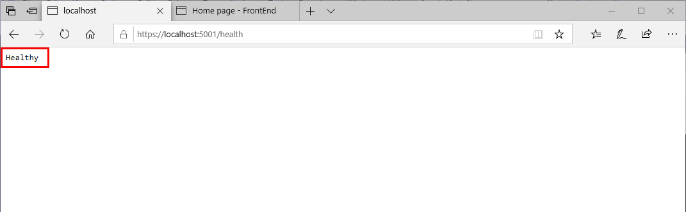

8. In the browser window for the **FrontEnd** web application, move to the health endpoint. The address of this endpoint is the URL of the **FrontEnd** web app with the suffix `/health`. Verify that the **FrontEnd** web application also responds with the **Healthy** message.

9. Stop the web application and web API service:

    - **If you're using Visual Studio 2019:**

        - Close the web browser. The **FrontEnd** and **BackEnd** projects will stop automatically.

    - **If you're using the .NET Core CLI:**

        1. Close both web browser windows.

        2. Switch to the console window for the **BackEnd** project and press **Ctrl+C** to stop the web API service.

        3. Return to the console window for the **FrontEnd** project, and press **Ctrl+C** to stop the web application.

## Add a custom health check to test for BackEnd availability from the FrontEnd

In this task, you'll customize the health check for the **FrontEnd** web application. You create your own health check class by implementing the `IHealthCheck` interface. You can then do more extensive health checking to ensure that any additional services on which the web API depends (such as a database), are accessible. In this exercise, you'll add a custom health check to the **FrontEnd** web application to check for the availability of the **BackEnd** web API service.

1. In the **FrontEnd** project, open the **IApiClient.cs** file in the **Services** folder.

2. Add the method **CheckHealthAsync** method to the end of the **IApiClient** interface, as shown below:

   ```csharp
   public interface IApiClient
   {
       ...
       Task<bool> CheckHealthAsync();
   }
   ```

3. Open the **ApiClient.cs** file in the **Services** folder.

4. Add the directive `using System;` to the list at the start of the file, if it isn't already present.

5. In the **ApiClient** class, add the **CheckHealthAsync** method shown below. This method sends a request to the `health` endpoint of the **BackEnd** web API service. If the service responds with the message **Healthy**, the **CheckHealthAsync** method returns true, otherwise it returns false:

    ```csharp
    public class ApiClient : IApiClient
    {
        ...
        public async Task<bool> CheckHealthAsync()
        {
            try
            {
                var response = await _httpClient.GetStringAsync("/health");

                return string.Equals(response, "Healthy", StringComparison.OrdinalIgnoreCase);
            }
            catch
            {
                return false;
            }
        }
    }
    ```

6. Create a folder named **HealthChecks** under the root folder in the **FrontEnd** project.

7. In the **HealthChecks** folder, add a class file named **BackendHealthCheck.cs**.

8. Replace the contents of the **BackendHealthCheck.cs** file with the following code. The **BackendHealthChecks** method implements the **IHealthCheck** interface. This interface defines a method named **CheckHealthAsync**. The code below implements this method by calling the **CheckHealthAsync** method of the **ApiClient** class. If the method in the **ApiClient** class returns true, this returns a status of `Healthy`. Otherwise, it returns `Unhealthy`.

    ```csharp
    using System;
    using System.Collections.Generic;
    using System.Linq;
    using System.Threading;
    using System.Threading.Tasks;
    using FrontEnd.Services;
    using Microsoft.Extensions.Diagnostics.HealthChecks;

    namespace FrontEnd.HealthChecks
    {
        public class BackendHealthCheck : IHealthCheck
        {
            private readonly IApiClient _client;

            public BackendHealthCheck(IApiClient client)
            {
                _client = client;
            }

            public async Task<HealthCheckResult> CheckHealthAsync(HealthCheckContext context, CancellationToken cancellationToken = default(CancellationToken))
            {
                if (await _client.CheckHealthAsync())
                {
                    return HealthCheckResult.Healthy();
                }

                return HealthCheckResult.Unhealthy();
            }
        }
    }
    ```

9. Return to the **Startup.cs** file in the root folder of the **FrontEnd** project.

10. Add the directive `using FrontEnd.HealthChecks;` to the list at the start of the file.

11. In the **ConfigureServices** method, modify the statement that calls the **AddHealthChecks** method, and register the **BackendHealthCheck** method, as shown in the following code:

    ```csharp
    public void ConfigureServices(IServiceCollection services)
    {
        ...
        services.AddHealthChecks()
                .AddCheck<BackendHealthCheck>("backend")
                .AddDbContextCheck<IdentityDbContext>();
    }
    ```

12. Start the solution, and browse to the URL of the **FrontEnd** application.

    > **Note:** If you're using Visual Studio 2019, start the solution without debugging.
    >
    > 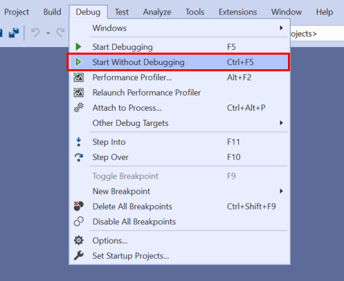

13. Go to the `/health` endpoint. The page should display the text **Healthy**.

14. Close the console window running the **BackEnd** project, but leave the **FrontEnd** project running. Note that the window for the **BackEnd** project might be hidden behind Visual Studio; look in the Windows task bar for the icon highlighted in the following image:

    

    The contents of the console window should look like this (just to make sure you have selected the correct window):

    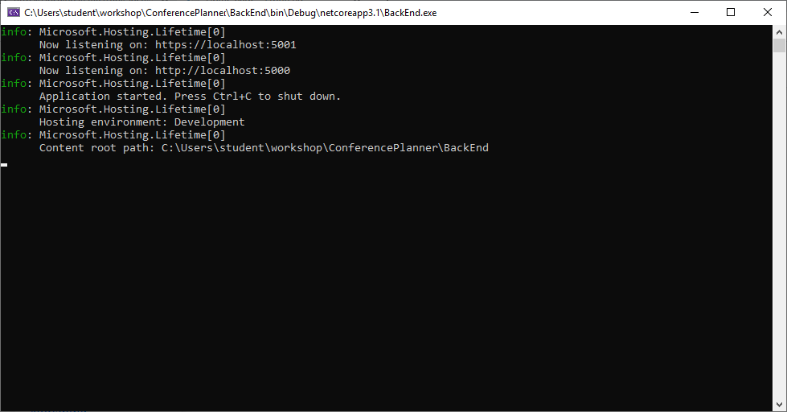

15. In the web browser window for the **FrontEnd** web app, refresh the page open at the `/health` endpoint. The page should now display the text **Unhealthy**, because the **BackEnd** service is no longer available.

    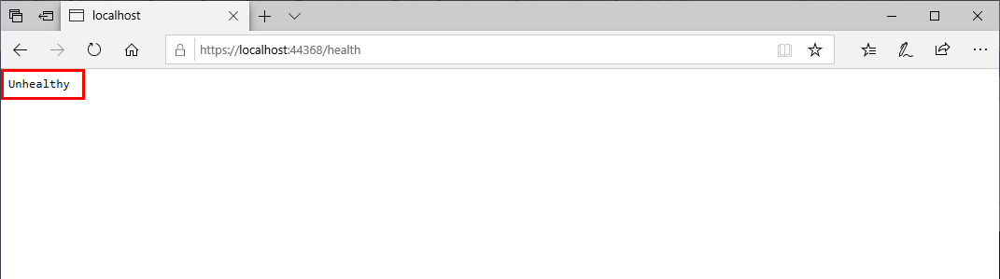

16. Close the web browser and stop the solution.

# Publish the BackEnd web API service and FrontEnd web application as Azure Windows Web Apps using Zip deployment

In this exercise, you'll deploy the **BackEnd** web API service and the **FrontEnd** web app to Azure, running as Windows Web Apps. This task assumes you have an Azure subscription. If you don't already have an Azure account, you can sign up free of charge on the [Azure page of the Microsoft website](https://azure.microsoft.com/free/).

## Sign in to your Azure subscription

### If you're using Visual Studio 2019
  
1. On the **View** menu, click **Cloud Explorer**.

    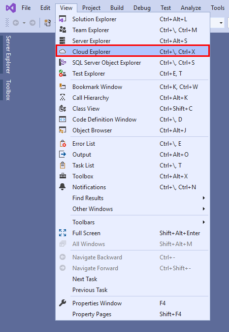

2. In the **Cloud Explorer** window, click the **Account Management** button, and then click **Manage Accounts**.

    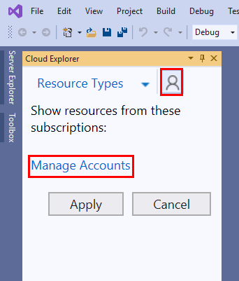

3. In the **Sign in to Visual Studio** dialog box, click **Sign in**.

    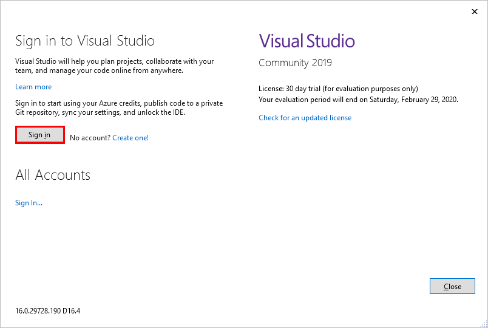

4. In the **Sign in to your account** dialog box, sign in using the credentials associated with your Azure subscription.

    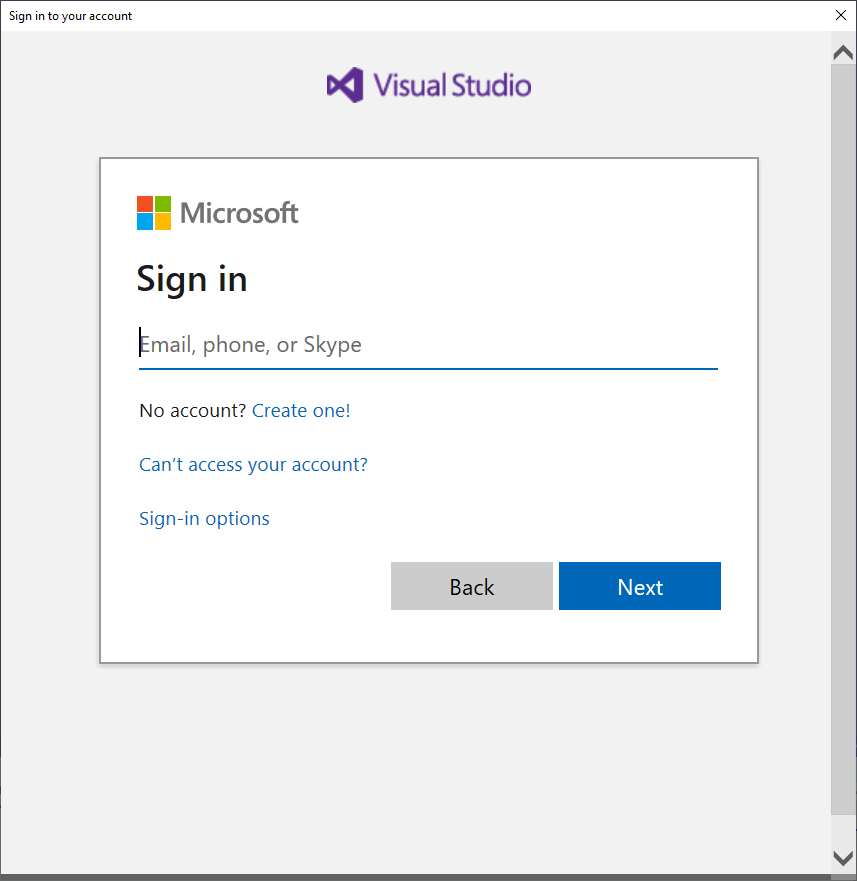

5. When you've signed in, in the **Personalization Account** dialog box, click **Close**.

    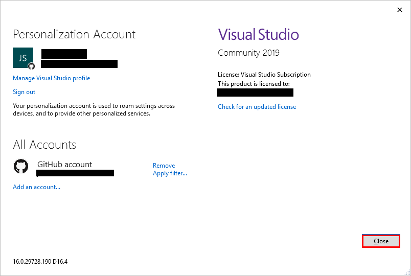

6. In the **Cloud Explorer** window, click **Apply**, and then close the **Cloud Explorer** window.

    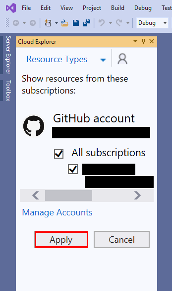

### If you're using the .NET Core CLI

1. If you haven't already done so, [install the Azure CLI](https://docs.microsoft.com/cli/azure/install-azure-cli?view=azure-cli-latest). Close any open command prompts, and then start a new command prompt session.

2. Run the command below, and follow the instructions to sign in to the account associated with your Azure subscription:

    ```console
    az login
    ```

3. Close the browser window.

## Prepare the BackEnd project for migration

> **Note:** This task is only necessary if you've previously been using SQLite to manage the conference database. If you've been using SQL Server, omit this task.

### If you're using Visual Studio 2019

1. In Solution Explorer, right-click the **BackEnd** project, and then click **Manage NuGet Packages**.

2. In the **NuGet Package Manager** window, click the **Browse** tab, and search for the package **Microsoft.EntityFrameworkCore.SqlServer**.

3. Select the version **3.1.2**, and then click **Install**.

4. In the **Preview Changes** dialog box, click **OK**.

5. In the **License Acceptance** dialog box, click **I Accept**.

6. Open the **Startup.cs** file in the root folder of the **BackEnd** project.

7. In the **ConfigureServices** method, amend the `services.AddDbContext` statement. Replace the call to the **UseSqlite** method with **UseSqlServer**, as shown below:

    ```csharp
    public void ConfigureServices(IServiceCollection services)
    {
        services.AddDbContext<ApplicationDbContext>(options =>
        {
            // For SQL Server
            options.UseSqlServer(Configuration.GetConnectionString("DefaultConnection"));
        });
        ...
    }
    ```
  
### If you're using the .NET Core CLI

1. Move to the **BackEnd** project folder.

2. Run the following command:

    ```console
    dotnet add package Microsoft.EntityFrameworkCore.SqlServer --version 3.1.2
    ```

3. Open the **Startup.cs** file in the root folder of the **BackEnd** project.

4. In the **ConfigureServices** method, amend the `services.AddDbContext` statement. Replace the call to the **UseSqlite** method with **UseSqlServer**, as shown below:

    ```csharp
    public void ConfigureServices(IServiceCollection services)
    {
        services.AddDbContext<ApplicationDbContext>(options =>
        {
            // For SQL Server
            options.UseSqlServer(Configuration.GetConnectionString("DefaultConnection"));
        });
        ...
    }
    ```

## Deploy the BackEnd web API service to Azure

### If you're using Visual Studio 2019
  
1. In Solution Explorer, right-click the **BackEnd** project, and then click **Publish**.

    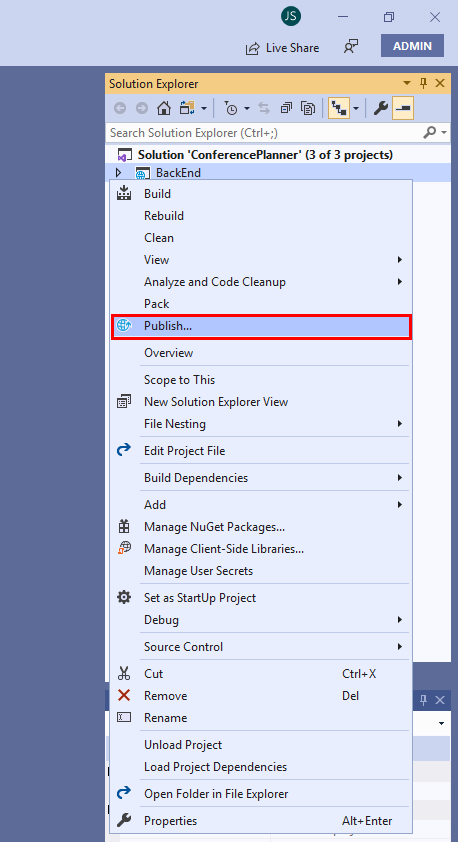

2. In the **Pick a publish target** dialog box, in the left pane, click **App Service**. In the **Azure App Service** pane, click **Create New**, and then click **Create Profile**.

    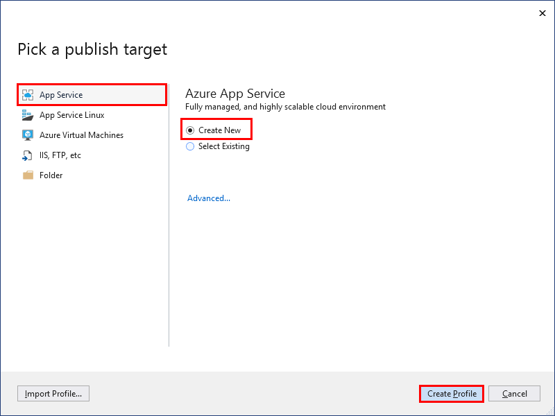

3. In the **App Service Create new** dialog box, enter the following details. **Don't** click **Create** yet.

    | Field | Value |
    |-|-|
    | Name | Accept the default App Service name |
    | Subscription | Select your Azure subscription |
    | Resource group | Click **New**, and create a resource group named **aspnetrg** |
    | Hosting plan | Accept the default plan name |
    | Application Insights | None |

4. Under **Explore Additional Azure services**, click **Create a SQL Database**.

    

5. In the **Azure SQL Database Create new** dialog box, enter the following details, and then click **OK**:

    | Field | Value |
    |-|-|
    | Database name | **Conference_db** |
    | Database server | Click **New**. Create a database server with the default server name and location. Set the **Administrator username** to **azureadmin**, and specify a password of your choice. Click **OK** to return to the **Azure SQL Database Create new** dialog box. |
    | Database administrator username | azureadmin |
    | Database administrator password | Accept the default value |
    | Connection string name | **DefaultConnection** |

6. In the **App Service Create new** dialog box, click **Create**.

7. On the **Publish** page, click **Edit**.

    

8. In the **Publish** dialog box, on the **Settings** tab, expand **Databases**, and then select the **Use this connection string at runtime** check box. Expand **Entity Framework Migrations**, and then select **Apply this migration on publish**.

    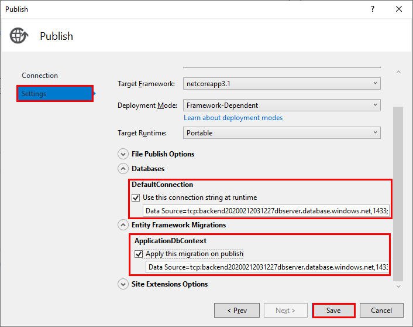

    > **Note:** The publish settings also enable you to specify the target framework for the web app when it's deployed. In this case, the target framework is **.netcoreapp3.1**. However, Azure App Services doesn't currently support this version of .NET Core natively, so the target runtime is set to **Portable**. If you really need to run the web app using .NET Core version 3.1, you can change the deployment mode to **Self-Contained**, and specify a target runtime of **win-x86**. These settings cause the .NET Core framework to be bundled up in the deployment and uploaded to the App Service as part of the application.
    >
    > 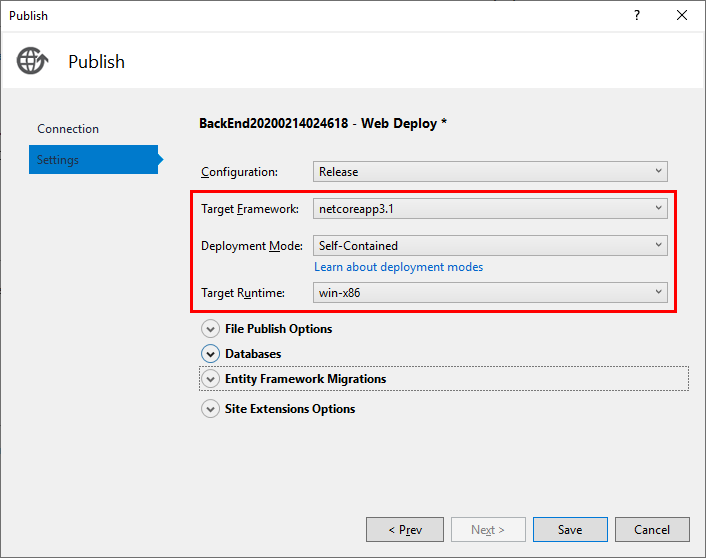
    >
    > You can use this technique wherever you require a version of a framework that's not yet currently available with App Services. For this exercise, leave the **Deployment Mode** set to **Framework-Dependent**, and the **Target Runtime** set to **Portable**.

9. In the **Publish** dialog box, click **Save**.

10. On the **Publish** page, click **Publish**.

    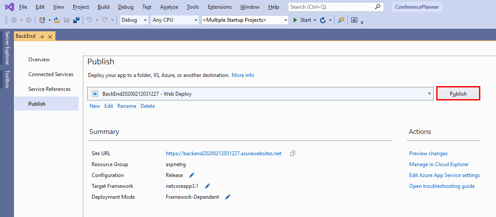

    When the web API service has been published, a web browser window will open and attempt to go to the URL of the service. The page will fail to open, with an HTTP 404 error. This error occurs because the root URL of the web API service isn't a valid address.

    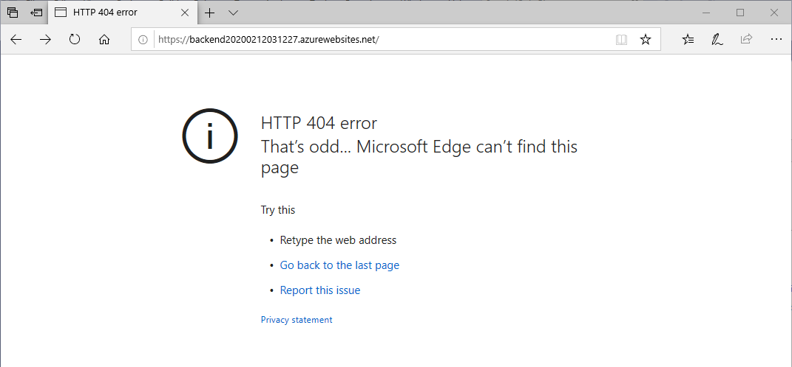

11. In the web browser, make a note of the URL of the web API service. It will have the form `https://backend<service-name-suffix>.azurewebsites.net`. You'll need this URL later, when you deploy the **FrontEnd** web application.

12. In the address bar of the browser, append the suffix `/api/speakers` to the URL. The web API service should respond with an empty list of speakers.

    

### If you're using the .NET Core CLI

1. Run the following command to create a new resource group named **aspnetrg**. Replace *\<location\>* with the name of your nearest Azure location, such as *westus*, *eastus*, *westuerope**, and so on:

    > **Note:** You can obtain a list of valid locations using the command `az account list-locations`. 
  
    ```console
    az group create --location <location> --name aspnetrg
    ```

2. Run the following command to create a new Azure SQL Server. Use the same location as before. Each Azure App Service must have a unique name, so replace *\<service-name-suffix\>* with your initials and the current data in numeric format, for example, JPWS01012020. Specify an administrator password of your choice:
  
    ```console
    az sql server create --name backendserver<service-name-suffix> --resource-group aspnetrg --location <location> --admin-user azureadmin --admin-password <password>
    ```

3. Run the command shown below to obtain the IP address of your computer. Make a note of the IP address:

    ```console
    ipconfig
    ```

4. Execute the following commands to open the SQL Server firewall. Replace *\<your-ip-address\>* with the address of your computer. These commands will allow you to access the server from your computer, and from Azure services, including the **BackEnd** web API service:
  
    ```console
    az sql server firewall-rule create --name sql --resource-group aspnetrg --server backendserver<service-name-suffix> --start-ip-address <your-ip-address> --end-ip-address <your-ip-address>

    az sql server firewall-rule create --name azure --resource-group aspnetrg --server backendserver<service-name-suffix> --start-ip-address 0.0.0.0 --end-ip-address 0.0.0.0
    ```

5. Create a SQL Server database named **conference_db**, as shown below:

    ```console
    az sql db create --name conference_db --resource-group aspnetrg --server backendserver<service-name-suffix> --edition Basic
    ```

6. Run the following command to retrieve the connection string for the **conference_db** database:

    ```console
    az sql db show-connection-string --name conference_db --server backendserver<service-name-suffix> --client ado.net
    ```

7. Move to the root folder of the **BackEnd** project.

8. Open the **appsettings.json** file. Replace the value of the **DefaultConnection** property with the string returned in the previous step. In this string, replace *\<username\>* with **azureadmin**, and replace *\<password\>* with the password you specified when you created the Azure SQL Server. The file should look similar to this:

    ```json
    {
        "ConnectionStrings": {
            "DefaultConnection": "Server=tcp:backendserver<service-name-suffix>.database.windows.net,1433;Database=conference_db;User ID=azureadmin;Password=<password>;Encrypt=true;Connection Timeout=30;"
        },
        "Logging": {
            "LogLevel": {
                "Default": "Information",
                "Microsoft": "Warning",
                "Microsoft.Hosting.Lifetime": "Information"
            }
        },
        "AllowedHosts": "*"
    }
    ```

9. Install the **Entity Framework** database migration tools if you haven't already done so, as follows:

    1. Run the following command:

        ```console
        dotnet tool install -g dotnet-ef --version 3.1.2
        ```

    2. Close the command prompt window, and start a new command prompt session.

    3. Return to the **BackEnd** project folder.

10. Delete all the files in the **Migrations** folder of the **BackEnd** project.

11. Run the following commands shown below to create and run a database migration. These commands will create the tables for the web API service in the new SQL Server database in Azure:

    ```console
    dotnet ef migrations add MoveToAzure
    dotnet ef database update
    ```

12. Build the **BackEnd** project and publish the files to a local folder named **publish**. The following command also includes the .NET Core 3.1 runtime. Azure Web Apps running Windows currently don't include versions of the .NET Core later than version 2.2, so the web application must provide the runtime libraries:

    ```console
    dotnet publish --runtime win-x86 --self-contained --configuration Release --output publish
    ```

13. Run the following command to compress the contents of the **publish** folder into a zip file named **publish.zip**:

    ```console
    powershell Compress-Archive -Path publish\* -DestinationPath publish.zip
    ```

14. Create a new Azure App Service plan with the following command. The **D1** SKU uses a low-cost shared infrastructure that's suitable for development environments:
  
    ```console
    az appservice plan create --name backendplan --resource-group aspnetrg --sku D1
    ```

15. Create an Azure Web App using the App Service Plan. Each Azure App Service must have a unique name, so replace *\<service-name-suffix\>* with your initials and the current data in numeric format. For example, **jpws01012020**.

    ```console
    az webapp create --name backend<service-name-suffix> --plan backendplan --resource-group aspnetrg
    ```

16. Deploy the **BackEnd** project to the App Service using the **publish.zip** file you created earlier.

    ```console
    az webapp deployment source config-zip --name backend<service-name-suffix> --resource-group aspnetrg --src publish.zip
    ```

17. Run the following command to open a browser window at the URL of the web app: 

    ```console
    az webapp browse --name backend<service-name-suffix> --resource-group aspnetrg
    ```

    The browser will attempt to go to the URL of the service. The page will fail to open, with an HTTP 404 error. This error occurs because the root URL of the web API service isn't a valid address.

    

18. In the web browser, make a note of the URL of the web API service. It will have the form `https://backend<service-name-suffix>.azurewebsites.net`. You'll require this URL later, when you deploy the **FrontEnd** web application.

19. In the address bar of the browser, append the suffix `/api/speakers` to the URL. The web API service should respond with an empty list of speakers.

    

## Populate the Conference database

1. In the web browser, move to the Swagger endpoint of the web API service, **https://backend\<*service-name-suffix*\>.azurewebsites.net/swagger**.

2. In the **Sessions** section, click the **POST** button for the **/api/Sessions/upload** operation, and then click **Try it out**.

3. In the **Parameters** section, at the **file** prompt, click **Browse**.

4. In the **Open** dialog box, browse to the folder containing your clone of the GitHub repository, move to the folder **src/BackEnd/Data/Import** in the repository, select the file **NDC_London_2020.json**, and then click **Open**.

5. In the web browser, click **Execute**, and wait for the data to be uploaded. Verify that the upload is successful. The server response code should be 200.

    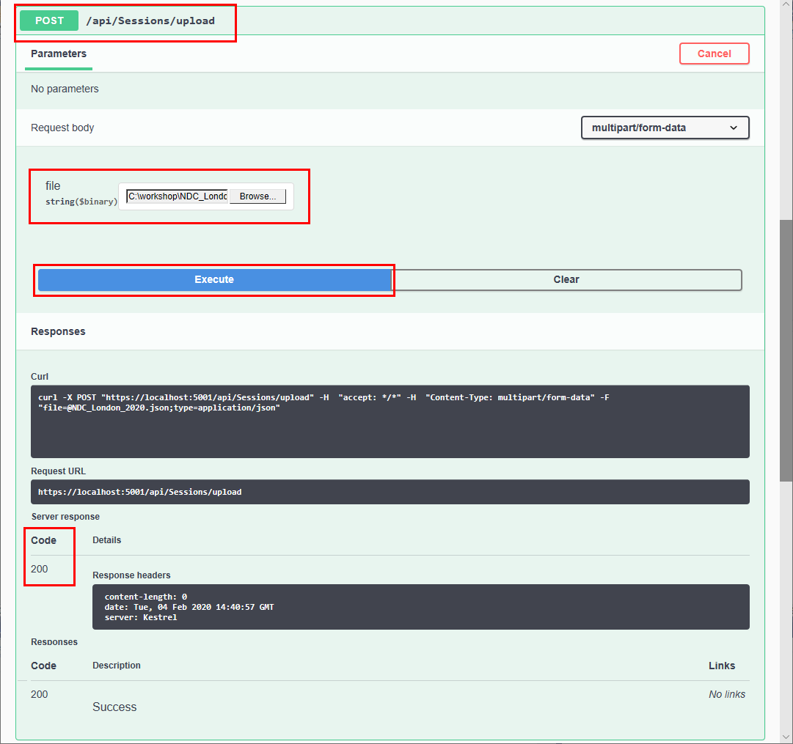

## Prepare the FrontEnd project for migration

> **Note:** This task is only necessary if you've previously been using SQLite to manage the identity database. If you've been using SQL Server, omit this task.

1. Add the NuGet package **Microsoft.EntityFrameworkCore.SqlServer** version 3.1.2 to the project, using the steps described in the section [Prepare the BackEnd project for migration](#prepare-the-backend-project-for-migration).

2. Open the **IdentityHostingStartup.cs** file in the **Areas\Identity** folder of the **FrontEnd** project.

3. In the **Configure** method, amend the `services.AddDbContext` statement. Replace the call to the **UseSqlite** method with **UseSqlServer**, as shown below:

    ```csharp
    public void Configure(IWebHostBuilder builder)
    {
        builder.ConfigureServices((context, services) => {
            services.AddDbContext<IdentityDbContext>(options =>
                // For SQL Server
                options.UseSqlServer(
                    context.Configuration.GetConnectionString("IdentityDbContextConnection")));

            ...
        });
    }
    ```

4. Delete all the files in the **Migrations** folder of the **FrontEnd** project.

## Deploy the FrontEnd web API service to Azure

### If you're using Visual Studio 2019
  
1. Open the **appsettings.json** file in the root folder of the **FrontEnd** project, and replace the value of the **ServiceUrl** settings with the URL of the **BackEnd** service running as an App Service. You noted this URL earlier.

2. In Solution Explorer, right-click the **FrontEnd** project, and then click **Publish**.

3. In the **Pick a publish target** dialog box, in the left pane, click **App Service**. In the **Azure App Service** pane, click **Create New**, and then click **Create Profile**.

4. In the **App Service Create new** dialog box, enter the following details. **Don't** click **Create** yet:

    | Field | Value |
    |-|-|
    | Name | Accept the default App Service name |
    | Subscription | Select your Azure subscription |
    | Resource group | Select **aspnetrg** |
    | Hosting plan | Accept the default plan name. This will be the same hosting plan you created for the **BackEnd** web app |
    | Application Insights | None |

5. Under **Explore Additional Azure services**, click **Create a SQL Database**.

6. In the **Azure SQL Database Create new** dialog box, enter the following details, and then click **OK**.

    | Field | Value |
    |-|-|
    | Database name | **Identity_db** |
    | Database server | Select the database server that you created for holding the **Conference_db** database |
    | Database administrator username | **azureadmin** |
    | Database administrator password | Enter the password you created for the **azureadmin** user |
    | Connection string name | **DefaultConnection** |

7. In the **App Service Create new** dialog box, click **Create**.

8. On the **Publish** page, click **Edit**.

9. In the **Publish** dialog box, on the **Settings** tab, expand **Databases**, and then select the **Use this connection string at runtime** check box. Expand **Entity Framework Migrations**, select the **Apply this migration on publish** check box, and then click **Save**.

10. On the **Publish** page, click **Publish**.

    When the web API service has been published, a web browser window will open and display the home page of the Conference web app. The web app should display the conference data, retrieved from the web API service running as an App Service.

    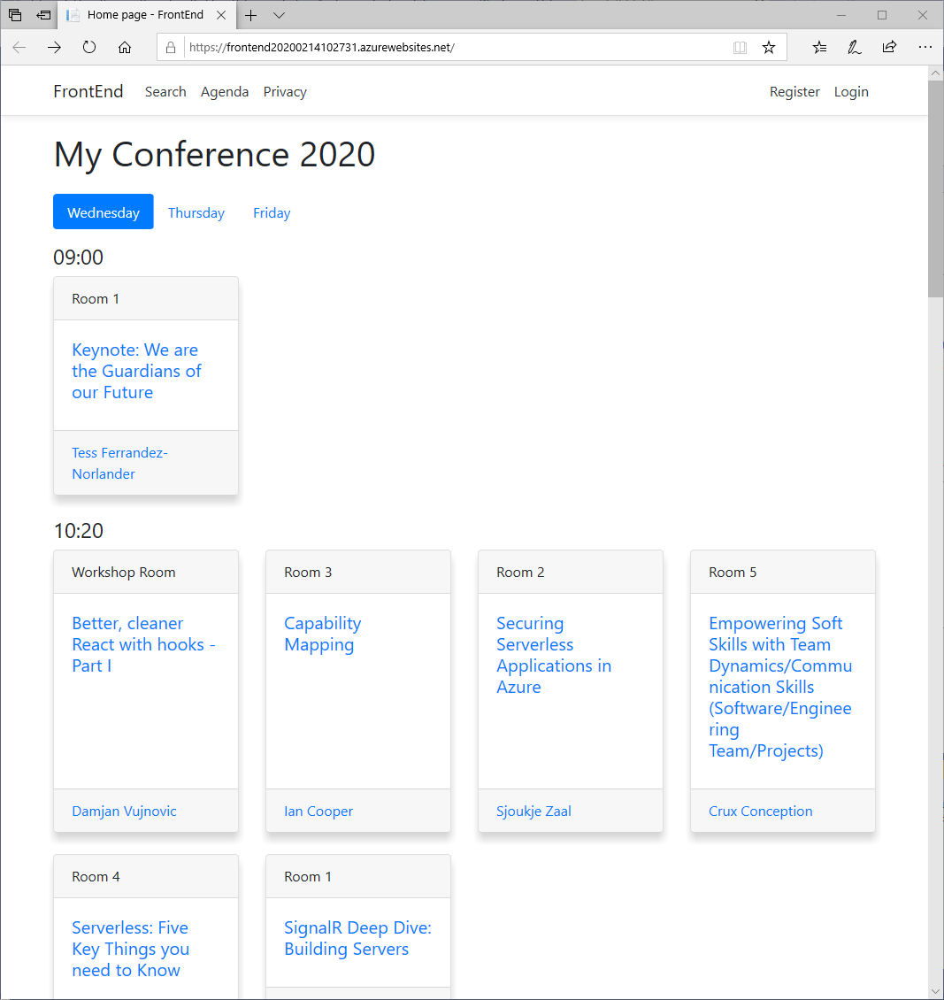

11. Verify that you can register as a conference attendee, and create your own agenda.

### If you're using the .NET Core CLI

1. Open the **appsettings.json** file in the root folder of the **FrontEnd** project, and replace the value of the **ServiceUrl** settings with the URL of the **BackEnd** service running as an App Service. You noted this URL earlier.

2. Create a SQL Server database named **identity_db**, using the SQL Server you created for the **BackEnd** web API service, as shown below:

    ```console
    az sql db create --name identity_db --resource-group aspnetrg --server backendserver<service-name-suffix> --edition Basic
    ```

3. Run the following command to retrieve the connection string for the **identity_db** database:

    ```console
    az sql db show-connection-string --name identity_db --server backendserver<service-name-suffix> --client ado.net
    ```

4. Move to the root folder of the **FrontEnd** project.

5. Open the **appsettings.json** file. Replace the value of the **IdentityDbContextConnection** property with the string returned in the previous step. In this string, replace *\<username\>* with **azureadmin**, and replace *\<password\>* with the password that you specified when you created the Azure SQL Server.

6. Execute the commands shown below to create and run a database migration. These commands will create the tables for the identity database in Azure:

    ```console
    dotnet ef migrations add MoveIdentityToAzure
    dotnet ef database update
    ```

7. Build the **FrontEnd** project and publish the files to a local folder named **publish**. Include the .NET Core 3.1 runtime, as shown in the following command:

    ```console
    dotnet publish --runtime win-x86 --self-contained --configuration Release --output publish
    ```

8. Compress the contents of the **publish** folder into a zip file named **publish.zip**.

    ```console
    powershell Compress-Archive -Path publish\* -DestinationPath publish.zip
    ```

9. Create an Azure Web App using the App Service Plan you created earlier for the **BackEnd** project. As with the **BackEnd** web app, replace *\<service-name-suffix\>* with your initials and the current date in numeric format.

    ```console
    az webapp create --name frontend<service-name-suffix> --plan backendplan --resource-group aspnetrg
    ```

10. Deploy the **FrontEnd** project to the App Service.

    ```console
    az webapp deployment source config-zip --name frontend<service-name-suffix> --resource-group aspnetrg --src publish.zip
    ```

11. Run the following command to open a browser window at the URL of the web app:

    ```console
    az webapp browse --name frontend<service-name-suffix> --resource-group aspnetrg
    ```

    The web browser will display the home page of the Conference web app. The web app should display the conference data, retrieved from the web API service running as an App Service.

    

12. Verify that you can register as a conference attendee, and create your own agenda.

# Publish the BackEnd web API service as an Azure Linux Web App using Git deployment

In this exercise, you'll deploy the **BackEnd** web API service Azure, running as a Linux Web App. You'll leave the **FrontEnd** web app running locally, to save time and avoid repetition. This task assumes you have an Azure subscription. If you don't already have an Azure account, you can sign up for a free account on the [Azure page of the Microsoft website](https://azure.microsoft.com/free/). As a variation on the Windows Web App deployment scenario, you'll use GitHub deployment in this exercise. Git deployment enables you to publish updates to the web apps more easily. You push the changes to a Git repository managed by the Azure App service.

## Prepare the **BackEnd** project

1. If you haven't already done so, sign in to your Azure subscription [by following the procedure described earlier](#sign-in-to-your-azure-subscription).

2. Change the version of the .NET Framework Core for the BackEnd project.

    > **Note:** This change is necessary because the *Oryx* build processor that rebuilds applications in the Azure App Service doesn't currently support later builds of the .NET Core Framework. This situation is expected to change soon.

    - **If you're using Visual Studio 2019:**

        1. In Visual Studio, in Solution Explorer, right-click the **BackEnd** project, and then click **Properties**.

        2. In the **Properties** window for the **BackEnd** project, on the **Application** tab, change the **Target framework** to **.NET Core 3.0**.

            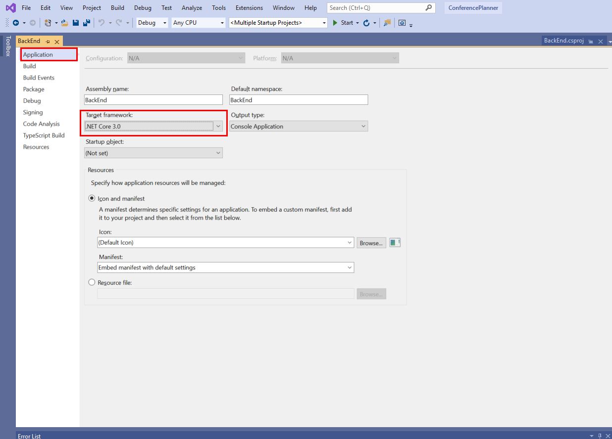

        3. Add a reference to the NuGet package `Newtonsoft.Json` version `12.0.3` to the **BackEnd** project. This package is not automatically included with the .NET Core 3.0 Framework.

        4. On the **Build** menu, click **Rebuild Solution**. You'll receive a warning about the `Microsoft.VisualStudio.Web.CodeGeneration.Design` package, but you shouldn't get any errors.

    - **If you're using the .NET Core CLI:**

        1. In the **BackEnd** project folder, open the file **BackEnd.csproj** using a text editor of your choice.

        2. Change the value of the **TargetFramework** property to **netcoreapp3.0**, as shown in the example below:

            ```json
            <Project Sdk="Microsoft.NET.Sdk.Web">

                <PropertyGroup>
                    <TargetFramework>netcoreapp3.0</TargetFramework>
                </PropertyGroup>
                ...
            </Project>
            ```

        3. Run the following command to add a reference to the NuGet package `Newtonsoft.Json` version `12.0.3` to the **BackEnd** project:

            ```console
            dotnet add package Newtonsoft.Json --version 12.0.3
            ```

        4. Rebuild the solution. You'll receive warnings about the `Microsoft.VisualStudio.Web.CodeGeneration.Design` package, but you shouldn't get any errors.

            ```console
            dotnet build
            ```

## Switch the **BackEnd** project to use SQLite

This exercise uses SQLite to illustrate this database management system as an option with Linux deployments. If you prefer to use SQL Server, you can configure a new SQL Server service in Azure, and configure the **BackEnd** project to use this service, by following the procedures in the previous exercise.

1. Add a reference to the Nuget Package `Microsoft.Data.Sqlite` version `3.1.2` to the **BackEnd** project.

    - **If you're using Visual Studio**, use the **NuGet Package Manager**, as described earlier

    - **If you're using the .NET Core CLI**, move to the root folder of the **BackEnd** project, and run the following command:
  
        ```console
        dotnet add package Microsoft.Data.Sqlite --version 3.1.2
        ```

2. Open the **Startup.cs** file in the root folder of the **BackEnd** project.

3. In the **ConfigureServices** method, change the `services.AddDbContext` statement, as shown below:

    ```csharp
    public void ConfigureServices(IServiceCollection services)
    {
        services.AddDbContext<ApplicationDbContext>(options =>
        {
            // For SQLite
            options.UseSqlite(Configuration.GetConnectionString("DefaultConnection"));
        });
        ...
    }
    ```

4. Open the **appsettings.json** file in the root folder of the **BackEnd** project.

5. In the **ConnectionStrings** section, modify the **DefaultConnection** setting as shown below:

    ```json
    {
        "ConnectionStrings": {
            "DefaultConnection": "Data Source=conference.db;"
        },
        "Logging": {
            ...
        }
    }
    ```

6. Migrate the database to SQLite.

    - **If you're using Visual Studio 2019:**
  
        1. Delete the files in the **Migrations** folder in the **BackEnd** project.

        2. On the **Tools** menu, point to **NuGet Package Manager**, and then click **Package Manager Console**.

        3. In the **Package Manager Console** window, set the **Default project** to **BackEnd**.

        4. Run the following commands in the **Package Manager Console** window, at the **PM>** prompt:

            ```console
            Add-Migration MoveToSqlite
            Update-Database
            ```

        5. In Solution Explorer, right-click the **conference.db** file in the **BackEnd** project, and then click **Properties**.

        6. In the **conference.db File Properties** window, set **Copy to Output Directory** to **Copy always**. This action ensures that the database is deployed with the application.

            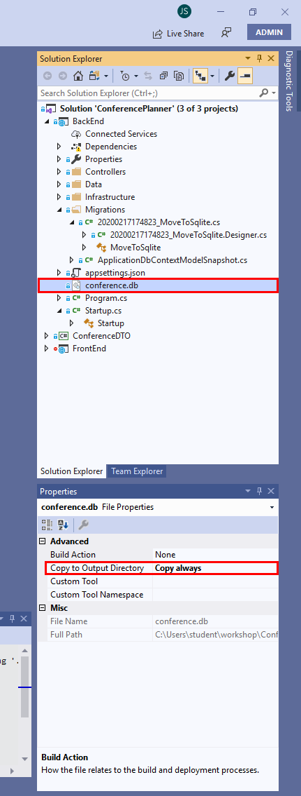

    - **If you're using the .NET Core CLI:**

        1. Delete the files in the **Migrations** folder in the **BackEnd** project.

        2. In a command prompt window, move to the **BackEnd** project folder.

        3. Install the **Entity Framework** database migration tools if you haven't already done so, as follows:

            1. Run the following command:

                ```console
                dotnet tool install -g dotnet-ef --version 3.1.2
                ```

            2. Close the command prompt window, and start a new command prompt session.

        4. Return to the **BackEnd** project folder.

        5. Run the following commands:

            ```console
            dotnet ef migrations add MoveToSqlite
            dotnet ef database update
            ```

        6. Edit the **BackEnd.csproj** file in the **BackEnd** project, and add the `<ItemGroup>` section shown in the example below to the end of the project settings. This section ensures that the **conference.db** database file is copied when the application is deployed:

            ```json
            <Project Sdk="Microsoft.NET.Sdk.Web">
                ...
                <ItemGroup>
                    <None Update="conference.db">
                        <CopyToOutputDirectory>Always</CopyToOutputDirectory>
                    </None>
                </ItemGroup>

            </Project>
            ```

## Create a Linux App Service that supports GitHub deployment

For this task, you can either use the Azure portal, or the Azure command-line tools.

### If you're using the Azure portal

1. Open a web browser, and go to the Azure portal at https://portal.azure.com.

2. Sign in to the portal with your Azure credentials.

3. On the home page, position the cursor over the **App Services** icon, and then click **Create**.

    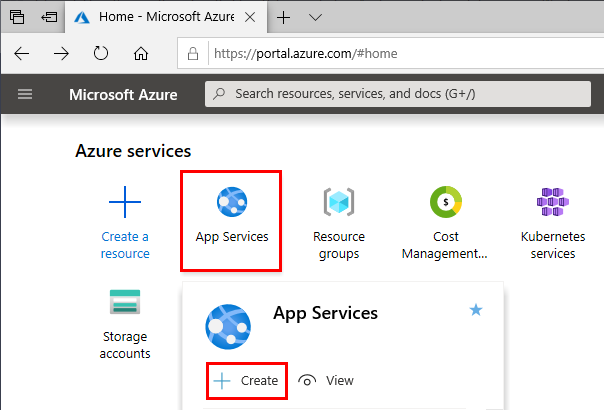

4. On the **Web App** page, on the **Basics** tab, specify the following settings, and then click **Review + create**:

    | Field | Value |
    |-|-|
    | Subscription | Select your subscription |
    | Resource group | Click **create new**, and create a new resource group named **aspnetlinuxrg** |
    | Name | **linuxbackend\<web-app-suffix\>**, where *\<web-app-suffix\>* is a combination of your initials and the current date in numeric format. For example, **js01012020**.
    | Publish | **Code** |
    | Runtime stack | **.NET Core 3.0 (Current)** |
    | Operating System | **Linux** |
    | Region | Select your closest region |
    | Linux Plan | Accept the default plan name |
    | SKU and size | Click **Change size**. On the **Spec Picker** page, select the **Dev / Test** tab. Select the **F1** pricing tier if it's available, otherwise select **B1**, and then click **Apply** |

    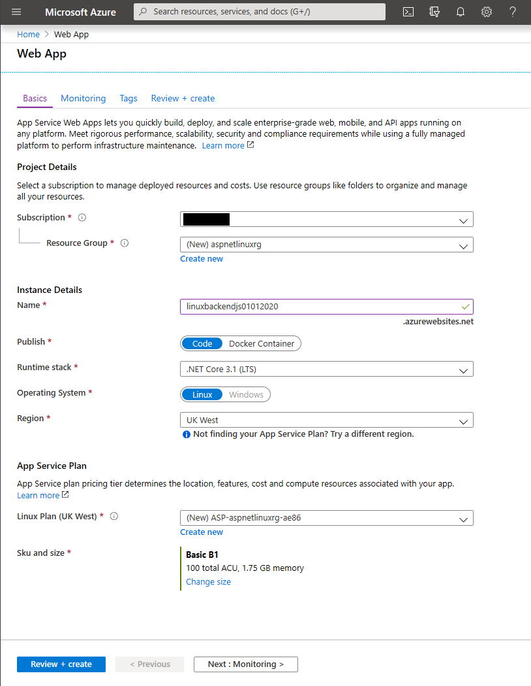

5. On the **Review + create** page, click **Create**.

6. When the deployment is complete, click **Go to resource**.

7. On the page for your web app, in the menu pane, under **Deployment**, click **Deployment Center**.

    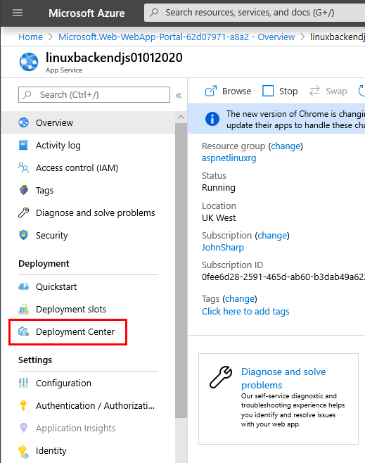

8. On the **Deployment Center** page, click **Local Git**, and then click **Continue**.

    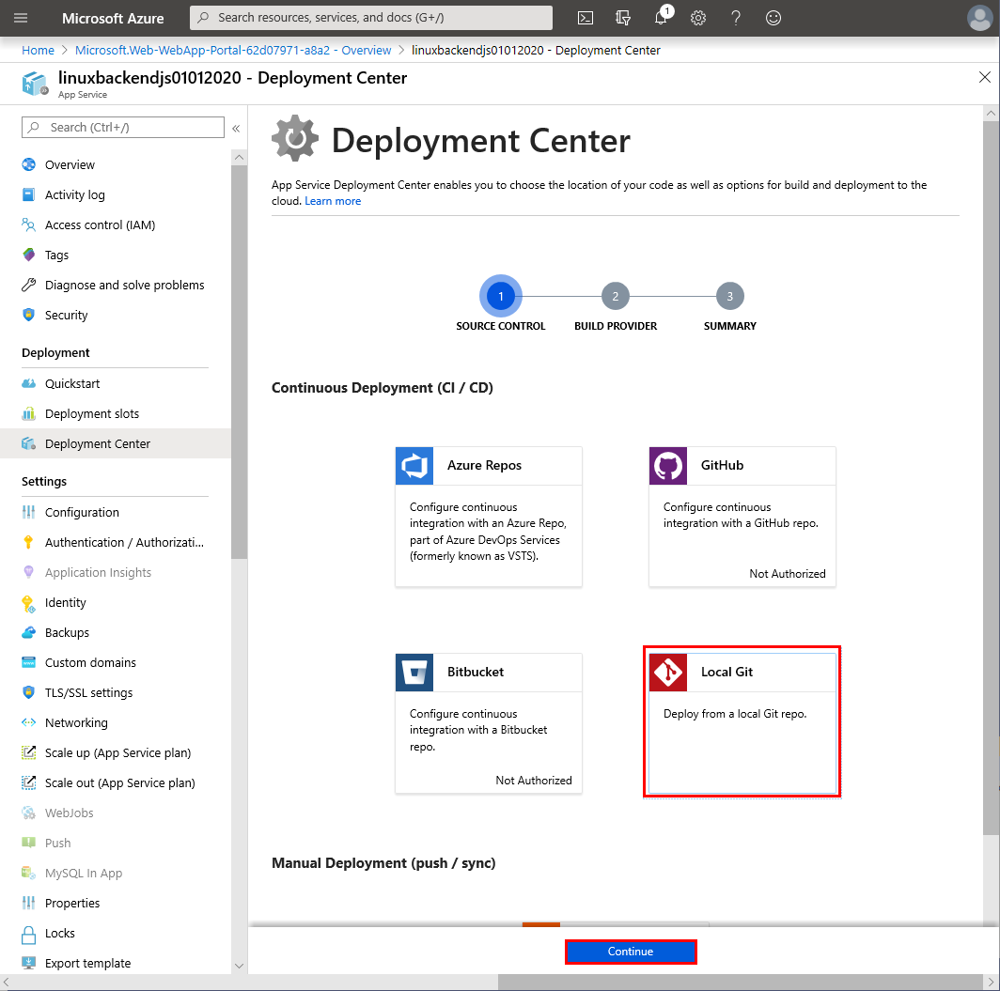

9. On the **Build Provider** page, click **App Service build service**, and then click **Continue**.

    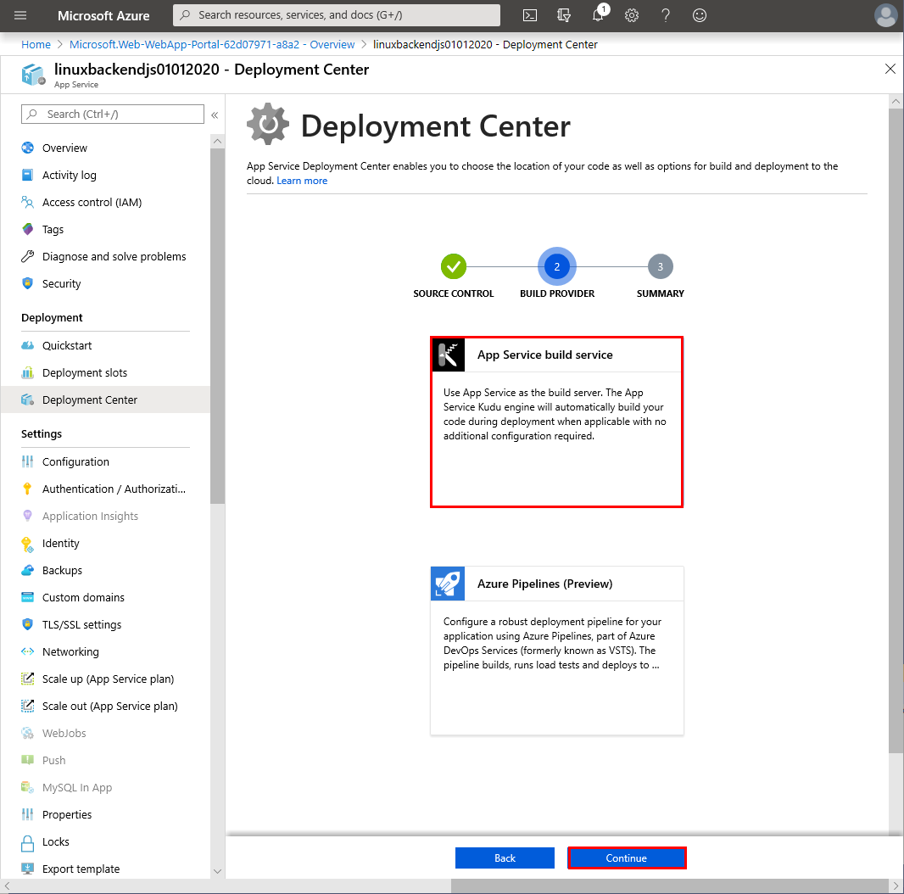

10. On the **Summary** page, click **Finish**.

11. On the **Deployment Center** page, click **Deployment Credentials**.

    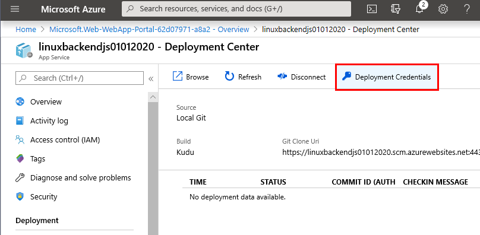

12. In the **Deployment Credentials** pane, make a note of the **Git Clone URL**, **Username**, and the **Password**.

    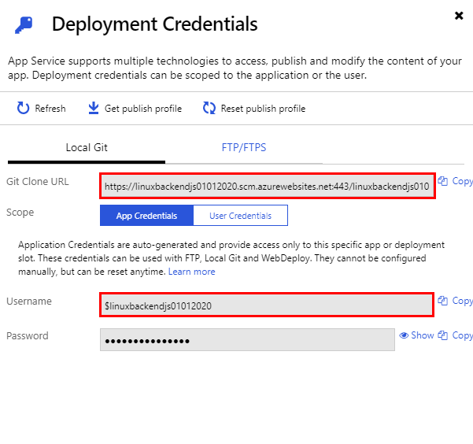

### If you're using the Azure command line

1. Run the command shown below to create a new resource group named **aspnetlinuxrg**. Specify your nearest location, such as **useast** or **westeurope**. You'll find a list of locations with the command `az account list-locations`:

    ```console
    az group create --location <location> --name aspnetlinuxrg
    ```

2. Create a new App Service Plan for hosting a Linux App Service, as follows. Use the same location as before. If the **FREE** service plan SKU isn't available for your location, set `--sku` to **F1** or **B1**:

    ```console
    az appservice plan create --name backendplan --resource-group aspnetlinuxrg --location <location> --is-linux --sku FREE
    ```

3. Create a new App Service using the App Service Plan. Replace *\<web-app-suffix\>* with a combination of your initials and the current date in numeric format. For example, **js01012020**. The `deployment-local-git` flag creates a local Git repository as part of the App Service. Whenever you push changes to this repository, the App Service build processor (*Oryx*) will rebuild and redeploy the code to the App Service:

    ```console
    az webapp create --name linuxbackend<web-app-suffix> --plan backendplan --resource-group aspnetlinuxrg --runtime "dotnetcore|3.0" --deployment-local-git
    ```

## Deploy the BackEnd web API service

For this task, you can either use Visual Studio 2019, or the .NET Core SDK from the command line.

### If you're using Visual Studio 2019

1. In Visual Studio, in Solution Explorer, right-click the **ConferencePlanner** solution, and then click **Add Solution to Source Control**. This action creates a new local Git repository for the project, in the solution folder, and adds the files for projects in the solution to the repository.

    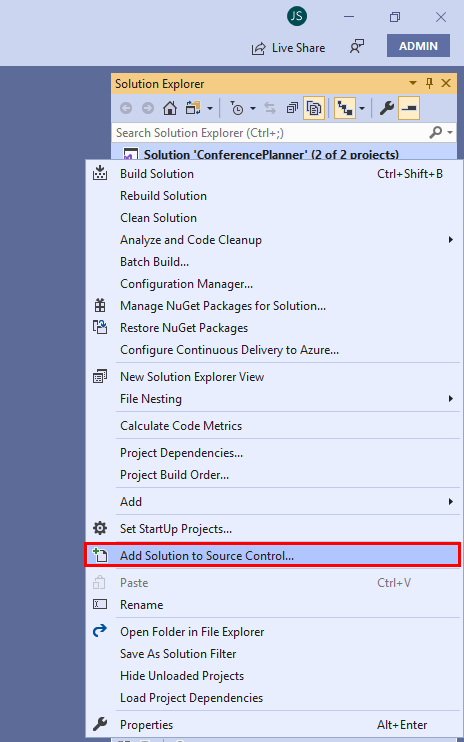

2. On the **View** menu, click **Team Explorer**.

    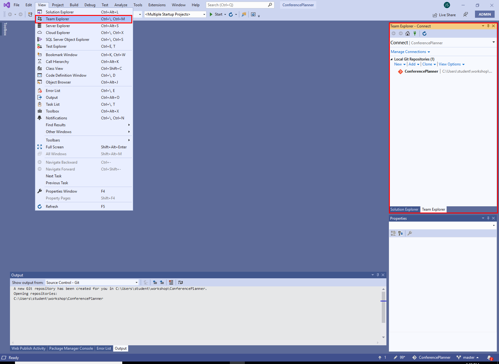

3. In the **Team Explorer** window, click the **Home** button, and then click **Settings**.

    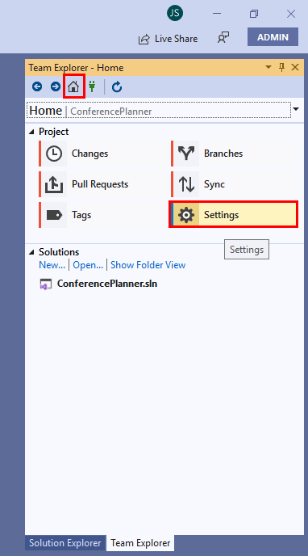

4. In the **Settings** window, click the **Repository Settings** link.

    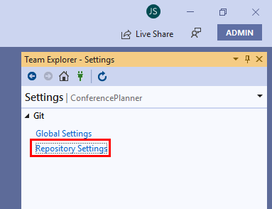

5. In the **Repository Settings** window, in the **Remotes** section, click **Add**.

    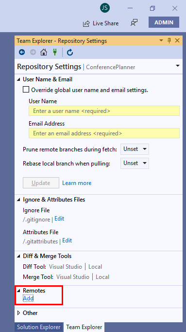

6. In the **Add Remote** dialog box, enter the settings shown in the following table, and then click **Save**:

    | FIeld | Value |
    |-|-|
    | Name | **origin** |
    | Fetch | Copy the value of the **Git Clone URL** from the **Deployment Credentials** pane in the Azure portal |
    | Push matches fetch | Selected |

    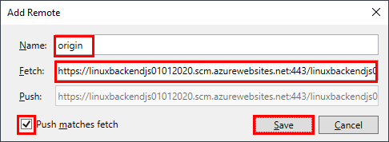

7. In the **Team Explorer** window, click the **Home** button, and then click **Changes**.

    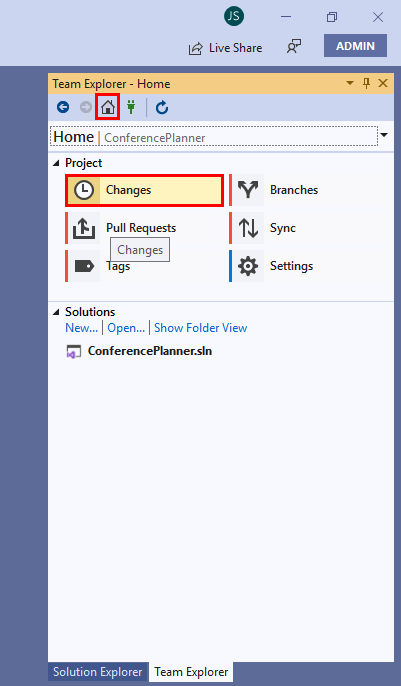

8. In the **Git User Information** dialog box, in the **Name** field, enter the **Username** from the **Deployment Credentials** pane in the Azure portal. Enter your email address, clear the **Set in global .gitconfig** check box, and then click **Save**.

    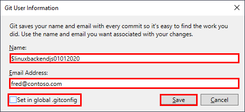

9. In the **Changes** window, scroll down through the **Staged Changes** box to the **FrontEnd** project. Right-click the **FrontEnd** node, and then click **Unstage**. This action prevents the **FrontEnd** project from being included in the deployment.

    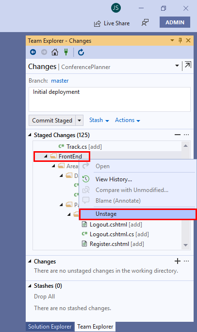

10. In the **Changes** window, enter a commit message of **Initial deployment**. In the **Commit Staged** drop-down list, select **Commit Staged and Push**.

    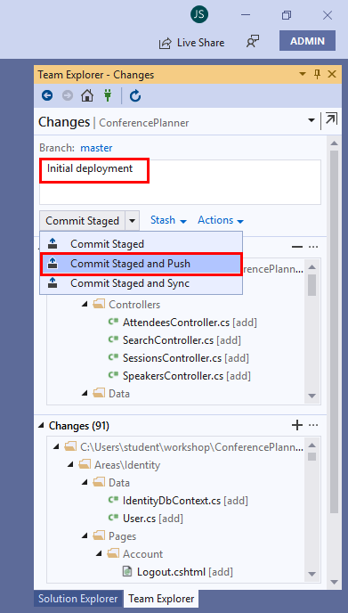

11. In the **Git Credential Manager for Windows** dialog box, specify the user name and password from the **Deployment Credentials** pane in the Azure portal, and then click **OK**.

    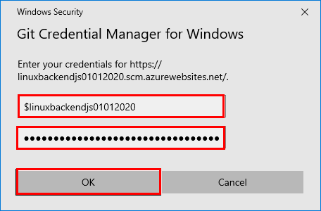

    The changes are pushed to the repository in the App Service, where the project will be rebuilt and deployed. When deployment is complete, you should see the message **Successfully pushed branch master to origin** in the **Synchronization** window in Visual Studio.

    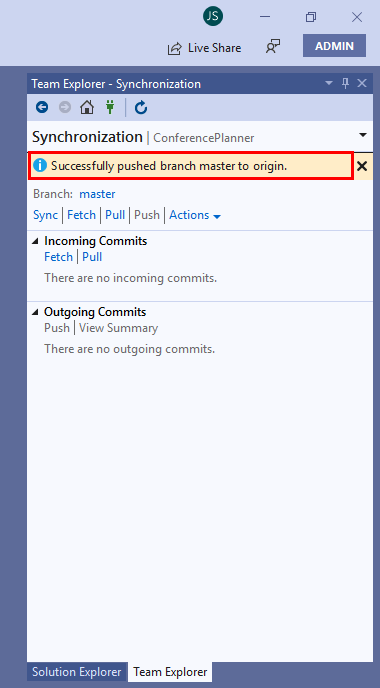

### If you're using the .NET Core CLI

1. Move to the solution folder for the **ConferencePlanner** project.

2. Run the following commands to create a new Git repository for the solution:

    ```console
    git init
    ```

3. Set a global name and email address for identifying commits to the new Git repository. They have no significance outside of this repository. The values specified in the command below are simply placeholders. You can use your own values if you prefer.

    ```console
    git config --global user.email "me@somewhere.com"
    git config --global user.name "me"
    ```

4. Add the files in the **BackEnd** and **ConferenceDTO** projects to the repository, and commit the changes.

    ```console
    git add BackEnd
    git add ConferenceDTO
    git commit -m "Initial deployment"
    ```

5. Run the following command to obtain the URL of the Git repository in the App Service. Make a note of the value returned:

    ```console
    az webapp deployment source show --name linuxbackend<web-app-suffix> --resource-group aspnetlinuxrg --query repoUrl --output tsv
    ```

6. Add the Git repository in the App Service as a remote repository for the local repository you created in step 4. Replace *\<remote-repo-url\>* with the URL you retrieved in step 5.

    ```console
    git remote add azure <remote-repo-url>/linuxbackend<web-app-suffix>.git
    ```

7. Create a set of credentials for pushing changes to the repository in the App Service. Replace *\<username\>* and *\<password\>* with values of your choice. Make sure that the password consists of numbers, uppercase and lowercase letters, and other characters, and is at least eight characters long.

    ```console
    az webapp deployment user set --user-name <username> --password <password>
    ```

8. Push the changes from the local repository to the App Service. When prompted, enter the user name and password for the repository in the App Service that you created in step 7.

    ```console
    git push azure master
    ```

    You'll see a series of messages as the application is deployed.

## Test the BackEnd web API service

1. Open the web browser if it isn't already open.

2. Move to the Swagger endpoint of the web API service, **https://linuxbackend\<*web-app-suffix\>*.azurewebsites.net/swagger**.

3. In the **Sessions** section, click the **POST** button for the **/api/Sessions/upload** operation, and then click **Try it out**.

4. In the **Parameters** section, at the **file** prompt, click **Browse**.

5. In the **Open** dialog box, browse to the folder containing your clone of the GitHub repository, move to the folder **src/BackEnd/Data/Import** in the repository, select the file **NDC_London_2020.json**, and then click **Open**.

6. In the web browser, click **Execute**, and wait for the data to be uploaded. Verify that the upload is successful. The server response code should be 200.

    

7. Open the **appsettings.json** file in the root folder of the **FrontEnd** project, and replace the value of the **ServiceUrl** settings with the URL of the **BackEnd** service running as an App Service, **https://linuxbackend\<*web-app-suffix\>*.azurewebsites.net**.

8. Start the **FrontEnd** web application:

   - **If you're using Visual Studio 2019:**

        - In Solution Explorer, right-click the **FrontEnd** project, point to **Debug**, and then click **Start new instance**.
  
   - **If you're using the .NET Core CLI:**

        1. Move to the root folder of the **FrontEnd** project and rebuild the project:

            ```console
            dotnet build
            ```

        2. Start the **FrontEnd** project in a new session:

            ```console
            start dotnet run
            ```

        3. When the application starts, make a note of the URLs for the endpoints on which the app is listening:

            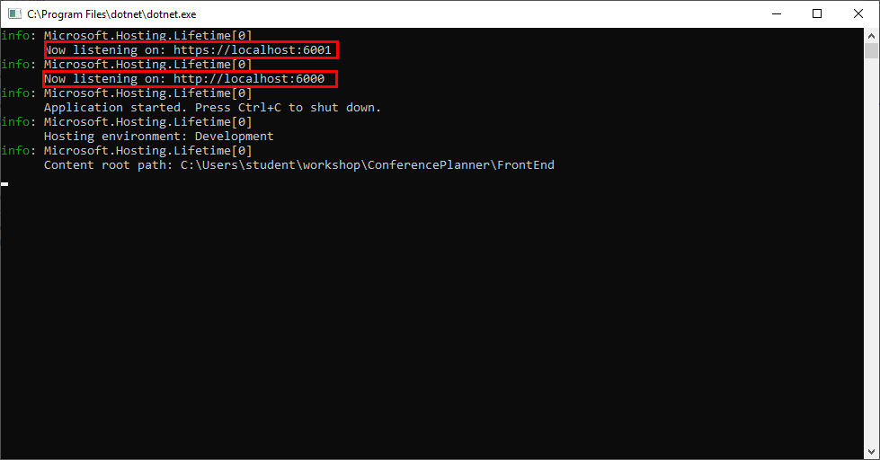

        4. Open a browser window at one of the URLs for the **FrontEnd** web app.

    When the web API service has been published, a web browser window will open and display the home page of the Conference web app. The web app should display the conference data, retrieved from the web API service running as an App Service.

    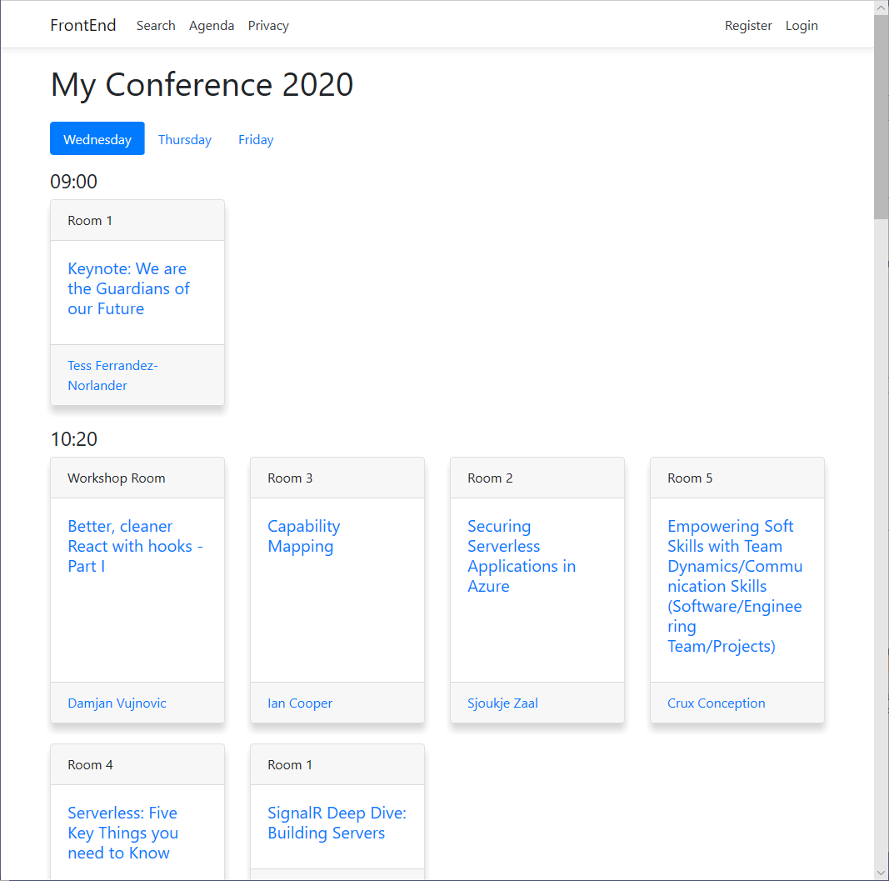

9. Verify that the web application connects successfully to the **BackEnd** web API service, and that you can browse sessions.

# Deploy the BackEnd web API service and FrontEnd web application to Docker

In this exercise, you'll deploy the **BackEnd** web API service and the **FrontEnd** web application to a Docker container, running locally on your computer.

Before starting this exercise, make sure you have Docker installed and running on your computer. If you are using Visual Studio, ensure that you also install the Visual Studio Tools for Docker. For more information and instructions, see the following links:

- [Docker for Windows](https://www.docker.com/docker-windows)
- [Docker for Mac](https://www.docker.com/docker-mac)
- [Visual Studio Tools for Docker with ASP.NET Core](https://docs.microsoft.com/aspnet/core/host-and-deploy/docker/visual-studio-tools-for-docker)

For this exercise, start with a copy of the solution in the [Docker folder of the Session 6 save point folder](../save-points/6-Deployment-docker/Docker). In this version of the solution, the **FrontEnd** and **BackEnd** projects are configured to use a local SQL Server database.

## Prepare the BackEnd and FrontEnd projects

1. Add the NuGet package `Microsoft.AspNetCore.Diagnostics.EntityFrameworkCore`, version `3.1.2` to the **BackEnd** and **FrontEnd** projects.

    - **If you're using Visual Studio 2019:**

        - Use the **Nuget Package Manager**, and follow the instructions described earlier. Make sure you add the package to both projects.

    - **If you're using the .NET Core CLI:**

        1. Move to the **BackEnd** project folder and run the following command:

            ```console
            dotnet add package Microsoft.AspNetCore.Diagnostics.EntityFrameworkCore --version 3.1.2
            ```

        2. Move to the **FrontEnd** project folder and repeat the same command.

2. Open the **Startup.cs** file in the **BackEnd** project, and add the `app.UseDatabaseErrorPage();` statement shown below to the **Configure** method, immediately after `UseDeveloperExceptionPage();`:

    ```csharp
    public void Configure(IApplicationBuilder app, IWebHostEnvironment env)
    {
        if (env.IsDevelopment())
        {
            app.UseDeveloperExceptionPage();
            app.UseDatabaseErrorPage();
        }

        ...
    }
    ```

3. Comment out the `app.UseHttpsRedirection();` statement in the **Configure** method:

    ```csharp
    public void Configure(IApplicationBuilder app, IWebHostEnvironment env)
    {
        ...
        // app.UseHttpsRedirection();
        ...
    }
    ```

4. Make the same changes in the **Configure** method in the **Startup.cs** file for the **FrontEnd** project.

5. In the **BackEnd** project, add the code shown below to the end of the **Configure** method in the **Startup.cs** file. This code runs the database migrations required to create the tables in the database for the web API service:

    ```csharp
    public void Configure(IApplicationBuilder app, IWebHostEnvironment env)
    {
        ...
        using (var scope = app.ApplicationServices.GetRequiredService<IServiceScopeFactory>().CreateScope())
        {
            using (var context = scope.ServiceProvider.GetService<ApplicationDbContext>())
            {
                context.Database.Migrate();
            }
        }
    }
    ```

6. In the **FrontEnd** project, in the **Startup.cs** file, add the directive `using Microsoft.EntityFrameworkCore;` to the list at the start of the file.

7. Add the code shown below to the end of the **Configure** method in the **Startup.cs** file. This code runs the database migrations required to create the identity tables in the database used by the web application:

    ```csharp
    public void Configure(IApplicationBuilder app, IWebHostEnvironment env)
    {
        ...
        using (var scope = app.ApplicationServices.GetRequiredService<IServiceScopeFactory>().CreateScope())
        {
            using (var context = scope.ServiceProvider.GetService<IdentityDbContext>())
            {
                context.Database.Migrate();
            }
        }
    }
    ```

## Create Docker scripts for the **BackEnd** project

1. Add Docker support to the **BackEnd** project:

    - **If you're using Visual Studio:**

        1. In Solution Explorer, right-click the **BackEnd** project, point to **Add**, and then click **Docker Support**.

            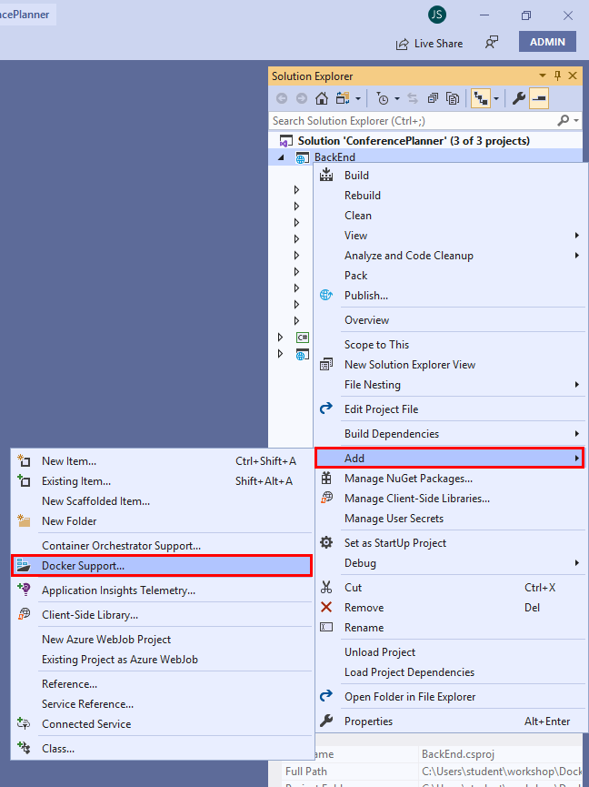

        2. In the **Docker File Options** dialog box, under **Target OS**, click **Linux**, and then click **OK**.

            

        3. If the **Install Docker Desktop** dialog box shown below appears, click **Yes** to install Docker Desktop and Windows Hyper-V features. Use the default options, and selected Linux containers when prompted. Restart your computer when the installation has completed.

            > **Note:** If you already have Docker Desktop installed on your computer, this dialog box won't appear.

            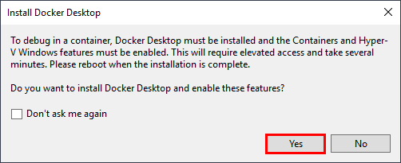

        4. Open the **Dockerfile** file in the root folder of the **BackEnd** project. This file contains a script for creating a Docker image from the project. Examine the file, but don't change anything.

    - **If you're using the .NET Core CLI:**

        1. Verify that you've installed Docker Desktop, as described at the start of this exercise.

        2. In the root folder of the **BackEnd** project, create a file named **Dockerfile**, using a text editor of your choice.

        3. Add the following image build instructions to the file. This script creates a Docker image from the **BackEnd** project:

            ```Dockerfile
            FROM mcr.microsoft.com/dotnet/core/aspnet:3.1-buster-slim AS base
            WORKDIR /app
            EXPOSE 80
            EXPOSE 443

            FROM mcr.microsoft.com/dotnet/core/sdk:3.1-buster AS build
            WORKDIR /src
            COPY ["BackEnd/BackEnd.csproj", "BackEnd/"]
            COPY ["ConferenceDTO/ConferenceDTO.csproj", "ConferenceDTO/"]
            RUN dotnet restore "BackEnd/BackEnd.csproj"
            COPY . .
            WORKDIR "/src/BackEnd"
            RUN dotnet build "BackEnd.csproj" -c Release -o /app/build

            FROM build AS publish
            RUN dotnet publish "BackEnd.csproj" -c Release -o /app/publish

            FROM base AS final
            WORKDIR /app
            COPY --from=publish /app/publish .
            ENTRYPOINT ["dotnet", "BackEnd.dll"]
            ```

2. Add **Container Orchestration Support** to the **BackEnd** project:

    - **If you're using Visual Studio 2019:**

        1. In Solution Explorer, right-click the **BackEnd** project, point to **Add**, and then click **Container Orchestration Support**.

            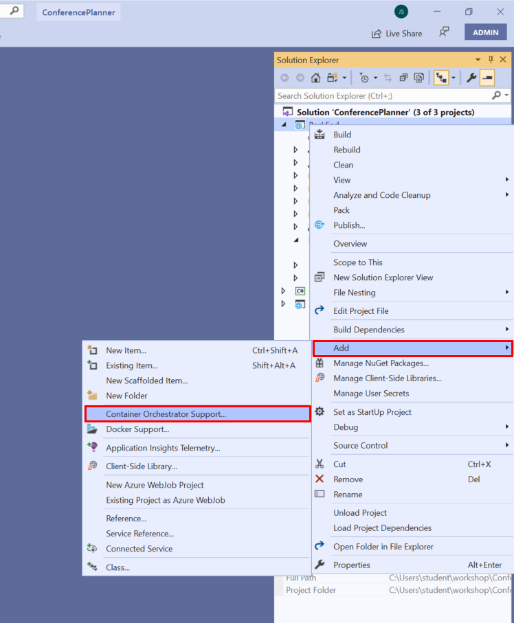

        2. In the **Add Container Orchestration Support** dialog box, select **Docker Compose**, and then click **OK**.

            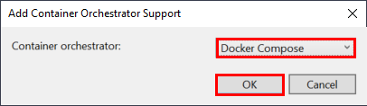

        3. In the **Docker Support Options** dialog box, click **Linux**, and then click **OK**.

            Visual Studio creates a **docker-compose** project and adds it to the solution. The project contains a configuration file named **docker.compose.yml**. This file specifies how Docker organizes and runs the images in the solution.

            > **Note:** Visual Studio will automatically build and deploy the configuration to Docker. You might see a message box asking you to enable sharing for the drive containing the code on your computer with Docker. You should enable sharing, otherwise Docker can't build and run the image.

    - **If you're using the .NET Core CLI:**

        1. Move to the root folder of the **ConferencePlanner** solution.

        2. Create a file named **docker-compose.yml** using a text editor of your choice.

        3. Add the following orchestration configuration to the file:

            ```yaml
            version: '3.4'

            services:
                backend:
                    image: ${DOCKER_REGISTRY-}backend
                    build:
                        context: .
                        dockerfile: BackEnd/Dockerfile
            ```

## Create Docker scripts for the **FrontEnd** project

1. Add Docker support to the **FrontEnd** project:

    - **If you're using Visual Studio:**

        1. In Solution Explorer, right-click the **FrontEnd** project, point to **Add**, and then click **Docker Support**.

        2. In the **Docker File Options** dialog box, under **Target OS**, click **Linux**, and then click **OK**.

        3. Examine the **Dockerfile** file in the root folder of the **FrontEnd** project. This script is similar to that for the **BackEnd** project. Don't change anything.

    - **If you're using the .NET Core CLI:**

        1. In the root folder of the **FrontEnd** project, create a file named **Dockerfile**, using a text editor of your choice.

        2. Add the following image build instructions to the file. This script creates a Docker image from the **FrontEnd** project:

            ```Dockerfile
            FROM mcr.microsoft.com/dotnet/core/aspnet:3.1-buster-slim AS base
            WORKDIR /app
            EXPOSE 80
            EXPOSE 443

            FROM mcr.microsoft.com/dotnet/core/sdk:3.1-buster AS build
            WORKDIR /src
            COPY ["FrontEnd/FrontEnd.csproj", "FrontEnd/"]
            COPY ["ConferenceDTO/ConferenceDTO.csproj", "ConferenceDTO/"]
            RUN dotnet restore "FrontEnd/FrontEnd.csproj"
            COPY . .
            WORKDIR "/src/FrontEnd"
            RUN dotnet build "FrontEnd.csproj" -c Release -o /app/build

            FROM build AS publish
            RUN dotnet publish "FrontEnd.csproj" -c Release -o /app/publish

            FROM base AS final
            WORKDIR /app
            COPY --from=publish /app/publish .
            ENTRYPOINT ["dotnet", "FrontEnd.dll"]
            ```

2. Add **Container Orchestration Support** to the **FrontEnd** project:

    - **If you're using Visual Studio 2019:**

        1. In Solution Explorer, right-click the **FrontEnd** project, point to **Add**, and then click **Container Orchestration Support**.

        2. In the **Add Container Orchestration Support** dialog box, select **Docker Compose**, and then click **OK**.

        3. In the **Docker Support Options** dialog box, click **Linux**, and then click **OK**.

            Visual Studio updates the **docker.compose.yml** file in the **docker-compose** project with details of the image for the **FrontEnd** project.

    - **If you're using the .NET Core CLI:**

        1. In the root folder of the **ConferencePlanner** solution, edit the **docker-compose.yml**.

        2. Add the **frontend** orchestration configuration shown below to the file, after the **backend** configuration:

            ```yaml
            version: '3.4'

            services:
                backend:
                    ...

                frontend:
                    image: ${DOCKER_REGISTRY-}frontend
                    build:
                        context: .
                        dockerfile: FrontEnd/Dockerfile
            ```

## Add SQL Server to the configuration

1. Edit the **docker-compose.yml** file, and add the **db** configuration shown below, after the **frontend** service:

    ```yaml
    version: '3.4'

        services:
            backend:
                ...

            frontend:
                ...

            db:
                image: "microsoft/mssql-server-linux"
                environment:
                    SA_PASSWORD: "ConferencePlanner!1234"
                    ACCEPT_EULA: "Y"
    ```

2. Modify the **backend** configuration and add the **depends_on** entry shown below. The **BackEnd** service shouldn't be able to start until the database container is ready and the database is available:

    ```yaml
    ...
    backend:
        image: backend
        build:
            context: .
            dockerfile: BackEnd/Dockerfile
        depends_on:
           - db
    ...
    ```

3. Add the **links** section shown below to the **frontend** definition. This entry sets up the host name in the Docker networking, enabling the **FrontEnd** web application to call the **BackEnd** web API service with the URL **http://backend** inside the Docker environment:

    ```yaml
    ...
    frontend:
        image: frontend
        build:
            context: .
            dockerfile: FrontEnd/Dockerfile
        links:
            - backend
    ...
    ```

4. **If you're using the .NET Core CLI**, move to the root folder of the **ConferencePlanner** solution, and create a file named **docker-compose.override.yml** file. Add the configuration information shown below to this file:

    > **Note:** If you're using Visual Studio, the **docker-compose.override.yml** file is generated automatically, so you don't need to perform this step manually.

    ```yaml
    version: '3.4'

    services:
        backend:
            environment:
                - ASPNETCORE_ENVIRONMENT=Development
                - ASPNETCORE_URLS=http://+:80
            ports:
                - "63145:80"
            volumes:
                - ${APPDATA}/Microsoft/UserSecrets:/root/.microsoft/usersecrets:ro
                - ${APPDATA}/ASP.NET/Https:/root/.aspnet/https:ro
        frontend:
            environment:
                - ASPNETCORE_ENVIRONMENT=Development
                - ASPNETCORE_URLS=http://+:80
            ports:
                - "56004:80"
            volumes:
                - ${APPDATA}/Microsoft/UserSecrets:/root/.microsoft/usersecrets:ro
                - ${APPDATA}/ASP.NET/Https:/root/.aspnet/https:ro
    ```

    In this configuration, port **63145** on your computer will be mapped to port **80** for the **BackEnd** service. Port **56004** on your computer will be mapped to port **80** for the **FrontEnd** web application.

5. In the **BackEnd** project folder, open the **appsettings.json** file, and modify the default connection string as shown below. This string connects to SQL Server running in the Docker container:

    ```json
    ...
    "ConnectionStrings": {
        "DefaultConnection": "Server=db;Initial Catalog=ConferencePlanner;User=sa;Password=ConferencePlanner!1234;MultipleActiveResultSets=true"
    },
    ...
    ```

6. In the **FrontEnd** project folder, open the **appsettings.json** file, and change the value of the **ServiceUrl** property, and the **IdentityDvContextConnection** property, as shown below:

    ```json
    {
        ...
        "AllowedHosts": "*",
        "ServiceUrl": "http://backend/",
        "ConnectionStrings": {
            "IdentityDbContextConnection": "Server=db;Initial Catalog=FrontEnd;User=sa;Password=ConferencePlanner!1234;MultipleActiveResultSets=true"
        }
    }
    ```

## Test the solution

- **If you're using Visual Studio 2019:**

    1. In Solution Explorer, right-click the **docker-compose** project, and then click **Set as Startup Project**.

    2. On the **Build** menu, click **Rebuild Solution**. Verify that the solution builds successfully.  
  
    3. On the **Debug** menu, click **Start Debugging**.
    
    4. If the **Trust SSL Certificate** dialog box appears, click **Yes**. In the **Security Warning** dialog box, click **Yes**.
    
    5. In the **View Downloads** dialog box, click **Open**.
    
    6. The **speakers.json** file opens showing an empty list of speakers, because the database is currently empty.

    7. In the web browser, move to the **Swagger** endpoint for the **BackEnd** service, `https://localhost:<port>/swagger`. The **Swagger** UI page should appear. The *\<port\>* can be found in Visual Studio, in the **Containers** window, and click the **Containers** and **Ports** tabs. In the left pane listing containers, select the **BackEnd** container.

    8.  In the **Sessions** section, click the **POST** button for the **/api/Sessions/upload** operation, and then click **Try it out**.

    9.  In the **Parameters** section, at the file prompt, click **Browse**.

    10. In the **Open** dialog box, browse to the folder containing your clone of the GitHub repository, move to the folder **src/BackEnd/Data/Import** in the repository, select the file **NDC_London_2020.json**, and then click **Open**.

    11. In the web browser, click **Execute**, and wait for the data to be uploaded. Verify that the upload is successful. The server response code should be 200.

        

    12. In Visual Studio, select the **Containers** window, and click the **Containers** and **Ports** tabs. In the left pane listing containers, select the **FrontEnd** container.

        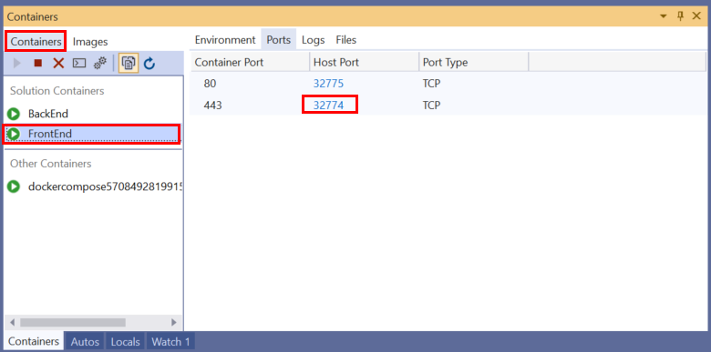

    13. In the list of ports for the **FrontEnd** container, click the **Host Port** link for **Container Port** 443; **Host port** 32774 in the image above. The web browser will open a page at this port, running on the server in the container. This is the URL for the **BackEnd** web API service in the container.

        The web browser will open the home page for the **FrontEnd** application, displaying the list of sessions for the conference.

        

    14. Verify that you can register, sign in, and create a personal agenda.

    15. When you've finished, in Visual Studio, on the **Debug** menu, click **Stop Debugging**.

    > **Note:** Stopping the debug session doesn't stop the services or containers running in Docker. You can still connect to the FrontEnd web app and BackEnd web API service from a browser.

- **If you're using the .NET Core CLI:**

    1. Move to the root folder of the **ConferencePlanner** solution.

    2. Run the following command to build the Docker images:

        ```console
        docker-compose build
        ```

    3. Start the application with the following command:

        ```console
        docker-compose up -d
        ````

    4. Open a web browser, and go to the URL **http://localhost:63145/swagger/index.html**. The Swagger UI for the **BackEnd** web API service should appear.

    5. In the **Sessions** section, click the **POST** button for the **/api/Sessions/upload** operation, and then click **Try it out**.

    6. In the **Parameters** section, at the file prompt, click **Browse**.

    7. In the **Open** dialog box, browse to the folder containing your clone of the GitHub repository. Move to the folder **src/BackEnd/Data/Import** in the repository, select the file **NDC_London_2020.json**, and then click **Open**.

    8. Back in the web browser, click **Execute**, and wait for the data to be uploaded. Verify that the upload is successful. The server response code should be 200.

    9. In the web browser, move to the URL **http://localhost:56004/**. The home page for the **FrontEnd** web application should be displayed, listing the conference sessions.

    10. Verify that you can register, sign in, and create a personal agenda.

    11. When you've finished, run the following command from the command prompt to stop the application, and remove the containers from Docker:

        ```console
        docker-compose down
        ```

    > **Note:** If you remove the containers, you'll lose the data in the database as it isn't saved to persistent storage.

# Deploy the BackEnd web API service and FrontEnd web application to Azure App Services using Azure DevOps

In this exercise, you'll deploy the **BackEnd** web API service and the **FrontEnd** web application to a pair of Azure App services. You'll use Azure DevOps to manage the deployment process. Azure DevOps supports CI/CD scenarios, enabling you to quickly deploy updates to the web API service as the code is modified and released after testing.

> **Note:** For this exercise, start with the solution in the [DevOps Starter folder under the Session 6 save point folder](../save-points/6-Deployment-docker/DevOps/Starter). Don't try and perform this exercise using the Docker-enabled solution from the previous exercise because DevOps integration in Visual Studio will attempt to create a Docker image and container in the Azure Container Registry.

## Prepare the virtual infrastructure

> **Note:** This task creates the SQL Server databases and App Services required by the system using the Azure CLI from the command line. You can do these tasks using the Azure portal if your prefer, by following the steps shown in the earlier exercises.

1. If you haven't already done so, [install the Azure CLI](https://docs.microsoft.com/cli/azure/install-azure-cli?view=azure-cli-latest).

2. Run the command shown below, and follow the instructions to sign in to the account associated with your Azure subscription:

    ```console
    az login
    ```

3. Run the following command to create a new resource group named **devopsrg**. Replace *\<location\>* with the name of your nearest Azure location, such as *westus*, *eastus*, *westeurope*, and so on:

    > **Note:** You can obtain a list of valid locations using the command `az account list-locations`.
  
    ```console
    az group create --location <location> --name devopsrg
    ```

4. Run the following command to create a new Azure SQL Server. Use the same location as before, and provide your initials and current data numeric format for *\<service-name-suffix\>*. Specify an administrator password of your choice:
  
    ```console
    az sql server create --name backendserver<service-name-suffix> --resource-group devopsrg --location <location> --admin-user azureadmin --admin-password <password>
    ```

5. Run the command shown below to obtain the IP address of your computer. Make a note of the IP address:

    ```console
    ipconfig
    ```

6. Execute the following commands to open the SQL Server firewall. Replace *\<your-ip-address\>* with the address of your computer. These commands will allow you to access the server from your computer, and from Azure services, including the **BackEnd** web API service:
  
    ```console
    az sql server firewall-rule create --name sql --resource-group devopsrg --server backendserver<service-name-suffix> --start-ip-address <your-ip-address> --end-ip-address <your-ip-address>

    az sql server firewall-rule create --name azure --resource-group devopsrg --server backendserver<service-name-suffix> --start-ip-address 0.0.0.0 --end-ip-address 0.0.0.0
    ```

7. Create a SQL Server database, named **conference_db**, as shown below. The **BackEnd** web API service will use this database to store conference information:

    ```console
    az sql db create --name conference_db --resource-group devopsrg --server backendserver<service-name-suffix> --edition Basic
    ```

8. Create another SQL Server database, named **security_db**, as shown below. The **FrontEnd** web application will use this database to store user account information:

    ```console
    az sql db create --name security_db --resource-group devopsrg --server backendserver<service-name-suffix> --edition Basic
    ```

9. Create a new Azure App Service plan with the following command. The **D1** SKU uses a low-cost shared infrastructure that's suitable for development environments:
  
    ```console
    az appservice plan create --name webserviceplan --resource-group devopsrg --sku D1
    ```

10. Create an Azure Web App using the App Service Plan. Replace *\<service-name-suffix\>* with your initials and the current date in numeric format. This web app will host the **BackEnd** web API service.

    ```console
    az webapp create --name backend<service-name-suffix> --plan webserviceplan --resource-group devopsrg
    ```

11. Create another Azure Web App. This web app will host the **FrontEnd** web application.

    ```console
    az webapp create --name frontend<service-name-suffix> --plan webserviceplan --resource-group devopsrg
    ```

## Configure the **BackEnd** and **FrontEnd** projects

> **Note:** For continuity with the previous task, the steps in this task also use the command line. Previous exercises have shown how to perform the operations in this task from Visual Studio.

1. Run the following command to retrieve the connection string for the **conference_db** database:

    ```console
    az sql db show-connection-string --name conference_db --server backendserver<service-name-suffix> --client ado.net
    ```

2. Move to the root folder of the **BackEnd** project.

3. Open the **appsettings.json** file. Replace the value of the **DefaultConnection** property with the string returned in the previous step. In this string, replace *\<username\>* with **azureadmin**, and replace *\<password\>* with the password you specified when you created the Azure SQL Server. The file should look similar to this:

    ```json
    {
        "ConnectionStrings": {
            "DefaultConnection": "Server=tcp:backendserver<service-name-suffix>.database.windows.net,1433;Database=conference_db;User ID=azureadmin;Password=<password>;Encrypt=true;Connection Timeout=30;"
        },
        "Logging": {
            "LogLevel": {
                "Default": "Information",
                "Microsoft": "Warning",
                "Microsoft.Hosting.Lifetime": "Information"
            }
        },
        "AllowedHosts": "*"
    }
    ```

4. Install the **Entity Framework** database migration tools if you haven't already done so, as follows:

    1. Run the following command:

        ```console
        dotnet tool install -g dotnet-ef --version 3.1.2
        ```

    2. Close the command prompt window, and start a new command prompt session.

    3. Return to the **BackEnd** project folder.

5. Use the commands shown below to create and run a database migration. These commands will create the tables for the web API service in the new SQL Server database in Azure:

    ```console
    dotnet ef migrations add MoveToDevops
    dotnet ef database update
    ```

6. Move to the root folder of the **FrontEnd** project.

7. Open the **appsettings.json** file. Replace the value of the **IdentityDbContextConnection** property with the same value you specified for the **BackEnd** project, but change the database name to **security_db**. 

    Additionally, replace the **ServiceUrl** property with the address of the App Service you created for the **BackEnd** web API service:

    ```json
    {
        "Logging": {
            "LogLevel": {
                "Default": "Information",
                "Microsoft": "Warning",
                "Microsoft.Hosting.Lifetime": "Information"
            }
        },
        "AllowedHosts": "*",
        "ServiceUrl": "https://backend<service-name-suffix>.azurewebsites.net/",
        "ConnectionStrings": {
            "IdentityDbContextConnection": "Server=tcp:backendserver<service-name-suffix>.database.windows.net,1433;Database=security_db;User ID=azureadmin;Password=<password>;Encrypt=true;Connection Timeout=30;"
        }
    }
    ```

8. Run the following commands to create the security database for the **FrontEnd** project in the SQL Server database in Azure.

    ```console
    dotnet ef migrations add MoveToDevops
    dotnet ef database update
    ```

## Create an Azure DevOps project

> **Note:** The remaining tasks in this exercise use the Azure portal, the Azure DevOps portal, and Visual Studio 2019.

1. Open a web browser and go to the [Azure DevOps page](https://azure.microsoft.com/services/devops/).

2. If you already have a DevOps account, click **Sign in to Azure DevOps**, otherwise click **Start free**. Follow the instructions to sign in to your Azure account and create a new DevOps account.

    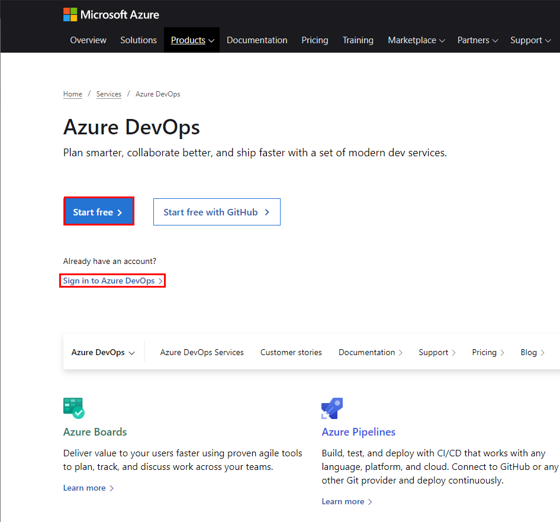

3. **If you've created a new account**, DevOps will automatically create a new project. You'll see the home page for your new project. Make a note of the project name, which will typically be the same as your account name.

    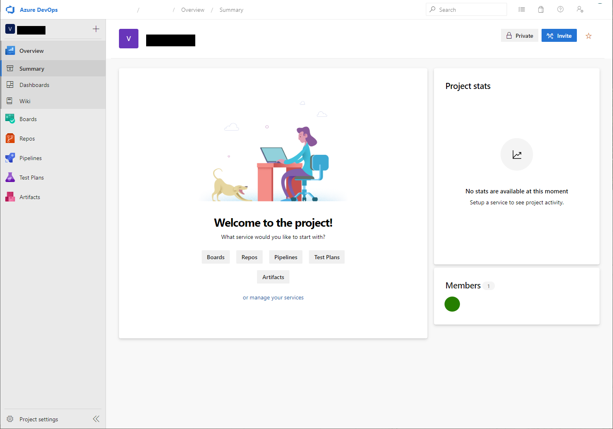

    **If you've signed in to an existing account**, you'll be taken to the **Organizations** page instead. Click **+ New Project** to create a new project, and give it a meaningful name.

    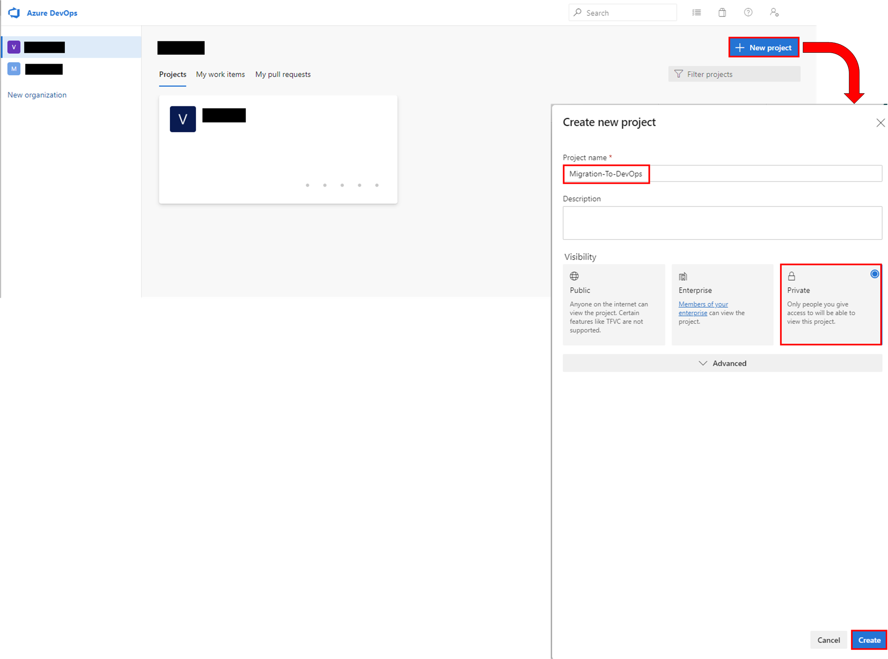

## Connect the ConferencePlanner solution to Azure DevOps

1. In Visual Studio, if you haven't already done so, sign in to your Azure subscription:

    1. On the **View** menu, click **Cloud Explorer**.

    2. In the **Cloud Explorer** window, click the **Account Management** button, and then click **Manage Accounts**.

        

    3. In the **Sign in to Visual Studio** dialog box, click **Sign in**.

        

    4. In the **Sign in to your account** dialog box, sign in using the credentials associated with your Azure subscription.

    5. When you've signed in, in the **Personalization Account** dialog box, click **Close**.

        

    6. In the **Cloud Explorer** window, click **Apply**, and then close the **Cloud Explorer** window.

        

2. In Team Explorer, click the **Home** icon, and then click **Settings**.

3. On the **Settings** page, click **Global Settings**.

4. On the **Git Settings** page, enter a user name and email address (if these fields are empty), and then click **Update**. You can specify any name and address; these settings are only used to identify the user that has pushed changes to the DevOps repository, but aren't used for authentication purposes.

    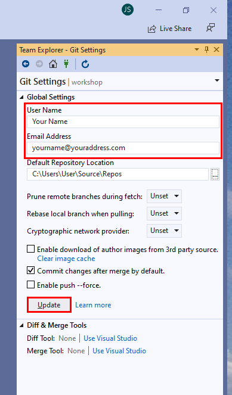

5. In Solution Explorer, right-click the **ConferencePlanner** solution, and then click **Configure Contininuous Delivery to Azure**.

    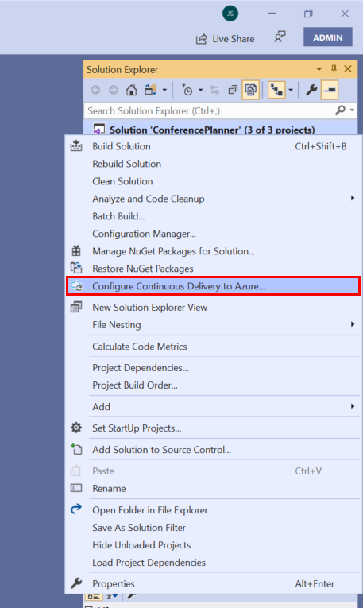

6. In the **Setup Azure Pipelines** dialog box, you'll receive the message **The solution needs to be under source control on Azure DevOps or GitHub**. Click the **Add it to source control now** link.

    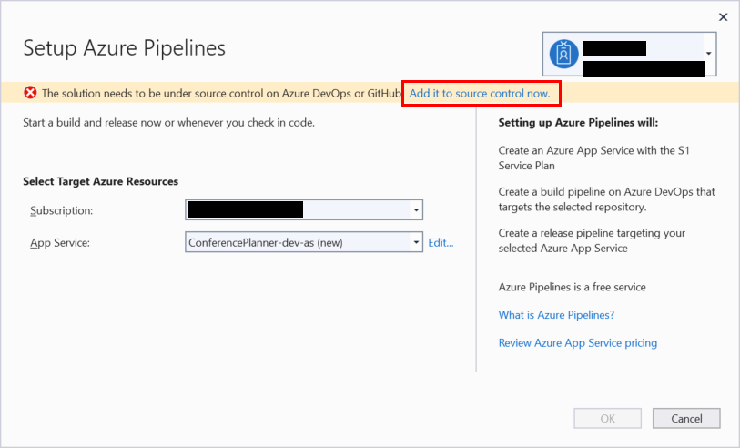

7. The **Team Explorer** window will appear. In the **Azure DevOps** pane, click **Publish Git Repo**

    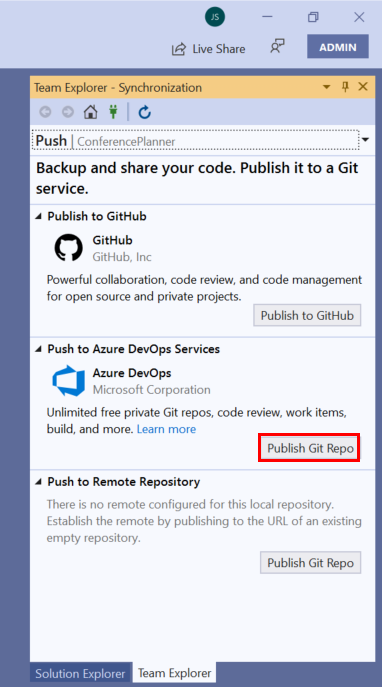

8. In the **Push to Azure DevOps Services** pane in **Team Explorer**, select your Azure DevOps account and organization, and then click **Advanced**. The organization account will have the same identifier as your account name. 

    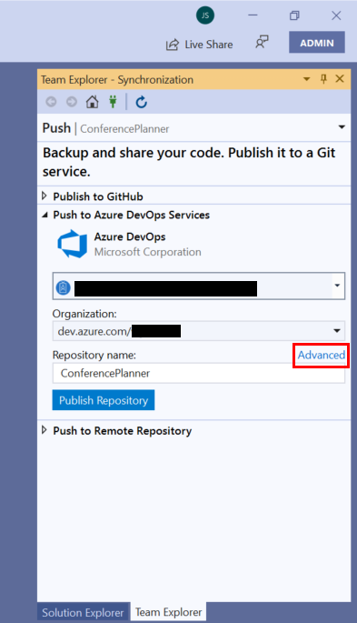

9. In the **Project** drop-down list box, select the Azure DevOps project you created earlier, and then click **Publish Repository**.

    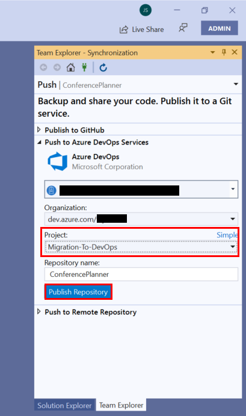

    This action will put your solution under the control of a local Git repository on your computer. You'll set the origin of your local repository to the repository in the DevOps project. When you push changes from your local repository, they'll be recorded in the DevOps repository.

10. Switch to your Azure DevOps project in the web browser.

11. In the left pane, click **Repos**. In the navigation bar at the top of the page, click the **ConferencePlanner** repository.

    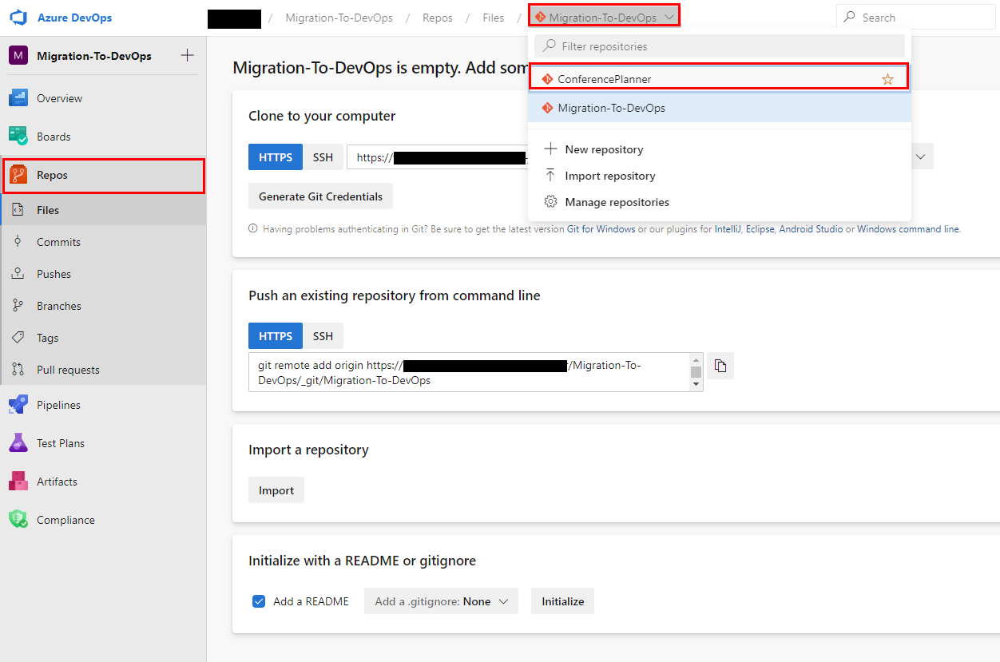

    After you've selected the repository, you should see the files and folders for the solution. These files were uploaded when you used the **Publish Repository** feature in Visual Studio.

    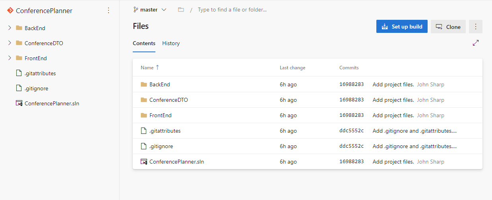

## Create an Azure DevOps pipeline to automate builds

An Azure pipeline is a series of commands that run each time you push changes to the DevOps repo. You use a pipeline to deploy updates to the Azure App Services that will be used to host the **BackEnd** and **FrontEnd** projects.

1. Return to Visual Studio.

2. In the **Home** pane of the **Team Explorer** window, click **Azure Pipelines**.

    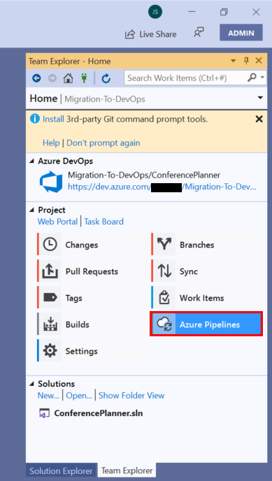

3. In the **Setup Azure Pipelines** dialog box, in the **Select Target Azure Resources** section, in the **App Service** drop-down list box, select the App Service you created for the **BackEnd** web API service, **backend\<service-name-suffix\>**, and then click **OK**.

    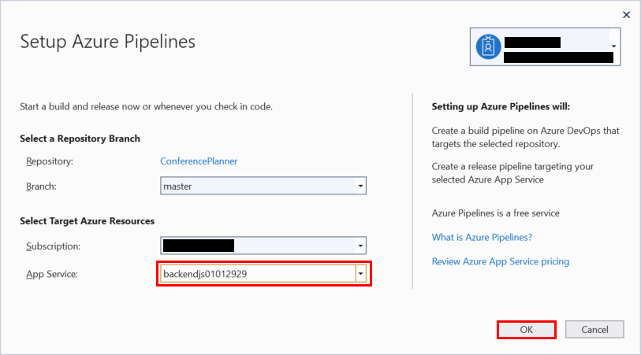

    Visual Studio will create a default pipeline for building and deploying the solution. You'll see a series of messages appear in the **Output** window. Wait until the message **The build pipeline setup for Azure DevOps Project migration-to-devops completed successfully** is displayed:

    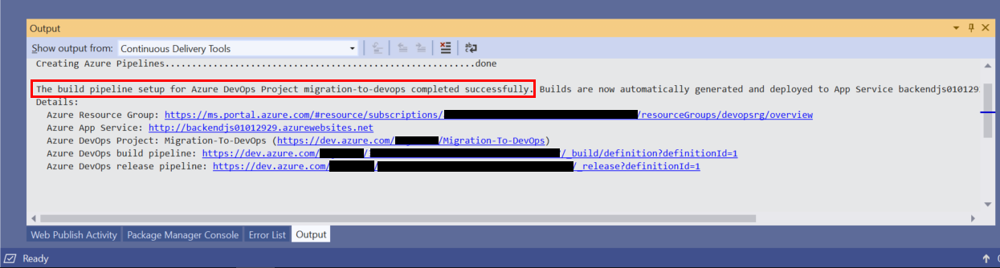

4. Return to your Azure DevOps project in the web browser. In the left pane, click **Pipelines**. You'll see the new pipeline, but you'll also notice that it failed. This is because the default pipeline is simply a skeleton. You must customize it for the specifics of your solution before it will run properly.

    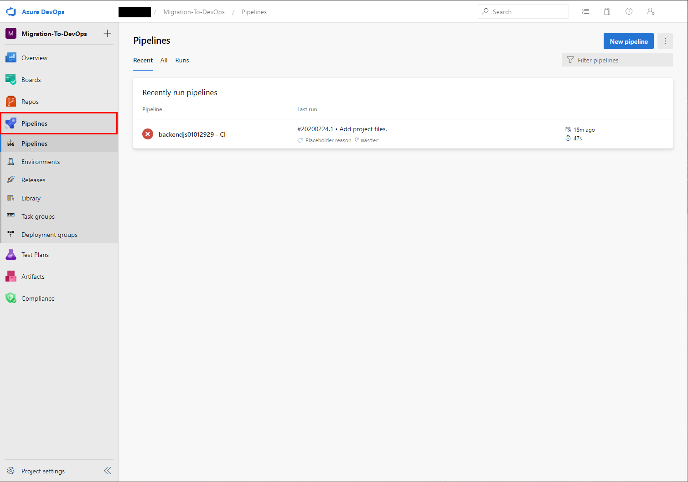

5. Click the pipeline, and then click **Edit**.

    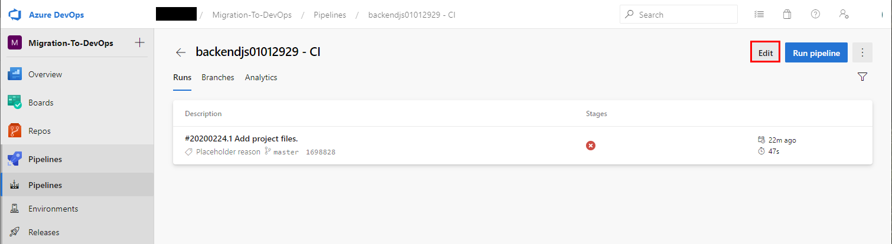

    The pipeline definition is displayed, listing the tasks completed by the default pipeline. 

    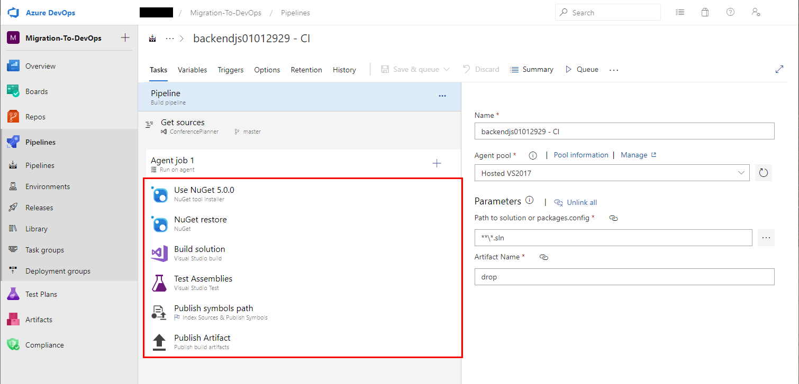

    For the **ConferencePlanner** solution, you'll replace many of these tasks and modify the pipeline to perform the following workflow:

    1. Switch to the .NET Core SDK version 3.1. The default pipeline uses version 2.1.
    2. Install NuGet version 5.0.0.
    3. Run the `dotnet publish` command to build the **BackEnd** and **FrontEnd** projects, and package them as zip files.
    4. Use zip deployment to deploy the **BackEnd** package to the **backend\<service-name-suffix\>** App Service.
    5. Use zip deployment to deploy the **FrontEnd** package to the **frontend\<service-name-suffix\>** App Service.

6. Click and select the **NuGet restore**, **Build solution**, **Test Assemblies**, **Publish symbols path**, and **Publish Artifact** tasks.

    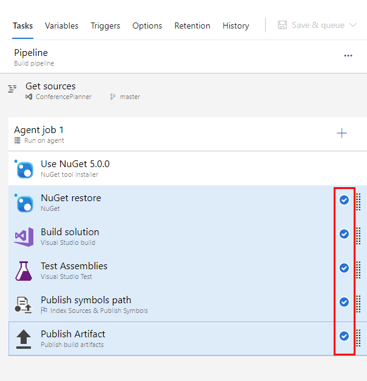

7. Right-click any of the selected tasks, and then click **Remove selected task(s)**. You should be left with a pipeline containing only the **Use NuGet 5.0.0** task.

8. In the **Agent job 1** pane, click the **+** icon.

    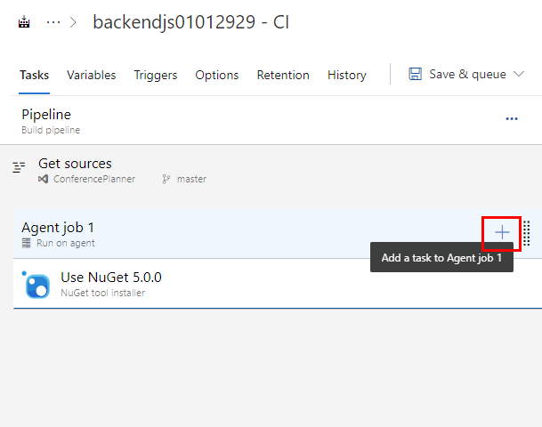

9. In the **Add tasks** pane to the right of the pipeline, in the **Search** box, type **.NET**. Select the **Use .NET Core** task, and then click **Add**.

    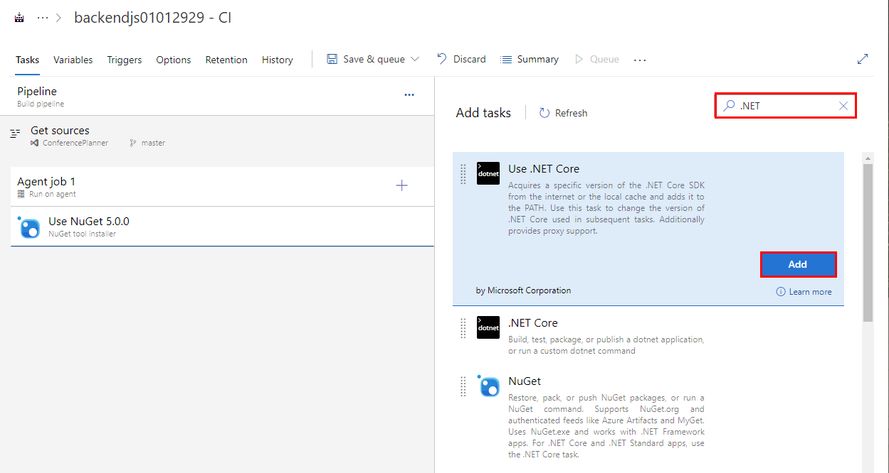

10. The **Use .NET Core** task enables you to specify exactly which build of .NET Core to use to build and run the application. In the pipeline definition pane, click the **Use .NET Core sdk** task you just added to the pipeline. In the properties pane to the right, in the **Version** box, type **3.1.102**. Notice that the **Display name** property of the task changes automatically. You can change it if you want.

    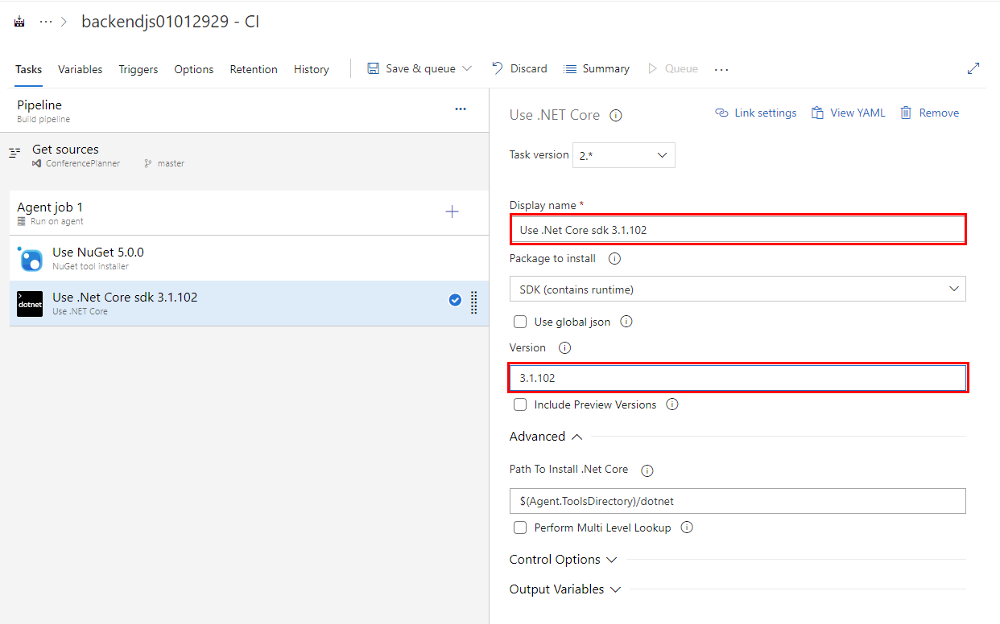

11. In the **Agent job 1** pane, click the **+** icon to add another task to the pipeline.

12. In the **Add tasks** pane to the right of the pipeline, in the **Search** box, type **.NET**. Select the **.NET Core** task, and then click **Add**.

    > **Note:** Make sure you don't select the **Use .NET Core** task.

    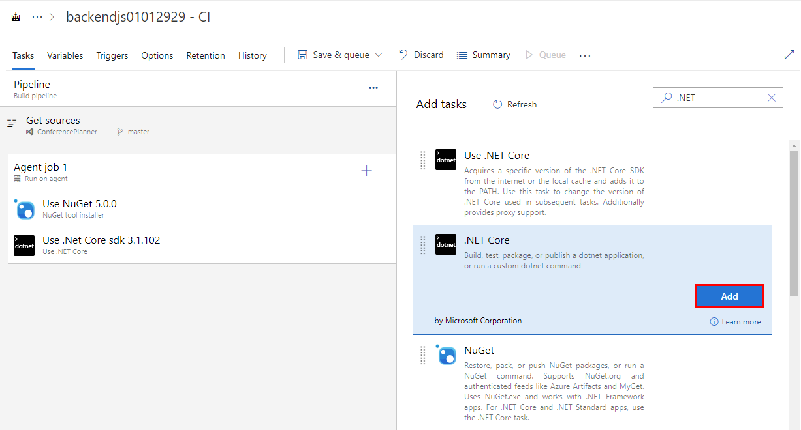

13. The **.NET Core** task enables you to run .NET Core commands. In the pipeline definition pane, click the **dotnet build** task you just added to the pipeline. In the properties pane to the right, set properties to the following values:

    | Property | Value |
    |-|-|
    | Display name | **dotnet publish** |
    | Command | **publish** |
    | Publish Web Projects | Clear |
    | Path to project(s) | **\*\*/\*.csproj** |
    | Arguments | **--configuration Release --output published** |
    | Zip Published Projects | Selected |
    | Add project's folder name to publish path | Selected |

    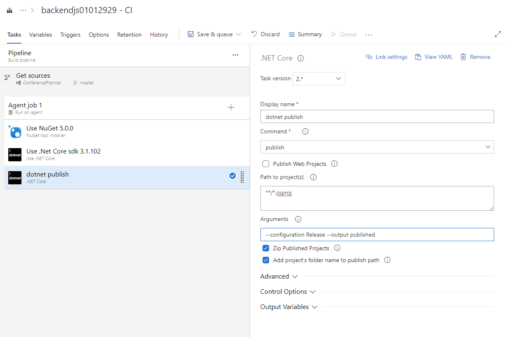

    These options run the `dotnet publish` command over every project in the solution. The published files are stored in the **published** folder, and zipped up as **FrontEnd.zip** and **BackEnd.zip**.

14. In the **Agent job 1** pane, click the **+** icon to add another task to the pipeline.

15. In the **Add tasks** pane to the right of the pipeline, in the **Search** box, type **Azure Web App**. Select the **Azure Web App** task, and then click **Add**.

    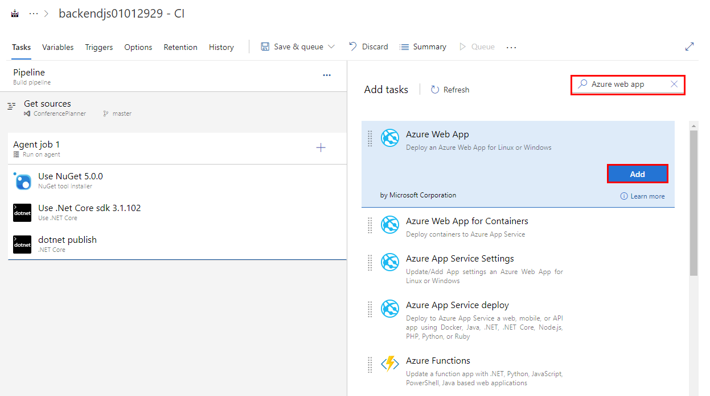

16. Use the **Azure Web App** task to deploy a web app to Azure App Service. In the pipeline definition pane, click the **Azure Web App** task you just added to the pipeline. In the properties pane to the right, set properties to the following values:

    | Property | Value |
    |-|-|
    | Display name | **Azure Web App Deploy: BackEnd** |
    | Azure subscription | In the **Azure subscription** list, under **Available Azure service connections**, click the **backend\<service-name-suffix\> - Azure** connection. This connection was created in Visual Studio when you set up the default pipeline. The connection provides access to the **backend\<service-name-suffix\>** App Service. |
    | App type | **Web App on Windows** |
    | App name | **backend\<service-name-suffix\>** |
    | Deploy to Slot or App Service Environment | Clear |
    | Package or folder | **$(System.DefaultWorkingDirectory)/published/BackEnd.zip** |

    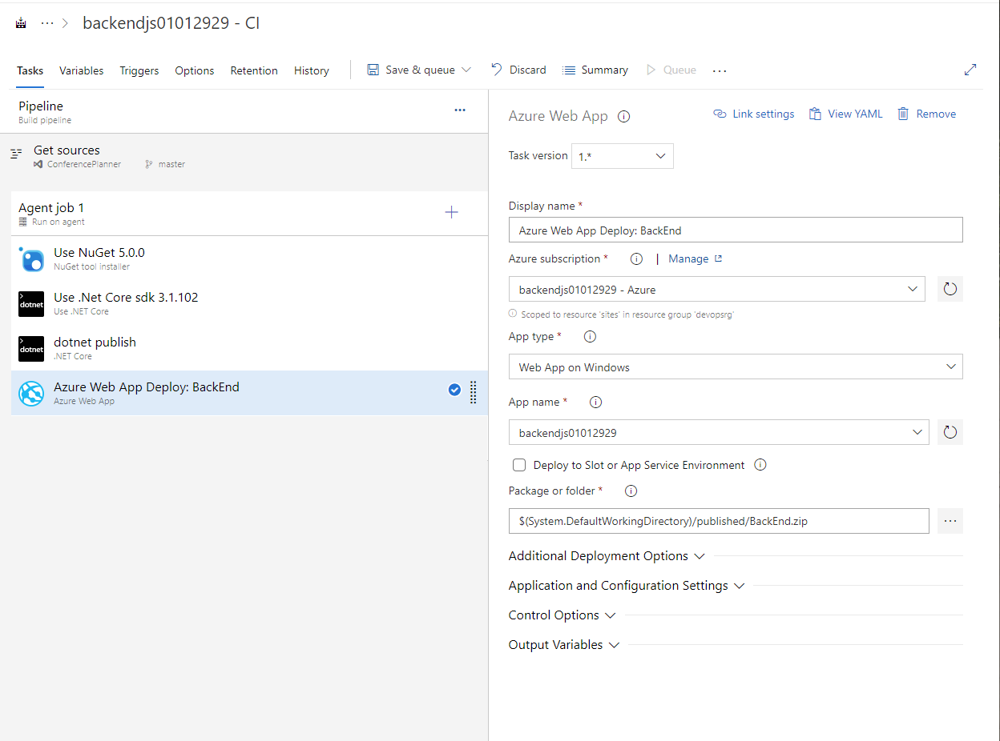

17. In the **Agent job 1** pane, right-click the **Azure Web App Deploy: BackEnd** task, and then click **Clone task(s)** to add a copy of the task to the pipeline.

    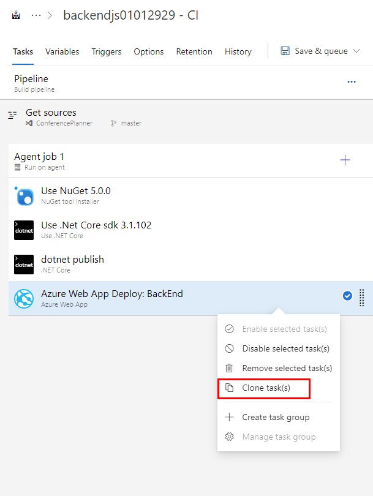

18. Select the **Azure Web App Deploy: BackEnd copy** task. In the properties pane to the right, set properties to the following values:

    | Property | Value |
    |-|-|
    | Display name | **Azure Web App Deploy: FrontEnd** |
    | Azure subscription | In the **Azure subscription** list, under **Available Azure subscriptions**, click your subscription, and then click **Authorize**. If an error appears, close the error dialog box, ensure any pop-up blockers and off, click **Authorize** again, and sign in using your Azure credentials. You can't use the service connection created in Visual Studio because that connection only provides access to the **backend\<service-name-suffix\>** App Service. |
    | App type | **Web App on Windows** |
    | App name | **frontend\<service-name-suffix\>** |
    | Deploy to Slot or App Service Environment | Clear |
    | Package or folder | **$(System.DefaultWorkingDirectory)/published/FrontEnd.zip** |

    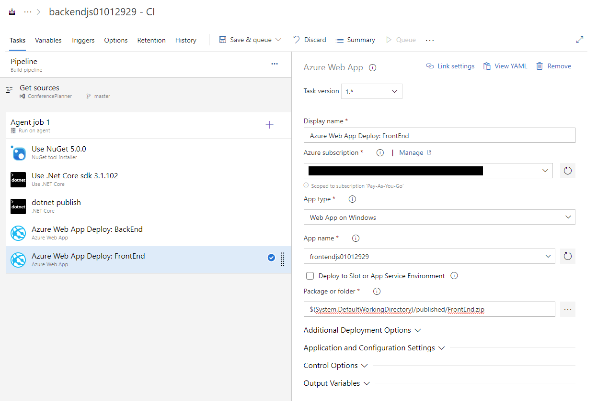

19. In the pipeline editor, click the **Use NuGet 5.0.0** task, and drag it below the **Use .NET Core sdk 3.1.102** task. This step ensures that the version of the .NET SDK is set before installing NuGet.

20. In the menu bar for the pipeline editor, click **Save & queue**, and then click **Save**.

    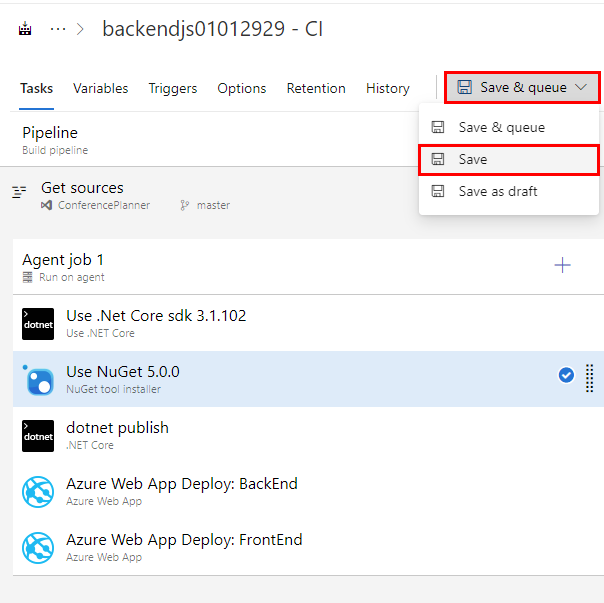

21. In the **Save build pipeline** dialog box, in the **Comment** box, type **Build and deploy web apps to App Services**, and then click **Save**.

    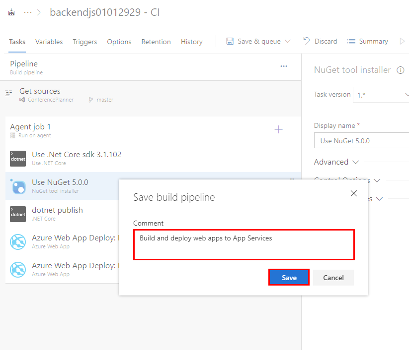

## Run the pipeline to deploy the **BackEnd** and **FrontEnd** web applications

1. In the menu bar for the pipeline editor, click **Queue**.

    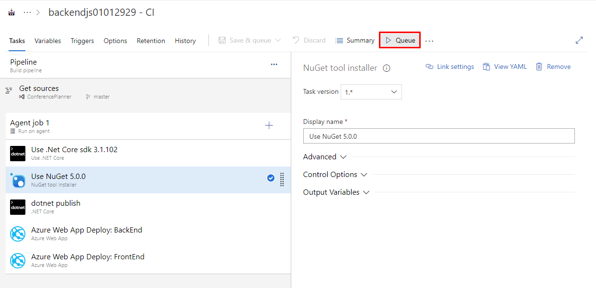

2. In the **Run pipeline** window, set the **Agent pool** to **Azure Pipelines**, in the **Agent Specification** drop-down list, select **windows-2019**, and then click **Run**.

    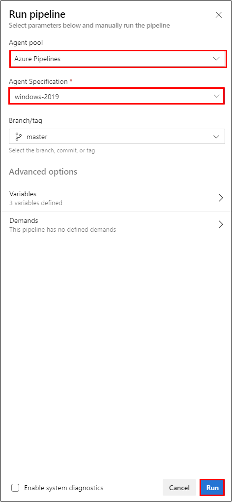

3. When the **Jobs** pane appears, click the **Agent job 1** job.

    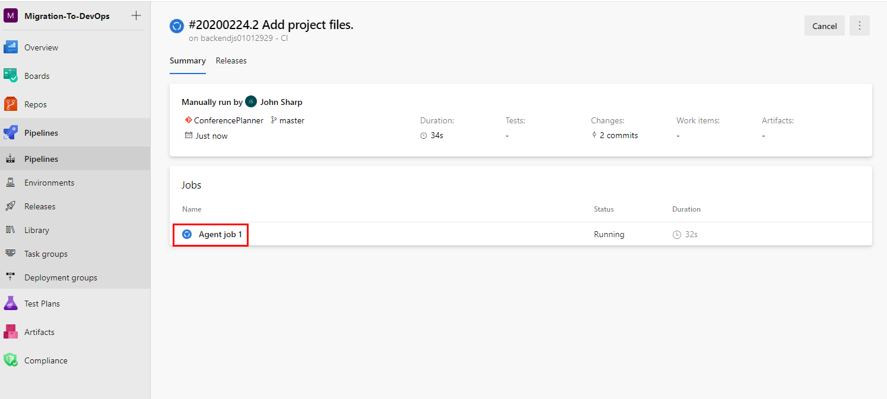

4. Monitor the progress of the job as it runs. Each task should complete successfully. You can click any task to view the details of the completed operations. If any errors occur, error messages are displayed in the details view of a task.

    

5. Open another web browser window, and go to the Swagger endpoint of the **BackEnd** web API service, **https://backend\<service-name-suffix\>.azurewebsites.net/swagger**. Verify that the Swagger user interface for the **Conference Planner API** web API service appears.

6. In the **Sessions** section, click the **POST** button for the **/api/Sessions/upload** operation, and then click **Try it out**.

7. In the **Parameters** section, at the **file** prompt, click **Browse**.

8. In the **Open** dialog box, browse to the folder containing your clone of the GitHub repository, move to the folder **src/BackEnd/Data/Import** in the repository, select the file **NDC_London_2020.json**, and then click **Open**.

9. In the web browser, click **Execute**, and wait for the data to be uploaded. Verify that the upload is successful. The server response code should be 200.

    

10. In the web browser window, move to the URL of the **FrontEnd** web application, **https://frontend\<service-name-suffix\>.azurewebsites.net**. Verify that the home page for the Conference Planner web app appears, displaying the list of sessions. The web application should operate in exactly the same manner as shown in previous exercises.

    > **Note:** Sometimes the **FrontEnd** web application fails to deploy correctly the first time. If you receive an error when attempting to access the **FrontEnd** web application, repeat the steps in this task to re-run the pipeline. The pipeline should work correctly the second time.


    

## Modify and redeploy the **FrontEnd** web application

1. Return to Visual Studio, and display the **Solution Explorer** window.

2. In the **FrontEnd** project, open the **Index.cshtml** file in the **Pages** folder.

3. Change the text in the `<h1>` heading as shown below:

    ```html
    <h1 class="mb-4">Microsoft Conference @System.DateTime.Now.Year</h1>
    ```

4. On the **File** menu, click **Save Index.cshtml**.

5. In Solution Explorer, notice that the **Index.cshtml** file has a tick mark, to indicate that it's been changed, but not yet committed to the repository in Azure DevOps.

    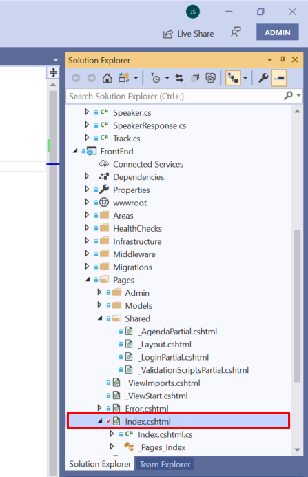

6. Switch to the **Team Explorer** window.

7. In the **Home** pane of the **Team Explorer** window, click **Changes**.

    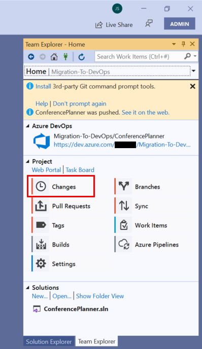

8. In the **Changes** pane, in the **Commit** message box, enter the message **Changed title**, and then, in the **Commit All** drop-down list box, click **Commit All and Push**.

    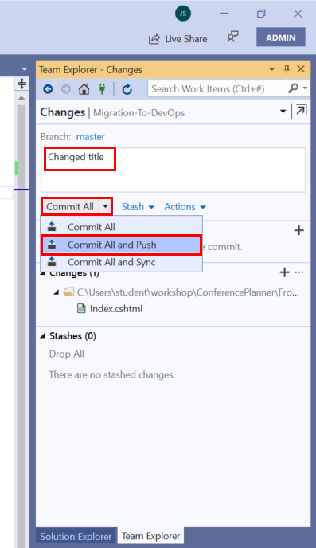

    This action saves the change to your local repository, then pushes it to the repository in Azure DevOps. The DevOps pipeline will run to rebuild and redeploy the web application.

9. In the Azure DevOps page in the web browser, in the left menu, click **Pipelines**, and then click your pipeline. In the **Runs** pane, click the **Changed title** run. This is the run of the pipeline for your new commit.

    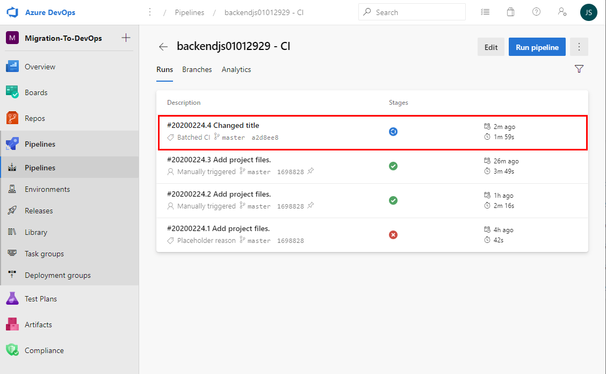

10. When the pipeline has finished running, move to the URL of the **FrontEnd** web application, **https://frontend\<service-name-suffix\>.azurewebsites.net**. You should see that the title in the index page has changed.

    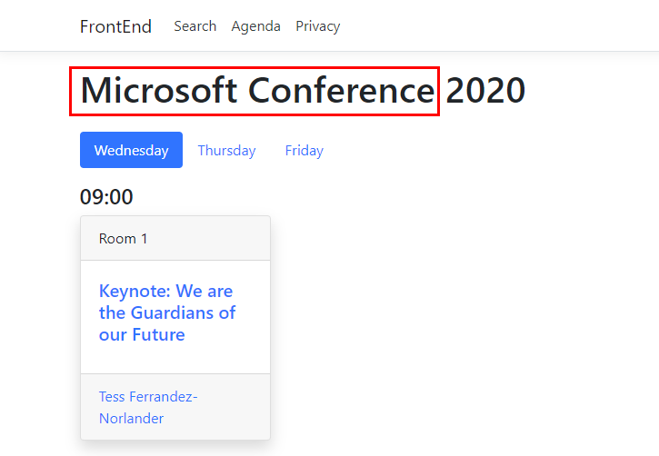

> **Note:** You'll find the completed code for the exercises in this session in the [Session 6 save point folder](../save-points/6-Deployment-docker).

**Next**: [Session #7 - Use Blazor to optimize the FrontEnd web application](7.%20Use%20Blazor%20to%20Optimize%20the%20Front%20End.md) | **Previous**: [Session #5 - Add user registration and personal agendas](5.%20Add%20personal%20agenda.md).
