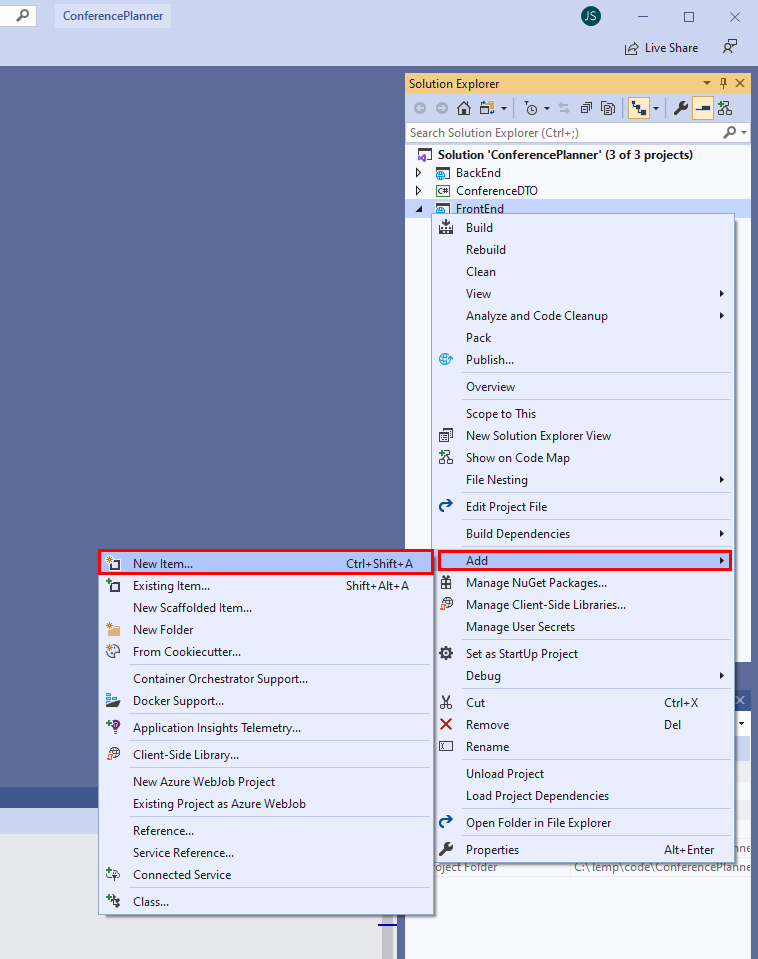
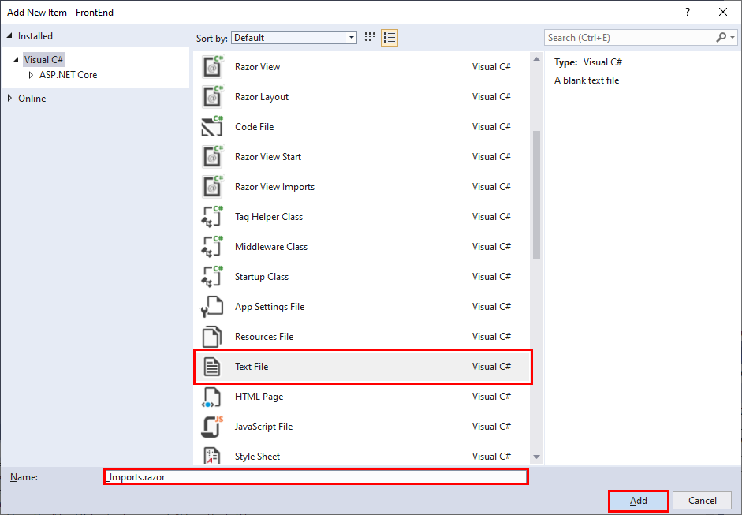
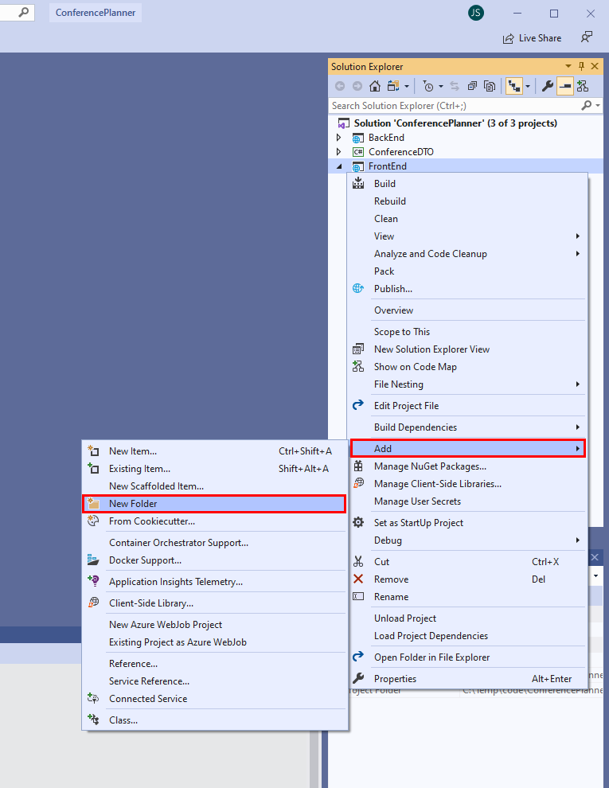
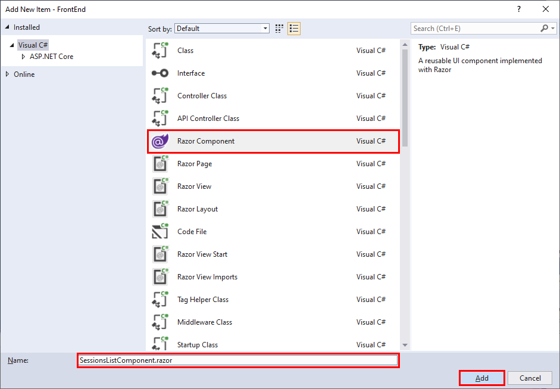
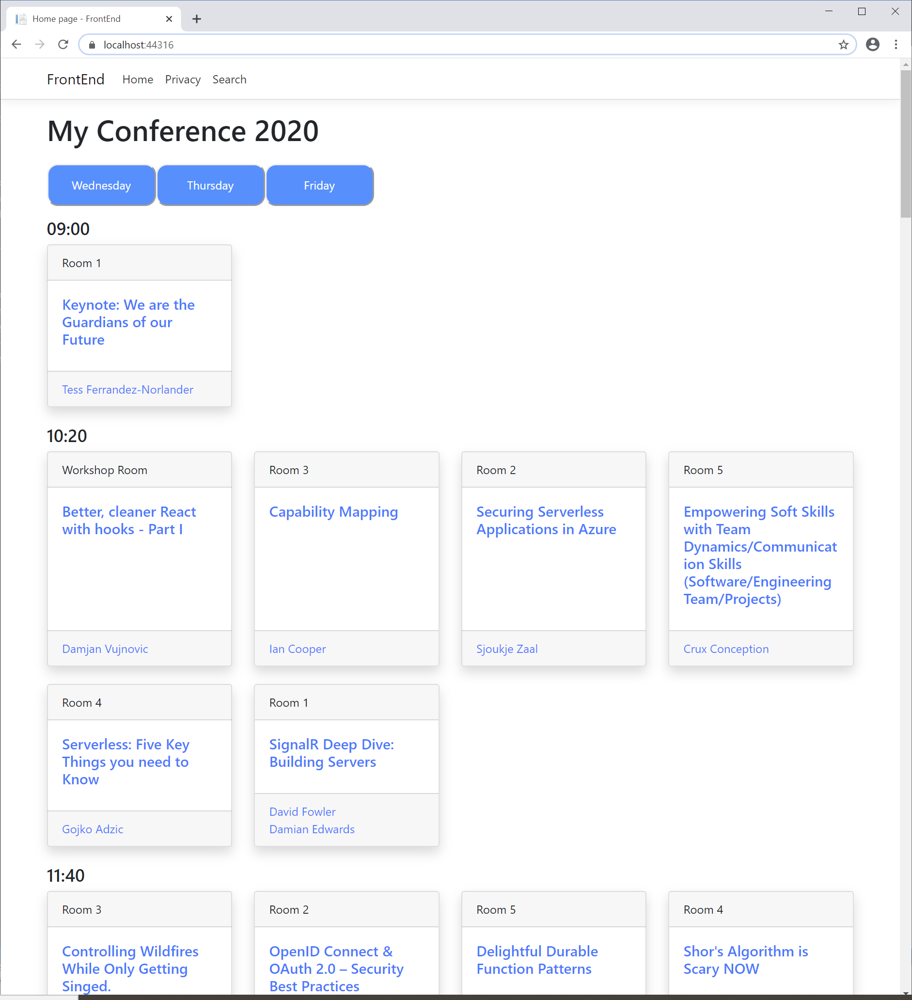
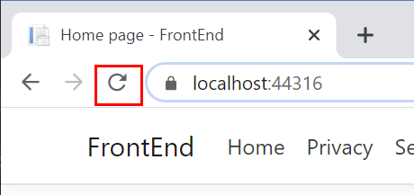
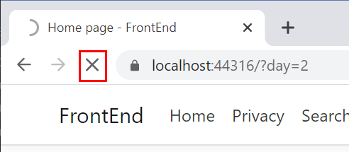
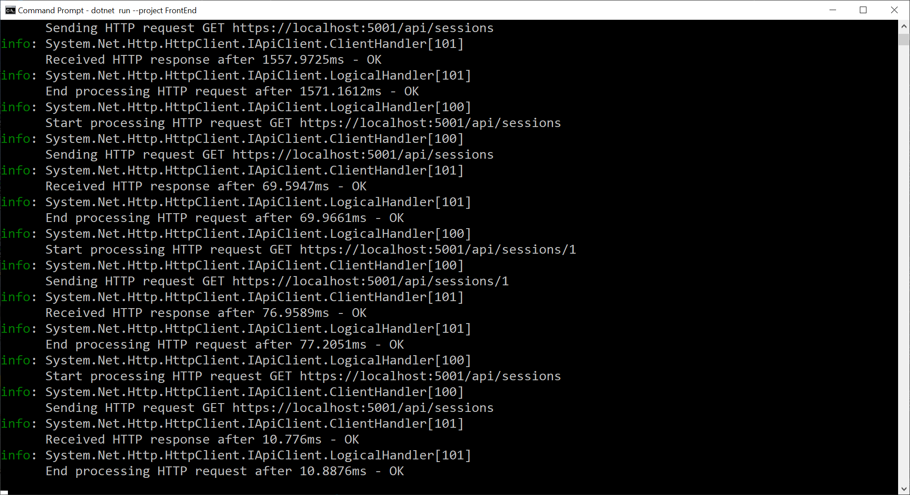

# Use Blazor to optimize the FrontEnd web application

In this session, you'll rework part of the **FrontEnd** web application to use a Blazor component to fetch and display conference session information.

The **Agenda** page for the web application enables the user to switch between the different days of the conference, and display the sessions for that day. When the user clicks a link for the specified day, the web application sends an HTTP GET request to the **BackEnd** web API service to fetch the data. The data is passed back in JSON format. The size of the payload might be significant, and can take a noticeable time.

Blazor uses SignalR for transmitting data between the web server and the client. SignalR can be far more efficient for many types of application, especially those that require real-time, or near real-time responses. SignalR uses a more compact payload format, and can push data directly to a client rather than waiting for a request.

So you can focus on Blazor functionality, this exercise uses a simplified version of the **ConferencePlanner** application. This version doesn't include user authentication or support administrative tasks.

## Create the **SessionsListComponent** Blazor component

1. If you haven't already done so, clone the repository for this workshop to a convenient location on your computer with the following command:

    ```console
    git clone https://github.com/dotnet-presentations/aspnetcore-app-workshop
    ```

2. Import the namespaces required by Blazor:

    - **If you're using Visual Studio 2019:**

        1. Open the **ConferencePlanner** solution in the **save-points/7-Blazor/Starter/ConferencePlanner** folder in your local clone of the Git repository.

        2. In Solution Explorer, right-click the **FrontEnd** project, point to **Add**, and then click **New Item**.

            

        3. In the **Add New Item - FrontEnd** dialog box, click **Text File**. Name the file **_Imports.razor**, and then click **Add**.

            

        4. Add the following directives to the file:

            ```razor
            @using System.Net.Http
            @using Microsoft.AspNetCore.Authorization
            @using Microsoft.AspNetCore.Components.Authorization
            @using Microsoft.AspNetCore.Components.Forms
            @using Microsoft.AspNetCore.Components.Routing
            @using Microsoft.AspNetCore.Components.Web
            @using Microsoft.JSInterop
            @using FrontEnd
            ```

    - **If you're using the .NET Core CLI:**

        1. Move to the **save-points/Blazor/Starter/ConferencePlanner/FrontEnd** folder in your local clone of the Git repository. 

        2. Create a new file named **_Imports.razor** using an editor of your choice.

        3. Add the following directives to the file:

            ```razor
            @using System.Net.Http
            @using Microsoft.AspNetCore.Authorization
            @using Microsoft.AspNetCore.Components.Authorization
            @using Microsoft.AspNetCore.Components.Forms
            @using Microsoft.AspNetCore.Components.Routing
            @using Microsoft.AspNetCore.Components.Web
            @using Microsoft.JSInterop
            @using FrontEnd
            ```

3. Add the **SessionsListComponent** to the starter solution for this exercise:

    - **If you're using Visual Studio 2019:**

        1. In Solution Explorer, right-click the **FrontEnd** project, point to **Add**, and then click **New Folder**.

            

        2. Name the new folder **Components**.

        3. In Solution Explorer, right-click the new **Components** folder, point to **Add**, and then click **New Item**.

        4. In the **Add New Item - FrontEnd** dialog box, click **Razor Component**. Name the component **SessionsListComponent.razor**, and then click **Add**.

            

        5. In the **SessionsListComponent.razor** file, delete the current contents.

    - **If you're using the .NET Core CLI:**

        1. Move to the **save-points/Blazor/Starter/ConferencePlanner/FrontEnd** folder in your local clone of the Git repository. 

        2. Create a new folder named **Components**.

        3. Move to the **Components** folder, and create a new file named **SessionsListComponent.razor**.

4. Add the following directives to the start of the **SessionsListComponent.razor** file:

    ```razor
    @using FrontEnd.Services
    @using ConferenceDTO

    @inject IApiClient _apiClient

    @namespace FrontEnd.Components
    ```

    The component will use types in the **FrontEnd.Services** and **ConferenceDTO** namespaces. It will also use an **IApiClient** object to connect to the **BackEnd** web API service. You'll inject the **IApiClient** object into the component when the application starts running.

5. Add the following **@code** block to the end of the razor component:

    ```csharp
    @code {

        public IEnumerable<IGrouping<DateTimeOffset?, SessionResponse>> Sessions { get; set; }

        public IEnumerable<(int Offset, DayOfWeek? DayofWeek)> DayOffsets { get; set; }

        public int CurrentDayOffset { get; set; }

        protected List<SessionResponse> sessions;

        protected DateTime? startDate;

        protected virtual Task<List<SessionResponse>> GetSessionsAsync()
        {
            return _apiClient.GetSessionsAsync();
        }

        protected override async Task OnInitializedAsync()
        {
            sessions = await GetSessionsAsync();

            startDate = sessions.Min(s => s.StartTime?.Date);

            DayOffsets = sessions.Select(s => s.StartTime?.Date)
                                 .Distinct()
                                 .OrderBy(d => d)
                                 .Select(day => ((int)Math.Floor((day.Value - startDate)?.TotalDays ?? 0),
                                             day?.DayOfWeek))
                                 .ToList();

            Sessions = sessions.Where(s => s.StartTime?.Date == startDate)
                               .OrderBy(s => s.TrackId)
                               .GroupBy(s => s.StartTime)
                               .OrderBy(g => g.Key);
        }

        public void SetDay(int day = 0)
        {
            var filterDate = startDate?.AddDays(day);

            Sessions = sessions.Where(s => s.StartTime?.Date == filterDate)
                               .OrderBy(s => s.TrackId)
                               .GroupBy(s => s.StartTime)
                               .OrderBy(g => g.Key);
        }
    }
    ```

    This is a modified version of the code in the **IndexModel** model, behind the **Index.cshtml** page. You'll replace the model with this component in a later task.

    The **OnInitializedAsync** method runs when the component is first created. The component uses the **IApiClient** object to retrieve the details of the sessions for the conference, and caches them in the **sessions** collection. The **Sessions** property is populated with the sessions for the first day of the conference from this collection.

    The **SetDay** method takes a day number as a parameter (day 0 is the first day of the conference), and updates the **Sessions** property with the session details for that day.

6. Add the following `<style>` block to the component, between the **@namespace** directive and the `@code` block:

    ```html
    ...
    @namespace FrontEnd.Components

    <style>
        .local-button {
            background-color: dodgerblue;
            padding: 15px 32px;
            text-align: center;
            display: inline-block;
            color: white;
            cursor: pointer;
            border-radius: 15px;
            width: 150px;
            outline: none;
        }

        .local-button:hover {
            background-color: bisque;
            color: black;
            width: 150px;
            outline: none;
        }

        .local-button:focus {
            background-color: bisque;
            color: black;
            width: 160px;
            outline: none;
        }
    </style>

    @code {
        ...
    ```

    The **Index** page currently displays the days of the conference as HTML links. The component will use buttons instead. You'll use these styles to change the appearance of the buttons.

7. Between the `<styles>` block and the `@code` block, add the following markup:

    ```html
        ...
    </style>

    <ul class="nav nav-pills mb-3">
        @if (DayOffsets != null)
        {
            foreach (var day in DayOffsets)
            {
                <li role="presentation" class="nav-item">
                    <button class="local-button" @onclick="@(() => SetDay(day.Offset))">@day.DayofWeek?.ToString()</button>
                </li>
            }
        }
    </ul>

    @code {
        ...
    ```

    This markup is similar to that in the **Index.cshtml** file. It iterates through the **DayOffsets** collection created in the `@Code` block. This collection is populated by the **OnInitializedAsync** method, and contains the list of days that the conference spans. The markup displays each day as a button, and sets the `onclick` event handler to call the **SetDay** method in the `@Code` block to update the display.

8. After the code you just added, and before the `@code` block, add the markup shown below:

    ```html
    ...
    <div class="agenda">
        @if (Sessions != null)
        {
            @foreach (var timeSlot in Sessions)
            {
                <h4>@timeSlot.Key?.ToString("HH:mm")</h4>
                <div class="row">
                    @foreach (var session in timeSlot)
                    {
                        <div class="col-md-3 mb-4">
                            <div class="card shadow session h-100">
                                <div class="card-header">@session.Track?.Name</div>
                                <div class="card-body">
                                    @{var sessionRef = $"/Session/{session.Id}";}
                                    <h5 class="card-title"><NavLink href=@sessionRef>@session.Title</NavLink></h5>
                                </div>
                                <div class="card-footer">
                                    <ul class="list-inline mb-0">
                                        @foreach (var speaker in session.Speakers)
                                        {
                                            <li class="list-inline-item">
                                                @{var speakerRef = $"/Speaker/{speaker.Id}"; }
                                                <NavLink href=@speakerRef>@speaker.Name</NavLink>
                                            </li>
                                        }
                                    </ul>
                                </div>
                            </div>
                        </div>
                    }
                </div>
            }
        }
    </div>

    @code {
        ...
    ```

    This code is also similar to that found in the **Index.cshtml** file. It displays the sessions in each timeslot for the currently selected day. The markup uses `<NavLink>` tags rather than `<a>` tags to link to the session and speaker pages. The original `<a>` tags in the **Index.cshtml** file use ASP.NET routing helpers that aren't available in Blazor components.

## Update the Index page

1. In the **Pages** folder of the **FrontEnd** project, open the **Index.cshtml** file. Much of the functionality in this file is now implemented in the **SessionsListComponent** component.

2. Replace the contents of the **Index.cshtml** file with the code shown below:

    ```razor
    @page
    @using FrontEnd.Components

    @{
        ViewData["Title"] = "Home page";
    }

    <h1 class="mb-4">My Conference @System.DateTime.Now.Year</h1>

    <component type="typeof(SessionsListComponent)" render-mode="ServerPrerendered" />
    ```

    Note the page no longer uses the **IndexModel** model. The code is contained in the **SessionsListComponent** instead, as is the markup used to display the session information.

## Configure the **FrontEnd** to support Blazor at runtime

Blazor components require additional runtime support in the form of scripts and other services that you must add to the web application.

1. In the **Shared** folder, under the **Pages** folder in the **FrontEnd** project, open the **_Layout.cshtml** file.

2. Add the following `<base>` tag to the end of the `<head>` element, after the existing stylesheet links, as shown below:

    ```html
    ...
    <head>
        ...
        <link rel="stylesheet" ... />
        <base href="~/" />
    </head>
    ...
    ```

3. Near the end of the file, add the following `<script>` link, just before the closing `</body>` tag:

    ```html
        ...
        <script src="_framework/blazor.server.js"></script>
    </body>
    </html>
    ```

4. Open the **Startup.cs** file in the root folder of the **FrontEnd** project.

5. Add the statement shown below to the end of the **ConfigureServices** method in the **Startup** class:

    ```csharp
    public void ConfigureServices(IServiceCollection services)
    {
        ...
        services.AddServerSideBlazor();
    }
    ```

6. Find the `app.UseEndpoints` statement at the end of the **Configure** method. Modify this statement and add the Blazor hub endpoints, as shown in the code below:

    ```csharp
    public void Configure(IApplicationBuilder app, IWebHostEnvironment env)
    {
        ...
        app.UseEndpoints(endpoints =>
        {
            endpoints.MapRazorPages();

            // New statement below
            endpoints.MapBlazorHub();
        });
    }
    ```

## Test the solution

### If you're using Visual Studio:

1. On the **Debug** menu, click **Start Debugging** to build and run the solution.

    Two web browser windows will appear; one for the **BackEnd** web API service displaying the list of speakers in JSON format, and another for the **FrontEnd** project. The index page for the **FrontEnd** project should look similar to the image below:

    

2. Click one of the day buttons. The display should change to show the sessions for that day, and the application should function much as it did before. The main difference for the user is that the application should be more responsive. You can verify this situation with the following procedure:

    1. When you click the button for any day, the icon on the *progress/refresh* button in the browser toolbar remains as a circular arrow:

        

    2. Click the title of any session or speaker. This action results in a regular HTTP request rather than a Blazor SignalR exchange. You'll momentarily see the icon on the *progress/refresh* button change to an *X* symbol to indicate that an HTTP request has been issued, and the browser is waiting for the response.

        

### If you're using the .NET Core CLI:

1. Open the **launchSettings.json** file in the **Properties** folder of the **BackEnd** project.

2. Make a note of the HTTPS URL in the **applicationUrl** property in the **BackEnd** profile, and then close the **launchSettings.json** file.

3. Open the **appsettings.json** file in the root folder of the **FrontEnd** project.

4. Change the **ServiceUrl** property to the HTTPS URL you noted in step 2.

5. Open the **launchSettings.json** file in the **Properties** folder of the **FrontEnd** project.

6. Make a note of the HTTPS URL in the **applicationUrl** property in the **FrontEnd** profile, and then close the **launchSettings.json** file.

7. Move to the **ConferencePlanner** solution folder.

8. Run the following command to run the **BackEnd** project in a new console window:

    ```console
    start dotnet run --project BackEnd
    ```

9. When the **BackEnd** project has started, return to the original console window, and run the following command to start the **FrontEnd** project:

    ```console
    dotnet run --project FrontEnd
    ```

10. Open a web browser, and go to the HTTPS URL of the **FrontEnd** web application that you noted earlier.

11. Click one of the day buttons. The display should change to show the sessions for that day, and the application should function much as it did before.

12. Display the console window running the **FrontEnd** web application. In the web browser, click a link for any session. In the console window, you'll see the HTTP requests and corresponding response messages that occur after you retrieve the session details. It should look similar to those in the image below:

    

13. In the web browser, return to the Home page for the **FrontEnd** web application.

14. With the console window for the **FrontEnd** application visible, click the buttons on the Home page to display the sessions for each day. In the console window, you shouldn't see any HTTP activity. This is because the web application and the **BackEnd** web API service are communicating over a SignalR channel rather than an HTTP connection.

> **Note:** You'll find the completed code for the exercises in this session in the [Blazor Session save point folder](../save-points/7-Blazor/Complete).